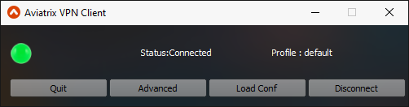

.. meta::
   :description: Aviatrix SAML Client download
   :keywords: SAML, openvpn, SSL VPN, remote user vpn, SAML client. Openvpn with SAML
   

   
.. |mac| image:: AVPNC_img/Mac.png
   

 

===================
Aviatrix VPN Client 
===================
|Client|

The Aviatrix VPN solution is the only VPN solution that provides SAML authentication from the client itself. The solution is built on OpenVPN®. The Aviatrix VPN Client
provides a seamless user experience when authenticating a VPN user through a SAML IDP. The client also supports password based authentication methods as well.

The VPN Client can be installed on desktop platforms and is supported on various OS like Windows, Mac and Linux.

Consult the VPN client `user guide <https://s3-us-west-2.amazonaws.com/aviatrix-download/AviatrixVPNClient/Aviatrix+VPN+Client+User+Guide.pdf>`__ for how to use it. 

Latest version: 1.9.14 - (Oct 18 2018) `Changelog. <http://docs.aviatrix.com/HowTos/changelog.html>`_

*************
Windows |win|
*************
Windows client can be download from `this link <https://s3-us-west-2.amazonaws.com/aviatrix-download/AviatrixVPNClient/AVPNC_win_x64.exe>`__

At the end of the installation, please install the TUN TAP driver if you haven't done so earlier.

Please note that the client uses the default browser, and Microsoft Edge is not supported

*********
Mac |mac|
*********

Mac client can be downloaded from `this link <https://s3-us-west-2.amazonaws.com/aviatrix-download/AviatrixVPNClient/AVPNC_mac.pkg>`__. Please make sure that you are running macOS 10.12(Sierra) or higher.

If you have installed version 1.4.26 or lower please uninstall before you install the newer version

***********
Linux |lux|
***********
For the .deb files, if opening them using software center does not work, use sudo dpkg -i file.deb; sudo apt-get install -f (Dependencies)to install

For the .tar files use tar -xvzf file.tar.gz; cd AVPNC_setup; sudo ./install.sh to install

If the icon is missing from the launcher, type AVPNC in the terminal to launch the app

Debian/Ubuntu
=============
Ubuntu 16/Generic - `Debian file <https://s3-us-west-2.amazonaws.com/aviatrix-download/AviatrixVPNClient/AVPNC_debian.deb>`__, 
`Tar file. <https://s3-us-west-2.amazonaws.com/aviatrix-download/AviatrixVPNClient/AVPNC_linux.tar.gz>`__

Trusty/Ubuntu14  - `Debian file <https://s3-us-west-2.amazonaws.com/aviatrix-download/AviatrixVPNClient/AVPNC_debian_Q4.deb>`__, `Tar file <https://s3-us-west-2.amazonaws.com/avi atrix-download/AviatrixVPNClient/AVPNC_linux_Q4.tar.gz>`__, 

Zesty/Ubuntu17 and Ubuntu18 - `Debian file <https://s3-us-west-2.amazonaws.com/aviatrix-download/AviatrixVPNClient/AVPNC_zesty.deb>`__, `Tar file <https://s3-us-west-2.amazonaws.com/aviatrix-download/AviatrixVPNClient/AVPNC_zesty.tar.gz>`__

*************
FreeBSD |bsd|
*************
FreeBSD client can be downloaded from- `this link <https://s3-us-west-2.amazonaws.com/aviatrix-download/AviatrixVPNClient/AVPNC_FreeBSD.tar.gz>`__

tar -xvzf file.tar.gz; cd AVPNC_setup; sudo ./install.sh to install

*******************
Development version
*******************
These are preview images for the next release.

`Windows <https://s3-us-west-2.amazonaws.com/aviatrix-download/AviatrixVPNClient/dev/AVPNC_win_x64.exe>`__, `Mac <https://s3-us-west-2.amazonaws.com/aviatrix-download/AviatrixVPNClient/dev/AVPNC_mac.pkg>`__ , `Linux tar <https://s3-us-west-2.amazonaws.com/aviatrix-download/AviatrixVPNClient/dev/AVPNC_linux.tar.gz>`__, `Debian file <https://s3-us-west-2.amazonaws.com/aviatrix-download/AviatrixVPNClient/dev/AVPNC_debian.deb>`__, `Linux tar trusty <https://s3-us-west-2.amazonaws.com/aviatrix-download/AviatrixVPNClient/dev/AVPNC_linux_Q4.tar.gz>`__, `Debian trusty <https://s3-us-west-2.amazonaws.com/aviatrix-download/AviatrixVPNClient/dev/AVPNC_debian_Q4.deb>`__, `Linux tar zesty <https://s3-us-west-2.amazonaws.com/aviatrix-download/AviatrixVPNClient/dev/AVPNC_zesty.tar.gz>`__, `Debian zesty <https://s3-us-west-2.amazonaws.com/aviatrix-download/AviatrixVPNClient/dev/AVPNC_zesty.deb>`__, `FreeBSD <https://s3-us-west-2.amazonaws.com/aviatrix-download/AviatrixVPNClient/dev/AVPNC_FreeBSD.tar.gz>`__

OpenVPN is a registered trademark of OpenVPN Inc.

.. disqus::

