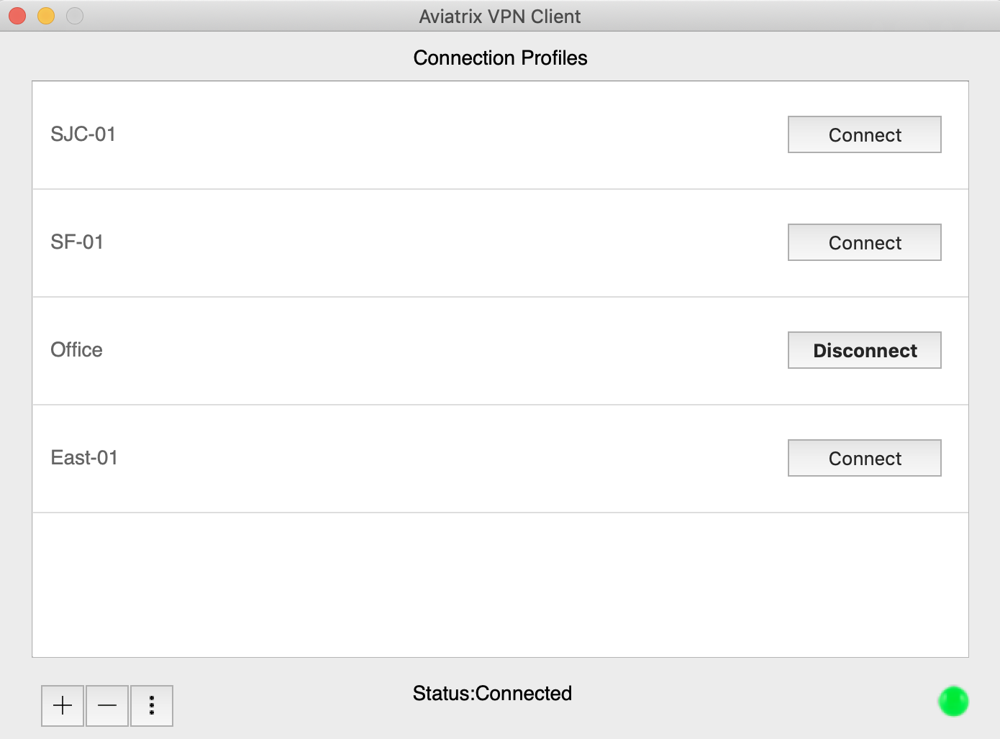

.. |win| image:: AVPNC_img/Win.png

.. |mac| image:: AVPNC_img/Mac.png

.. |lux| image:: AVPNC_img/Linux.png

.. |bsd| image:: AVPNC_img/BSD.png

==============================
Aviatrix VPN Client User Guide
==============================

****************************************
Installing and Launching the Application
****************************************

*************
Windows |win|
*************

1. Download the Aviatrix VPN Client installer from `this link <https://s3-us-west-2.amazonaws.com/aviatrix-download/AviatrixVPNClient/AVPNC_win_x64.exe>`__

    Run the installer and follow the on-screen instructions to install the application.

    If you have installed OpenVPN previously, TUN TAP drivers would have been installed. If they are not installed, you can install the TUN TAP at the end of the installation.

2. Save the OpenVPN configuration file (with the extension .ovpn) that was sent to you by your Admin, on to your machine.

3. Open the “Aviatrix VPN Client” application by going to “Start Menu -> Aviatrix VPN Client-> Aviatrix VPN Client”.

   |WinClientLocation|

4. A UAC window pops up.

   |WinClientPopup|

5. Allow administrator access so that the application can modify the routing tables. The Aviatrix VPN Client window should come up which should look like.

   |WinClientStartUp|

6. Skip to the `Using the Application <#using-the-application>`__ section if you do not need to install it on a Mac or Linux

*********
Mac |mac|
*********

1. Download the Aviatrix VPN Client installer from `this link <https://s3-us-west-2.amazonaws.com/aviatrix-download/AviatrixVPNClient/AVPNC_mac.pkg>`__

    Follow the on-screen instructions to install the application

2. Save the OpenVPN configuration file (with the extension .ovpn) that was sent to you by your Admin, on to your machine.

3. Start the Aviatrix VPN Client application by going to LaunchPad and clicking on “Aviatrix VPN Client”.

   |MacClientLocation|

   |MacClientLocation2|

4. A popup comes up to request sudo privelages to modify routing tables

   |MacCrendential|

5. This opens the application window.

6. Skip to the `Using the Application <#using-the-application>`__ section if you do not need to install it on Linux

***********
Linux |lux|
***********

1. Download the Aviatrix VPN Client installer from `this link <https://s3-us-west-2.amazonaws.com/aviatrix-download/AviatrixVPNClient/AVPNC_linux.tar.gz>`__

2. To install the application run the following commands

    tar -xvzf AVPC_linux.tar.gz

    sudo ./install.sh

3. Save the OpenVPN configuration file (with the extension .ovpn) that was sent to you by your Admin, on to your machine.

4. To open the “Aviatrix VPN Client” launch a new terminal and type AVPNC

.. note::

   This has been tested only on Ubuntu 16/14. Theoretically, it should work with other flavours of linux as well as long as openvpn is installed separately.

.. _using_the_application:

*********************
Using the Application
*********************

There are 3 buttons on the bottom

1. |add| : This opens a window to choose the OpenVPN configuration (.ovpn) file.

2. |minus| : This deletes a item choosed in the Connection Profiles

3. |3dots| : This pops up a submenu including "Edit", "Sort", "Connection Log" and "Settings"

  3.1 "Edit": Modify a item choosed in the Connection Profiles

  3.2 "Connection Log": Show every single connection's log

  3.3 "Settings": Open the advanced settings

*************
Windows |win|
*************

1. There is a menu on the top of the App GUI

    1.1 "File" has a menu to quit the App

    1.2 "Help" has menu "About" to show the App information

2. Closing the application window hides it to the system tray

   |WinBottomBar|

*********
Mac |mac|
*********

1. There is a menu on the top-left of the screen

    1.1 "About" shows show the App information

    1.2 "Quit" exit the App information

2. Closing the application window hides it to the system tray

   |MacBottomBar|

   By a right click on Windows's or a click on Mac's system tray icon to show a menu

   |TrayMenu|

3. There are 3 status icons that are shown in the window and on the tray.

   |ProgressIcon|

***********************
Advanced Settings Page
***********************

|Settings|

Here you can perform special operations if Troubleshooting is required

1. Flush DNS: (Not for windows) Flushes the DNS configuration if there are internet issues after full tunnel VPN disconnection. Also turning the wifi/ethernet adapter on/off can fix some internet issues.

2. Kill all OpenVPN process: (Not supported on Windows) Sends a soft kill to all running OpenVPN processes

3. Force kill all OpenVPN process: Terminates other OpenVPN processes that are running abruptly

4. Check VPN DNS server reachability: (MacOS only) If this option is checked, it will apply the VPC DNS servers in the MacOS system. If it is disabled, it will use the local DNS servers or other local DNS mechanism (e.g. CISCO Umbrella)

****************************
Connecting to a SAML Gateway
****************************

Enter your IDP Credentials to login.

Check doc `OpenVPN® with SAML Authentication <https://docs.aviatrix.com/HowTos/VPN_SAML.html>`__ for detail.

**************************************************
Connecting to a Gateway without any Authentication
**************************************************

Just load the OpenVPN configuration(.ovpn) file on to the VPN Client and click on “Connect”.

*************************************************************
Connecting to a Gateway with Username-Password Authentication
*************************************************************

CloudN VPC supports a variety of authentication methods to verify VPN user credentials. Here’s a brief overview of how to enter user credentials for different authentication methods.

LDAP:

  Enter username and password stored on LDAP server.

  Check doc `LDAP Configuration for Authenticating VPN Users <https://docs.aviatrix.com/HowTos/VPNUsers_LDAP.html>`__ for detail.

Google 2-step verification:

  Use your email address as the username.

  Password should be appended with the 6-digit code generated by Google authenticator app on your phone.

  E.g., If your email is "joe@examplecompany.com", the following username password combination of "joe@examplecompany.com" and "password123456" should be used where "password" is your account password and "123456" is the 6 digit-code.

Duo Security Two-Factor Authentication: Mac and Windows users:

  An automatic approval request will be pushed to your registered cellphone. Select “Approve” to connect to VPN gateway.

LDAP + Duo Security Two-Factor Authentication:

  Enter username and password for the LDAP server and an automatic approval request will be pushed to your registered cellphone.

  Select “Approve” to connect to VPN gateway.

The username and password windows is shown

|LDAPAuth|

