.. meta::
   :description: Using the AWS Network Load Balancer and Aviatrix Gateway to balance loads between the cloud and a remote office or datacenter
   :keywords: NLB, network load balancer, aviatrix, balance workload

.. role:: orange

.. role:: green

.. role:: blue

.. raw:: html

   

================================================================================
Hybrid Network Load Balancing (NLB)
================================================================================

Balance Traffic between AWS and your Datacenter using AWS `Network Load Balancer <https://www.aviatrix.com/learning/glossary/network-load-balancing.php>`_ and Aviatrix Gateway
----------------------------------------------------------------------------------------------------

Problem Description
^^^^^^^^^^^^^^^^^^^
Operations teams are frequently managing infrastructure and services hosted both in the cloud and on-premise.  Some common examples include:

  * DR scenarios,
  * centrally located shared services, and
  * application and workload migration to the cloud.

Establishing reliable and secure network connectivity for these hybrid use cases presents a challenge to most teams.

Imagine one specific example: you have a critical internal web application hosted in remote offices around the globe as well as in AWS.  In order to provide fault-tolerance for the application, you would like to setup a central load balancer that balances traffic between the remote sites and AWS. 

AWS recently released the Network Load Balancer that made this possible by adding the ability to specify an IP address as a load balancer target, in addition to instances.  However, using the NLB to forward traffic to a target IP address outside of AWS will only work if you have Direct Connect between the remote site and the AWS region.  An IPSEC tunnel built between AWS VGW and on-prem site does not work since in this case traffic is always initiated from the VPC. So, for most users this doesn't help.

Aviatrix solves this for AWS customers without Direct Connect.

In this document, we will demonstrate how to go from an empty AWS VPC and a remote, on-premise hypervisor to a working demo that balances web traffic between the two sites.

Demonstration
^^^^^^^^^^^^^
This demo will involve two web servers hosting a basic website.  One server will be located in a remote site and one will be hosted in AWS.  We'll set up AWS' NLB service to listen on port 80 and configure both of these servers as targets.

This diagram represents the desired configuration:

|image1|

The webdemo hostname has been registered in DNS pointing to the NLB.  When a user accesses the demo site (webdemo.aviatrix.com/index.html) from a browser, that request will be handled by the Network Load Balancer  (the :orange:`orange` line in the diagram).  The NLB will choose either the :green:`green` route to the remote site or the :blue:`blue` route to the EC2 instance and the selected web server will respond to the user with the contents of the requested file.

For the purposes of this demo, the contents of `index.html` will differ slightly on each server to include either "Welcome to the Data Center" or "Welcome to AWS".

Prerequisites
^^^^^^^^^^^^^
In order to complete the steps in this guide, you'll need:

- An AWS account,
- An Aviatrix license key (email to info@aviatrix.com if you don't have one)

Step 1: Create AWS Resources
----------------------------
For AWS, we'll create a new VPC, EC2 instance, and enable the NLB service.

Step 1a: Create VPC
^^^^^^^^^^^^^^^^^^^
There are a number of ways to create a VPC in AWS.  We'll use the VPC Wizard, available in the `VPC Dashboard <https://console.aws.amazon.com/vpc/home>`_.

Click the `Start VPC Wizard` button to launch the wizard.  Then, select the `VPC with a Private Subnet Only and Hardware VPN Access` option.

 |imageAWSVPC1|

Finally, fill out the form that follows providing an appropriate CIDR block and VPC name.

 |imageAWSVPC2|

Step 1b: Create EC2 Instance (Web Server)
^^^^^^^^^^^^^^^^^^^^^^^^^^^^^^^^^^^^^^^^^
We'll create a T2-micro instance running Amazon Linux and Apache to handle the web server role.  The steps we used to create the EC2 instance are shown below:

 |imageAWSEC20|

 |imageAWSEC21|

 |imageAWSEC22|

Connect to the new instance via SSH.  We temporarily associated an Elastic IP with this instance for convenience while configuring it. ::

  > ssh ec2-user@<EIP> -i ~/aviatrix/demo/aws/aviatrix-demo.pem

And, install the Apache package::

  > sudo yum install httpd

Finally, create a simple `index.html` page in the doc root (`/var/www/html/` for our installation)::

  <html>
    <head>
      <title>Welcome!</title>
    </head>
    <body>
      <h3>Welcome to AWS</h3>
    </body>
  </html>

Now, if we go directly to the instance EIP in a web browser we should see this:

  |imageAWSEC25|

In the next step, we'll set up the NLB to route traffic to this instance so we will no longer need the EIP associated with this instance.

Step 1c: Configure the Network Load Balancer
^^^^^^^^^^^^^^^^^^^^^^^^^^^^^^^^^^^^^^^^^^^^
In the `EC2 Dashboard <https://console.aws.amazon.com/ec2/home>`_, select `Load Balancers`, click the `Create Load Balancer` button, and finally select `Network Load Balancer` when prompted for the type:

  |imageAWSNLB1|

On Step 1 of the form that is displayed, give the NLB a name and select `internet-facing` for the Scheme.  We'll only need one listener on port 80 for this demo, so the default configuration is sufficient.

Under Availability Zones, select the VPC we created in step 1a and then check the only subnet in the table below that.

  |imageAWSNLB2|

On Step 2, select `New target group0 and provide a name.  Be sure to change the `Target type` to `ip` instead of `instance` (we'll rely on this configuration later when accessing our remote site).  Everything else will remain the default.

  |imageAWSNLB3|

Step 3 requires us to select our target(s).  For now, we only have one (our Linux EC2 instance that we created in the previous step.

In the `IP` field, type in the private IP address of the EC2 instance that was created earlier.  Keep the default port of 80 in the Port field and then click `Add to list`.

  |imageAWSNLB4|

Review the configuration and click `Create`.   Give the Load Balancer a few minutes to move out of the `provisioning` state into `active`.  Once `active`, open a web browser and go to the public DNS name of the new load balancer.
 
Step 2: Create and Configure Remote Site Web Server
---------------------------------------------------
The remote site can be any network not in AWS.  For this demo, I've provisioned a VM with Apache on my laptop's VMware Fusion environment.

On this VM, I've also added a simple `index.html` file::

  <html>
    <head>
      <title>Welcome!</title>
    </head>
    <body>
      <h3>Welcome to the Remote Site</h3>
    </body>
  </html>

Step 3: Set up Aviatrix in the Cloud
------------------------------------
Without a Direct Connect connection between the remote site and AWS, you won't be able to add this new VM to the NLB.  However, Aviatrix can overcome this requirement with a few simple steps.

Step 3a: Install and configure the Controller
^^^^^^^^^^^^^^^^^^^^^^^^^^^^^^^^^^^^^^^^^^^^^
The Aviatrix Controller provides a single pane of glass to visualize all of your hybrid cloud networking connections.  An example dashboard looks like this:

 |imageAvtxDashboard0|

Follow the `installation instructions <http://docs.aviatrix.com/StartUpGuides/aviatrix-cloud-controller-startup-guide.html>`_ to get a Controller up and running in AWS.

Once complete, open a browser and connect to the controller over https (https://<controller ec2 public IP>/).  Login with the username `admin`.  The password is the controller's private IP address.  Follow the prompts to enter your email address and click `Run` when prompted to upgrade the Controller to the latest version.

When the upgrade is finished, login using admin/<private ip address>.  Once you login, you will be prompted to change your password.  After that you will see this screen:

  |imageController4|

Select `AWS` to configure your AWS account.  And, then enter your Aviatrix customer ID and click `Save`:

  |imageController5|

Finally, create an Aviatrix Controller account.  You'll use this to login to the Controller.  Aviatrix recommends selecting `IAM role-based` option for AWS access.

  |imageController6|

Step 3b: Create a Gateway
^^^^^^^^^^^^^^^^^^^^^^^^^
Next, follow the `instructions <http://docs.aviatrix.com/HowTos/gateway.html>`_ to install an Aviatrix Gateway in this VPC.  This will be where our remote site will connect. 

Once the Gateway is up, you should see it appear on the Controller's dashboard:

  |imageGateway2|
  
  
Step 4: Set up Aviatrix on your remote site
-------------------------------------------

Our final step is to add an Aviatrix Gateway at our remote site.  Aviatrix provides a virtual appliance that can be downloaded from `here <http://aviatrix.com/download/>`__.  Download the appropriate appliance for your environment and spin up a VM.

Step 4a: Configure the Appliance
^^^^^^^^^^^^^^^^^^^^^^^^^^^^^^^^
At the prompt, enter `help` to see the options available.  You'll want to set up a static IP address.  The format of the command is::

 > setup_interface_static_address <static_ip> <netmask> <default_gateway> <primary_dns> <secondary_dns> proxy {true|false}

The configuration we used (on a VMware Fusion instance) looks like this:

  |imageCloudN0|

  Once complete, open a browser and browse to the IP address you just configured for your controller.   Follow the same initial steps as you did for the cloud (AWS) Controller.  Once you get to Step 2 `Datacenter Extension or Site2Cloud`, stop and click on the `Site2Cloud` icon on the left.

  |imageCloudN1|

Step 4b: Connect Remote Site to AWS
^^^^^^^^^^^^^^^^^^^^^^^^^^^^^^^^^^^
In a separate browser window, log into the Aviatrix Controller hosted in AWS.  Click on the `Site2Cloud` icon on the left and click `+ Add New` button at the top.  Select the correct VPC, enter a Connection Name, and change the Remote Gateway Type to `Aviatrix`.  Finally, provide your edge router IP address for the Remote Gateway IP Address and populate the appropriate Remote Subnet.  Then, click `OK`.

  |imageSite2Cloud0|

Once complete, select the connection from the table you just created.  Click `Download Configuration` (NOTE: you may need to disable the popup blocker in your browser).

  |imageSite2Cloud1|

Once downloaded, go back to the browser window with the Aviatrix Controller in the remote site.  You should be on the `Site2Cloud` page.  Click `+ Add New` at the top.  Then, scroll to the bottom and select `Import`.

  |imageSite2Cloud2|

In the file open box, select the configuration downloaded in the previous step.

Once complete, switch to the Aviatrix Controller hosted in AWS and go to the dashboard.  You should see the 2 sites connected but with a red line.

  |imageSite2Cloud3|

Once the link is established and the line representing the link turns green, we are all set.

  |imageSite2Cloud4|

One last step that we'll need to do is to tell the default gateway on the subnet where Aviatrix gateway is deployed that the next hop is the Aviatrix Gateway for traffic in AWS VPC private IP address range.  The steps to make this change will depend on your individual router.  You'll need to route all traffic destined for the AWS VPC private IP range (10.77.0.0/24 in my example) back to the Aviatrix Gateway.

Step 4c: Add Remote Site Web Server to the NLB
^^^^^^^^^^^^^^^^^^^^^^^^^^^^^^^^^^^^^^^^^^^^^^
Back in the AWS console, go to the Target Groups in the EC2 Dashboard.  Click on the Target Group we created earlier and then click on `Targets`.  You should have just one IP in the list right now.  Click `Edit` and then click on the `+` icon at the top.

|imageTestTG0|

Change the `Network` drop down to `Other private IP address` and then enter the private IP address of the Apache VM we set up earlier on the remote side. Click `Add to list` and then `Register`.

|imageTestTG1|

|imageTestTG2|

Once the remote VM is registered, verify that the NLB shows both targets as `healthy`.  It may take a few seconds for the newly added IP to move from `initial` to `healthy`.

|imageTestTG5|

After both target IP addresses are `healthy`, we are ready to test.

Step 5: Test
------------
First, let's open a browser window to the NLB's EIP.  We should see the welcome message from one of the web servers.  On my first attempt, I saw the remote site:

|imageTest2|

Next, let's turn off the web server on remote VM::

  > sudo systemctl status apache2
  > sudo systemctl stop apache2
  > sudo systemctl status apache2

The NLB target group reports the server as `unhealthy` quickly after:

|imageTestTG7|

And, the browser, after refresh, shows the welcome message from AWS:

|imageTest1|

Next, start Apache back up on the remote VM and wait for the target group to show both targets as `healthy`.  Once both are healthy, shut down Apache on the AWS (or remove port 80 from the security group's allowed inbound ports):

|imageTest3|

Wait for the NLB to show the AWS node as `unhealthy`:

|imageTestTG8|

Now, the browser, after refresh, shows the welcome message from the remote VM:

|imageTest2|

Start Apache back up on the AWS instance (or add port 80 back to the security group):

|imageTest4|

Conclusion
----------
Aviatrix makes balancing load between AWS and remote sites easy.  But that's just the beginning.  Aviatrix makes cloud and hybrid networking as simple, dynamic, and disposable as compute and storage.  Read more about Aviatrix `here <http://aviatrix.com/products/>`__.

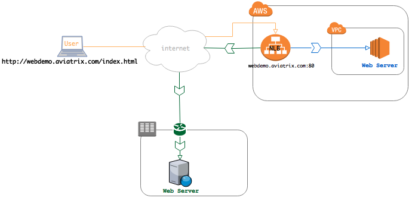

.. |image1| image:: AWS_NetworkLoadBalancer_Onsite_And_In_Cloud_media/overview_with_aviatrix.png

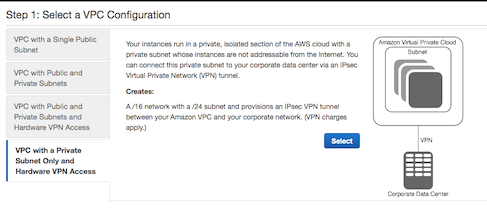

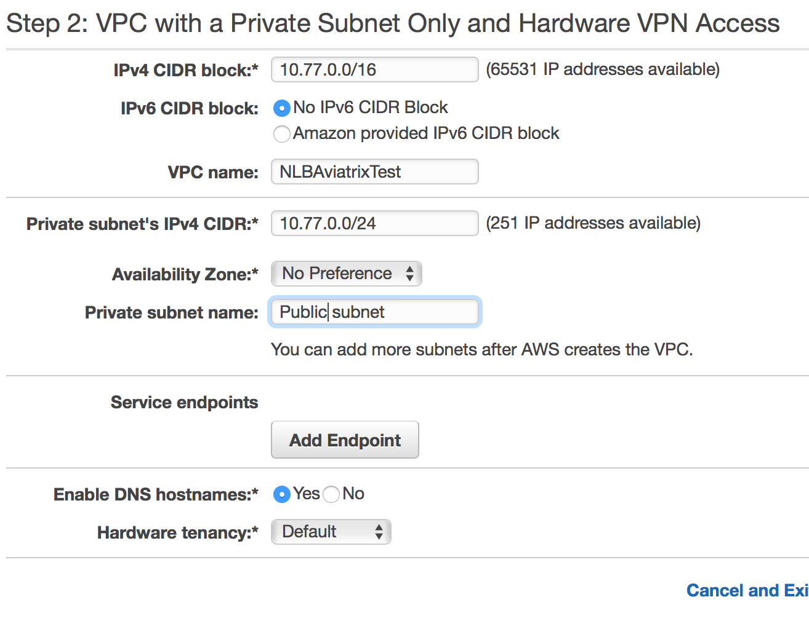

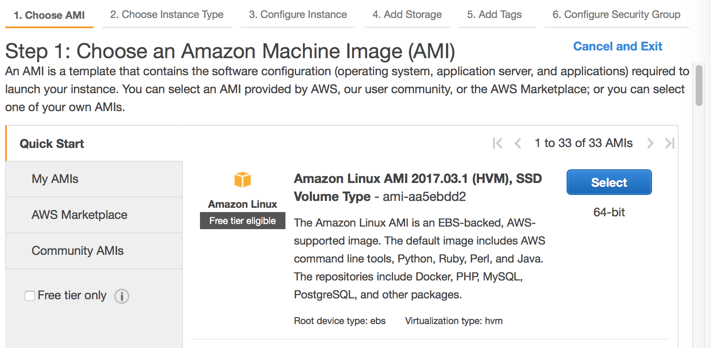

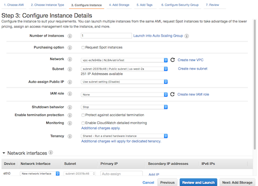

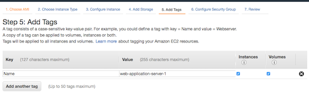

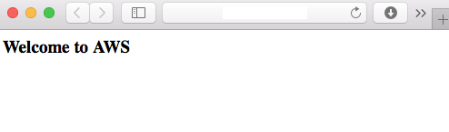

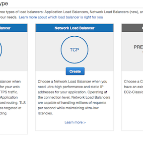

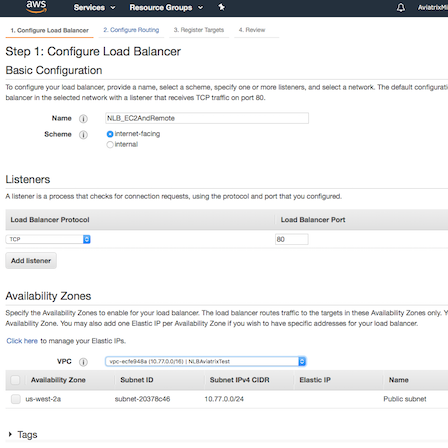

.. |imageAWSNLB3| image:: AWS_NetworkLoadBalancer_Onsite_And_In_Cloud_media/aws_screenshots/create_nlb/screenshot_configure_load_balancer_step_2.png

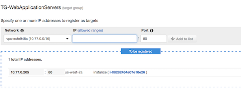

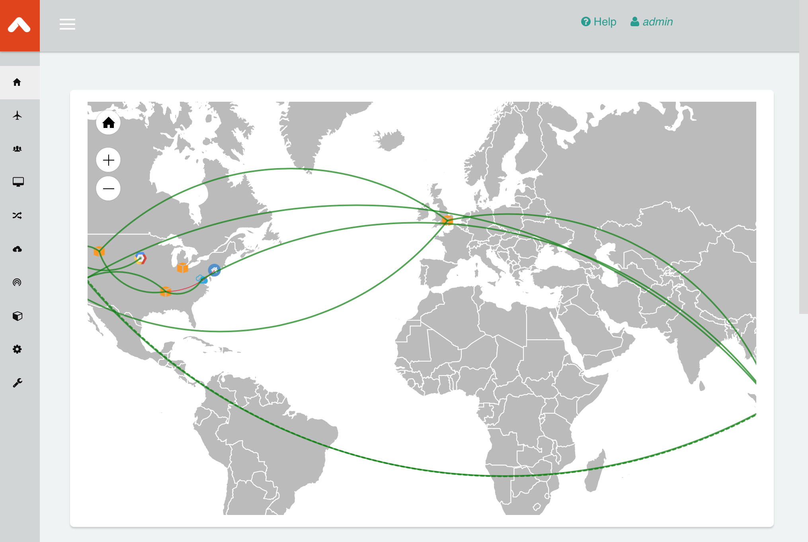

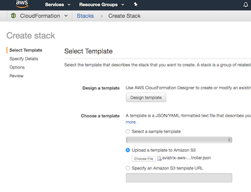

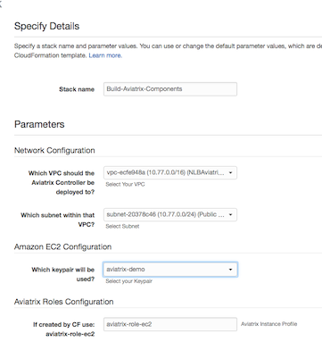

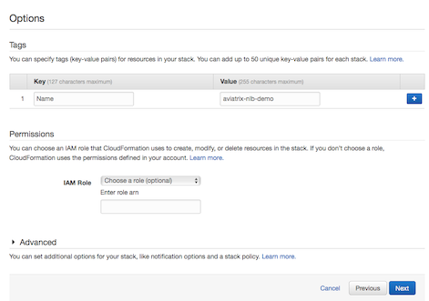

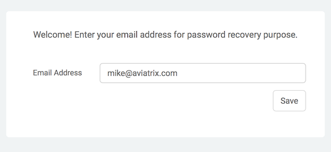

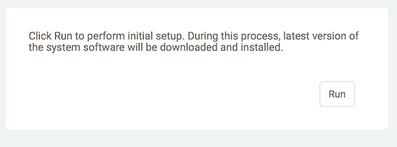

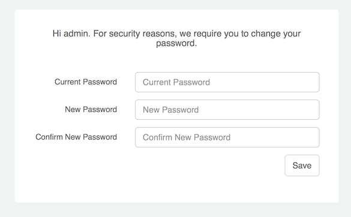

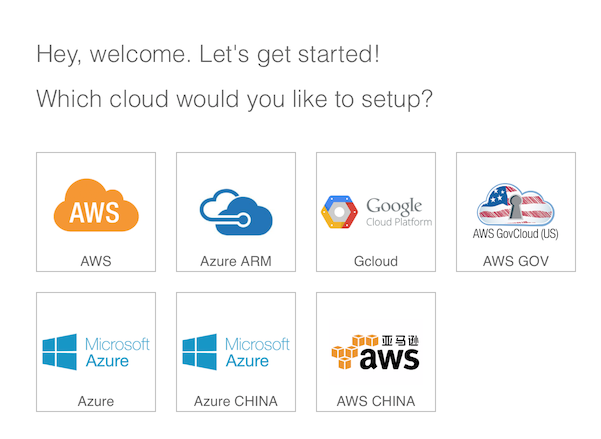

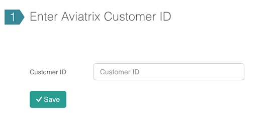

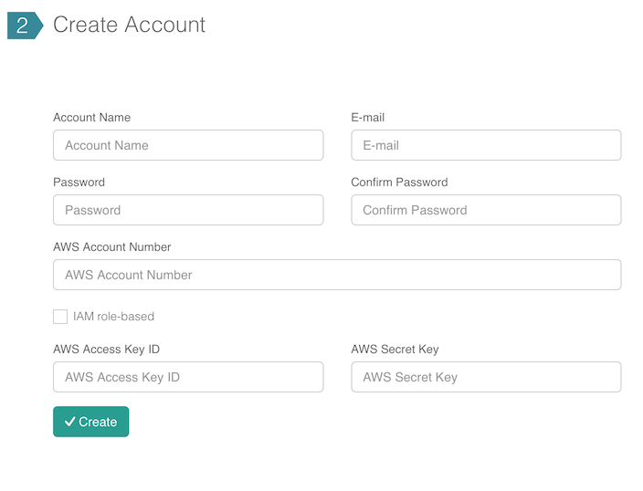

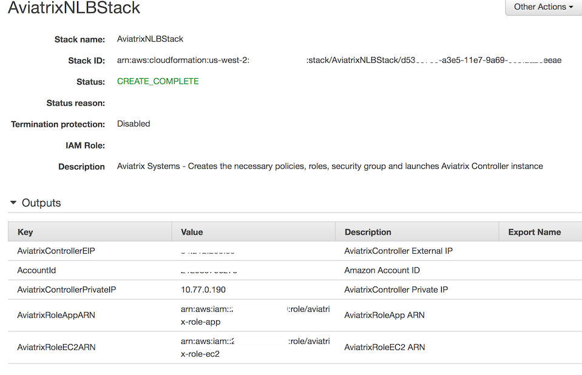

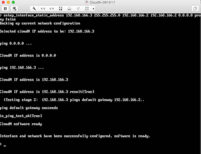

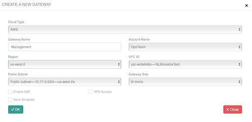

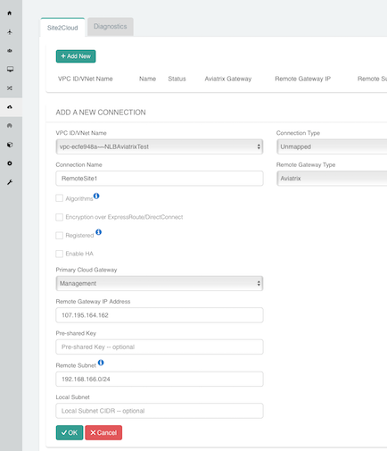

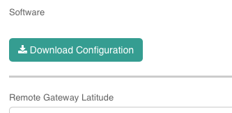

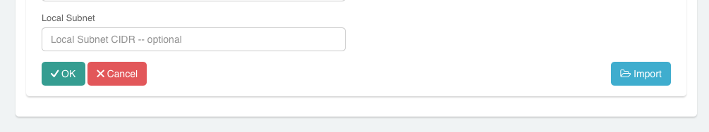

.. |imageSite2Cloud3| image:: AWS_NetworkLoadBalancer_Onsite_And_In_Cloud_media/site2cloud_screenshots/screenshot_site2cloud_link_down.png

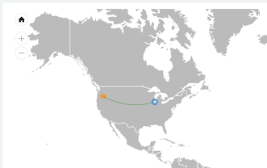

.. |imageTestTG0| image:: AWS_NetworkLoadBalancer_Onsite_And_In_Cloud_media/test_screenshots/tg/screenshot_test_tg_plus.png

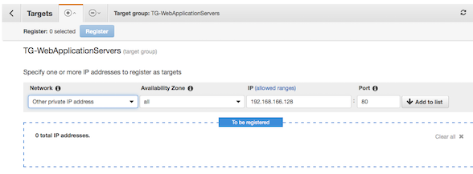

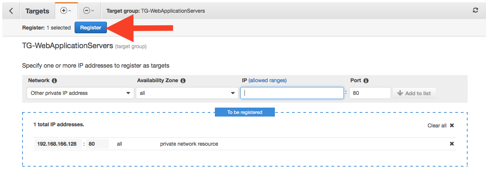

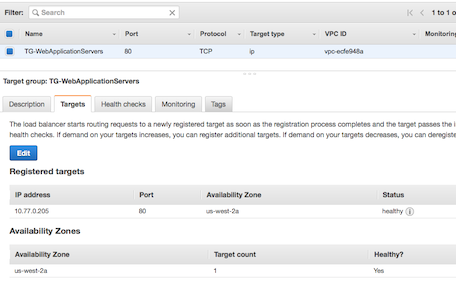

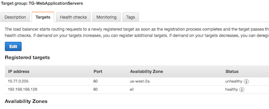

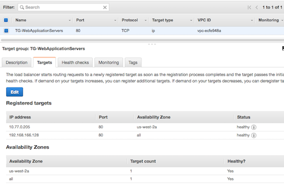

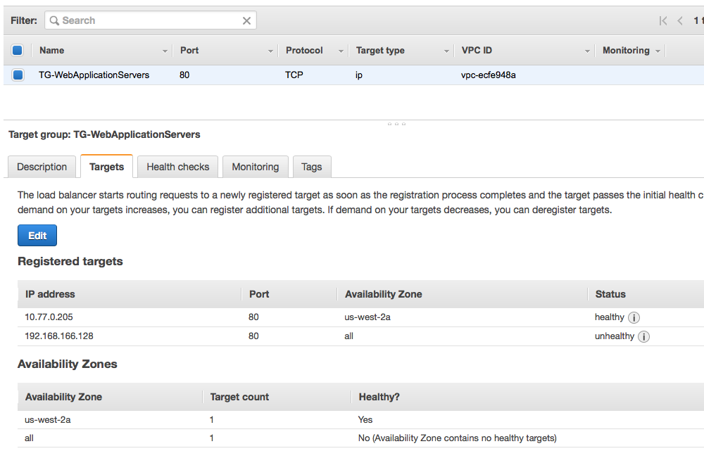

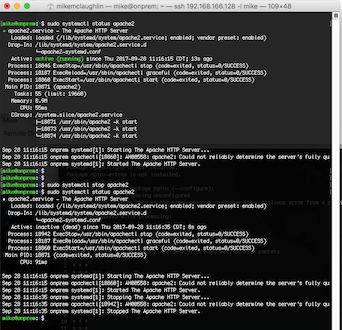

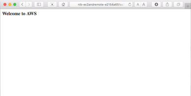

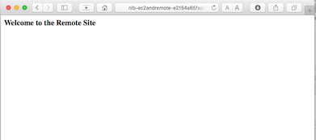

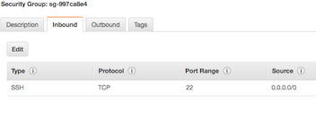

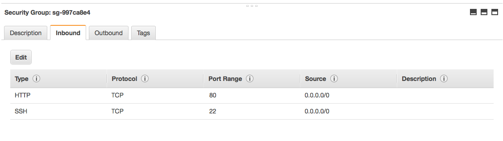

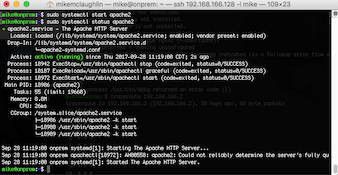

.. disqus::

