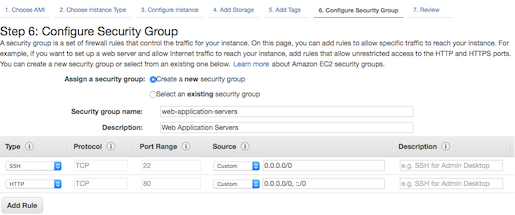
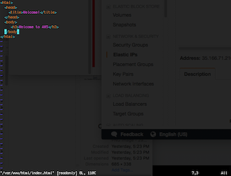
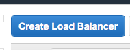
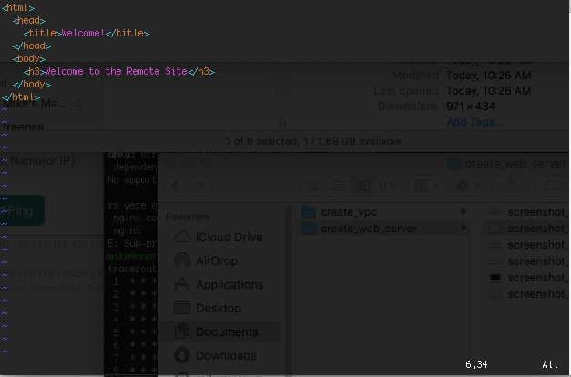

.. meta::
   :description: Using the AWS Network Load Balancer to balance loads between the cloud and a remote office or datacenter
   :keywords: NLB, network load balancer, aviatrix, balance workload

.. raw:: html

   

================================================================================
Hybrid Load Balancing
================================================================================

Balance Traffic between AWS and your Datacenter using AWS Network Load Balancer and Aviatrix Gateway
----------------------------------------------------------------------------------------------------

Problem Description
===================
Operations teams are frequently dealing with infrastructure and services hosted both in the cloud and on-premise.  A few common use cases for this include:

  * DR scenarios,
  * centrally located shared services, and
  * application and workload migration to the cloud.

There are numerous examples in these categories that, on the surface, sound straightforward to implement.  However, properly and securely routing the network traffic for these hybrid use cases presents a challenge to most teams.

And, routing traffic between the cloud and on-premise is critical to higher level services such as load balancing.  Imagine that you have centrally located your AD server in the cloud.  You might also like to place a replica in the corporate offices for redundancy and performance.  Ideally, traffic could be load balanced between the two locations providing a fault-tolerant, faster experience for the user.

Until recently, this task would have been impossible with AWS' built-in load balancers.  Howver, AWS recently released the `Network Load Balancer <http://docs.aws.amazon.com/elasticloadbalancing/latest/network/introduction.html>`_ that attempts to make it possible.  However, using the NLB will only work if you have DirectConnect between the remote site and the AWS region.  So, for most users this doesn't help.

Aviatrix solves this for everyone including AWS customers without DirectConnect.  In this document, we will demonstrate how to go from an empty AWS VPC and a hypervisor at a remote site to a working demo that balances web traffic between the two sites.

Demonstration
=============
This demo will involve two web servers hosting a basic website.  The servers will be co-located in our corporate data center and also in AWS.  We'll setup the NLB service to listen on port 80 and configure both of these servers as potential targets.

This diagram represents the desired configuration:

|image0|

The webdemo hostname has been registered in DNS with an A record pointing to the NLB public IP address.  When a user accesses the demo site (webdemo.aviatrix.com/index.html) from a browser, that request will be handled by the Network Load Balancer  (the :orange:`orange` line in the diagram).  The NLB will choose either the :green:`green` route to the data center or the :blue:`blue` route to the EC2 instance and the selected web server will respond to the user with the contents of the requested file.

For the purposes of this demo, the contents of `index.html` will differ slightly on each server to include either "Welcome to the Data Center" or "Welcome to AWS".

Prerequisites
=============
In order to complete the steps in this guide, you'll need:

- An AWS account,
- An Aviatrix license key

Step 1: Create AWS Resources
============================
For AWS, we'll create a new VPC, EC2 instance, and enable the NLB service.

Step 1a: Create VPC
-------------------
There are a number of ways to create a VPC in AWS.  We'll use the VPC Wizard, available in the `VPC Dashboard <https://console.aws.amazon.com/vpc/home>`_.  Click the `Start VPC Wizard` button to launch the wizard.
 |imageAWSVPC0|

For this setup, select the `VPC with a Private Subnet Only and Hardware VPN Access` option.

 |imageAWSVPC1|

Then, fill out the form that follows providing an appropriate CIDR block and VPC name.

 |imageAWSVPC2|

Step 1b: Create Web Server Instance
-----------------------------------
We'll create a T2-micro instance running Amazon Linux and Apache to handle the web server role.  The steps we used to create the EC2 instance are shown below:

 |imageAWSEC20|

 |imageAWSEC21|

 |imageAWSEC22|

 |imageAWSEC23|

Next, install Apache and create an index.html page on this instance.  We temporarily associated an Elastic IP with this instance for convenience while configuring it. ::

  > ssh ec2-user@<EIP> -i ~/aviatrix/demo/aws/aviatrix-demo.pem

And, install the Apache package::

  > sudo yum install httpd

Finally, create a simple `index.html` page::

  <html>
    <head>
      <title>Welcome!</title>
    </head>
    <body>
      <h3>Welcome to AWS</h3>
    </body>
  </html>

Now, if we go directly to our EIP in a web browser we should see this:

  |imageAWSEC25|

Step 1c: Configure the Network Load Balancer
--------------------------------------------
Now that we are done with direct access to our instance, we can disassociate the EIP and set up the NLB to use this new instance as its target.

In the EC2 Dashboard, select `Load Balancers` and then click the `Create Load Balancer` button.

  |imageAWSNLB0|

Select `Network Load Balancer` when prompted for the type:

  |imageAWSNLB1|

On Step 1, give the NLB a name and select `internet-facing` for the Scheme.  We'll only need one listener on port 80 for this test, so you can keep the default configuration.

Under Availability Zones, select the VPC we created in step 1a and then check the only subnet in the table below that.

  |imageAWSNLB2|

On Step 2, select "New target group" and provide a name.  Be sure to change the "Target type" to "ip" instead of "instance" (we'll rely on this configuration later when accessing our remote site).  Everything else will remain the default.

  |imageAWSNLB3|

Step 3 requires us to select our target(s).  For now, we only have one (our Linux EC2 instance that we created in the previous step.

In the "IP" field, type in the private IP address of the EC2 instance that was created earlier.  Keep the default port of 80 in the Port field and then click `Add to list`.

  |imageAWSNLB4|

Review the configuration and click `Create`.   Give the Load Balancer a few minutes to move out of the `provisioning` state into `active`.  Once `active`, open a web browser and go to the public DNS name posted with the load balancer details.
 
Step 2: Configure Remote Site
=============================
The remote site can be any network not in AWS.  For this demo, I've provisioned an Ubuntu VM with Apache on my laptop's VMware Fusion environment.

On this VM, I've also added a simple `index.html` file::

  <html>
    <head>
      <title>Welcome!</title>
    </head>
    <body>
      <h3>Welcome to the Remote Site</h3>
    </body>
  </html>

Step 3: Set up Aviatrix in the Cloud
====================================
Without a DirectConnect connection between the remote site and AWS, you won't be able to add this new VM to the NLB.  However, Aviatrix can overcome this requirement with a few simple steps.

Step 3a: Install and configure the Controller
---------------------------------------------
The Aviatrix Controller provides a single pane of glass to visualize all of your hybrid cloud networking connections.  An example dashboard looks like this:

 |imageAvtxDashboard0|

The Controller can be installed anywhere (either in the cloud or on the remote site and in any VPC).  For this demo, we're going to install the Controller in AWS.

Aviatrix makes installation very simple with a `CloudFormation script <https://github.com/AviatrixSystems/AWSQuickStart/blob/master/aviatrix-aws-quickstart-controller.json>`_.  Grab a copy of that file and head over to the `CloudFormation dashboard <https://console.aws.amazon.com/cloudformation/home>`_ and click "Create Stack".

Select "Upload a template to Amazon S3" and choose the `aviatrix-aws-quickstart.json` you grabbed from GitHub earlier.  Then, click "Next".

  |imageAWSCF0|

Next, specify a name, VPC, subnet, and keypair to use for the instances that will be created:

  |imageAWSCF1|

In most cases, you can leave the next page with defaults after entering a name.

  |imageAWSCF2|

Click "Create" and wait for the stack to complete (usually in less than 5 minutes).

Once the stack status is in "CREATE_COMPLETE", there are 2 optional tasks:
   1. associate a EIP with the controller and
   2. assign a hostname in DNS

All the information you need for the following steps is contained in the Stack's output.  Keep this window open for reference.

  |imageController7|

Next, open a browser and connect to the controller.  Login with the username "admin".  The password is the controller's private IP address.  Follow the prompts to enter your email address and click "Run" when prompted to upgrade the Controller to the latest version.

  |imageController0|

  |imageController1|

When the upgrade is finished, login using admin/<private ip address>.  Once you login, you will be prompted to change your password.  After that you will see this screen:

  |imageController4|

Select "AWS" to configure your AWS account.  And, then enter your Aviatrix customer ID and click "Save":

  |imageController5|

Finally, create an Aviatrix Controller account.  You'll use this to login to the Controller.  Be sure to check the box "IAM role-based" and use the ARN's provided in the output of the CloudFormation stack.

  |imageController6|

Step 3b: Create a Gateway
-------------------------
Next we'll install an Aviatrix Gateway in this VPC.  This will be where our remote site will connect.

Select the Gateway menu item from the navigation bar on the left:

  |imageGateway0|

And, click on the "+ New Gateway" button at the top.  Select your AWS region and appropriate VPC and subnet.  We'll use just a t2.micro for this Gateway.  Click "OK" and Aviatrix will handle the rest.

  |imageGateway1|

Once the Gateway is up, you should see it appear on the dashboard:

  |imageGateway2|
  
  
Step 4: Set up Aviatrix on your remote site
===========================================

Our final step is to add an Aviatrix Gateway in our remote site.  For this, Aviatrix provides an appliance that can be downloaded from `here <http://aviatrix.com/download/>`_.  Download the appropriate appliance for your environment and spin up a VM.  Once started, the VM will prompt you to configure it.

Step 4a: Configure the Appliance
--------------------------------
At the prompt, enter `help` to see the options available.  You'll want to setup a static IP address.  The format of the command is::

 > setup_interface_static_address <static_ip> <netmask> <default_gateway> <primary_dns> <secondary_dns> proxy {true|false}

Our configuration (on a VMware Fusion instance) looks like this:

  |imageCloudN0|

Once complete, open a browser and browse to the IP address you just configured for your controller.   Follow the same initial steps as you did for the cloud (AWS) Controller.  Once you get to Step 2 `Datacenter Extension or Site2Cloud`, stop and click on the `Site2Cloud` icon on the left.

  |imageCloudN1|

Step 4b: Connect the remote site to the cloud
---------------------------------------------
In a separate browser window, log back into the AWS Controller.  Click on the `Site2Cloud` icon on the left and click `+ Add New` button at the top.  Select the correct VPC, enter a Connection Name, and change the Remote Gateway Type to Aviatrix.  Finally, provide the edge router IP address for the Remote Gateway IP Address and populate the appropriate Remote Subnet.  Then, click `OK`.

  |imageSite2Cloud0|

Once complete, select the connection from the table you just created.  Click `Download Configuration` (NOTE: you may need to disable the popup blocker for this to work).

  |imageSite2Cloud1|

Once downloaded, go back to the browser window with the remote site.  You should be on the `Site2Cloud` page.  Click `+ Add New` at the top.  Then, scroll to the bottom and select `Import`.

  |imageSite2Cloud2|

In the file open box, select the configuration downloaded in the previous step.  Once complete, go to the dashboard on the AWS Controller browser window.  You should see the 2 sites connected but with a red line.

  |imageSite2Cloud3|

Once the link is established and the line representing the link turns green, we are all set.

  |imageSite2Cloud4|

One last step that we'll need to do is to tell our edge router how to route traffic back to AWS VPC private IP address range.  The steps to make this change will depend on your individual router.  You'll need to route all traffic destined for the AWS VPC private IP range (10.77.0.0/24 in my example) back to the Gateway.

Step 5: Test
============
First, let's add our remote site to the NLB.  Back in the AWS console, head over to the Target Groups (in the EC2 Dashboard).  Click on the Target Group we created earlier and then click on Targets.  You should have just one IP in the list right now.  Click `Edit` and then click on the `+` icon at the top.

|imageTestTG0|

Change the `Network` drop down to `Other private IP address` and then enter the private IP address of the Ubuntu Apache VM we set up earlier on the remote side. Click `Add to list` and then `Register`.

|imageTestTG1|

|imageTestTG2|

Once the remote VM is registered, verify that the NLB shows both targets as `healthy`.  It will take a few minutes for the newly added IP to move from `initial` to `healthy`.

|imageTestTG5|

After both target IP addresses are `healthy`, we are ready to test.  First, let's open a browser window to the NLB's EIP.  We should see the welcome message from one of the web servers.  On my first attempt, I saw the remote site:

|imageTest2|

Next, let's turn off the web server on remote VM:

|imageTest0|

The NLB target group reports the server as `unhealthy` quickly after:

|imageTestTG7|

And, the browser, after refresh, shows the welcome message from AWS:

|imageTest1|

Next, start Apache back up on the remote VM and wait for the target group to show both targets as `healthy`.  Once both are healthy, shut down Apache on the AWS (or remove port 80 from the security group's allowed inbound ports):

|imageTest3|

Now, the browser, after refresh, shows the welcome message from the remote VM:

|imageTest2|

Start Apache back up on the AWS instance (or add port 80 back to the security group):

|imageTest0|

.. |image0| image:: AWS_NetworkLoadBalancer_Onsite_And_In_Cloud_media/Overview.png

.. |imageAWSVPC0| image:: AWS_NetworkLoadBalancer_Onsite_And_In_Cloud_media/aws_screenshots/create_vpc/screenshot_start_vpc_wizard_button.png

.. |imageAWSVPC1| image:: AWS_NetworkLoadBalancer_Onsite_And_In_Cloud_media/aws_screenshots/create_vpc/screenshot_vpc_step_1.png

.. |imageAWSVPC2| image:: AWS_NetworkLoadBalancer_Onsite_And_In_Cloud_media/aws_screenshots/create_vpc/screenshot_vpc_step_2.png

.. |imageAWSEC20| image:: AWS_NetworkLoadBalancer_Onsite_And_In_Cloud_media/aws_screenshots/create_web_server/screenshot_EC2_step_1.png

.. |imageAWSEC21| image:: AWS_NetworkLoadBalancer_Onsite_And_In_Cloud_media/aws_screenshots/create_web_server/screenshot_EC2_step_3.png

.. |imageAWSEC22| image:: AWS_NetworkLoadBalancer_Onsite_And_In_Cloud_media/aws_screenshots/create_web_server/screenshot_EC2_step_5.png

.. |imageAWSEC25| image:: AWS_NetworkLoadBalancer_Onsite_And_In_Cloud_media/aws_screenshots/create_web_server/screenshot_web_browser_view_of_aws_httpd.png

.. |imageAWSNLB1| image:: AWS_NetworkLoadBalancer_Onsite_And_In_Cloud_media/aws_screenshots/create_nlb/screenshot_nlb_select_load_balancer_type.png

.. |imageAWSNLB2| image:: AWS_NetworkLoadBalancer_Onsite_And_In_Cloud_media/aws_screenshots/create_nlb/screenshot_configure_load_balancer_step_1.png

.. |imageAWSNLB3| image:: AWS_NetworkLoadBalancer_Onsite_And_In_Cloud_media/aws_screenshots/create_nlb/screenshot_configure_load_balancer_step_2.png

.. |imageAWSNLB4| image:: AWS_NetworkLoadBalancer_Onsite_And_In_Cloud_media/aws_screenshots/create_nlb/screenshot_configure_load_balancer_step_3.png

.. |imageAvtxDashboard0| image:: AWS_NetworkLoadBalancer_Onsite_And_In_Cloud_media/aviatrix_screenshots/screenshot_aviatrix_dashboard_sample.png

.. |imageAWSCF0| image:: AWS_NetworkLoadBalancer_Onsite_And_In_Cloud_media/aws_screenshots/create_aviatrix_using_cf/screenshot_cf_select_template.png

.. |imageAWSCF1| image:: AWS_NetworkLoadBalancer_Onsite_And_In_Cloud_media/aws_screenshots/create_aviatrix_using_cf/screenshot_cf_specify_details.png

.. |imageAWSCF2| image:: AWS_NetworkLoadBalancer_Onsite_And_In_Cloud_media/aws_screenshots/create_aviatrix_using_cf/screenshot_cf_options.png

.. |imageController0| image:: AWS_NetworkLoadBalancer_Onsite_And_In_Cloud_media/controller_setup_screenshots/screenshot_controller_email.png

.. |imageController1| image:: AWS_NetworkLoadBalancer_Onsite_And_In_Cloud_media/controller_setup_screenshots/screenshot_controller_run_update.png

.. |imageController2| image:: AWS_NetworkLoadBalancer_Onsite_And_In_Cloud_media/controller_setup_screenshots/screenshot_controller_change_password.png

.. |imageController3| image:: AWS_NetworkLoadBalancer_Onsite_And_In_Cloud_media/controller_setup_screenshots/screenshot_controller_email.png

.. |imageController4| image:: AWS_NetworkLoadBalancer_Onsite_And_In_Cloud_media/controller_setup_screenshots/screenshot_controller_wizard_home.png

.. |imageController5| image:: AWS_NetworkLoadBalancer_Onsite_And_In_Cloud_media/controller_setup_screenshots/screenshot_controller_enter_aviatrix_customer_id.png

.. |imageController6| image:: AWS_NetworkLoadBalancer_Onsite_And_In_Cloud_media/controller_setup_screenshots/screenshot_controller_create_account.png

.. |imageController7| image:: AWS_NetworkLoadBalancer_Onsite_And_In_Cloud_media/controller_setup_screenshots/screenshot_controller_stack_outputs.png

.. |imageCloudN0| image:: AWS_NetworkLoadBalancer_Onsite_And_In_Cloud_media/cloudn_screenshots/screenshot_cloudn_setup_address.png

.. |imageCloudN1| image:: AWS_NetworkLoadBalancer_Onsite_And_In_Cloud_media/cloudn_screenshots/screenshot_cloudn_site2cloud_icon_navigation.png

.. |imageGateway0| image:: AWS_NetworkLoadBalancer_Onsite_And_In_Cloud_media/aws_gateway_screenshots/screenshot_gw_nav_gateway.png

.. |imageGateway1| image:: AWS_NetworkLoadBalancer_Onsite_And_In_Cloud_media/aws_gateway_screenshots/screenshot_gw_create_new.png

.. |imageGateway2| image:: AWS_NetworkLoadBalancer_Onsite_And_In_Cloud_media/aws_gateway_screenshots/screenshot_gw_dashboard.png

.. |imageSite2Cloud0| image:: AWS_NetworkLoadBalancer_Onsite_And_In_Cloud_media/site2cloud_screenshots/screenshot_aws_site2cloud_add_new.png

.. |imageSite2Cloud1| image:: AWS_NetworkLoadBalancer_Onsite_And_In_Cloud_media/site2cloud_screenshots/screenshot_site2cloud_aws_download_config.png

.. |imageSite2Cloud2| image:: AWS_NetworkLoadBalancer_Onsite_And_In_Cloud_media/site2cloud_screenshots/screenshot_site2cloud_remote_import.png

.. |imageSite2Cloud3| image:: AWS_NetworkLoadBalancer_Onsite_And_In_Cloud_media/site2cloud_screenshots/screenshot_site2cloud_link_down.png

.. |imageSite2Cloud4| image:: AWS_NetworkLoadBalancer_Onsite_And_In_Cloud_media/site2cloud_screenshots/screenshot_site2cloud_link_up.png

.. |imageTestTG0| image:: AWS_NetworkLoadBalancer_Onsite_And_In_Cloud_media/test_screenshots/tg/screenshot_test_tg_plus.png

.. |imageTestTG1| image:: AWS_NetworkLoadBalancer_Onsite_And_In_Cloud_media/test_screenshots/tg/screenshot_test_tg_about_to_add.png

.. |imageTestTG2| image:: AWS_NetworkLoadBalancer_Onsite_And_In_Cloud_media/test_screenshots/tg/screenshot_test_tg_remote_ip_added.png

.. |imageTestTG3| image:: AWS_NetworkLoadBalancer_Onsite_And_In_Cloud_media/test_screenshots/tg/screenshot_test_tg_before_adding_remote.png

.. |imageTestTG4| image:: AWS_NetworkLoadBalancer_Onsite_And_In_Cloud_media/test_screenshots/tg/screenshot_test_tg_aws_unhealthy.png

.. |imageTestTG5| image:: AWS_NetworkLoadBalancer_Onsite_And_In_Cloud_media/test_screenshots/tg/screenshot_test_tg_both_healthy.png

.. |imageTestTG6| image:: AWS_NetworkLoadBalancer_Onsite_And_In_Cloud_media/test_screenshots/tg/screenshot_test_tg_remote_ip_added.png

.. |imageTestTG7| image:: AWS_NetworkLoadBalancer_Onsite_And_In_Cloud_media/test_screenshots/tg/screenshot_test_tg_unhealthy_remote.png

.. |imageTest0| image:: AWS_NetworkLoadBalancer_Onsite_And_In_Cloud_media/test_screenshots/screenshot_test_apache_status_then_stop.png

.. |imageTest1| image:: AWS_NetworkLoadBalancer_Onsite_And_In_Cloud_media/test_screenshots/screenshot_test_browser_aws_after_remote_unhealthy.png

.. |imageTest2| image:: AWS_NetworkLoadBalancer_Onsite_And_In_Cloud_media/test_screenshots/screenshot_test_browser_remote.png

.. |imageTest3| image:: AWS_NetworkLoadBalancer_Onsite_And_In_Cloud_media/test_screenshots/screenshot_test_sg_http_removed.png

.. |imageTest4| image:: AWS_NetworkLoadBalancer_Onsite_And_In_Cloud_media/test_screenshots/screenshot_test_sg_http_allowed.png

.. |imageTest5| image:: AWS_NetworkLoadBalancer_Onsite_And_In_Cloud_media/test_screenshots/screenshot_test_start_apache_remote.png

.. role:: orange
          
.. role:: green
          
.. role:: blue

.. disqus::

