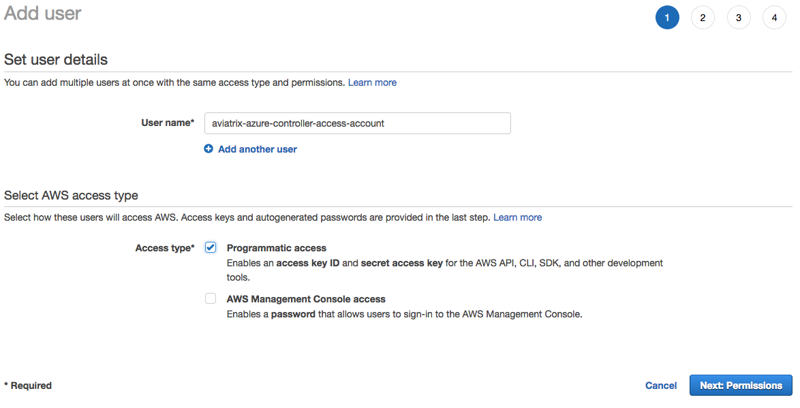
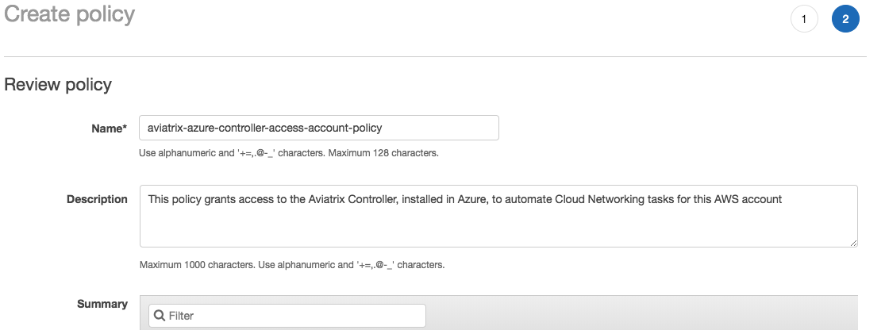
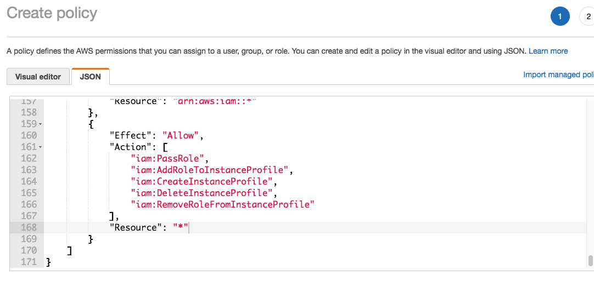
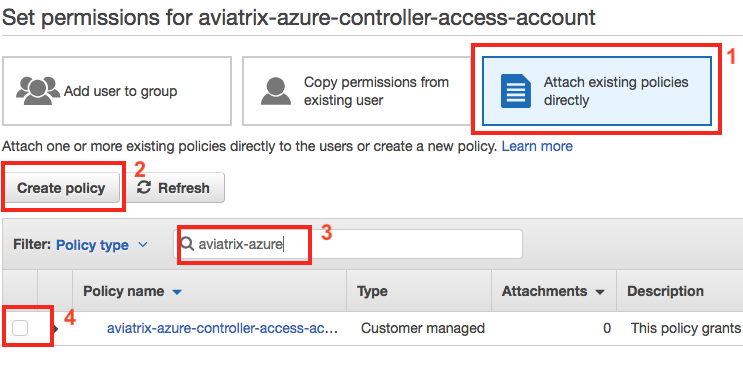
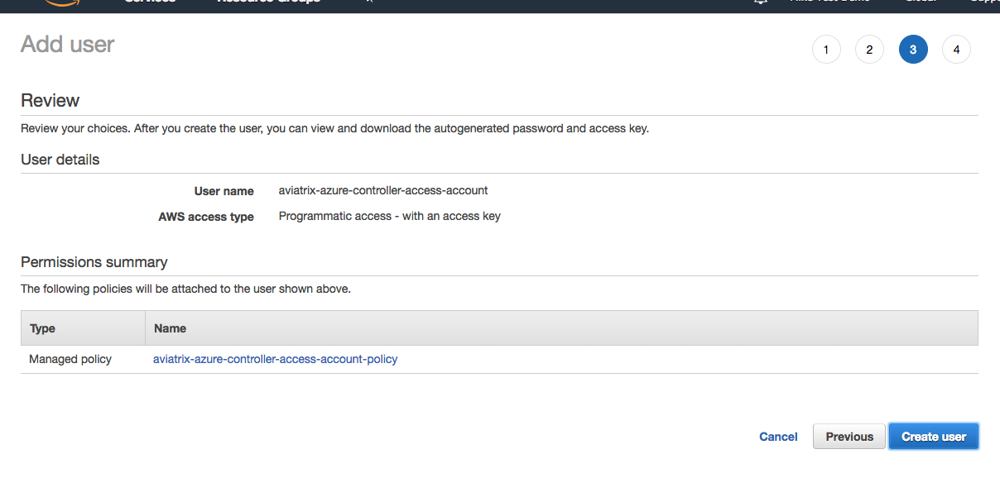
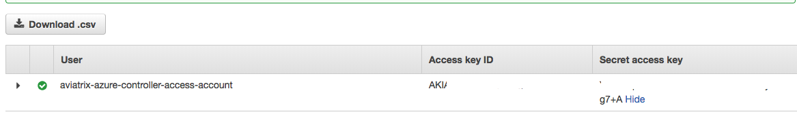

==================================================================
Add an AWS access account to Azure Controller
==================================================================

Overview
--------

If you have installed your Controller in Azure, you will not be able to use IAM roles to grant the Controller access to the account.  The Controller must be installed in AWS with an AWS EC2 role attached for this to work.

This guide outlines the steps to set up access to your AWS account using the Access Key ID and Secret Key.

Onboarding Steps
----------------

.. note::

   These steps apply to users who have an Aviatrix Controller installed in Azure and wish to add an AWS account.

Create an AWS User
++++++++++++++++++

Since you cannot use IAM roles to grant access to an Azure Controller, you must create a new AWS user and obtain the Access Key ID and Secret Key.

#. Login to the `AWS IAM console <https://console.aws.amazon.com/iam/home#/users>`__
#. Create a new user by clicking on the **Add user** button

   |imageAddUserStep1|

#. In the `User name` field, enter something like `aviatrix-azure-controller-access-account`
#. Select **Programmatic access** only (leave `AWS Management Console access` unchecked)
#. Click **Next::Permissions**
#. Select **Attach existing policies directly**
#. Click **Create policy**
#. In the new window, click on **JSON**

   |imageCreatePolicyEnterJSON|

#. In the JSON editor, delete the default value and paste in the contents of `this <https://s3-us-west-2.amazonaws.com/aviatrix-download/IAM_access_policy_for_CloudN.txt>` document
#. Click **Review policy**

   |imageCreatePolicyReview|

#. Enter a `Name` like `aviatrix-azure-controller-access-account-policy`
#. Enter a `Description` like `This policy grants access to the Aviatrix Controller, installed in Azure, to automate Cloud Networking tasks for this AWS account`
#. Click **Create policy**

   
   
#. Close the IAM policy window and return to the IAM user console
#. Click **Refresh** to show the newly created policy
#. Search for the policy you just created and select it
#. Click **Next: Review**

   |imageAddUserAttachPolicy|
   
#. Click **Create user**

   |imageAddUserReview|

#. On the following screen, you will be given an `Access key ID` and `Secret access key`. 

   |imageAddUserGetCredentials|

Add Access Account to Aviatrix Controller
+++++++++++++++++++++++++++++++++++++++++

#. Login to your Aviatrix Controller
#. Go to the **Access Accounts** navigation item below **Accounts**
#. Click **+ New Account**
#. Enter a new Account Name and select **AWS**
#. Uncheck the **IAM role-based** checkbox

   .. important::
      You will receive an error ('The controller is not role-based enabled.') if you attempt to use role-based access to your AWS account.

#. Enter the `AWS Access Key ID` and `AWS Secret Key` from the user created earlier
#. Enter the `AWS Account Number`
#. Click **OK**

   |imageAviatrixAddAccount|

.. |imageAviatrixAddAccount| image:: AddAWSAccountToAzure_media/aviatrix_new_account_creation.png
