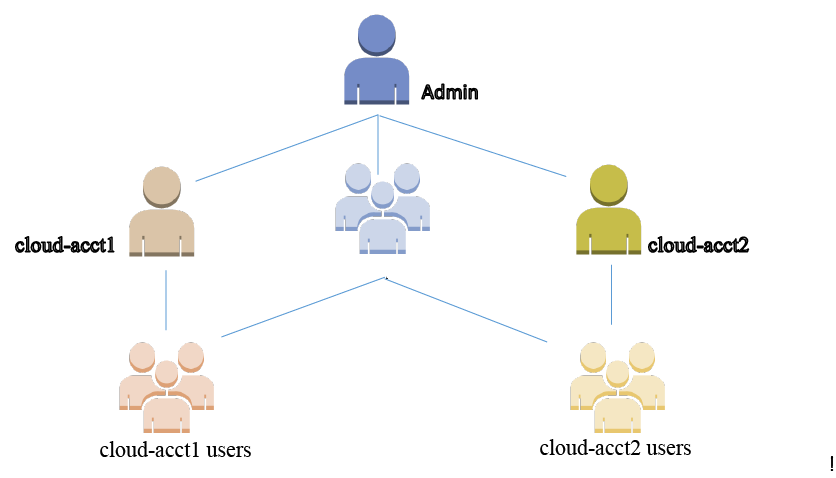
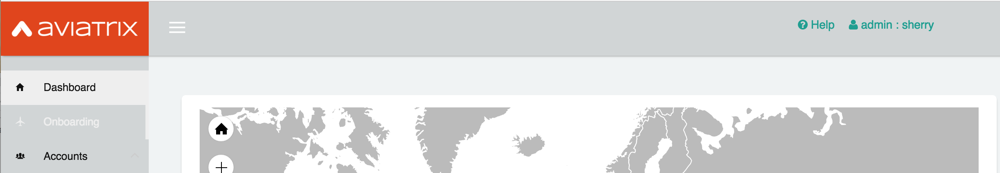
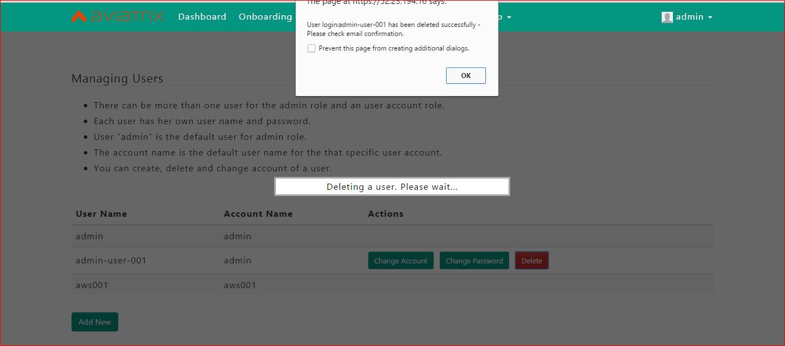
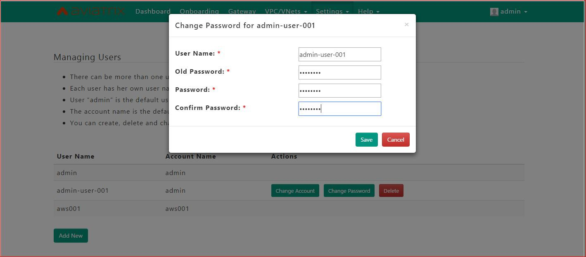
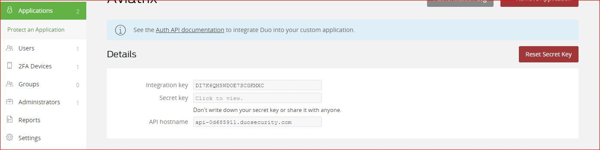
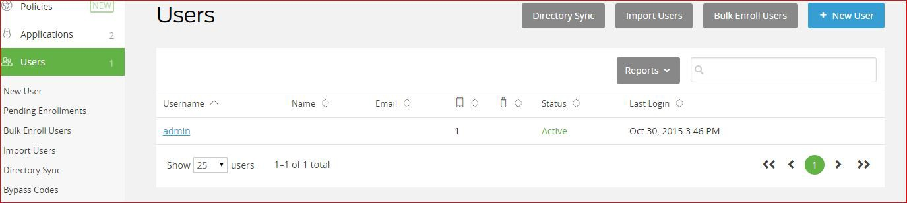

.. meta::
   :description: Admin users and Duo Authentication Management
   :keywords: Admin users, Duo authentication, Duo, Aviatrix

=============================================
Admin Users and Duo Authentication Management
=============================================
  

Objectives
-----------

    This document describes a reference design using Aviatrix Cloud
    console’s user management and Duo authentication capability to
    manage multiple users with admin privilege.

    As the cloud Ops team continues to expand to manage more cloud
    deployments, it is often required to give each member in the team
    her own username and password with admin privilege. In addition to
    username and password for log in credentials, a 2FA authentication
    can be added for enhanced security to manage cloud controller. DUO
    authentication is the current supported method. When enabled, it
    requires the user to accept a push message on the user’s mobile
    device from DUO service in addition to username and password at the
    user log in time.

    The following diagram illustrates the user relationship in a typical
    cloud Ops department. In this example, the Ops team has created two
    cloud accounts. A cloud account is associated with one or more
    distinct cloud provider’s API credentials. Typically, a cloud
    account corresponds to an IAM account of a distinct AWS and/or Azure
    account with a credit card.

    A default user “admin” is created by the system. In the picture
    below, admin has created two cloud accounts, each with a default
    user names bearing the cloud account name. Additional users in admin
    and cloud account are added by the admin or admin users.

    |image0|

    Note that the default user created from the cloud account can only
    access information specific to its account from the console. The
    default user cannot be changed in the Users page described below.

Configuration Workflow for Admin Users 
------------------------------------------

Add a new admin user
--------------------

    The page can be found at SettingsN>Manage AccountsN>Users.

    |image1|\ After the first cloud account is created, additional admin
    users can be added from this page. The page can only be accessed by
    the admin or an admin user. Initially, the default users will be
    displayed. Once a new admin user is added, it will be added to the
    list. Only the new users added by this page can be changed or
    deleted.

    |image2|\ When an admin user is created, changed, or deleted, an
    email is sent to the admin’s email address as a record for
    bookkeeping purpose. After the user is added, the user can log into
    the console with the specified user name and password. The user then
    has full access to the console like the admin.

Delete an admin user
--------------------

    |image3|\ The same page can be used to delete an admin user when the
    user leaves the group or the user role changes. After the delete
    button is clicked, a confirmation email is sent to the admin’s email
    address. Note that an admin cannot be deleted by himself or herself
    though the user has the full console access. Typically, the admin
    user is added or deleted by the special username admin.

Change admin user’s password
----------------------------

    Again, the admin user’s password can be changed at the same page. An
    email notification is sent to the admin’s email address after the
    change is successfully done.

    |image4|

Configuration Workflow for Duo Authentication
================================================

Getting DUO API credentials
---------------------------

    You need to first have a DUO account setup.

    If you company already has a DUO account and you have admin
    privilege, log in to the DUO Admin Panel, Click Applications. Click
    one of the applications, in the Details panel is the API credential
    you need to configure DUO on the controller.

    If this is your first time creating a DUO account, Log in to the Duo
    Admin Panel and navigate to Applications. Click Protect an
    Application and locate OpenVPN in the application list. Click
    Protect this application to view Integration key, secret key and API
    hostname. This information is needed to configure DUO on the
    controller. For more details, see
    *https://*\ `*www.duosecurity.com/product* <http://www.duosecurity.com/product>`__
    for more details.

|image5|

    At least one user has to be created in DUO account like below before
    the Duo authentication on the controller is setup so the user can
    log into the console.

    |image6|

    If you cannot login to the controller because of DUO account is not
    setup properly, you can always change DUO policy to Bypass mode to
    disable push approval authentication.

Create Duo Authentication
-------------------------

    To enable DUO, go to SettingsN>SystemN>Setup 2FA Login, as shown
    below.

    Enter Duo integration key, secret key, and API hostname of your
    account in DUO website described earlier. Currently only DUO push is
    supported.

    Once it is created successfully, the Duo push login applies to all
    users, including user admin. Every user (listed in settingsN>Manage
    AccountsN>Users) who wishes to login to the system must have a
    matching user name in DUO account.

|image7|

Remove Duo Authentication
-------------------------

    The Duo authentication setup can be removed completely by clicking
    the Remove button on the same page.

Disable/Enable Duo Authentication
---------------------------------

    The authentication can be disabled or enabled without deleting the
    DUO credential configuration.

API Server Check
----------------

    This button can be used to troubleshoot Duo API server connectivity
    when the API failure is occurring.

.. |image7| image:: Duo_media/image8.png

   
   
.. disqus::   
