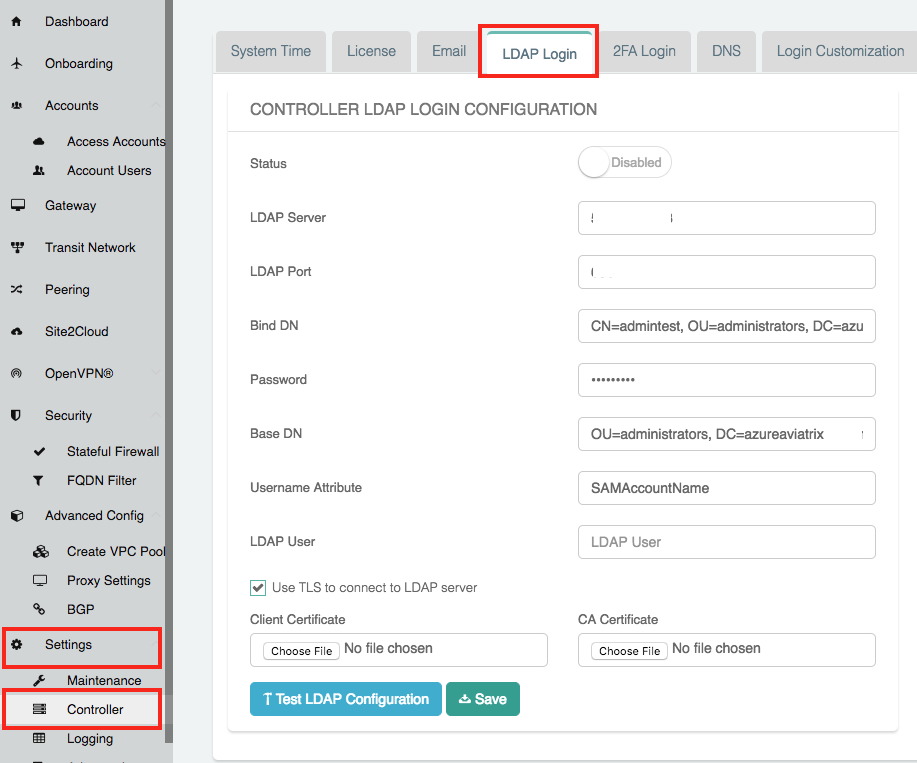

.. raw:: html

   

===============================================================
Controller LDAP Login Configuration
===============================================================

Overview
--------

Aviatrix allows you to configure LDAP authentication for users logging into the Controller.  At the login prompt for the Controller, the user will enter their username and LDAP/AD password to authenticate.

Configuration Details
---------------------

.. note::
   This step must be done by an existing Aviatrix Controller admin user.

#. Login to your Controller
#. Go to the **Settings** navigation menu item
#. Select **Controller**
#. Click on the **LDAP Login** tab

   |imageLDAPForm|

#. Enter the values as described in the table below

   +-------------------------+-------------------------------------------------+
   | Field                   | Description                                     |
   +=========================+=================================================+
   | Status                  | Select `Enabled` to enable LDAP login on the    |
   |                         | Controller.                                     |
   +-------------------------+-------------------------------------------------+
   | LDAP Server             | Enter the IP or hostname of the LDAP            |
   |                         | / AD server.                                    |
   +-------------------------+-------------------------------------------------+
   | LDAP Port               | UDP Port 389 is the standard port for both      |
   |                         | encrypted LDAP (using STARTTLS) and non-        |
   |                         | encrypted connections.                          |
   +-------------------------+-------------------------------------------------+
   | Bind DN                 | DN of the user that the Controller will use to  |
   |                         | authenticate with the LDAP server to handle     |
   |                         | user authentication.                            |
   +-------------------------+-------------------------------------------------+
   | Password                | The password of the `Bind DN` user.             |
   +-------------------------+-------------------------------------------------+
   | Base DN                 | Starting point in the directory for searching   |
   |                         | for matching usernames.                         |
   +-------------------------+-------------------------------------------------+
   | Username Attribute      | User attribute name for username to match.      |
   +-------------------------+-------------------------------------------------+
   | LDAP User               | This field is only used when clicking on the    |
   |                         | `Test LDAP Configuration` button.  It will use  |
   |                         | this value to search and respond if it was      |
   |                         | able to connect and find the user.              |
   +-------------------------+-------------------------------------------------+
   | Use TLS to connect to   | When checked, STARTTLS is used to connect with  |
   | LDAP server             | the LDAP server. NOTE: LDAP Over SSL is not     |
   |                         | supported (port 636). You'd have to provide a   |
   |                         | FQDN for the LDAP server if TLS is turned on.   |
   +-------------------------+-------------------------------------------------+
   | Client Certificate      | Only visible if `Use TLS to connect ...` is     |
   |                         | checked.                                        |
   +-------------------------+-------------------------------------------------+
   | CA Certificate          | Only visible if `Use TLS to connect ...` is     |
   |                         | checked.                                        |
   +-------------------------+-------------------------------------------------+

#. Enter a value for `LDAP User` and click **Test LDAP Configuration** to test the configuration
#. Click **Save** to save this configuration

Considerations
---------------

* LDAP authentication requires that local user accounts be created on the Controller.  The username configured in the `Account Users` must match the username in LDAP/AD.

* Once enabled, local user accounts will no longer be active.  That is, if there is a user created in the Controller that does not match a user in LDAP, they will no longer be able to login to the Controller.

  .. note::
     The local `admin` account is active when ldap is used for controller login authentication as descrived above. Please note that if the `admin` account is disabled via "Settings/Controller/LoginCustomization" and if your ldap authentication is not working as expected for any reason(for eexamp, server is down or not reachable), you will get locked out of the controller till your ldap authentication process is back up.

