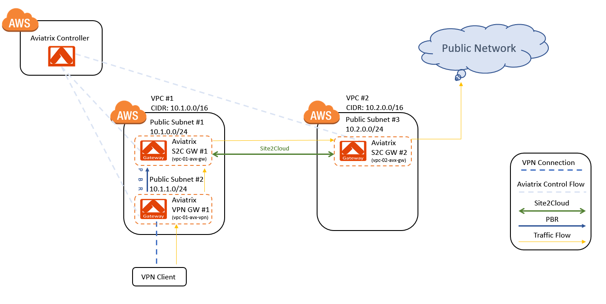

.. meta::

========================================================
Anonymous Internet Surfing
========================================================

Solution Overview
======================

Normally, when you surf an Internet website, the website administrator can easily identify where the user is located. This is done by identifying the source IP address (public IP address assigned to your location) contained in the packets. Sometimes, business needs arise when your employee's internet browsing and online research needs to be anonymous or needs to appear to originate from some other place. For example, when analysis of competitors is required or when avoiding countries' firewalls for better performance and access.

This document describes how to set up anonymous browsing from a client machine by routing internet traffic through an AWS-based Gateway in a different region.

Configuration Workflow
==========================

Pre-Configuration Checklist
-------------------------------

Before configuring VPC Site-to-Cloud peering, make sure the following prerequisites are completed.

**Pre Configuration Check List**

1. Deploy the Aviatrix Controller.
2. Create AWS VPCs and Check Settings.

These prerequisites are explained in detail below.

Deploying the Aviatrix Controller
--------------------------------------------

The Aviatrix Controller must be deployed and set up prior to configuring
VPC and site peering. Please refer to the `Aviatrix Controller Getting
Started Guide for AWS <https://s3-us-west-2.amazonaws.com/aviatrix-download/docs/aviatrix_aws_controller_gsg.pdf>`_ on how to deploy the Aviatrix Controller.

Check and make sure you can access the Aviatrix Controller dashboard and
log in with an administrator account. The default URL for the Aviatrix
Controller is:

https://<public ip of Aviatrix Controller>

Creating AWS VPCs and Checking Settings
--------------------------------------------------

-   Create 2 VPCs - VPC #1 (in Region 1) with CIDR 10.1.0.0/16 and VPC #2 (in Region 2) with CIDR 10.2.0.0/16

-   In VPC #1, create 2 public subnets in the same Availability Zone - 10.1.0.0/24 and 10.1.1.0/24.
    This means that both subnets must be associated with a route table whose default route points to IGW.

-   In VPC #2, create 1 public subnet - 10.2.0.0/24.
    This means that one subnet must be associated with a route table whose default route points to IGW.

Configuration Steps
---------------------------

Make sure the pre-configuration steps in the previous section are completed before proceeding.

The instructions in this section will use the following architecture.
The CIDR and subnets may vary depending on your VPC setup; however, the
general principles will be the same.

|image0|

Deploying Gateways
------------------------------------------

The first step is to deploy Aviatrix Gateways in each VPC.

**Instructions:**

1. Log in to the Aviatrix Controller.
2. Create Aviatrix Peering Gateway #1 in Subnet1 of VPC #1 (in Region 1).
3. Click on Gateway > New Gateway.

===============================    ================================================================================
**Setting**                        **Value**
===============================    ================================================================================
Cloud Type                         Choose AWS.
Gateway Name                       This name is arbitrary (e.g. vpc-01-avx-gw)
Account Name                       Choose the account name.
Region                             Choose the region of VPC #1.
VPC ID                             Choose the VPC ID of VPC #1.
Public Subnet                      Select a public subnet where the gateway will be deployed (e.g. 10.1.0.0/24).
Gateway Size                       t2.micro is fine for testing
Enable NAT                         **Unmark this checkbox** (IMPORTANT)
VPN Access                        Unmark this checkbox
Designated Gateway                 Unmark this checkbox
Allocate New EIP                   Unmark this checkbox
Save Template                      Unmark this checkbox
===============================    ================================================================================

4.  Click **OK**. It will take a few minutes for the gateway to deploy. Do not proceed until the gateway is deployed.
5.  Create an Aviatrix VPN Gateway in Subnet2 of VPC #1 (note that VPN Gateway is in a different subnet of Peering Gateway).
6.  Click on Gateway > New Gateway.

===============================     ===================================================
  **Setting**                       **Value**
===============================     ===================================================
  Cloud Type                        Choose AWS.
  Gateway Name                      This name is arbitrary (e.g. vpc-01-avx-vpn)
  Account Name                      Choose the account name.
  Region                            Choose the region of VPC #1.
  VPC ID                            Choose the VPC ID of VPC #1.
  Public Subnet                     Select the public subnet where the VPN gateway will be deployed (e.g. 10.1.1.0/24)
  Gateway Size                      t2.micro is fine for testing.
  Enable NAT                        Unmark this checkbox
  VPN Access                        Check this box
  Designated Gateway                Unmark this checkbox
  Allocate New EIP                  Unmark this checkbox
  Enable SAML                       Unmark this checkbox
  VPN CIDR Block	                  (e.g. 192.168.43.0/24)
  MFA Authentication                Optional (Disable is fine for testing)
  Max Connections                   100 is fine for testing
  Split Tunnel Mode                 No
  Enable ELB	                     Yes
  ELB Name	                        Leave blank is fine for testing
  Enable Client Cert. Sharing       No
  Enable PBR                        Check this box
  PBR Subnet	                     Select the subnet where Aviatrix Peering Gateway is located (e.g. 10.1.0.0/24)
  PBR Default Gateway               Select the private IP of Aviatrix Peering Gateway (e.g. 10.1.0.138)
  NAT Translation Logging           Unmark this checkbox
  Enable LDAP	                     Optional (Unmark this checkbox is fine for testing)
  Save Template                     Unmark this checkbox
===============================     ===================================================

7.  Click **OK**. It will take a few minutes for the gateway to deploy. Do not proceed until the gateway is deployed.
8.  Create Aviatrix Peering Gateway #2 in VPC #2.
9.  Click on Gateway > New Gateway.

===============================     ===================================================
  **Setting**                       **Value**
===============================     ===================================================
   Cloud Type                       Choose AWS.
   Gateway Name                     This name is arbitrary (e.g. vpc-02-avx-gw)
   Account Name                     Choose the account name.
   Region                           Choose the region of VPC #2.
   VPC ID                           Choose the VPC ID of VPC #2.
   Public Subnet                    Select a public subnet where the gateway will be deployed (e.g. 10.2.0.0/24).
   Gateway Size                     t2.micro is fine for testing
   Enable NAT                       **Mark this checkbox** (IMPORTANT)
   VPN Access                       Unmark this checkbox
   Designated Gateway               Unmark this checkbox
   Allocate New EIP                 Unmark this checkbox
   Save Template                    Unmark this checkbox
===============================     ===================================================

10.  Click **OK**. It will take a few minutes for the gateway to deploy. Do not proceed until the gateway is deployed.

Establishing Site to Cloud Peering Connection
-----------------------------------------------------------

This step explains how to establish a Site-to-Cloud (S2C) connection between two Aviatrix Gateways in VPC #1 and VPC #2.

**Instructions:**

1. From the Aviatrix Controller.
2. Click Site2Cloud > Site2Cloud.
3. Click **+Add New** to establish a S2C connection from Aviatrix Peering Gateway #1 (in VPC #1) to Aviatrix Peering Gateway #2 (in VPC #2).

===============================     =================================================================
  **Setting**                       **Value**
===============================     =================================================================
  VPC ID/VNet Name                  Choose VPC ID of VPC #1.
  Connection Type                   Unmapped
  Connection Name                   This name is arbitrary (e.g. vpc01-s2c-vpc02).
  Remote Gateway Type               Aviatrix (in this example)
  Tunnel Type                       UDP
  Algorithms                        Unmark this checkbox
  Encryption over DirectConnect     Unmark this checkbox
  Enable HA                         Unmark this checkbox
  Primary Cloud Gateway             Select Aviatrix Peering Gateway #1 in VPC #1 (e.g. vpc-01-avx-gw).
  Remote Gateway IP Address         Public IP of Aviatrix Peering Gateway #2 in VPC #2
  Pre-shared Key                    Optional
  Remote Subnet                     0.0.0.0/0
  Local Subnet                      IP of eth1 of Aviatrix VPN Gateway #1 (e.g. 10.1.0.190/32)
===============================     =================================================================

4.  Click **OK**.
5.  From the S2C connection table, select the Site2Cloud connection created above (e.g. vpc01-s2c-vpc02).
6.  Select **Aviatrix** from the **Vendor** dropdown menu.
7.  Click **Download Configuration** then save it.
8.  Click **+Add New" to establish a Site2Cloud connection from Aviatrix Peering Gateway #2.
9.  Choose VPC ID of VPC #2 from "VPC ID/VNet Name" dropdown menu. Click **Import** to upload.
the downloaded configuration saved above.
10. This template file contains the necessary information to configure the new S2C connection.

===============================     ===================================================
  **Setting**                       **Value**
===============================     ===================================================
  VPC ID/VNet Name                  Choose VPC ID of VPC #2.
  Connection Type                   Unmapped
  Connection Name                   This name is arbitrary (e.g. vpc02-s2c-vpc01)
  Remote Gateway Type               Aviatrix
  Tunnel Type                       UDP
  Algorithms                        Mark this checkbox
  Phase 1 Authentication 	         SHA-1
  Phase 2 Authentication 	         HMAC-SHA-1
  Phase 1 DH Groups  		         2
  Phase 2 DH Groups  		         2 
  Phase 1 Encryption 		         AES-256
  Phase 2 Encryption 		         AES-256
  Encryption over DirectConnect     Unmark this checkbox
  Enable HA                         Unmark this checkbox
  Primary Cloud Gateway             Aviatrix Peering Gateway #2 (e.g. vpc-02-avx-gw)
  Remote Gateway IP Address         Public IP of Aviatrix Peering Gateway #1
  Pre-shared Key                    (automatically created)
  Remote Subnet                     IP of eth1 of Aviatrix VPN Gateway #1 (e.g. 10.1.0.190/32)
  Local Subnet                      0.0.0.0/0
===============================     ===================================================

Notes: The IP of eth1 of the Aviatrix VPN Gateway can be acquired from the AWS console.

11.  Click **OK**.

Creating an OpenVPN® User
------------------------------------------------------------

This step explains how to create a OpenVPN® user.

**Instructions:**

1.  From the Aviatrix Controller.
2.  Click OpenVPN® > VPN Users.
3.  Click button **+Add New**.

===============================     ===================================================
  **Setting**                       **Value**
===============================     ===================================================
  VPC ID	                           Choose the VPC ID of VPC #1.
  LB/Gateway Name                   Choose the ELB in VPC #1.
  User Name 		 	               This name is arbitrary (ex. vpn-user).
  User Email			               Email address
  Profile			                  Unmarking this checkbox is fine for the testing.
===============================     ===================================================

4.  Click **OK**.
5.  Check your email to receive a .ovpn file.

Starting Anonymous Browsing
--------------------------------------------

This step explains how to establish an OpenVPN® connection and surf the network anonymously.

**Instructions:**

1.  Enable an OpenVPN® client tool.
2.  Establish an OpenVPN® connection with the ovpn file which has received in email.
3.  Confirm the connectivity to public network.

* Ping to www.google.com.
* Check public IP address (ie. https://www.whatismyip.com/what-is-my-public-ip-address/).
* Check IP location (ie. https://www.iplocation.net/).

Troubleshooting
===============

To check a tunnel state, go to Site2Cloud, the tunnel status will be
displayed at the "status" column.

To troubleshoot a tunnel state, go to Site2Cloud > Diagnostics.

OpenVPN is a registered trademark of OpenVPN Inc.

.. disqus::
