.. meta::
   :description: CloudN: From Initial-Setup to DataCenterExtension Using Linux curl command
   :keywords: cloudn, init, setup, curl, dcx, datacenter extension
   
   
==========================================================================
CloudN: From Initial-Setup to DataCenterExtension Using Linux "curl" Command
==========================================================================

|

Description:
============
  * Thank you for choosing Aviatrix! This document demonstrates using the Linux "**curl**" command to operate an Aviatrix CloudN instance from Initial-Setup to DataCenterExtension creation. If you prefer using the command line interface over WebUI to work with CloudN, this doc is for you.
  * We use a controller instance without configuring a valid cert for this demonstration. Therefore, the examples in this document use "-k" parameter when issuing "curl" command in order to bypass the cert check. If you wish, you can configure your own valid cert on your controller.

|

Prerequisites
=============
  * Aviatrix CloudN instance is up and running
  * CloudN has already acquired an IP address by using one of the following CloudN commands...
  
    1. Option A (static IP): setup_interface_static_address    <static_ip_address>    <net_mask>    <default_gateway_ip_address>    <primary_dns_server_ip_address>    <secondary_dns_server_ip_address>    <proxy {true|false}>

    2. Option B (DHCP): setup_interface_address    <netmask>    <default_gw>    <primary_dns>    <2ndary_dns>    <proxy {true|false}>

|

Tips:
=====
If your value contains some special characters that cause the command to fail, you can search online for `"URL Encoder" <https://www.urlencoder.org/>`__, which is one of many tools that will convert the value into a valid format if you happen to encounter the problem.

|

Example List
============
  1. `Login CloudN with private IP and get CID <#example01>`__
  2. `Setup admin email <#example02>`__
  3. `Change admin password <#example03>`__
  4. `Login with new password and get CID <#example04>`__
  5. `Setup Aviatrix customer ID <#example05>`__
  6. `Setup Maximum number of VPC/VNets <#example06>`__
  7. `List Maximum number of VPC/VNets <#example07>`__
  8. `List Available CIDRs <#example08>`__
  9. `Create Aviatrix-Cloud-Account (AWS-SecretKey based) <#example09>`__
  10. `Create Aviatrix-Cloud-Account (Azure-ARM based) <#example10>`__
  11. `Create DataCenterExtension (AWS-SecretKey, without VPN access) <#example11>`__
  12. `Create DataCenterExtension (Azure-ARM, without VPN access) <#example12>`__

|

.. _example01:

**Example 01: Login CloudN with private IP and get CID**

::

    curl  -k  "https://10.67.0.2/v1/api?action=login&username=admin&password=10.67.0.2"

|image1|

|

.. _example02:

**Example 02: Setup admin email**

::

    curl  -k  "https://10.67.0.2/v1/api?action=add_admin_email_addr&CID=XXXXXXXXXX&admin_email=test@aviatrix.com"

|image2|

|

.. _example03:

**Example 03: Change admin password**

::

    curl  -k  "https://10.67.0.2/v1/api?action=change_password&CID=XXXXXXXXXX&account_name=admin&user_name=admin&old_password=10.67.0.2&password=Test123!"

|image3|

|

.. _example04:

**Example 04: Login with new password and get CID**

::

    curl  -k  "https://10.67.0.2/v1/api?action=login&username=admin&password=Test123!"

|image4|

|

.. _example05:

**Example 05: Setup Aviatrix customer ID**

::

    curl  -k  "https://10.67.0.2/v1/api?action=setup_customer_id&CID=XXXXXXXXXX&customer_id=XXXXXXXXXX"

|image5|

|

.. _example06:

**Example 06: Setup Maximum number of VPC/VNets**

::

    curl  -k  "https://10.67.0.2/v1/api?action=setup_max_vpc_containers&CID=XXXXXXXXXX&vpc_num=4"

|image6|

|

.. _example07:

**Example 07: List Maximum number of VPC/VNets**

::

    curl  -k  "https://10.67.0.2/v1/api?action=list_max_vpc_containers&CID=XXXXXXXXXX"

|image7|

|

.. _example08:

**Example 08: List Available CIDRs**

::

    curl  -k  "https://10.67.0.2/v1/api?action=list_cidr_of_available_vpcs&CID=XXXXXXXXXX"

|image8|

|

.. _example09:

**Example 09: Create Aviatrix-Cloud-Account (AWS-SecretKey based)**

::

    curl  -k    --data  "action=setup_account_profile"    
                --data  "CID=XXXXXXXXXX"    
                --data  "account_name=my-cloud-account-AWS"    
                --data  "account_password=Test123!"    
                --data  "account_email=test@aviatrix.com"    
                --data  "cloud_type=1"    
                --data  "aws_account_number=123456789999"    
                --data  "aws_iam=false"    
                --data  "aws_access_key=XXXXXXXXXX"    
                --data  "aws_secret_key=XXXXXXXXXX"    
                "https://10.67.0.2/v1/api"

|image9|

|

.. _example10:

**Example 10: Create Aviatrix-Cloud-Account (Azure-ARM based)**

::

    curl  -k    --data  "action=setup_account_profile"    
                --data  "CID=XXXXXXXXXX"    
                --data  "account_name=my-cloud-account-ARM"    
                --data  "account_password=Test123!"    
                --data  "account_email=test@aviatrix.com"    
                --data  "cloud_type=8"    
                --data  "arm_subscription_id=XXXXXXXXXX"    
                --data  "arm_application_endpoint=XXXXXXXXXX"    
                --data  "arm_application_client_id=XXXXXXXXXX"    
                --data  "arm_application_client_secret=XXXXXXXXXX"    
                "https://10.67.0.2/v1/api"

|image10|

|

.. _example11:

**Example 11: Create DataCenterExtension (AWS-SecretKey, without VPN access)**

::

    curl  -k  --data  "action=create_container"    
              --data  "CID=XXXXXXXXXX"    
              --data  "account_name=my-cloud-account-AWS"    
              --data  "cloud_type=1"    
              --data  "vpc_reg=ca-central-1"    
              --data  "vpc_name=my-dcx-name"    
              --data  "vpc_net=10.67.128.0/19"    
              --data  "vpc_size=t2.micro"    
              --data  "internet_access=yes"    
              --data  "public_subnet=yes"    
              --data  "tunnel_type=tcp"    
              "https://10.67.0.2/v1/api"

|image11|

|

.. _example12:

**Example 12: Create DataCenterExtension (Azure-ARM, without VPN access)**

::

    curl  -k  --data  "action=create_container"    
              --data  "CID=XXXXXXXXXX"    
              --data  "account_name=my-cloud-account-ARM"    
              --data  "cloud_type=8"    
              --data  "vpc_reg=West US"    
              --data  "vpc_name=my-arm-dcx"    
              --data  "vpc_net=10.67.96.0/19"    
              --data  "vpc_size=Standard_D2"    
              --data  "internet_access=yes"    
              --data  "public_subnet=yes"    
              --data  "tunnel_type=tcp"    
              "https://10.67.0.2/v1/api"

|image12|

|

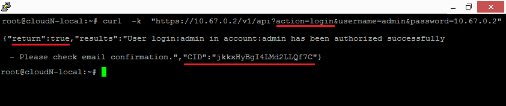
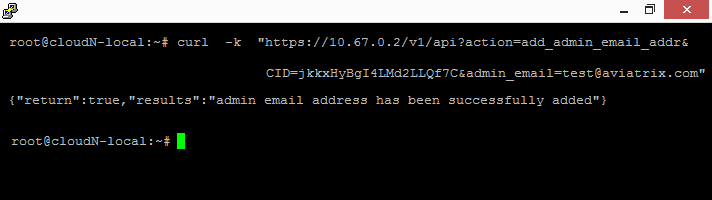
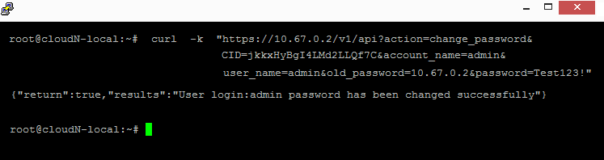
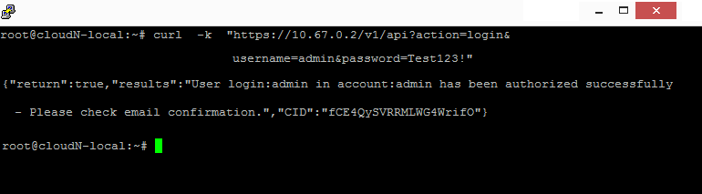
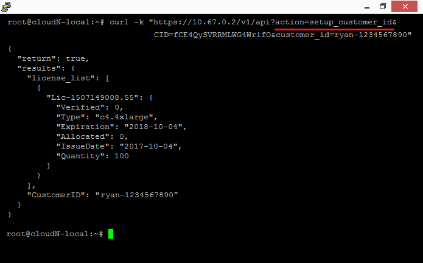
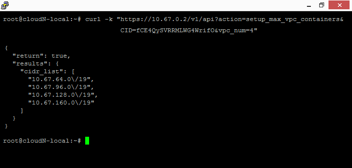
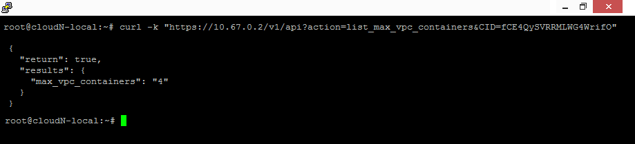
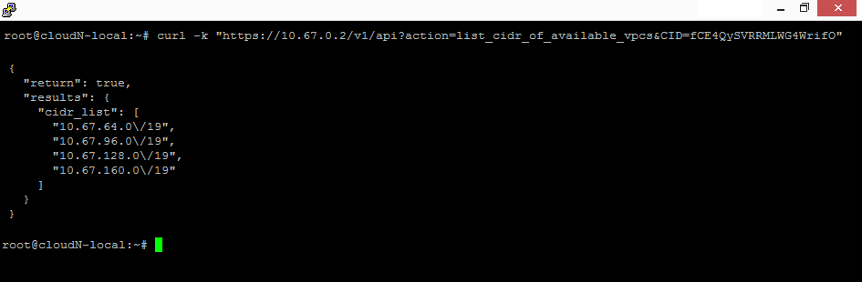
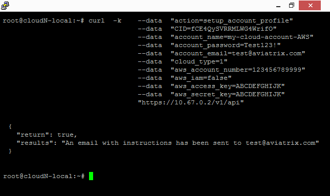
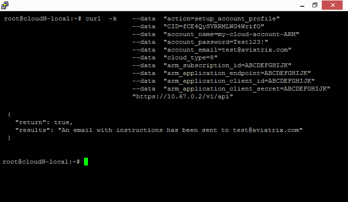
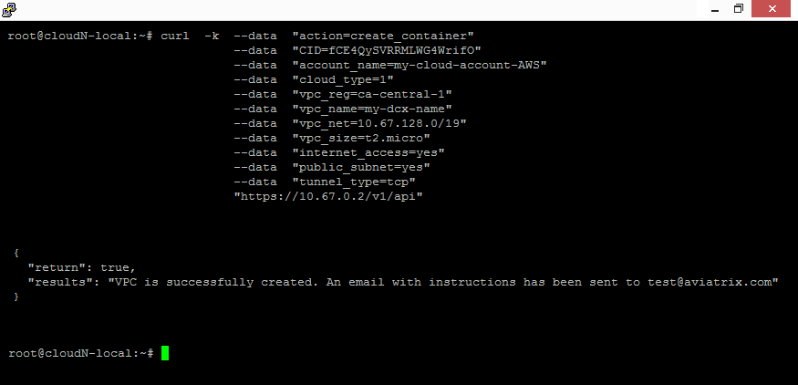
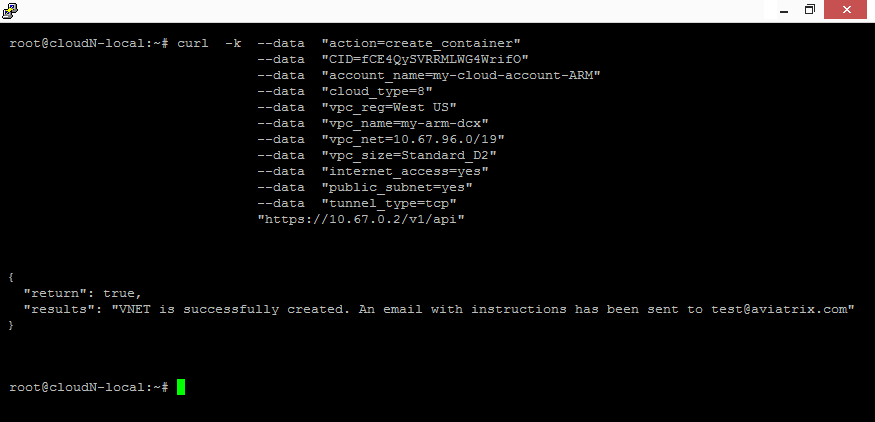

    
.. disqus::
