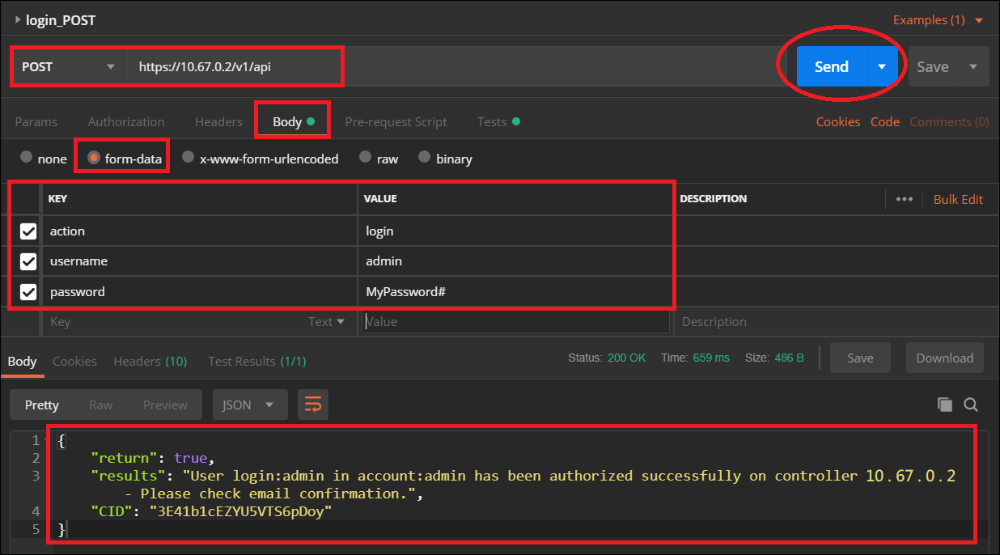
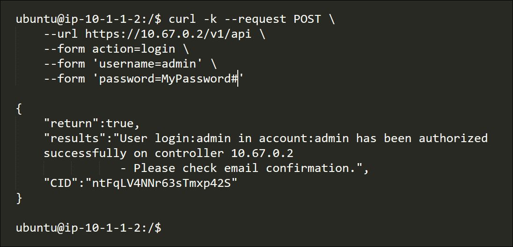
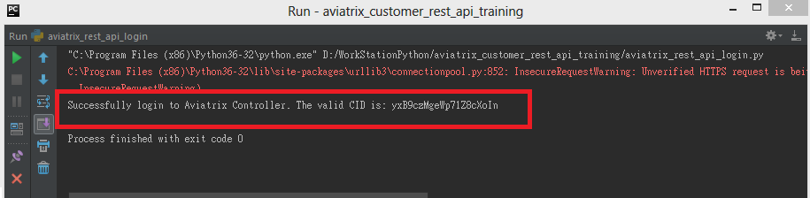
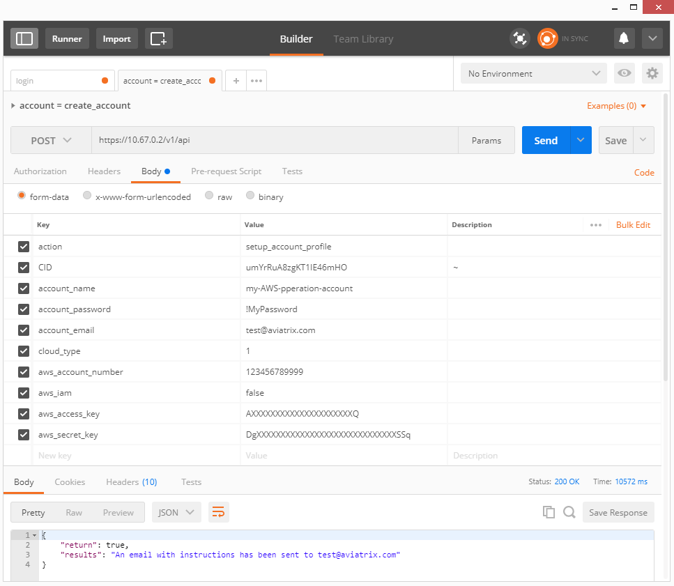
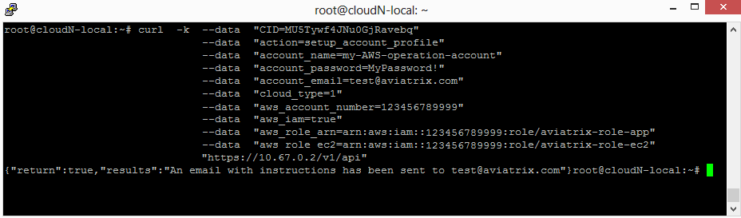
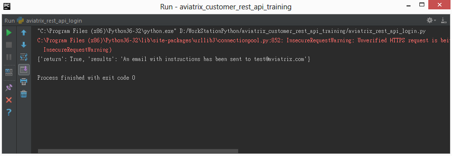
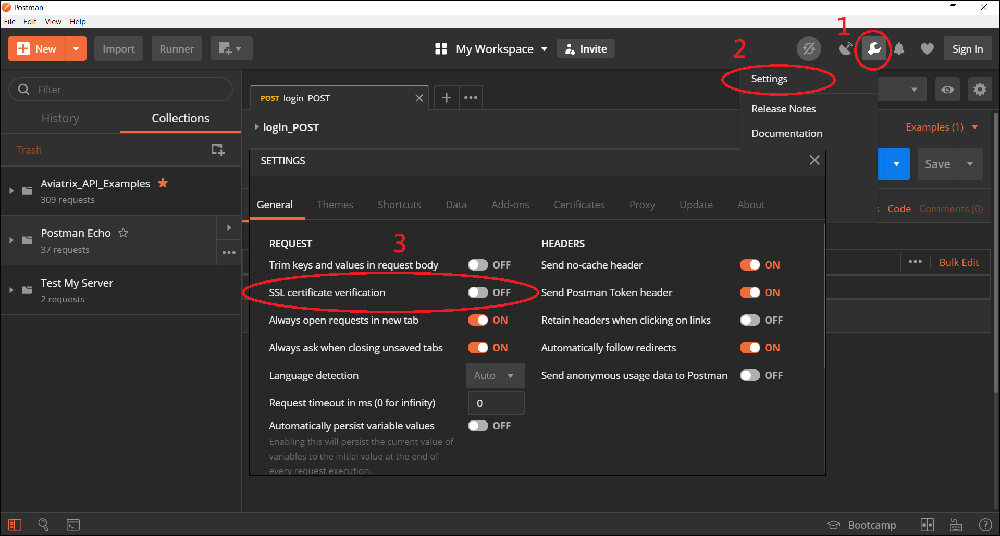

.. meta::
   :description: Multiple Approaches to Use Aviatrix API
   :keywords: API, CID, login, cloud account

=======================================
Multiple Ways to Use Aviatrix API
=======================================

Introduction
------------

Aviatrix provides APIs to help customers to integrate Aviatrix products or to automate some routine tasks, such as backups for the Aviatrix controller, checking the status of active/live VPN users for management purposes, etc.

|

Tools
-----

In this document, we demonstrate Aviatrix API invocation with the following tools.
  1. **Postman**
  2. Linux **"curl"** command
  3. Python **"requests"** module/library/package
  4. PowerShell

|

Value Format (URL Encoding)
---------------------------

If the input value contains certain special characters, such as '#' or '/' you may need to convert them to conform to a valid URL:

Tip:
"""""

Use '%23' instead of '#'; use '%2F' instead of '/'

For example:
""""""""""""

If my Azure ARM Subscription ID is "abc#efg", instead of using...

    "arm_subscription_id=abc#efg"

you need to use the following format instead...

    "arm_subscription_id=abc%23efg"

|

Tools to convert the value format
---------------------------------

There are many tools online that can do the job. Just simply google **"URL Encoder"**, and you can encode/convert the special character to the correct format.

|

How the Aviatrix API Works
-------------------------------

In order to invoke most of the Aviatrix API(s), the user must have a valid **"CID"** (session ID) for security purposes. Moreover, a valid CID can be acquired through the Aviatrix **"login"** API. The examples are provided below.
Please refer to the `Aviatrix API site. <https://api.aviatrix.com/?version=latest>`_ for the completed Aviatrix API list.

|

Examples: Invoke Aviatrix "login" API to get a valid CID
--------------------------------------------------------

Postman
"""""""

    |image1|

.. Tip:: You may disable Postman SSL certificate verification for simple testing. See the follow screenshot.
..

    |image7|

Linux "curl" command
""""""""""""""""""""

**Syntax:**

::

    ubuntu@ip-10-1-1-2:/$ curl -k --request POST \
        --url https://10.67.0.2/v1/api \
        --form action=login \
        --form 'username=admin' \
        --form 'password=MyPassword#'

    {
        "return":true,
        "results":"User login:admin in account:admin has been authorized successfully on controller 10.67.0.2
                   - Please check email confirmation.",
        "CID":"ntFqLV4NNr63sTmxp42S"
    }

    ubuntu@ip-10-1-1-2:/$ 

**Example:**

    |image2|

Python "requests" module
""""""""""""""""""""""""

**Example Code:**

.. code-block:: python

    import requests

    # Controller configuration
    base_url = "https://10.67.0.2/v1/api"
    username = "admin"
    password = "MyPassword"
    action = "login"
    CID = ""

    # Configuration for "login" API
    payload = {
        "action": action,
        "username": username,
        "password": password
    }

    # Use "requests" module to invoke API
    response = requests.post(url=base_url, data=payload, verify=False)

    # If login successfully
    if True == response.json()["return"]:
        CID = response.json()["CID"]
        print("Successfully login to Aviatrix Controller. The valid CID is: " + CID)

**Execution Result:**

    |image3|

PowerShell Example
""""""""""""""""""""""""
::

 $params = @{"action"="login";
 >> "username"="admin";
 >> "password"="password";
 >> }

:: 

 Invoke-WebRequest -Uri $Uri -Method POST -Body $params
 StatusCode        : 200
 StatusDescription : OK
 Content           : {"return":true,"results":"User login:admin in account:admin has been authorized successfully -
                    Please check email confirmation.","CID":"RwuXX5KoJsTrOBAjXl9N"}
 RawContent        : HTTP/1.1 200 OK
                     Pragma: no-cache
                     X-Frame-Options: DENY
                     Strict-Transport-Security: max-age=77760000
                     Content-Length: 158
                     Cache-Control: no-store
                     Content-Type: text/json
                     Date: Tue, 10 Apr 2018 17:...
 Forms             : {}
 Headers           : {[Pragma, no-cache], [X-Frame-Options, DENY], [Strict-Transport-Security, max-age=77760000],
                     [Content-Length, 158]...}
 Images            : {}
 InputFields       : {}
 Links             : {}
 ParsedHtml        : mshtml.HTMLDocumentClass
 RawContentLength  : 158

Examples: Invoke Other Aviatrix APIs with a valid CID
----------------------------------------------------

.. Note::
   The following example demonstrates how to use the Aviatrix API **"setup_account_profile"** to create an Aviatrix **"Cloud Account"**.

Postman
"""""""

    |image4|

Linux "curl" command
""""""""""""""""""""

    |image5|

Python
""""""

**Example Code:**

.. code-block:: python

    import requests

    # Configuration for "setup_account_profile" API to create AWS IAM Role based account
    payload = {
        "action": "setup_account_profile",
        "CID": "B4XvxZYJUTHNaMcK2Nf2",
        "account_name": "my-AWS-operation-account",
        "account_password": "!MyPassword",
        "account_email": "test@aviatrix.com",
        "cloud_type": "1",
        "aws_account_number": "123456789999",
        "aws_iam": "true",
        "aws_access_key": "XXXXXXXXXXXXXXXXXXXXXX",
        "aws_secret_key": "XXXXXXXXXXXXXXXXXXXXXXXXXXXXXXXXX"
    }

    # Use "requests" module to invoke API
    response = requests.post(url="https://10.67.0.2/v1/api", data=payload, verify=False)

    # Display return message
    print(response.json())

**Execution Result:**

    |image6|

PowerShell
"""""""""""
::

 $paramsaccount = @{"action"="setup_account_profile";
 >> "CID"="RwuXX5KoJsTrOBAjXl9N";
 >> "account_name"="test_api";
 >> "account_password"="xxx";
 >> "account_email"="xxx.com";
 >> "cloud_type"=1;
 >> "aws_account_number"="xxxx";
 >> "aws_access_key"="xxxx";
 >> "aws_secret_key"="xxxx";
 >> }

::
 
 Invoke-WebRequest -Uri $Uri -Method Post -Body $paramsaccount

 StatusCode        : 200
 StatusDescription : OK
 Content           : {"return":true,"results":"An email confirmation has been sent to lyan@aviatrix.com"}
 RawContent        : HTTP/1.1 200 OK
                     Pragma: no-cache
                     X-Frame-Options: DENY
                     Strict-Transport-Security: max-age=77760000
                     Content-Length: 84
                     Cache-Control: no-store
                     Content-Type: text/json
                     Date: Tue, 10 Apr 2018 17:1...
 Forms             : {}
 Headers           : {[Pragma, no-cache], [X-Frame-Options, DENY], [Strict-Transport-Security, max-age=77760000],
                     [Content-Length, 84]...}
 Images            : {}
 InputFields       : {}
 Links             : {}
 ParsedHtml        : mshtml.HTMLDocumentClass
 RawContentLength  : 84

.. disqus::
