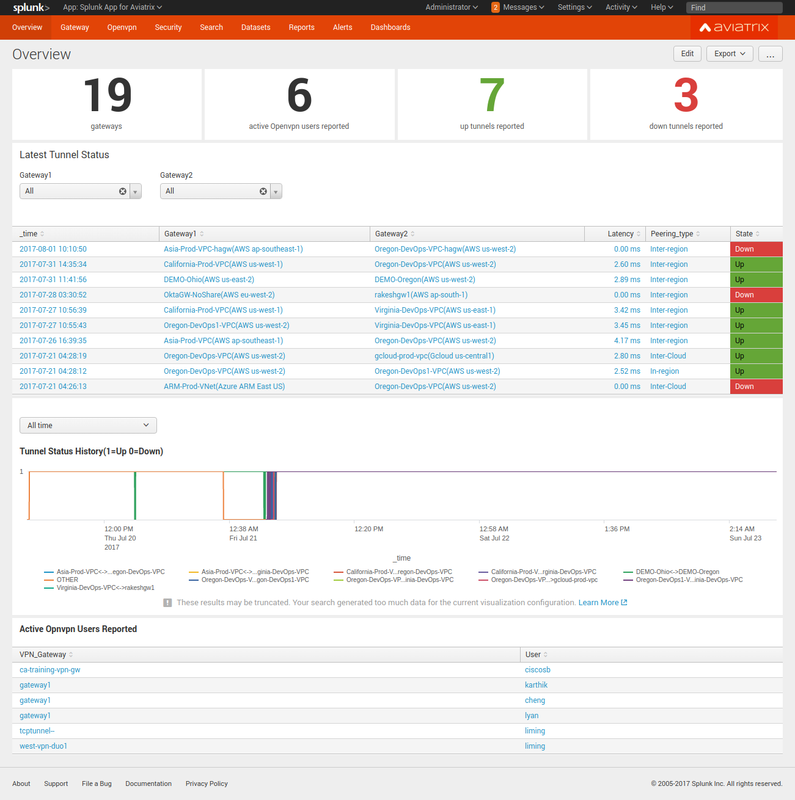
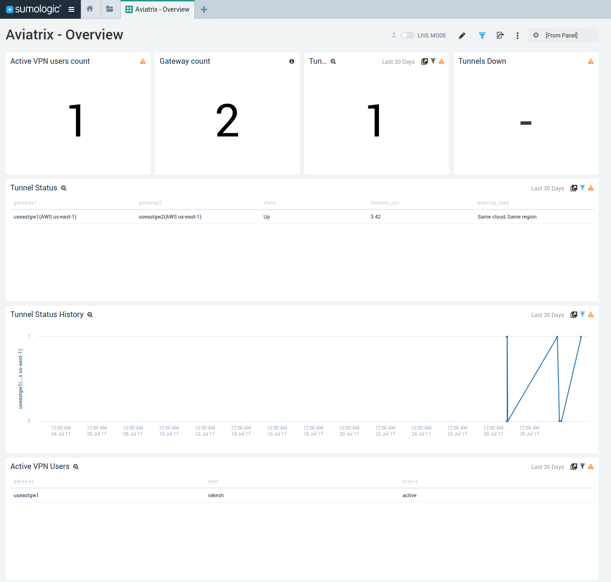

.. meta::
   :description: Data Analytics with Aviatrix Logs -Splunk and Sumo
   :keywords: Splunk, Sumo, aviatrix logs, data analytics

=========================================================
    Logging 
=========================================================

1. Introduction
================

The Aviatrix Controller and all of its managed gateways can be configured to forward logs to well known log management systems.
The controller and all of the managed gateways will forward the logs directly to the logging server and hence each of them need network connectivity
to the logging server. Out of box integration is supported for the following logging service or systems.

 - Remote syslog (recommended to use)
 - AWS CloudWatch
 - Splunk Enterprise
 - Datadog
 - Elastic Filebeat
 - Sumo Logic
 - Netflow

.. note:: We highly recommend user to use remote syslog (rsyslog) as log forwarder which is both efficient and the industry standard.
   Most log collectors support rsyslog as forwarder. We may only add new features to rsyslog going forward.

Here are the sample instructions to configure log services to collect from rsyslog forwarder.
"Note" box gives example of template needed for the config on the Aviatrix rsyslog logging service.

 - Splunk https://docs.splunk.com/Documentation/Splunk/latest/Data/Monitornetworkports

 .. note:: (No rsyslog template needed for splunk config)

 - Datadog https://docs.datadoghq.com/integrations/rsyslog/?tab=datadogussite

 .. note:: <DATADOG_API_KEY> <%pri%>%protocol-version% %timestamp:::date-rfc3339% %HOSTNAME% %app-name% - - - %msg%\n

   (replace DATADOG_API_KEY with your datadog key)

 - Sumologic https://help.sumologic.com/03Send-Data/Sources/02Sources-for-Hosted-Collectors/Cloud-Syslog-Source

 .. note:: <%pri%>%protocol-version% %timestamp:::date-rfc3339% %HOSTNAME% %app-name% %procid% %msgid% [YOUR_TOKEN] %msg%\n

    (replace YOUR_TOKEN with your sumo token)

In addition to standard information on syslog, Aviatrix also provides
capability for user VPN connections, VPN user TCP sessions, security
rule violation statistics, Gateway stats and FQDN filter violations.

The Log Management System can be used to sift through the Aviatrix logs and
get the meaningful trend charts that helps monitor the network
connectivity and user VPN sessions. The following sections provide a
list of useful Aviatrix logs which can be parsed on Splunk, Sumo Logic
and other log management systems to display relevant analytics of data
collected from Aviatrix Controller and gateways.

2. Aviatrix Log Format for Log Management Systems
==================================================

The following types of Aviatrix log keywords can be identified by the Log
Management System for further analysis:

- `AviatrixVPNSession <https://docs.aviatrix.com/HowTos/AviatrixLogging.html#id1>`_
- `AviatrixUser <https://docs.aviatrix.com/HowTos/AviatrixLogging.html#id2>`_
- `AviatrixLicenseVPNUsers <https://docs.aviatrix.com/HowTos/AviatrixLogging.html#id4>`_ 
- `AviatrixRule <https://docs.aviatrix.com/HowTos/AviatrixLogging.html#id6>`_
- `AviatrixGwNetStats <https://docs.aviatrix.com/HowTos/AviatrixLogging.html#id7>`_
- `AviatrixGwSysStats <https://docs.aviatrix.com/HowTos/AviatrixLogging.html#id8>`_
- `AviatrixFQDNRule <https://docs.aviatrix.com/HowTos/AviatrixLogging.html#id9>`_
- `AviatrixTunnelStatusChange <https://docs.aviatrix.com/HowTos/AviatrixLogging.html#id10>`_
- `AviatrixCMD <https://docs.aviatrix.com/HowTos/AviatrixLogging.html#id11>`_
- `AviatrixBGPOverlapCIDR <https://docs.aviatrix.com/HowTos/AviatrixLogging.html#id12>`_
- `AviatrixBGPRouteLimitThreashold <https://docs.aviatrix.com/HowTos/AviatrixLogging.html#aviatrixbgproutelimitthreshold>`_
- `AviatrixGuardDuty <https://docs.aviatrix.com/HowTos/AviatrixLogging.html#id13>`_
- `AviatrixFireNet <https://docs.aviatrix.com/HowTos/AviatrixLogging.html#id14>`_
- `AviatrixVPNVersion <https://docs.aviatrix.com/HowTos/AviatrixLogging.html#id15>`_
- `AviatrixGatewayStatusChanged <https://docs.aviatrix.com/HowTos/AviatrixLogging.html#id16>`_

Below are the details of each log keyword. 

AviatrixVPNSession:
--------------------

This log is for gateways that have `VPN enabled <http://docs.aviatrix.com/HowTos/Cloud_Networking_Ref_Des.html>`_. To enable VPN, check "VPN Access" 
when launching a gateway. 

Logs with this prefix come from the Controller and contain  information such as VPN user
name, the VPN gateway IP address and name where the user connects to,
client virtual IP address, connection duration, total received bytes,
total transmitted bytes, and login and logout time. Two logs will be
generated for each VPN connection. One is when the connection is
established, the other when it is disconnected.

Example logs:

**Connect Log:**

::

  Aug 17 22:07:39 ip-172-31-46-24 cloudx_cli: AviatrixVPNSession: 
  User=Splumo, Status=active, Gateway=splunksumo, GatewayIP=52.52.76.149,
  VPNVirtualIP=192.168.0.6, PublicIP=N/A, Login=2016-08-17 22:07:38, Logout=N/A,
  Duration=N/A, RXbytes=N/A, TXbytes=N/A

**Disconnect log:**

::

  Aug 17 22:26:37 ip-172-31-46-24 cloudx_cli: AviatrixVPNSession: 
  User=Splumo, Status=disconnected, Gateway=splunksumo,
  GatewayIP=52.52.76.149, VPNVirtualIP=192.168.0.6, PublicIP=N/A,
  Login=2016-08-17 22:07:38, Logout=2016-08-17 22:26:37, Duration=0:0:18:59,
  RXbytes=2.1 MB, TXbytes=9.03 MB

AviatrixUser:
--------------

This log is for gateways that have `VPN enabled <http://docs.aviatrix.com/HowTos/Cloud_Networking_Ref_Des.html>`_. To enable VPN, check "VPN Access"
when launching a gateway.

Logs with this prefix come from each VPN gateway managed by the
controller. The log contains the information for the TCP session, such
as inbound and outbound interface, source IP address, destination IP
address, TTL value, protocol name, and packet length. The log record is
for each packet that passes through the VPN connection from the client
to the destination.

Two example logs:

::

  Aug 17 22:15:47 ip-10-100-0-60 kernel: [14167.983249]
  ***AviatrixUser***:IN= OUT=eth0 SRC=192.168.0.6 DST=68.67.154.85 LEN=64
  TOS=0x00 PREC=0x00 TTL=63 ID=28916 DF PROTO=TCP SPT=50428 DPT=443
  WINDOW=65535 RES=0x00 SYN URGP=0

  Aug 17 22:15:47 ip-10-100-0-60 kernel: [14167.968275]
  ***AviatrixUser***:IN= OUT=eth0 SRC=192.168.0.6 DST=10.100.0.2 LEN=66
  TOS=0x00 PREC=0x00 TTL=254 ID=13309 PROTO=UDP SPT=64775 DPT=53 LEN=46

AviatrixLicenseVPNUsers:
-------------------------

This log is for gateways that have `VPN enabled <http://docs.aviatrix.com/HowTos/Cloud_Networking_Ref_Des.html>`_. To enable VPN, check "VPN Access"
when launching a gateway.

Logs with this prefix come from the Controller and can be used to monitor 
the license usage of active vpn users connected to all vpn gateways.

One example log:

::

  Sep 25 23:40:19 ip-10-40-0-133 cloudxd: AviatrixLicsenseVPNUsers: users=2

.. note:: There is a typo in some versions (as noted in the above example) that incorrectly shows this entry as `AviatrixLicsenseVPNUsers` instead of `AviatrixLicenseVPNUsers`.

AviatrixRule:
--------------

You need to configure `security policies <http://docs.aviatrix.com/HowTos/gateway.html#security-policy>`_ to see AviatrixRule log.

Logs with this prefix come from each gateway managed by the controller.
Any packet that triggers the security policy rule will generate a log
record of this type with the first 100 bytes of the packet. It contains
the information such as gateway IP address, inbound and outbound
interface, MAC address, TTL value, protocol name, source IP address,
destination IP address and packet length.

An example for a deny rule event is shown below. The log event prefix is  "AvxRl gw1 D:", where 
the gateway name is gw1, "D" represents Drop. 

::

 2019-04-10T23:33:47.217018+00:00 ip-10-240-0-44 kernel: [ 4976.320353] AvxRl gw1 D:IN=eth0 OUT=eth0 MAC=02:bd:e5:4f:d0:e2:02:d8:14:81:fc:48:08:00 SRC=10.240.1.60 DST=10.230.1.23 LEN=84 TOS=0x00 PREC=0x00 TTL=63 ID=45312 DF PROTO=ICMP TYPE=8 CODE=0 ID=2833 SEQ=1

Another example for an accept rule event is shown below. The log event prefix is "AvxRl StatefulGW2 A:", 
where the gateway name is StatefulGW2, "A" represents Accept.  

::

 2019-04-10T23:34:47.602166+00:00 ip-10-240-0-44 kernel: [ 5036.705845] AvxRl StatfulGW2 A:IN=eth0 OUT=eth0 MAC=02:bd:e5:4f:d0:e2:02:d8:14:81:fc:48:08:00 SRC=10.240.1.60 DST=10.230.1.23 LEN=84 TOS=0x00 PREC=0x00 TTL=63 ID=48453 DF PROTO=ICMP TYPE=8 CODE=0 ID=2834 SEQ=1

AviatrixGwNetStats:
--------------------

Logs with this prefix come from each gateway managed by the controller.
These logs are sampled every minute and give details about gateway
network interface.

Two example logs:

::
 
  2018-02-19T06:51:03.496447+00:00 ip-172-31-58-147 perfmon.py: AviatrixGwNetStats: 
  timestamp=2018-02-19 06:51:03.496156 name=gg public_ip=35.172.17.198.fifo 
  private_ip=172.31.58.147 interface=eth0 total_rx_rate=4.48Kb total_tx_rate=3.14Kb
  total_rx_tx_rate=7.62Kb total_rx_cum=292.43MB total_tx_cum=169.99MB
  total_rx_tx_cum=462.42MB
  
  2018-02-19T05:44:07.491705+00:00 ip-172-31-58-147 perfmon.py: AviatrixGwNetStats:
  timestamp=2018-02-19 05:44:07.491411 name=gg public_ip=35.172.17.198.fifo 
  private_ip=172.31.58.147 interface=eth0 total_rx_rate=3.99Kb total_tx_rate=2.84Kb
  total_rx_tx_rate=6.83Kb total_rx_cum=290.44MB total_tx_cum=168.48MB
  total_rx_tx_cum=458.92MB

AviatrixGwSysStats:
-------------------

Logs with this prefix come from each gateway managed by the controller.
These logs are sampled every minutes and give details about gateway
memory, cpu and disk load.

Two example logs:

::

  May 17 00:23:20 ip-10-0-0-129 gwmon.py: AviatrixGwSysStats: 
  timestamp=2017-05-17 00:23:06.065548 name=wing-aws-aws-use-2-gw0000
  cpu_idle=100 memory_free=237048 disk_total=8115168 disk_free=4665560

  May 17 00:28:20 ip-10-0-0-129 gwmon.py: AviatrixGwSysStats: 
  timestamp=2017-05-17 00:28:06.064229 name=wing-aws-aws-use-2-gw0000
  cpu_idle=100 memory_free=237072 disk_total=8115168 disk_free=4665560

AviatrixFQDNRule
----------------

You need to configure `FQDN Whitelists <http://docs.aviatrix.com/HowTos/FQDN_Whitelists_Ref_Design.html>`_ in order to see these logs. 

Logs with this prefix come from each gateway managed by the controller.
Domain name filtering can be configured per gateway via controller. And
every time a gateway tries to access a domain name, it will check if the
domain name passes the configured filters. If it does, access will be
allowed with the state as MATCHED, otherwise it will be discarded with state
as NO_MATCH.

Two example logs:

::

  2019-12-12T04:33:46.892381+00:00 ip-172-32-0-6 avx-nfq: AviatrixFQDNRule2[CRIT]nfq_ssl_handle_client_hello() L#281  Gateway=spoke1-fqdn S_IP=172.32.1.144 D_IP=52.218.234.41 hostname=aviatrix-download.s3-us-west-2.amazonaws.com state=MATCHED  Rule=*.amazonaws.com;1

  2019-12-12T04:36:53.173210+00:00 ip-172-32-0-6 avx-nfq: AviatrixFQDNRule1[CRIT]nfq_ssl_handle_client_hello() L#281  Gateway=spoke1-fqdn S_IP=172.32.1.144 D_IP=98.137.246.7 hostname=www.yahoo.com state=NO_MATCH drop_reason=NOT_WHITELISTED

AviatrixTunnelStatusChange
--------------------------

Logs with this prefix come from the controller whenever a tunnel status changes.
old_state means old state of the tunnel, and new_state is the new changed state of tunnel.

Example log:

::

  2019-11-30T15:44:52.718808+00:00 ip-172-32-0-226 cloudxd: AviatrixTunnelStatusChange: src_gw=oregon-transit(AWS us-west-2) dst_gw=100.20.53.124(NA NA) old_state=Down new_state=Up

AviatrixCMD
--------------------------

Logs with this prefix come from the controller whenever a CLI command is issued.  It contains
information on the CLI command that was issued, the results of the execution,  reason
a message if there is a failure and who issued the command.

Example log:

.. highlight:: none

::

  2019-11-19T20:13:44.585942+00:00 ip-172-32-0-226 cloudxd: AviatrixCMD: action=USERCONNECT_UPGRADE_TO_VERSION, argv=['--rtn_file', '/run/shm/rtn957594707', 'userconnect_upgrade_to_version', 'upgrade-status', ''], result=Success, reason=, username=admin

  2019-11-19T18:01:59.796230+00:00 ip-172-32-0-226 cloudxd: AviatrixCMD: action=TRANSIT_SPOKE_LIST, argv=['--rtn_file', '/run/shm/rtn2091225061', 'transit_spoke_list', '--spoke_only'], result=Success, reason=, username=admin

AviatrixBGPOverlapCIDR
------------------------

Log messages with this prefix come from the Controller whenever it detects overlapping CIDRs between on-prem learned and Spoke VPC CIDRs. 

Example log:

::
  
  2018-09-24T20:28:58.330708+00:00 ip-172-31-23-128 cloudxd: AviatrixBGPOverlapCIDR: Time Detected: 2018-09-24 20:28:58.329881
 
  Spoke/Manual CIDRs ['10.0.0.0/8'] have a conflict with BGP Learned CIDRs [u'10.2.0.0/16', u'30.2.0.0/16'] in VPC vpc-782bb21f on connection vgw-bgp-ha.

AviatrixBGPRouteLimitThreshold
--------------------------------

Log messages with this prefix come from the Controller whenever it detects that total BGP routes
exceed the 80 routes. (AWS VGW has a total 100 route limit.)

Example log:

::
  
  2018-09-24T20:24:50.600144+00:00 ip-172-31-23-128 cloudxd: AviatrixBGPRouteLimitThreshold: This message is alerting you that the VGW listed below currently has 89 routes, which is approaching the VGW route limits (100). You can reduce the number of routes on VGW both from on-prem side and on Aviatrix Transit gateway by enabling Route Summarization feature.
 
  Time Detected: 2018-09-24 20:24:50.599822
 
  Connection Name: vgw-bgp-ha
  VGW Id: vgw-0942b724a5150bc6a

AviatrixGuardDuty
-------------------

Log messages with this prefix come from the Controller whenever it receives an alert message from AWS GuardDuty. 

Example log:

::

  2018-09-23T00:00:50.369963-07:00 ip-172-31-89-197 cloudxd: AviatrixGuardDuty: Account [aws], Region [us-east-1], Instance ID [i-0a675b03fafedd3f2], at 2018-09-23T02:05:35Z, 163.172.7.97 is performing SSH brute force attacks against i-0a675b03fafedd3f2.  Please tighten instance security group to avoid UnauthorizedAccess:EC2/SSHBruteForce threat.
 
  2018-09-23T00:00:50.332066-07:00 ip-172-31-89-197 cloudxd: AviatrixGuardDuty: Account [aws], Region [us-east-1], Instance ID [i-0a675b03fafedd3f2], at 2018-09-23T06:35:40Z, Unprotected port on EC2 instance i-0a675b03fafedd3f2 is being probed. Please tighten instance security group to avoid Recon:EC2/PortProbeUnprotectedPort threat.
 
AviatrixFireNet
-----------------

Log messages with this prefix come from the Controller whenever a firewall instance state changes. 

Example log:

::

  2019-11-19T09:38:40.070080-08:00 ip-172-31-93-101 cloudxd: AviatrixFireNet: Firewall i-021f23187b8ac81c9~~tran-fw-1 in FireNet VPC vpc-0f943cd05455358ac~~cal-transit-vpc-1 state has been changed to down.

  2019-11-19T09:39:03.066869-08:00 ip-172-31-93-101 cloudxd: AviatrixFireNet: Firewall i-021f23187b8ac81c9~~tran-fw-1 in FireNet VPC vpc-0f943cd05455358ac~~cal-transit-vpc-1 state has been changed to unaccessible.

  2019-11-19T09:40:12.878075-08:00 ip-172-31-93-101 cloudxd: AviatrixFireNet: Firewall i-021f23187b8ac81c9~~tran-fw-1 in FireNet VPC vpc-0f943cd05455358ac~~cal-transit-vpc-1 state has been changed to up.

AviatrixVPNVersion
-------------------

Log messages with this prefix come from the Controller whenever it rejects an Aviatrix VPN client connection.

Example log:

::

  2020-02-07T11:38:48.276150-08:00 Controller-52.204.188.212 cloudxd: AviatrixVPNVersion:  The VPN connection was rejected as it did not satisfy the minimum version requirements. Current version: AVPNC-2.4.10 Required minimum version: AVPNC-2.5.7 . The rejected VPN user name is tf-aws-52-tcplb-user1
  

AviatrixGatewayStatusChanged
-----------------------------

These log messages will be seen from the Controller's syslogs when a gateway's status changes

Example log:

::

  2020-03-29T00:09:13.201669+00:00 ip-10-88-1-63 cloudxd: AviatrixGatewayStatusChanged: status=down gwname=EMEA-ENG-VPNGateway
  
  

3. Logging Configuration at Aviatrix Controller
================================================

To enable logging at the Aviatrix Controller, go to Settings->Logging page. Once logging is enabled, both the Controller and all gateways will forward logs directly to the logging server.

Two examples for Remote Syslog and Logstash Forwarder follow below.

3.1 Remote Syslog
------------------
On the Aviatrix Controller:
  a. Server:	FQDN or IP address of the remote syslog server
  #. Port:	Listening port of the remote syslog server (6514 by default)
  #. CA Certificate: Certificate Authority (CA) certificate
  #. Server Public Certificate: Public certificate of the controller signed by the same CA
  #. Server Private Key: Private key of the controller that pairs with the public certificate
  #. Protocol:	TCP or UDP (TCP by default)
  #. Optional Custom Template: (Deprecated)
  
On the Remote syslog server:
  a. Install rsyslog and rsyslog-gnutls packages
  #. Create a new config file in /etc/rsyslog.d with the similar content as in the following box depends on your rsyslog version to enable tls connection. Please make sure key paths are readable by the syslog user
  #. Make sure the output directory /var/log is writable by rsyslog user/daemon
  #. Restart rsyslog service and check port is listening and no error in /var/log/syslog
  #. Confirm the port is allowed in the security group / fireware for incoming traffic

(version <8)
::

    $ModLoad imtcp
    $InputTCPServerRun 514

    $DefaultNetstreamDriver gtls

    #Certificate location
    $DefaultNetstreamDriverCAFile /etc/cert/rsyslog-ca.pem
    $DefaultNetstreamDriverCertFile /etc/cert/rsyslog-crt.pem
    $DefaultNetstreamDriverKeyFile /etc/cert/rsyslog-key.pem

    $InputTCPServerStreamDriverAuthMode x509/certvalid
    $InputTCPServerStreamDriverMode 1 # run driver in TLS-only mode

    # Re-direct logs to host specific directories
    $template TmplMsg, "/var/log/aviatrix/%HOSTNAME%/%PROGRAMNAME%"
    *.info,mail.none,authpriv.*,cron.none ?TmplMsg
    & ~

(version >=8)
::

    global(
        DefaultNetstreamDriver="gtls"
        DefaultNetstreamDriverCAFile="/etc/cert/rsyslog-ca.pem"
        DefaultNetstreamDriverCertFile="/etc/cert/rsyslog-crt.pem"
        DefaultNetstreamDriverKeyFile="/etc/cert/rsyslog-key.pem"
    )
    template(name="TmplMsg" type="list") {
        constant(value="/var/log/aviatrix/")
        property(name="hostname")
        constant(value="/")
        property(name="programname" SecurePath="replace")
        constant(value="")
        }
    ruleset(name="remote"){
        *.info;mail.none;authpriv.*;cron.none action(type="omfile" DynaFile="TmplMsg")
    }
    module(
        load="imtcp"
        StreamDriver.Name="gtls"
        StreamDriver.Mode="1"
        StreamDriver.Authmode="anon"
    )
    input(type="imtcp" port="514" ruleset="remote")

Then
  1. Go to /var/log/aviatrix directory
  #. Find the directory of desired controller or gateway
        a. Controller's directory name is in a format of Controller-public_IP_of_controller
        #. Gateway's directory name is in a format of GW-gateway_name-public_IP_of_gateway
  #. Each controller/gateway directory should have
        a. auth.log
        #. syslog

3.1.a Using Rsyslog to send logs to Sumo
-------------------------------------------

Since Sumo agents on the controller and gateways tend to consume a lot of cpu/memory resources, we strongly suggest that rsyslog is used instead to send logs to Sumo. This is `documented by Sumo <https://help.sumologic.com/03Send-Data/Sources/02Sources-for-Hosted-Collectors/Cloud-Syslog-Source>`_. Follow the following instructions:

  #. Follow the directions in `Sumo document  <https://help.sumologic.com/03Send-Data/Sources/02Sources-for-Hosted-Collectors/Cloud-Syslog-Source>`_ to create a cloud syslog source on your collections. Save the token, host and tcp tls port.
  #. Go to Controller/Settings/Logging/Remote Syslog and enable the service
  #. Enter the Server ip/fqdn that you received from the first step
  #. Provide the port - obtained from the first step
  #. Upload the CA cert from Sumo pointed by their documentation
  #. Keep the Protocol set to TCP
  #. For Optional Custom Template, copy the following string into a new text file and replace the string ADD_YOUR_SUMO_TOKEN_HERE with the token you received in the first step and upload it. Please do keep the square brackets around the token.
  
  ::

<%pri%>%protocol-version% %timestamp:::date-rfc3339% %HOSTNAME% %app-name% %procid% %msgid% [ADD_YOUR_SUMO_TOKEN_HERE] %msg%\n

  #. Click on Advanced, if you want to selectively send logs from only some gateways
  #. Click on Enable

3.2 Filebeat Forwarder
-----------------------
On the Aviatrix Controller:
  a. Server:	FQDN or IP address of logstash server
  #. Port:	Listening port of logstash server (5000 by default)
  #. Optional Configuration File:	(Deprecated)

3.3 Splunk Logging
-------------------
On the Aviatrix Controller:
  a. How to configure:	Manual Input or Import File
  #. Splunk Server:	FQDN or IP address of Splunk Enterprise Server
  #. Splunk Server Listening Port:	Listening port of Splunk Enterprise Server
  #. Splunk inputs.conf stanza: (Deprecated)

Note:
If "Import File" is selected for "How to configure", please provide the Splunk configuration file. 

3.4 Sumo Logic
-------------------
On the Aviatrix Controller:
   a. Access ID : ID of SumoLogic server
   #. Access Key: Access key of SumoLogic server
   #. Source Category: The category string of the source
   #. Additional Configurations: (Deprecated)

Steps to `upgrade <http://docs.aviatrix.com/HowTos/sumologic_upgrade.html>`_
Sumologic Collectors(eg: Controllers/Gateways) from SumoLogic servers.

Please note that Sumo collector is memory intensive and needs instances with at least 2GB of memory - for AWS, t3.small, or higher depending on features deployed.

3.5 DataDog Agent
-------------------
On the Aviatrix Controller:
	#. server: intake.logs.datadoghq.com  
	#. port: 10516  
	#. Optional Custom Template: upload your saved customer template, like this,
	
<DATADOG_API_KEY> <%pri%>%protocol-version% %timestamp:::date-rfc3339% %HOSTNAME% %app-name% - - [metas ddsource=\"<MY_SOURCE_NAME>\" ddtags=\"env:dev,<KEY:VALUE>\"] %msg%\n

Make sure you keep <> when you replace your DD API Key, save the temp like .txt file, and upload it.

4. Log management system Apps
====================================

The Aviatrix controller can be configured to forward logs to various log
management systems. Aviatrix also provides apps with prebuilt dashboards
for popular log management systems like Splunk and Sumo Logic.

Splunk App for Aviatrix
-----------------------

Splunk app for Aviatrix can be downloaded from
`Splunkbase <https://splunkbase.splunk.com/app/3585/>`_.

Click `here <https://github.com/AviatrixSystems/SplunkforAviatrix>`_ to check
instructions on GitHub.

**Sample**

|splunk_sample|

Sumo Logic App for Aviatrix
---------------------------

The Sumo Logic app installation guide is also available on
`GitHub <https://github.com/AviatrixSystems/SumoLogicforAviatrix>`_.

**Sample**

|sumo_sample|

5. Loggly integration via Syslog
====================================

To configure Loggly integration through an intermediary syslog server relay:

1. Build an rsyslog server relay using a Linux distribution of your choice 

2. Configure Aviatrix to send rsyslog traffic to the relay (section 3.1 above)

3. Follow `this document <https://www.loggly.com/docs/network-devices-and-routers/>`_ to configure the relay to send to Loggly

6. Netflow and Span port support
=================================

Starting from Release 4.0, Aviatrix Controller and gateways support netflow and span port. 

.. disqus::
