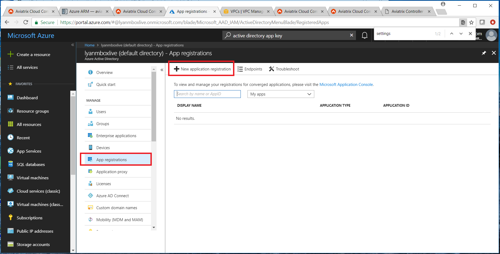
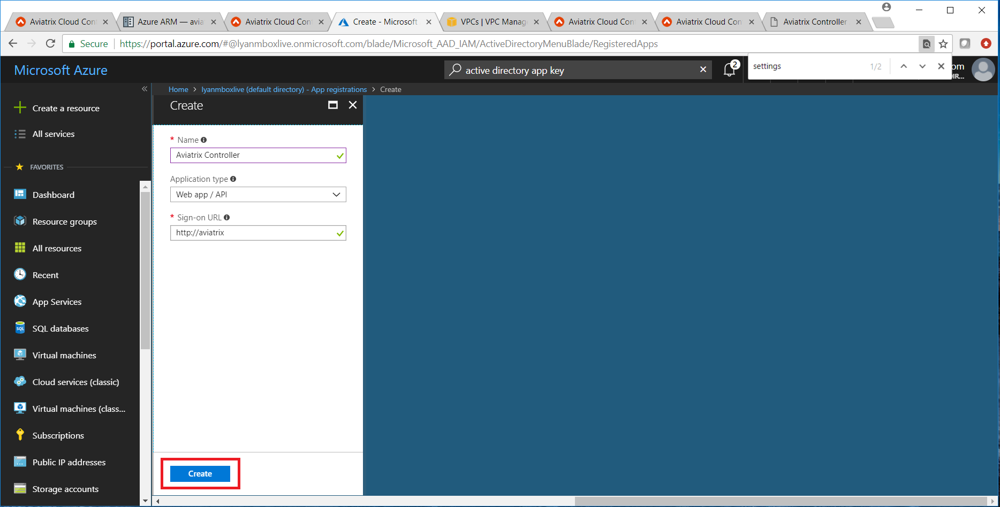
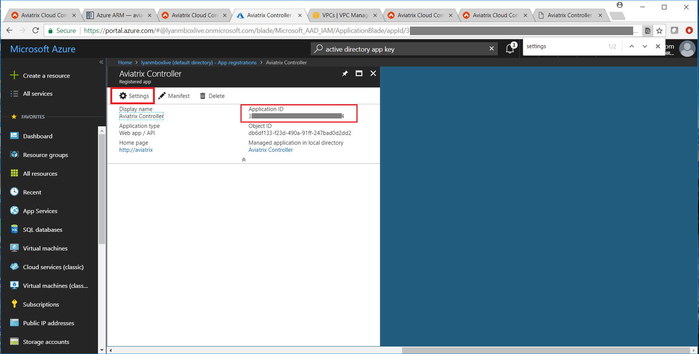
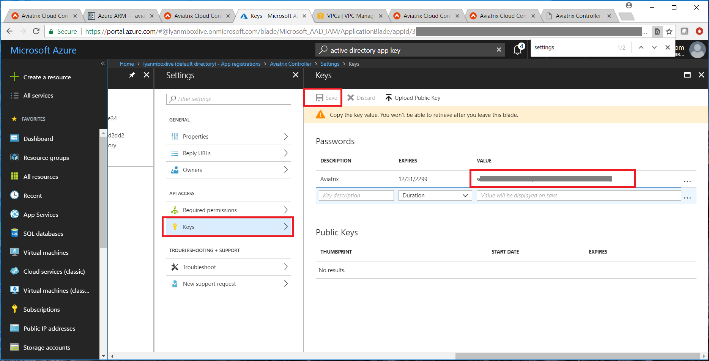
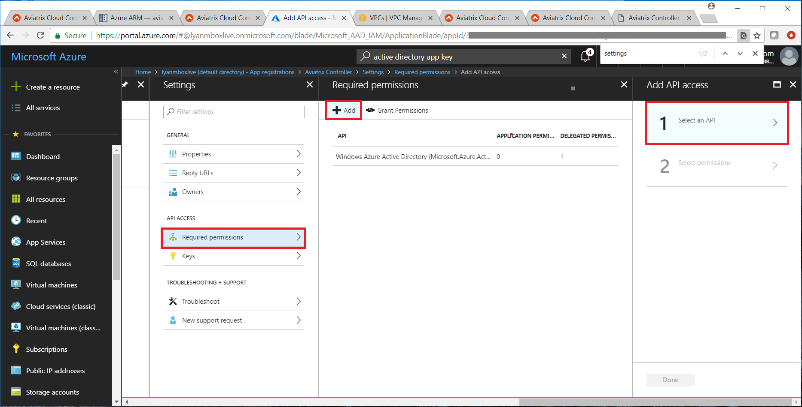
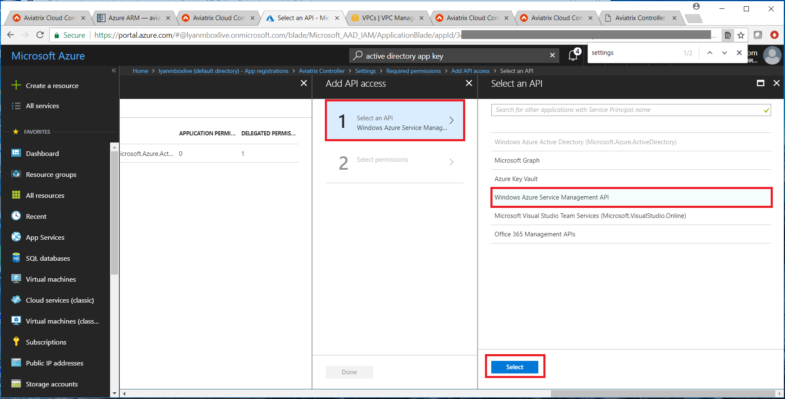
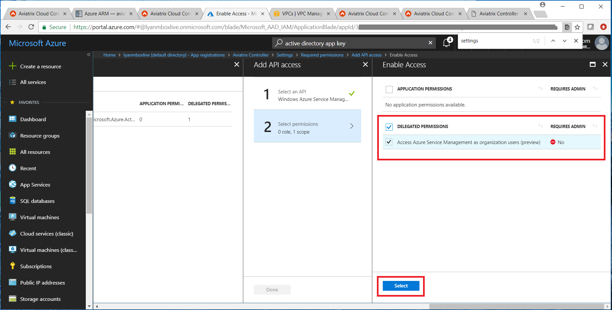

.. meta::
   :description: Aviatrix Cloud Account for Azure
   :keywords: Aviatrix account, Azure, Aviatrix Azure account credential, API credential

===========================================================
Azure ARM
===========================================================

1.0 Overview
=============

This document helps you to setup API credentials on Azure ARM. 
 
Aviatrix Cloud Controller uses Azure APIs extensively to launch Aviatrix
gateways, configure encrypted peering and other features.

In order to use Azure API, you need to first create an Aviatrix Cloud
Account on the Aviatrix Cloud controller. This cloud account corresponds
to a valid Azure account with API credentials.

The new Microsoft Azure (as opposed to Azure Classic) is significantly
different in how applications are authenticated and authorized to
interact with Azure Resource Manager APIs to manage resources, such as
Virtual Machines, Network, Storage Accounts, etc.

This document describes how to obtain the necessary information,
specifically Application ID, Application Key, and
Application Directory ID to create an Aviatrix Cloud Account with step by
step instructions. There are 3 sections, make sure you go through all of
them.

2.0 Azure Permission Setup for Aviatrix
========================================

Setting up Azure permission for Aviatrix involves three main steps.

1. Register Aviatrix Controller Application with Azure Active Directory

2. Grant Permissions

3. Get Application Client ID, Application Client Secret and Application
   Endpoint

**Important:** Complete the follow steps in order.

2.1  Step 1 – Register Aviatrix Controller Application
-------------------------------------------------------

Login to the Azure Portal.

https://portal.azure.com

***Register Aviatrix Controller***

1. From the Azure portal click on "All services" and search for “Azure Active Directory” and click on “Azure Active Directory”

|Image01|

2. Click “App registrations"

|Image03|

3. Click “+ New application registration”

|Image04|

   a. Name = Aviatrix Controller

   b. Application Type = Web app / API

   c. Sign-on URL = http://aviatrix

   d. Click Create.

3. Done

2.2 Step 2 – Grant Permissions
-------------------------------

***Grant Permissions***

1. Login to the Azure portal

2. On the top left, click All services, search for “Subscriptions”

|Image11|

3. Copy the Subscription ID (to notepad or a convenient location)

|Image12|

4. Click on the Subscription ID

5. Then select “Access control (IAM)”.

|Image13|

6. Click Add and then select the “Contributor” role.

7. In the Select search field, type in “Aviatrix”. The Aviatrix Controller
   app should show up. Select this one and click Select towards to the
   bottom.

2.3 Step 3 – Get Application Information
-----------------------------------------

**Get Application Information**

1. From the Azure portal, click All services and search for “Azure Active Directory”.

   |Image01|

2. Retrieve the **Application** **Directory ID**.

   A. Scroll down the Azure Active Directory panel and Click on Properties

   |Image02|

   B. Copy the “Directory ID” (to notepad or a convenient location)

3. Retrieve the **Application ID**.

   A. Scroll up and click App registrations

   |Image05|

   B. Copy the “Application ID”

4. Retrieve the **Application Key**.

   A. Click Aviatrix Controller

   B. Click Settings

   |Image06|

   C. Click Keys

   |Image07|

   D. Enter in the following

      * Description = Aviatrix

      * Expires = Never expires

   E. Click Save

   F. Copy the key value (to notepad or a convenient location)

5. Add **App permissions**.

   A. Click Required permissions -> Add

   |Image08|

   B. Click Select an API -> Click Windows Azure Service Management API and click Select down below

   |Image09|

   C. Click “Access Azure Service Management as organization user” and click Select

   |Image10|

6. Done

At this point you should have the following information.

+-----------------------------------+---------------+
| **Subscription ID**               | From step 2   |
+===================================+===============+
| **Application** **Endpoint ID**   | From step 3   |
+-----------------------------------+---------------+
| **Application Client ID**         | From step 3   |
+-----------------------------------+---------------+
| **Application Client Secret**     | From step 3   |
+-----------------------------------+---------------+

.. |image01| image:: AviatrixAccountForAzure_media/az-ad-01.PNG
   :width: 5.20313in
   :height: 1.50209in
.. |image02| image:: AviatrixAccountForAzure_media/az-ad-directory-id-02.PNG
   :width: 5.65600in
   :height: 2.39763in

.. |image05| image:: AviatrixAccountForAzure_media/az-ad-list-all-apps-05.PNG
   :width: 5.65600in
   :height: 2.39763in

.. |image11| image:: AviatrixAccountForAzure_media/az-ad-sub-role-11.PNG
   :width: 5.65600in
   :height: 2.39763in
.. |image12| image:: AviatrixAccountForAzure_media/az-ad-sub-list-12.PNG
   :width: 6.98958in
   :height: 3.02083in
.. |image13| image:: AviatrixAccountForAzure_media/az-ad-sub-contrib-13.PNG
   :width: 6.98958in
   :height: 3.02083in

.. add in the disqus tag

.. disqus::   
