.. meta::
   :description: Aviatrix Cloud Account for Azure
   :keywords: Aviatrix account, Azure, Aviatrix Azure account credential, API credential

===========================================================
Azure Account Credential Setup 
===========================================================

1. Overview
=============

Aviatrix Controller uses Azure APIs extensively to launch Aviatrix
gateways, configure encrypted peering and other features.

In order to use Azure API, you need to first create an Aviatrix `Access
Account <https://docs.aviatrix.com/HowTos/aviatrix_account.html>`_ on the Aviatrix controller. This access account corresponds
to a valid Azure subscription with API credentials. You need to create an access account for each subscription. 

This document describes, for a given subscription, how to obtain the necessary information,
specifically Application ID, Application Key (Client secret), and
Application Directory ID to create an Aviatrix Access Account so that the Controller can execute APIs on that subscription.
There are 3 sections, make sure you go through all of them.

2. API and Permission Setup 
========================================

Setting up Azure permission for Aviatrix involves three main steps.

#. Register Aviatrix Controller Application with Azure Active Directory
#. Assign a role to the Aviatrix Controller Application 
#. Find and save your Azure Subscription ID, Directory ID, Application ID, and Application Key value (from your Client secret).

**Important:** Complete the following steps in order.

2.1 – Register Aviatrix Controller Application
-------------------------------------------------------

1. Log into the `Azure portal <https://portal.azure.com>`_ and click **All services**. Search for “Azure Active Directory” and click on “Azure Active Directory.”
2. Click **App registrations** on the left (not App registrations (Legacy)). Click **+ New registration** near the top of the page.

|image03|

3. Enter a clear and memorable name for your Aviatrix Controller application, select **Accounts in this organizational directory only,** and then click **Register** at the bottom of the page. The page displays details of your Aviatrix Controller application registration.  
4. Copy the Application ID and Directory ID into a Notepad file and save the file. You will use the name of your Aviatrix Controller application and these ID values later to onboard your Azure access account in the Aviatrix Controller.

2.2 – Assign a Role to the Aviatrix Application
------------------------------------------------------------
After registering your Aviatrix Controller as an app, assign this app a role to set up the connection between your Azure account and your Aviatrix Controller.

1. Log in to the Azure portal, click **All services** in the top left, and search for "Subscriptions."
2. Copy the Subscription ID to the Notepad file where you saved the Application ID and Directory ID.

|image12|

3. Click the **Subscription ID** to open the subscription.

4. On the Subscriptions page, select **Access control (IAM)** on the left.
5. On the Access control (IAM) page, click **+ Add**.
6. Under Add role assignment, select the **Contributor** role for this app. If the Contributor role is too broad, you can later replace it with a custom role with specific permissions. Refer to `Use Azure IAM Custom Role <https://docs.aviatrix.com/HowTos/azure_custom_role.html>`_ for instructions. 
7. On the right, under Select members, in the Select search field, enter "aviatrix" into the field provided to search for the Aviatrix Controller app that you registered in section 2.1. Your app should appear in the list below. Select your Aviatrix Controller app and click **Select** towards to the bottom.

|image13|

8. On the Add role assignment page, click **Review + assign** in the bottom left.

Your Aviatrix Controller app is now assigned a Contributer role for this Azure subscription.

2.3 – Create a Secret Identifier
------------------------------------------------------------

After registering your Aviatrix Controller as an app and assigning it the Contributor role, create a Secret identifier. Azure Active Directory uses this Secret identifier to authenticate the Aviatrix Controller application.

1. On the page that displays your Aviatrix Controller app, click **Certificates & secrets** on the left. then, click **+New client secret**.
2. Under Add a client secret on the right, enter:

* **Description**  - Aviatrix
* **Expires**  - Never

3. Click **Add** towards the bottom. 

4. The page displays your new Client secret. Copy the secret **Value** and **Secret ID** to the Notepad file where you saved your Account ID, Directory ID, and Subscription ID. These four values are necessary to onboard this Azure account in the Aviatrix Controller.

2.4 – Setting API Permissions for the Aviatrix Controller Application
------------------------------------------------------------

The API permission provides the Aviatrix Controller application permission to access Azure APIs. 

#. Navigate back to All services > Azure Active Directory > App registrations. 
#. Click on the Aviatrix Controller application link. 
#. From the left sidebar, select **API permissions**; then click **+ Add a permission**. 
#. Under Request API permissions, click **Azure Service Management**. 
#. On the Request API permissions for Azure Service Management page, under Permissions, select **user_impersonation.**

You can now use the four values you saved to onboard your Azure account in your Aviatrix Controller.

Now, you should have the following information to create an access account on Azure.

==========================================               ======================
Access Account Setup Input Field                         Value
==========================================               ======================
Subscription ID                                          From section 2.2
Directory ID                                             From section 2.1
Application ID                                           From section 2.1
Application Key (Client Secret)                          From section 2.3
==========================================               ======================

2.5 – Onboarding Your Azure Access Account in the Aviatrix Controller
------------------------------------------------------------

#. Open your Aviatrix Controller. From the left sidebar, select **ONBOARDING**. 
#. Select Microsoft Azure from the list of Cloud Service Providers (CSPs). Make sure to select **Microsoft Azure**, not Azure Government.
#. Enter an Account Name for this Azure subscription. This name labels the account in the Aviatrix Controller and does not need to be a specific value from your Azure account.
#. In the fields provided, enter your ARM Subscription ID, Directory ID, Application ID, and Application Key you saved in a Notepad file. Then, click **CREATE**.

Your Primary Access Accont for Azure should be successfully onboarded. To troubleshoot onboarding issues, see the `Aviatrix Support website <https://support.aviatrix.com/>_` or `contact Aviatrix Support <https://aviatrix.com/contact/>_`. 

Additional References
=======================

If you need additional information, refer to `How to: Use the portal to create an Azure AD application and service principal that can access resources <https://docs.microsoft.com/en-us/azure/active-directory/develop/howto-create-service-principal-portal>`_ on Azure documentation.

Azure China notes
==================

Deploying the Aviatrix Gateway in the Azure China Cloud
-----------------------------------------------------------

Prerequisites:

- You must already have a Microsoft Azure China account and Aviatrix Controller in AWS China to deploy an Aviatrix Gateway in the Azure China Cloud.

1.	Create the Aviatrix Controller in your AWS China Cloud. Go to Onboarding and select Azure China. 

2.	Enter the Aviatrix Customer ID.

3.	Enter the Certificate Domain.

4.	Create the Primary Access Account.

6. 	Deploy Aviatrix gateway from the Gateway page in the Aviatrix Controller or the Multi-Cloud Transit Solution page.

For more information, see “What is a China ICP License?”

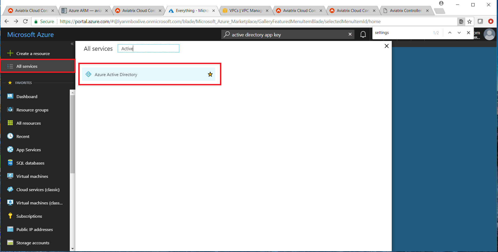
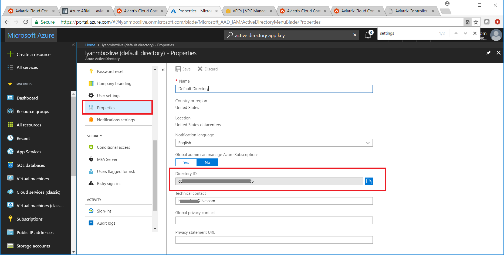
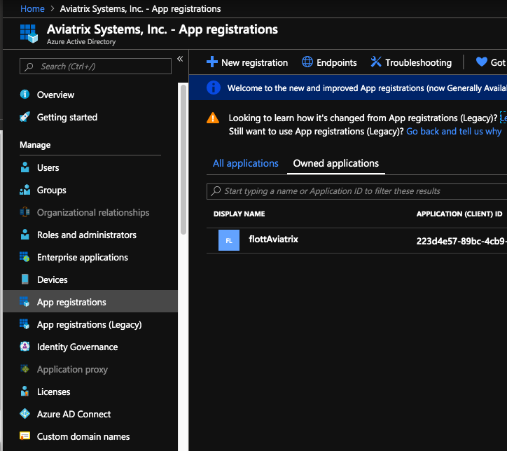
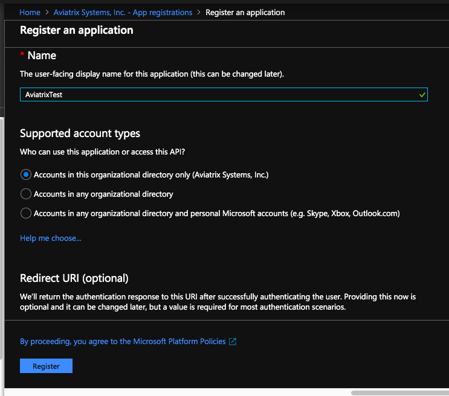
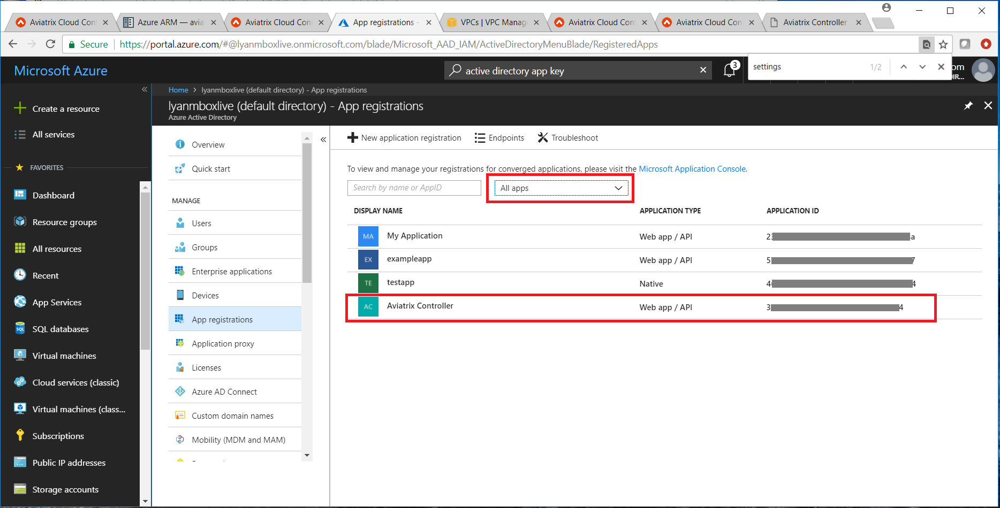
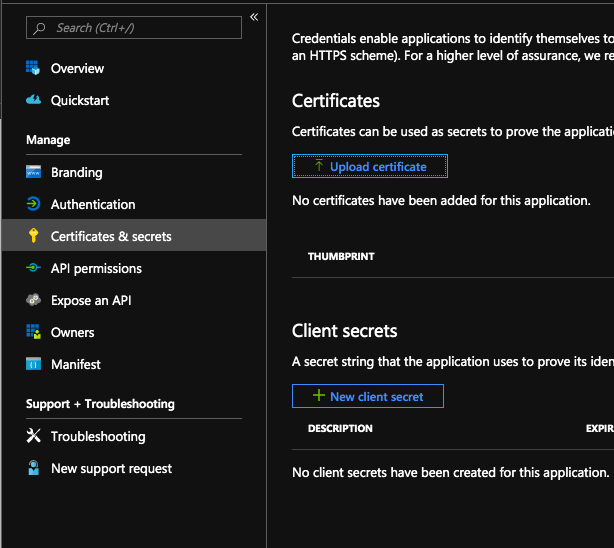
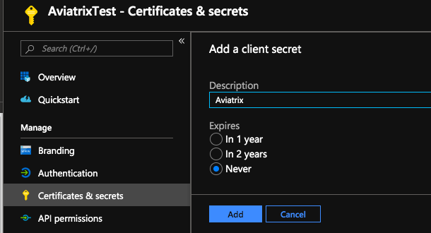
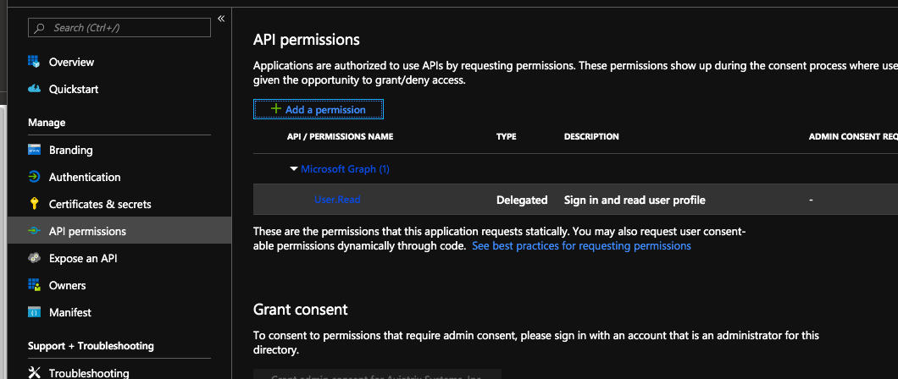
.. |image09| image:: AviatrixAccountForAzure_media/Image09.png
   :width: 100%
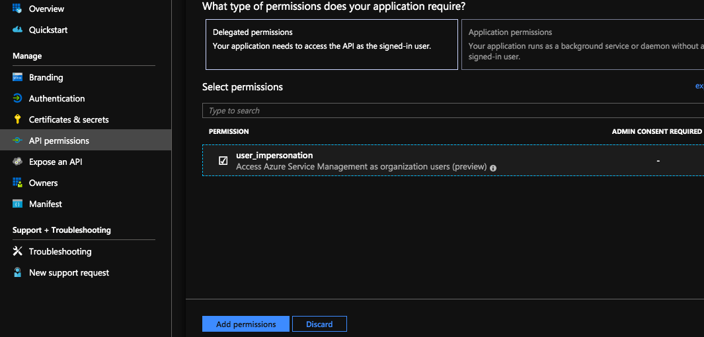
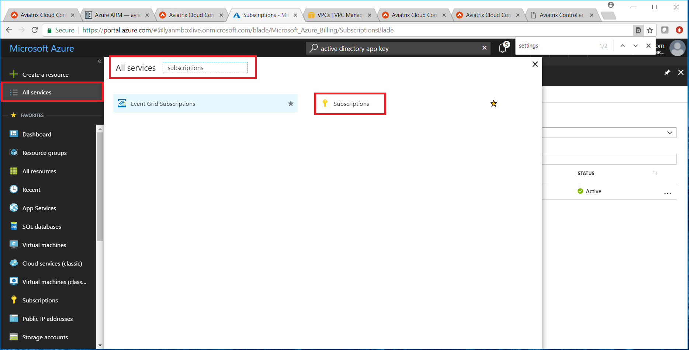
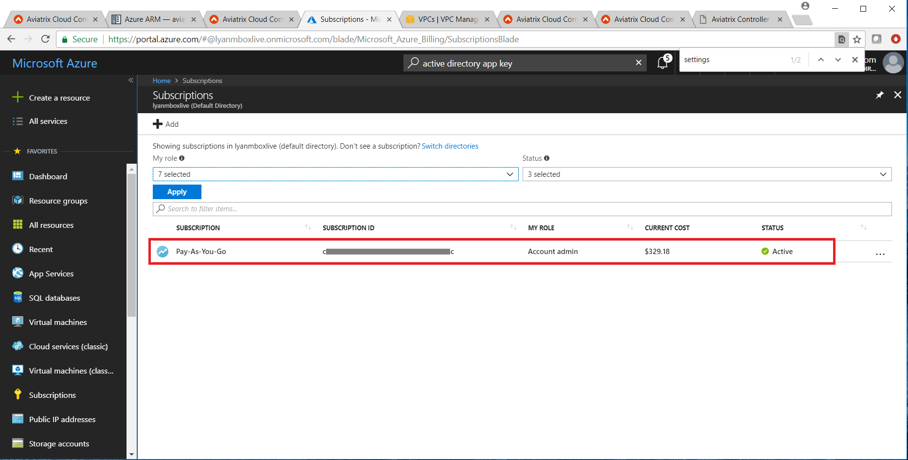
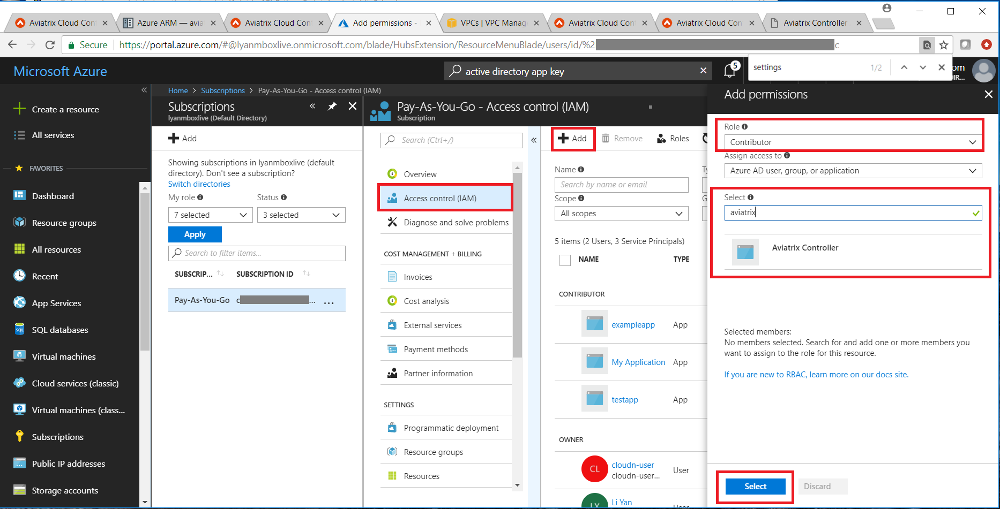
   
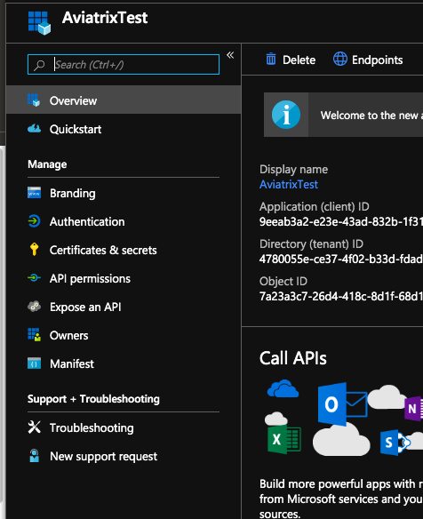
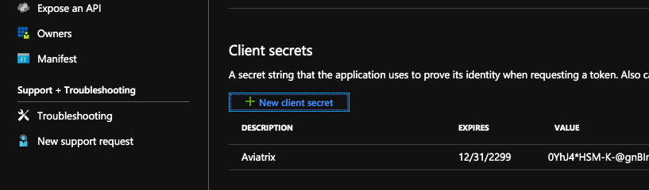

.. add in the disqus tag

.. disqus::   
