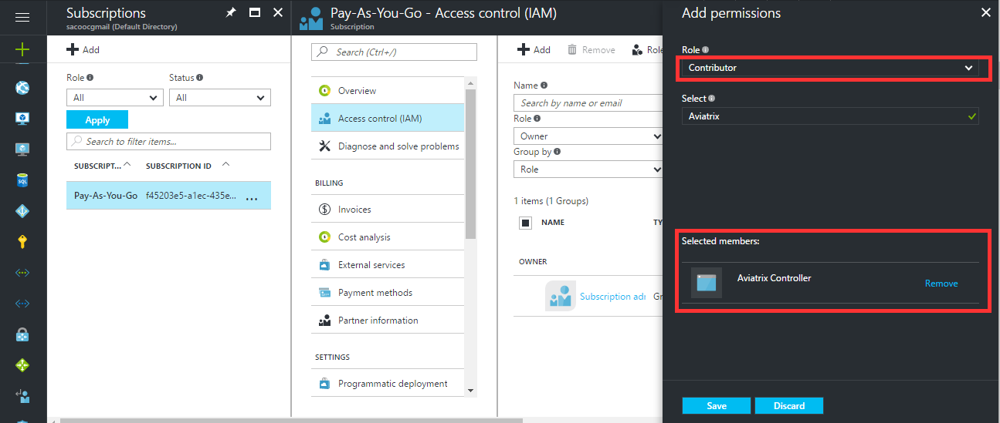

.. meta::
   :description: Avaitrix Cloud Account for Azure
   :keywords: Aviatrix account, Azure, Aviatrix Azure account, Aviatrix Azure

===========================================================
Azure ARM
===========================================================

1.0 Overview
=============

Aviatrix Cloud Controller uses Azure APIs extensively to launch Aviatrix
gateways, configure encrypted peering and many other capabilities.

In order to use Azure API, you need to first create an Aviatrix Cloud
Account on the Aviatrix Cloud controller. This cloud account corresponds
to a valid Azure account with API credentials.

The new Microsoft Azure (as opposed to Azure Classic) is significantly
different in how applications are authenticated and authorized to
interact with Azure Resource Manager APIs to manage resources, such as
Virtual Machines, Network, Storage Accounts, etc.

This document describes how to obtain the necessary information,
specifically Application Client ID, Application Client Secret, and
Application Endpoint to create an Aviatrix Cloud Account with step by
step instructions. There are 3 sections, make sure you go through all of
them.

2.0 Azure Permission Setup for Aviatrix
========================================

Setting up Azure permission for Aviatrix involves three main steps.

1. Register Aviatrix Controller Application with Azure Active Directory

2. Grant Permissions

3. Get Application Client ID, Application Client Secret and Application
   Endpoint

**Important:** Complete the follow steps in order.

2.1  Step 1 – Register Aviatrix Controller Application
-------------------------------------------------------

Login to the Azure Portal.

https://portal.azure.com

***Register Aviatrix Controller***

1. From the Azure portal click on “Azure Active Directory” and then “App
   registrations”

2. Click “+ Add”

   a. Name = Aviatrix Controller

   b. Application Type = Web app / API

   c. Sign-on URL = http://aviatrix

   d. Click Create.

3. Done

2.2 Step 2 – Grant Permissions
-------------------------------

***Grant Permissions***

1. Login to the Azure portal

2. On the bottom left, click More services, search for “Subscriptions”

3. Copy the Subscription ID (to notepad or a convenient location)

4. Click on the Subscription ID

5. Then select “Access control (IAM)”.

   |image0|

6. Click Add and then select the “Contributor” role.

   |image1|

7. In the User search field, type in “Aviatrix”. The Aviatrix Controller
   app should show up. Select this one and click Select towards to the
   bottom.

2.3 Step 3 – Get Application Information
-----------------------------------------

***Get Application Information***

1. From the Azure portal, click More services and search for “Azure
   Active Directory”.

|    a. Retrieve the **Application** **Endpoint ID**.
|
|        i. Scroll down the Azure Active Directory panel and Click on
|         Properties

      |image2|

|         ii. Copy the “Directory ID” (this is the Application Endpoint ID)
|
|     b. Retrieve the **Application Client ID**.
|
|        i.  Click App registrations
|        ii. Copy the “Application ID” this is the Application Client ID)
|
|     c. Retrieve the **Application Client Secret**
|
|        i.   Click App registration -> Keys
|        ii.  Enter in the following
|            1. Description = Aviatrix
|            2. Expires = Never expires
|        iii. Click save
|        iv.  Copy the key value
|
|     d. Add App permissions
|
|       i.   Click App registration -> Required permissions -> Add
|       ii.  Select an API -> Windows Azure Service Management API
|       iii. Select “Access Azure Service Management as organization user”
|       iv.  Done
|
2. Done

At this point you should have the following information.

+-----------------------------------+---------------+
| **Subscription ID**               | From step 2   |
+===================================+===============+
| **Application** **Endpoint ID**   | From step 3   |
+-----------------------------------+---------------+
| **Application Client ID**         | From step 3   |
+-----------------------------------+---------------+
| **Application Client Secret**     | From step 3   |
+-----------------------------------+---------------+

.. |image0| image:: AviatrixAccountForAzure_media/image1.png
   :width: 5.20313in
   :height: 1.50209in

.. |image2| image:: AviatrixAccountForAzure_media/image3.png
   :width: 6.98958in
   :height: 3.02083in
