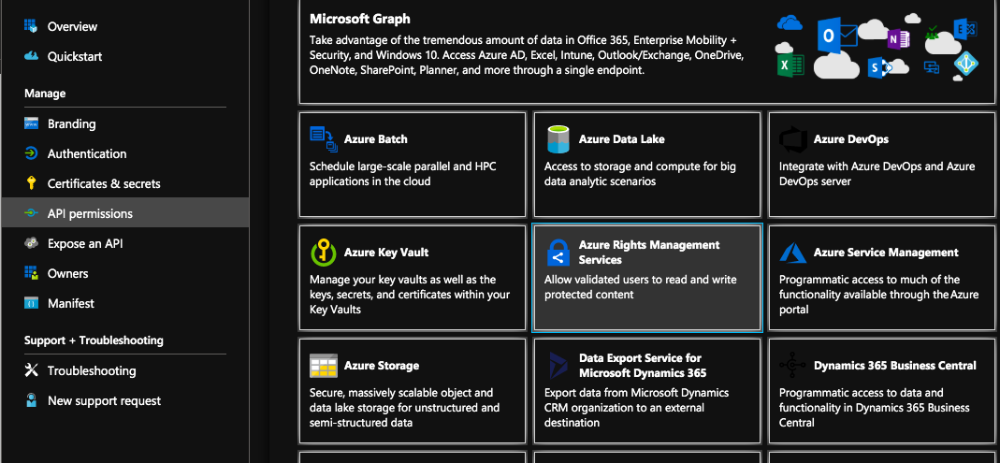

.. meta::
   :description: Aviatrix Cloud Account for Azure
   :keywords: Aviatrix account, Azure, Aviatrix Azure account credential, API credential

===========================================================
Azure Account Credential Setup 
===========================================================

1. Overview
=============

Aviatrix Controller uses Azure APIs extensively to launch Aviatrix
gateways, configure encrypted peering and other features.

In order to use Azure API, you need to first create an Aviatrix `Access
Account <https://docs.aviatrix.com/HowTos/aviatrix_account.html>`_ on the Aviatrix controller. This access account corresponds
to a valid Azure subscription with API credentials. You need to create an access account for each subscription. 

This document describes, for a given subscription, how to obtain the necessary information,
specifically Application ID, Application Key (Client secret), and
Application Directory ID to create an Aviatrix Access Account so that the Controller can execute APIs on that subscription.
There are 3 sections, make sure you go through all of them.

2. API and Permission Setup 
========================================

Setting up Azure permission for Aviatrix involves three main steps.

1. Register Aviatrix Controller Application with Azure Active Directory

2. Assign a role to the Aviatrix Controller Application 

3. Get Application ID, Application Key (Client secret) and Directory ID

**Important:** Complete the following steps in order.

2.1 – Register Aviatrix Controller Application
-------------------------------------------------------

Login to the Azure Portal:  https://portal.azure.com

1. From the Azure portal click on "All services" and search for “Azure Active Directory” and click on “Azure Active Directory”.

2. Click “App registrations".  Do not choose "App registrations (Legacy)"

|image03|

3. Click “+ New registration”

|image04|

   a. Name = Aviatrix Controller

   b. Supported account types = Accounts in this organizational directory only

   c. Click Register.

3. Done

2.2 – Assign a role to the Aviatrix Application
------------------------------------------------------------

1. Login to the Azure portal

2. On the top left, click All services, search for “Subscriptions”

  |image11|

3. Copy the Subscription ID (to notepad or a convenient location)

|image12|

4. Click on the Subscription ID

5. Then select “Access control (IAM)”.

|image13|

6. Click Add and then select the “Contributor” role. If the "Contributor" role is too broad, you can create custom role with specific permissions. 

7. In the Select search field, type in “Aviatrix”. The Aviatrix Controller
   (that you created in section 2.1) app should show up. Select this one and click Select towards to the
   bottom.

2.3 – Setup Information for Programmatic Sign in
------------------------------------------------------------

1. From the Azure portal, click All services and search for “Azure Active Directory”. Click “App registrations” and then the application to see the Application (client) ID and Directory (tenant) ID.

   |image01|

2. Retrieve the **Application (client) ID** and **Directory (tenant) ID**.
   
   A. Copy the Application ID and Directory ID for later use.  

   |image14|
   
3. Retrieve the **Client Secrets**.

   A. Click Certificates & secrets

   B. Click + New client secret

   |image06|

   C. Enter in the following, and then click Add

      * Description = Aviatrix

      * Expires = Never
      
   |image07|

   E. You should see the new secret as shown below.
   
   |image15|

   F. Copy the secret.  This will be used as the Application Key in the Aviatrix Controller.

5. Add **API permissions**.

   Go to Azure Active Directory -> select the "Aviatrix Controller" application, click into the application. 

   A. Click API permissions

   |Image08|

   B. Click "+Add a permission"
   
   C. Choose Azure Service Management
   
   |Image09|
   
   |Image10|

6. Done

At this point you should have the following information to create an access account on Azure.

==========================================               ======================
Access Account Setup Input Field                         Value
==========================================               ======================
Subscription ID                                          From section 2.2
Directory ID                                             From section 2.3
Application ID                                           From section 2.3
Application Key (Client Secret)                          From section 2.3
==========================================               ======================

Additional References
=======================

If you need additional information, refer to `How to: Use the portal to create an Azure AD application and service principal that can access resources <https://docs.microsoft.com/en-us/azure/active-directory/develop/howto-create-service-principal-portal>`_ on Azure documentation.

.. |image01| image:: AviatrixAccountForAzure_media/az-ad-01.PNG
   :width: 5.20313in
   :height: 1.50209in
.. |image02| image:: AviatrixAccountForAzure_media/az-ad-directory-id-02.PNG
   :width: 5.65600in
   :height: 2.39763in

.. |image04| image:: AviatrixAccountForAzure_media/Image04.png
   :width: 100%
.. |image05| image:: AviatrixAccountForAzure_media/az-ad-list-all-apps-05.PNG
   :width: 5.65600in
   :height: 2.39763in
.. |image06| image:: AviatrixAccountForAzure_media/Image06.png
   :width: 100%
.. |image07| image:: AviatrixAccountForAzure_media/Image07.png
   :width: 100%

.. |image11| image:: AviatrixAccountForAzure_media/az-ad-sub-role-11.PNG
   :width: 5.65600in
   :height: 2.39763in
.. |image12| image:: AviatrixAccountForAzure_media/az-ad-sub-list-12.PNG
   :width: 6.98958in
   :height: 3.02083in
.. |image13| image:: AviatrixAccountForAzure_media/az-ad-sub-contrib-13.PNG
   :width: 6.98958in
   :height: 3.02083in
   

.. |image15| image:: AviatrixAccountForAzure_media/Image15.png
   :width: 100%

.. add in the disqus tag

.. disqus::   
