.. meta::
  :description: Azure ingress firewall network
  :keywords: AVX Transit Architecture for Azure, Aviatrix Transit network, Transit DMZ, Egress, Firewall, Azure virtual network peering

=========================================================
Azure Ingress Firewall Setup Solution 
=========================================================

This document illustrates a simple architecture for Ingress traffic inspection firewall that leverages Azure Load Balancers, `Transit FireNet for Azure <https://docs.aviatrix.com/HowTos/transit_firenet_faq.html>`_, and `Azure Transit with Native Spoke VNets <https://docs.aviatrix.com/HowTos/transitvpc_workflow.html#b-attach-azure-arm-spoke-vnet-via-native-peering>`_. The solution also allows 
you to view the client IP address.

The deployment is shown as the diagram below. 

|transit_firenet_vnet|

The key idea is from FireNet point of view, the ingress inspection is simply a VNET to VNET traffic inspection. This is accomplished by 

 #. Place an Internet facing Azure Application Gateway in a spoke VNET (in the diagram, this spoke VNET is called Ingress Spoke VNET) to load balance traffic to the VNET where applications reside (Application Spoke VNET). 
 
 #. Manage Spoke Inspection Policies for the Application Spoke VNET traffic that requires inspection with the Aviatrix Transit VNET.

In this unified architecture, firewalls can be used for Ingress, Egress, North-South and VNET to VNET filtering. The solution does not need Azure Load Balancers to directly attach to firewall instances which then requires firewall instances to source NAT the incoming traffic from the Internet. Firewall instances can scale out as applications scale for all traffic types. 

.. Note::

  This architecture works for `Azure Application Gateway <https://docs.microsoft.com/en-us/azure/application-gateway/overview>`_. You can create multiple load balancers in the Ingress Spoke VNET. 

1. Prerequisite Setup
--------------------------------

First of all, upgrade the Aviatrix Controller to at least version UserConnect-5.3.1428

  - https://docs.aviatrix.com/HowTos/inline_upgrade.html
  
In this instruction, we are going to deploy the below topology in Azure

- Azure VNETs

	- Aviatrix Transit VNET (i.e. 192.168.23.0/24)

	- Ingress Spoke VNET (i.e. 10.20.0.0/16)

	- Application Spoke VNET (i.e. 10.21.0.0/16)

- Azure Transit with Native Spoke VNets topology

.. Note::

	Aviatrix Transit FireNet for Azure Encrypted Transit topology also supports this Azure Ingress Firewall Solution.

Deploy an Aviatrix Transit VNET
^^^^^^^^^^^^^^^^^^^^^

Create an Aviatrix Transit VNET by utilizing Aviatrtix feature `Create a VPC <https://docs.aviatrix.com/HowTos/create_vpc.html>`_ with Aviatrix FireNet VPC option enabled

- Go to the Aviatrix Controller Console.

- Click on the link "Useful Tools -> Create a VPC"

- Click on the button "+ Add new" to create a new VPC with Cloud Type Azure ARM

- Enable the checkbox "Aviatrix FireNet VPC"

Deploy an Ingress Spoke VNET
^^^^^^^^^^^^^^^^^^^^^

Create an Ingress Spoke VNET by utilizing Aviatrtix feature `Create a VPC <https://docs.aviatrix.com/HowTos/create_vpc.html>`_ as the previous step or manually deploying it in Azure portal. Moreover, feel free to use your existing VNET.

Deploy an Application Spoke VNET
^^^^^^^^^^^^^^^^^^^^^

Create an Application Spoke VNET by utilizing Aviatrtix feature `Create a VPC <https://docs.aviatrix.com/HowTos/create_vpc.html>`_ as the previous step or manually deploying it in Azure portal. Moreover, feel free to use your existing Application VNET.

Deploy Azure Transit with Native Spoke VNets topology
^^^^^^^^^^^^^^^^^^^^^

Follow `Global Transit Network Workflow Instructions (AWS/Azure/GCP/OCI) <https://docs.aviatrix.com/HowTos/transitvpc_workflow.html>`_ to deploy Azure Transit with Native Spoke VNets topology.

- Create an Aviatrix Transit Gateway in Aviatrix Transit VNET by following the step `Launch a Transit Gateway <https://docs.aviatrix.com/HowTos/transitvpc_workflow.html#launch-a-transit-gateway>`_ as the following screenshot.

	.. important::

		For Azure deployment, the Aviatrix Transit Gateway must be launched with the option Enable Transit FireNet Function enabled. The minimum Azure FireNet gateway size is Standard_B2ms.
		
|azure_avx_transit_gw|

- Attach both Ingress Spoke VNET and Application Spoke VNET via Azure native peering by following the step `Attach Azure ARM Spoke VNet via native peering <https://docs.aviatrix.com/HowTos/transitvpc_workflow.html#b-attach-azure-arm-spoke-vnet-via-native-peering>`_

Manage Transit FireNet
^^^^^^^^^^^^^^^^^^^^^

Follow `Aviatrix Transit FireNet Workflow <https://docs.aviatrix.com/HowTos/transit_firenet_workflow.html#>`_ to deploy manage FireNet policy, and firewall instances.

- Manage a spoke inspection policy for the Application spoke VNET by referring to step `Manage Transit FireNet Policy <https://docs.aviatrix.com/HowTos/transit_firenet_workflow.html#manage-transit-firenet-policy>`_ as the following screenshot.

|azure_avx_manage_firenet_policy|

- Deploy firewall instance in Aviatrix Transit VNET by following the step `Deploy Firewall Network <https://docs.aviatrix.com/HowTos/transit_firenet_workflow.html#deploy-firewall-network>`_ as the following screenshot.
	
	Here is the Firewall information in this example for your reference. Please adjust it depending on your requirements.

	==========================================      ==========
	**Example setting**                             **Example value**
	==========================================      ==========
	Firewall Image                                  Palo Alto Networks VM-Series Next-Generation Firewall Bundle 1
	Firewall Image Version                          9.1.0
	Firewall Instance Size                          Standard_D3_v2
	Management Interface Subnet						Select the subnet whose name contains "gateway-and-firewall-mgmt"
	Egress Interface Subnet                         Select the subnet whose name contains "FW-ingress-egress"
	Username										Applicable to Azure deployment only. “admin” as a username is not accepted.
	Attach                                          Check
	==========================================      ==========

	|azure_avx_deploy_firewall|

- Set up firewall configuration by referring to `Example Config for Palo Alto Network VM-Series <https://docs.aviatrix.com/HowTos/config_paloaltoVM.html>`_

	.. Note::

		In Azure, instead of using pem file, please use username/password to ssh into firewall instance to reset password if needed. Additionally, use the same username/password to login into firewall website.

2. Launch an Apache2 Web server in Application Spoke VNET 
-------------------------------------

In Application Spoke VNET, create an Ubuntu Server 18.04 LTS virtual machine and install Apache2 HTTP Server with custom port 8080.

========================	==============
**Example setting**		**Example value**
========================	==============
Protocol			HTTP
Port				8080
========================	==============

.. Note::

	Refer to `Install The Latest Apache2 HTTP Server ( 2.4.34 ) On Ubuntu 16.04 | 17.10 | 18.04 LTS Servers <https://websiteforstudents.com/install-the-latest-apache2-2-4-34-on-ubuntu-16-04-17-10-18-04-lts-servers/>`_ to install Apache2 HTTP Server
	
	Refer to `How To Change Apache Default Port To A Custom Port <https://www.ostechnix.com/how-to-change-apache-ftp-and-ssh-default-port-to-a-custom-port-part-1/>`_ to use custom port 8080

3. Create Azure Application Gateway
-------------------------------------

In Ingress Spoke VNET, create an Azure Application Gateway, make sure you select the following: 

- Create an Azure Application Gateway in Ingress Spoke VNET

	|azure_application_gw_creation|

- Select "Public" for Frontend IP address type in section Frontends

	|azure_application_gw_frontend|

- Select "IP address or hostname" for Target type and configure the private IP of Apache2 Web Server for Target in section Backends
 
	|azure_application_gw_backend|

- Add a routing rule on Listener depending on your requirement

	========================	==============
	**Example setting**        	**Example value**
	========================    	==============
	Frontend IP			Public
	Protocol			HTTP
	Port				80
	========================	==============
	
	
	|azure_application_gw_routing_rule_listener|

- Add a routing rule on Backend targets and create a HTTP setting depending on your requirement
	
	|azure_application_gw_routing_rule_backend_target|

- Click the button "Create new" on HTTP settings

	|azure_application_gw_routing_rule_http_setting|

	========================	=================
	**Example setting**        	**Example value**
	========================    	=================
	Bankend protocol		HTTP										
	Backend port			8080					
	========================	=================

	|azure_application_gw_routing_rule_backend_target_02|
	

- Review the configuration and click the button "Create" at the page "Review + create"
 
.. note::

	Refer to the instruction `Quickstart: Direct web traffic with Azure Application Gateway - Azure portal <https://docs.microsoft.com/en-us/azure/application-gateway/quick-create-portal>`_

4. Ready to go!
---------------

Make sure Server (backend pool) status is in Healthy state from the Azure portal page "Application Gateway -> Backend health".

|azure_application_gw_health_check|

Run a http request targeting on the Azure Application Gateway Public IP or DNS name.

- Find the Frontend public IP address of Azure Application Gateway from the Azure portal page "Application Gateway -> Overview"
	
	|azure_application_gw_frontend_public_IP|
	
- Copy the Frontend public IP address of Azure Application Gateway and paste it on a browser from your laptop/PC.
	
	|azure_browser|
	
- Perform tcpdump with port 8080 on Apache2 Web server
	
	|azure_application_server_tcpdump|
	
- Furthermore, Azure Application Gateway automatically preserves client original IP address in the HTTP header field "X-Forwarded-For (XFF)". Here is an HTTP packet example which is opened with Wireshark tool for your reference:

	|azure_application_server_wireshark|

.. note::

	`Does Application Gateway support x-forwarded-for headers? <https://docs.microsoft.com/en-us/azure/application-gateway/application-gateway-faq#does-application-gateway-support-x-forwarded-for-headers>`_

	`What is X-Forwarded-For <https://developer.mozilla.org/en-US/docs/Web/HTTP/Headers/X-Forwarded-For>`_
	
	`How do I see X forwarded for in Wireshark? <https://osqa-ask.wireshark.org/questions/13384/display-http-header>`_

5. View Traffic Log on Firewall
---------------

You can view if traffic is forwarded to the firewall instance by logging in to the Palo Alto VM-Series console. Go to the page "Monitor -> Logs -> Traffic". Perform http/https traffic from your laptop/PC to the public IP or domain name of Azure Application Gateway.

6. Capturing Client IP in logs
-------------------------

To view the client IP address in the access log, follow the instructions in `How to save client IP in access logs <https://aws.amazon.com/premiumsupport/knowledge-center/elb-capture-client-ip-addresses/>`_. 

- Find and open Apache configuration file.
	
	::

		#vim /etc/apache2/apache2.conf

- In the LogFormat section, add %{X-Forwarded-For}i as follows:

	::
	
		...
		LogFormat "%{X-Forwarded-For}i %h %l %u %t \"%r\" %>s %b \"%{Referer}i\" \"%{User-Agent}i\"" combined
		LogFormat "%h %l %u %t \"%r\" %>s %b" common
		...
		
- Save your changes.

- Reload the Apache service.

	::

		#systemctl reload apache2
		
- Review the public/original client IP on apache2 access log 

|azure_application_server_apache2_accesslog|

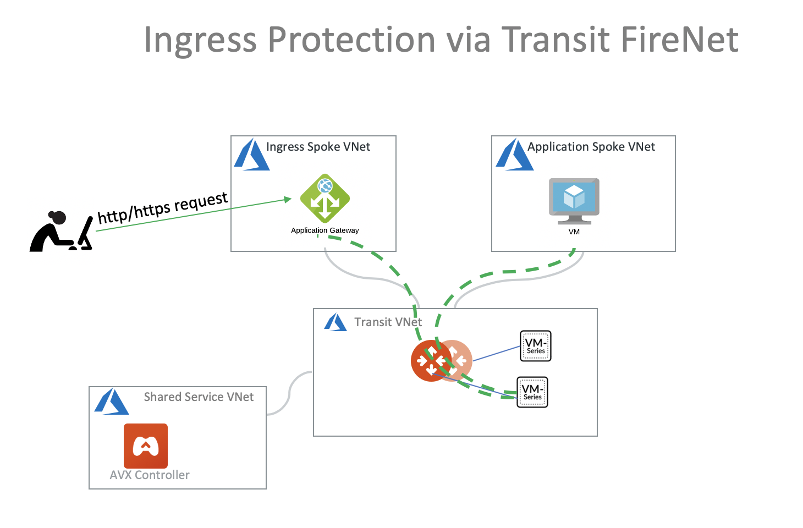
   
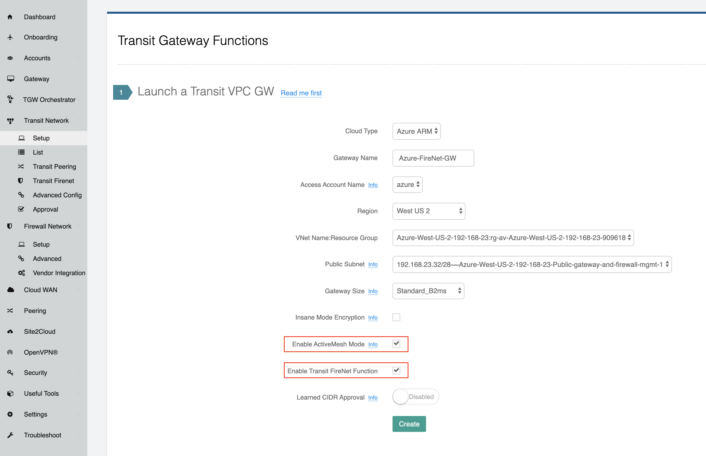
   
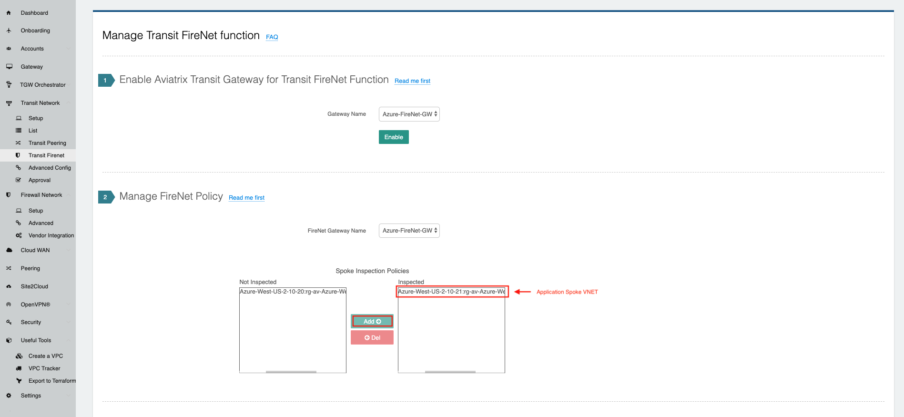

.. |azure_avx_deploy_firewall| image:: ingress_firewall_example_media/azure_avx_deploy_firewall.png
   :scale: 30%
  
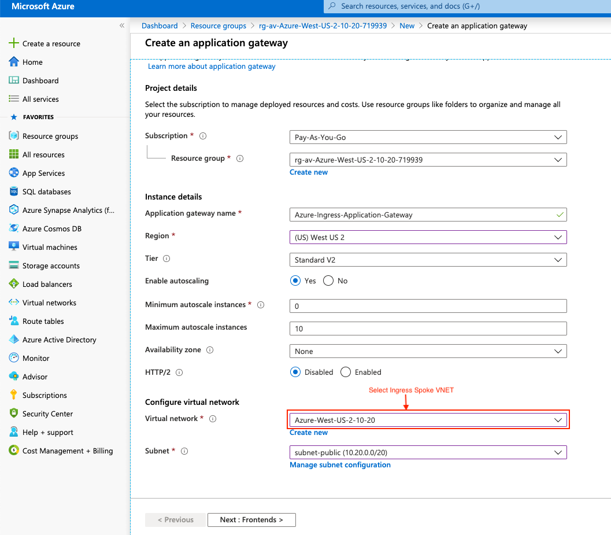
   
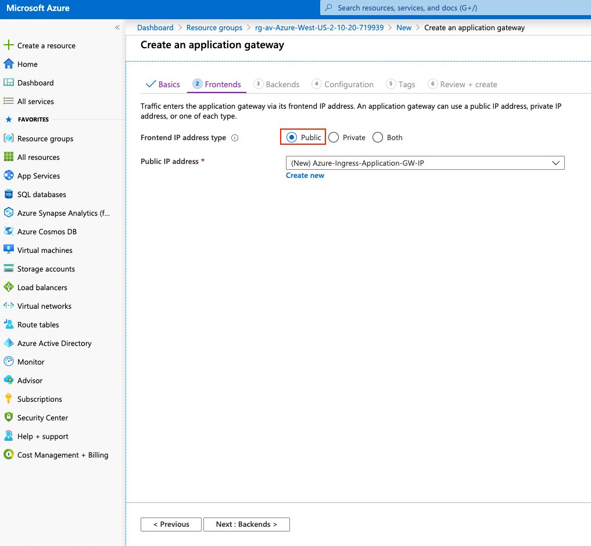
      
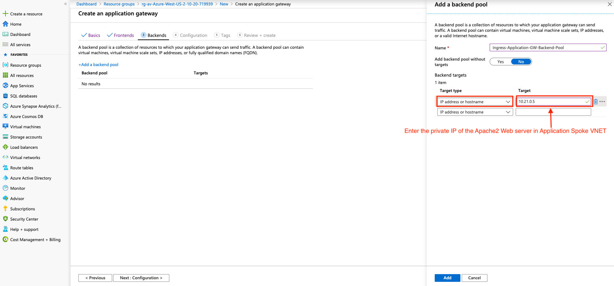
   
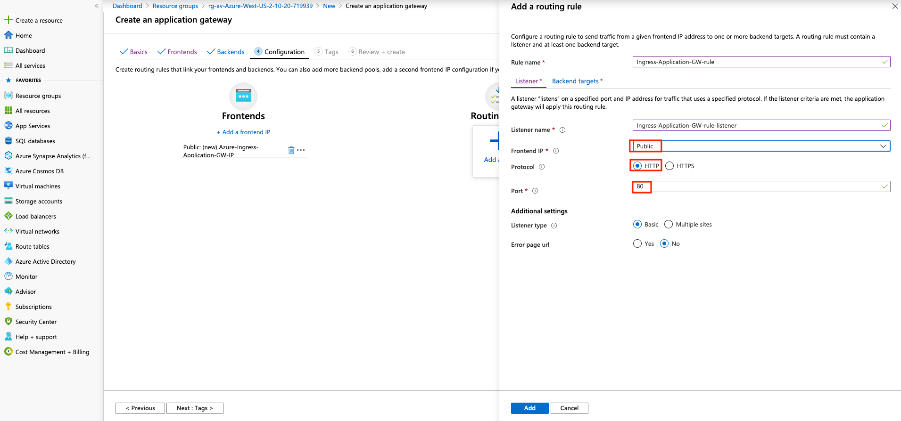
 
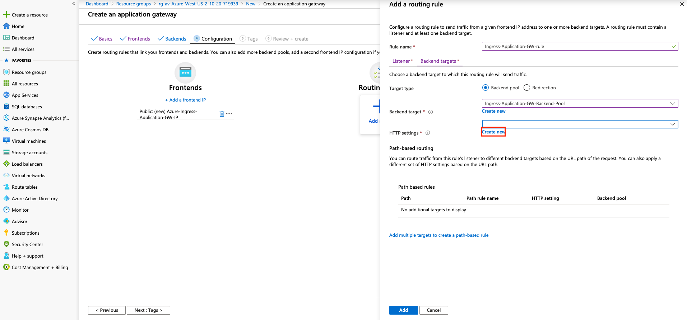
   
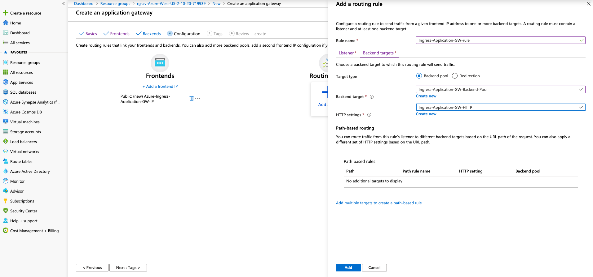
 
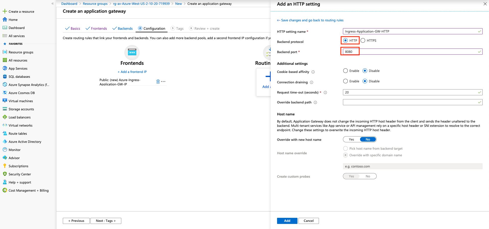
 
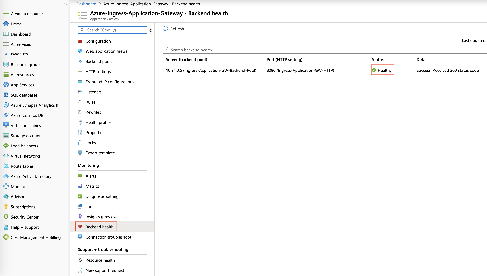
   
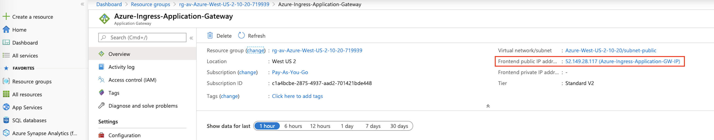
   
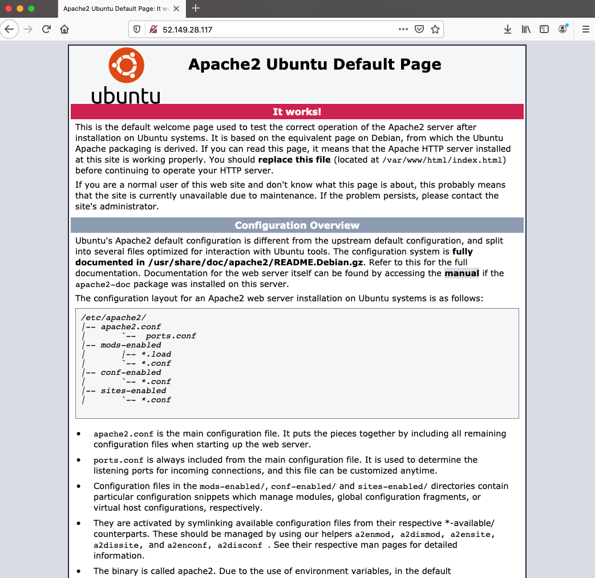

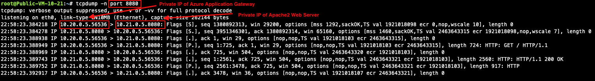
   
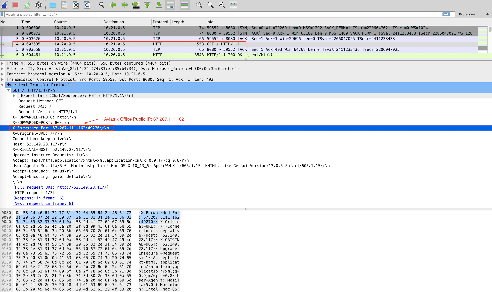

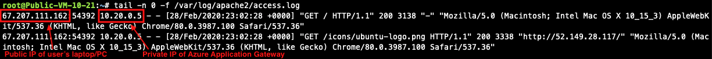

.. disqus::

