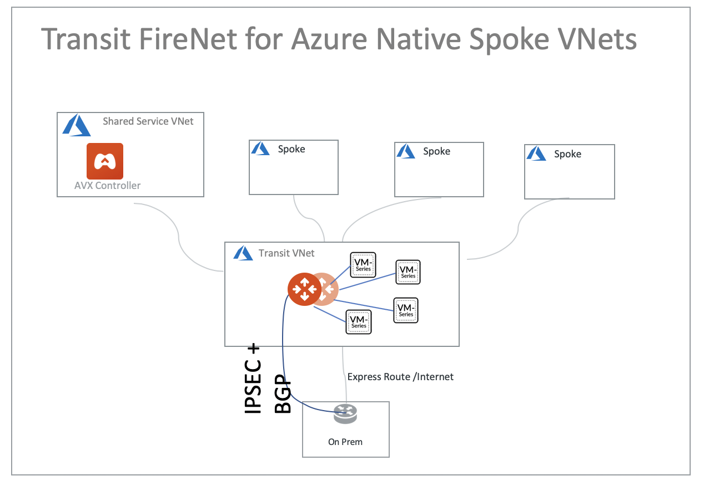

.. meta::
  :description: Azure ingress firewall network
  :keywords: Next Gen Transit Architecture for Azure, Aviatrix Transit network, Transit DMZ, Egress, Firewall, Azure virtual network peering

=========================================================
Azure Ingress Firewall Setup Solution 
=========================================================

This document illustrates a simple architecture for Ingress traffic inspection firewall that leverages Azure Load Balancers, `Transit FireNet for Azure <https://docs.aviatrix.com/HowTos/transit_firenet_faq.html>`_, and `Azure Transit with Native Spoke VNets <https://github.com/AviatrixSystems/Docs/blob/master/HowTos/transitvpc_workflow.rst#6b-attach-azure-arm-spoke-vnet-via-native-peering>`_. The solution also allows 
you to view the client IP address.

The deployment is shown as the diagram below. 

|transit_firenet_vnet|

The key idea is from FireNet point of view, the ingress inspection is simply a VNET to VNET traffic inspection. This is accomplished by 

 #. Place an Internet facing Azure Application Gateway in a spoke VNET (in the diagram, this spoke VNET is called Ingress spoke VNET) from the VNET where applications reside (Application spoke VNET). 
 
 #. Manage Spoke Inspection Policies for the Application spoke VNET traffic that requires inspection with the Aviatrix Transit VNet.

In this unified architecture, firewalls can be used for Ingress, Egress, North-South and VNET to VNET filtering. The solution does not need Azure Load Balancers to directly attach to firewall instances which then requires firewall instances to source NAT the incoming traffic from the Internet. Firewall instances can scale out as applications scale for all traffic types. 

.. Note::

  This architecture works for `Azure Application Gateway <https://docs.microsoft.com/en-us/azure/application-gateway/overview>`_.

  You can create multiple load balancers in the Ingress spoke VNET. 

1. Prerequisite Setup
--------------------------------

  - Follow `Aviatrix Transit FireNet Workflow <https://docs.aviatrix.com/HowTos/transit_firenet_workflow.html#>`_ to deploy Azure Transit with Native Spoke VNets topology, FireNet gateways, and firewall instances. Enable `Egress <https://docs.aviatrix.com/HowTos/firewall_network_faq.html#how-do-i-enable-egress-inspection-on-firenet>`_ if desired.
 
	- Create an Ingress spoke VNET and attach it to the Aviatrix Transit VNET
	- Create an Application spoke VNET and attach it to the Aviatrix Transit VNET
	- Manage a spoke inspection policy for the Application spoke VNET

2. Create Azure Application Gateway
-------------------------------------

In Ingress spoke VNET (Spoke-1), create an Azure Application Gateway, make sure you select the following: 

 - Select "Public" for Frontend IP address type in section Frontends
 - Select "IP address or hostname" for Target type and configure the private IP of Application Server for Target in section Backends
 
.. note::

	`Quickstart: Direct web traffic with Azure Application Gateway - Azure portal <https://docs.microsoft.com/en-us/azure/application-gateway/quick-create-portal>`_
	

3. Ready to go!
---------------

- From the Azure portal, make sure Server (backend pool) status is in Healthy state.
- Run a http/https request targeting on the Azure Application Gateway Public IP or DNS name.

4. View Traffic Log on Firewall
---------------

You can view if traffic is forwarded to the firewall instance by logging in to the Palo Alto VM-Series console. Go to the page "Monitor -> Logs -> Traffic". Perform http/https traffic from your laptop/PC to the public IP or domain name of Azure Application Gateway.

5. Capturing Client IP
-------------------------

Azure Application Gateway automatically preserves client IP address, you can find the client IP address in the HTTP header 
field "X-Forwarded-For". 

To view the client IP address in the access log, follow the instructions in `How to save client IP in access logs <https://aws.amazon.com/premiumsupport/knowledge-center/elb-capture-client-ip-addresses/>`_. 

.. note::

	`Does Application Gateway support x-forwarded-for headers? <https://docs.microsoft.com/en-us/azure/application-gateway/application-gateway-faq#does-application-gateway-support-x-forwarded-for-headers>`_

.. |ingress_firewall| image:: ingress_firewall_example_media/ingress_firewall.png
   :scale: 30%

.. disqus::

