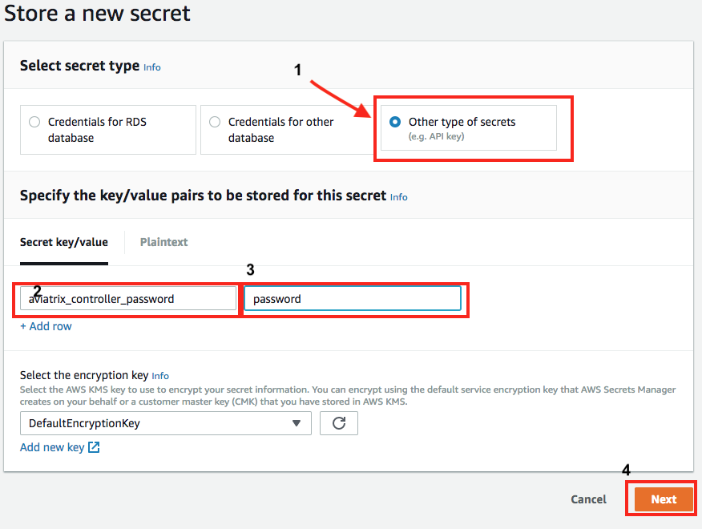
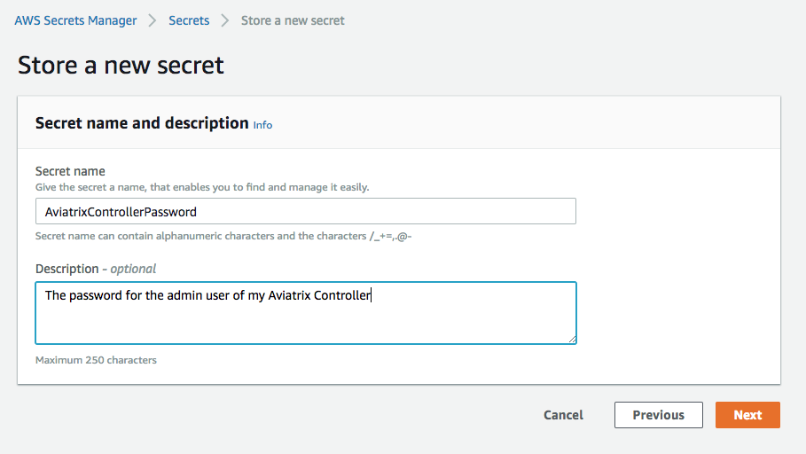
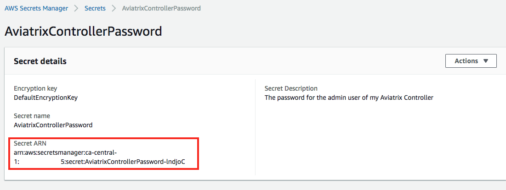
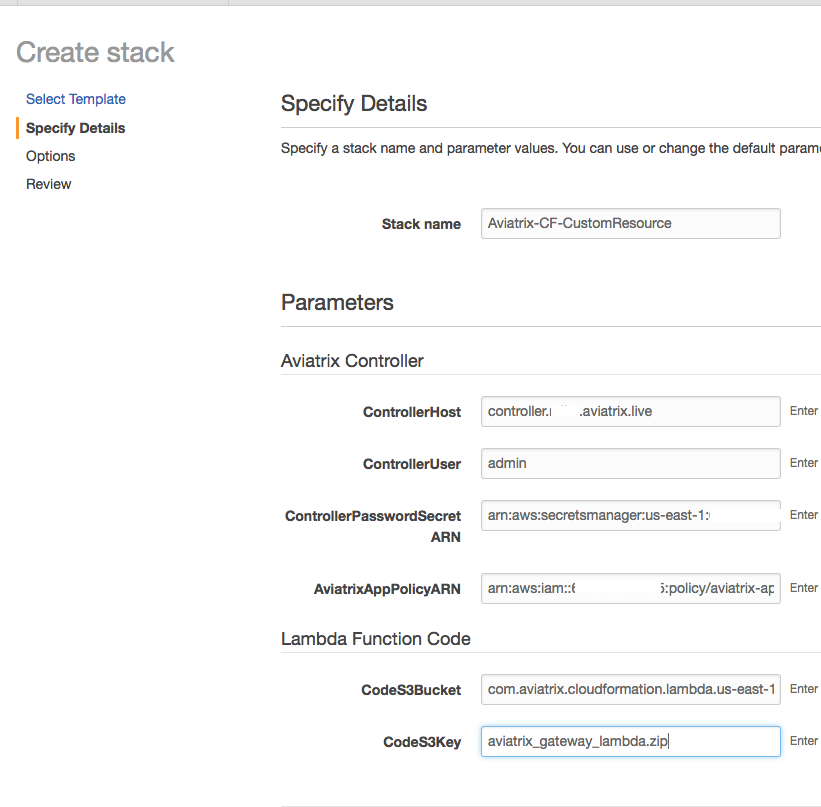
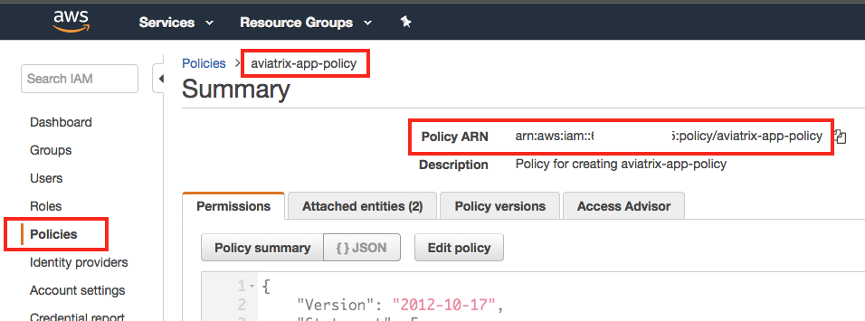
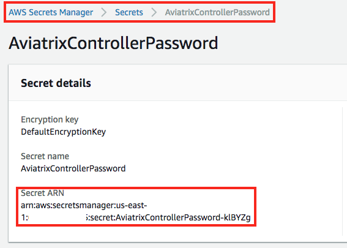
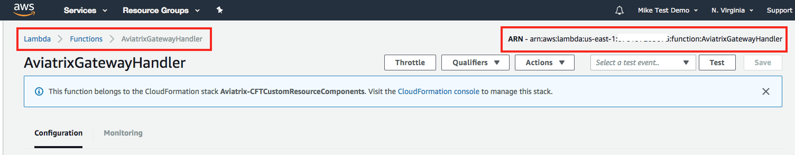
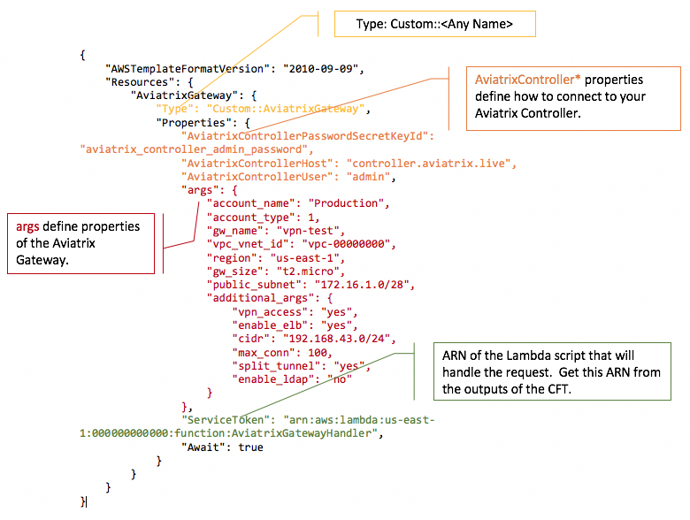
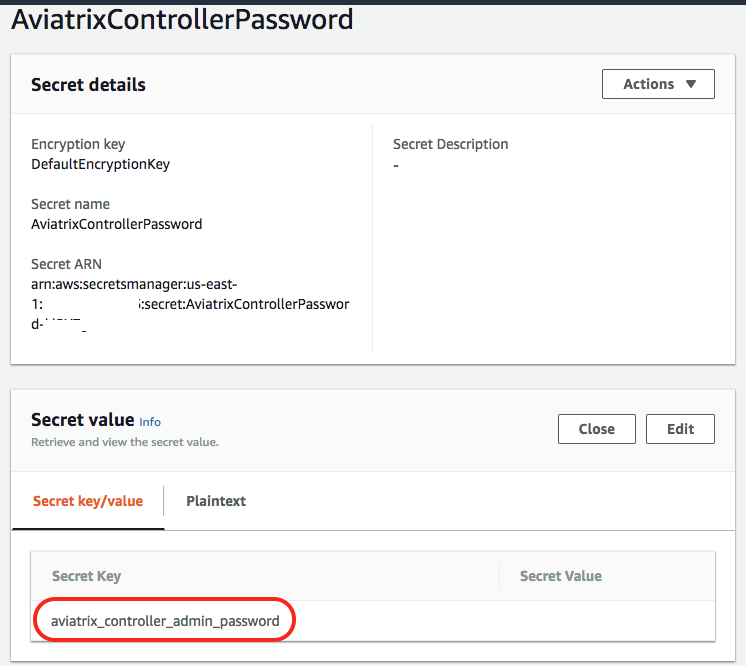

==========================================================
Managing Aviatrix Resources in CloudFormation
==========================================================

.. note::

  This functionality is not officially supported by Aviatrix. This is a community supported effort. And this document is our contribution to this community supported effort.

Overview
--------

Automating Aviatrix components is managed by APIs on the Aviatrix Controller.  However, many AWS customers use CloudFormation to automate their infrastructure within AWS.  In order to call Aviatrix APIs from CloudFormation templates, a `Custom Resource <https://docs.aws.amazon.com/AWSCloudFormation/latest/UserGuide/template-custom-resources.html>`__ is required.

Aviatrix has developed a Custom Resource to facilitate automation of Aviatrix components from CloudFormation templates.  This Custom Resource is backed by an AWS Lambda function.

Use this guide to set up your AWS account with the necessary components to automate Aviatrix from your CloudFormation templates. 

Deployment Guide
----------------

#. `Install an Aviatrix Controller <../StartUpGuides/aviatrix-cloud-controller-startup-guide.html>`__ if you don't already have one
#. `Prepare your AWS account <#cfr-prepare-aws>`__ with components necessary to connect to your Aviatrix Controller from CloudFormation templates
#. Use the Aviatrix Custom Resources in a `CloudFormation template <#cfr-use>`__
   
   
.. _cfr_prepare_aws:

Prepare AWS Account
-------------------

The Aviatrix Lambda script and related AWS resources need to be added to your AWS account to use the Custom Resources for CloudFormation.  Follow these steps to set up your AWS account:

#. `Add <#cfr-secret-manager>`__ your Aviatrix Controller password to AWS Secrets Manager
#. `Upload <#cfr-upload-code>`__ the Lambda code to S3
#. `Add <#cfr-add-aws-resources>`__ AWS resources

.. _cfr_secret_manager_:

Add Controller Password to AWS Secret Manager
#############################################

You will need to manually add your Aviatrix Controller password to the `AWS Secrets Manager <https://console.aws.amazon.com/secretsmanager>`__.  At the time of this writing, the AWS Secrets Manager is not available in CloudFormation and cannot be automatically added.

Follow these steps to add your Aviatrix Controller admin password to AWS Secrets Manager:

#. Login to the `AWS Secrets Manager Console <https://console.aws.amazon.com/secretsmanager>`__

   .. important::
      Be sure you are storing this secret in the correct AWS region

#. Click on the `Store a new secret` button
   
   |imageStoreNewSecret|

#. Select `Other type of secrets` for `Secret type`
#. Enter `aviatrix_controller_password` in the first (key) text field
#. Enter your Aviatrix password in the second (value) text field
#. Click `Next`

   |imageSecretType|

#. Enter a name and description for this secret.  You can use any values here.
#. Click `Next`

   |imageSecretName|

#. Disable automatic rotation
#. Click `Next`
#. Click `Store`

.. note::

   Copy the ARN for the secret just created.  You will need these when you run the CloudFormation stack.

      |imageSecretARN|

.. _cfr_upload_code:

Upload code for Lambda Function
###############################

CloudFormation's Lambda resource requires that the `code` be obtained from a .zip file stored in an S3 bucket in the same region as the CloudFormation template. 

#. Download the handler code `here <https://s3.amazonaws.com/aviatrix-custom-resources/aviatrix_custom_resources.zip>`__.
#. Upload this .zip file to an S3 bucket of your choice.

.. note::

   Remember the S3 bucket and path (key) to this uploaded file.  You will need it later when you run the CloudFormation stack.

.. _cfr_aws_resources:

Add Required AWS Resources
##########################

Once you have your Aviatrix Controller password `stored <#cfr-secret-manager>`__ in the AWS Secrets Manager and the `Lambda code uploaded to S3 <#cfr-upload-code>`__, you are ready to run a CloudFormation template to build the rest of the required components.

#. From the CloudFormation console, create a `new stack <https://console.aws.amazon.com/cloudformation/home#/stacks/new?stackName=AviatrixCloudFormationCustomResources&templateURL=https://s3.amazonaws.com/aviatrix-custom-resources/aviatrix-custom-resource-install.json>`__
#. Click `Next`
#. Enter the parameters:

   +-----------------------------+---------------------------------------------+
   | Parameter                   | Description                                 |
   +=============================+=============================================+
   | ControllerHost              | The hostname or IP of the Aviatrix          |
   |                             | Controller.  Example: demo.aviatrix.com     |
   +-----------------------------+---------------------------------------------+
   | ControllerUser              | The username to login to the Controller.    |
   |                             | You will most likely use the ``admin`` user |
   +-----------------------------+---------------------------------------------+
   | ControllerPasswordSecretARN | The ARN of the secret storing your Aviatrix |
   |                             | Controller password that was created        |
   |                             | earlier.                                    |
   |                             |                                             |
   |                             | |imageARNSecret|                            |
   +-----------------------------+---------------------------------------------+
   | AviatrixAppPolicyARN        | ARN of the aviatrix-app-policy IAM policy   |
   |                             |                                             |
   |                             | |imageARNAviatrixAppPolicy|                 |
   +-----------------------------+---------------------------------------------+
   | CodeS3Bucket                | S3 bucket name where you uploaded the       |
   |                             | Labmda code                                 |
   +-----------------------------+---------------------------------------------+
   | CodeS3Key                   | S3 file key where you uploaded the code     |
   +-----------------------------+---------------------------------------------+

   |imageCFStackParameters|

#. Create the stack

Once the stack is created successfully, you are ready to use the Aviatrix Custom Resources in your CloudFormation templates.
   
.. _cfr_use:

Use Aviatrix Custom Resource in a CloudFormation Template
---------------------------------------------------------

Overview
########

In order to manage Aviatrix resources in your AWS CloudFormation templates, add a new resource of type ``AWS::CloudFormation::CustomResource`` or ``Custom::YourString``.   See additional details `here <https://docs.aws.amazon.com/AWSCloudFormation/latest/UserGuide/aws-resource-cfn-customresource.html>`__.

The ``AWS::CloudFormation::CustomResource`` requires that a ``ServiceToken`` property be provided.  The value of this property should be the ARN of the Lambda function.  This ARN is output by the CloudFormation stack created earlier.

|imageARNLambda|

How to Use this Custom Resource
###############################

Arguments to the resource should be provided in the CFT resource `Properties` object.  There are 3 required properties to allow the Lambda script to access the Controller at the top level:

+---------------------------------------+--------------------------------------+
| Field                                 | Description                          |
+=======================================+======================================+
| AviatrixControllerPasswordSecretKeyId | Enter the `Secret Key` that you used |
|                                       | to store the password in AWS Secrets |
|                                       | Manager.                             |
|                                       |                                      |
|                                       | |imageASMKey|                        |
+---------------------------------------+--------------------------------------+
| AviatrixControllerHost                | The host name (or IP address) of     |
|                                       | your Aviatrix Controller.            |
+---------------------------------------+--------------------------------------+
| AviatrixControllerUser                | The username of the Aviatrix         |
|                                       | Controller.                          |
+---------------------------------------+--------------------------------------+

|imageCFTExample|

Reference
##########

* `Aviatrix Gateway <#cfcr-ref-gw>`__
* `Attach/Detach FQDN Filter to Gateway <#cfcr-ref-fqdn-gw>`__
* `FQDN Filter Tag <#cfcr-ref-fqdn>`__

.. _cfcr_ref_gw:

Aviatrix Gateway
++++++++++++++++

This resource allows you to create Aviatrix Gateways.

**Properties**

.. note::
   These properties must be in an **args** object inside the resource's `Properties` object.

+------------------+----------+------------------------------------------------+
| Name             | Required | Description                                    |
+==================+==========+================================================+
| account_name     | Yes      | Friendly name for account from Aviatrix        |
|                  |          | Controller.                                    |
+------------------+----------+------------------------------------------------+
| account_type     | Yes      | 1 = AWS, 4 = GCP, 8 = Azure ARM                |
+------------------+----------+------------------------------------------------+
| gw_name          | Yes      | Name of this gateway                           |
+------------------+----------+------------------------------------------------+
| vpc_vnet_id      | Yes      | VPC or VNet ID                                 |
+------------------+----------+------------------------------------------------+
| region           | Yes      | Region name (AWS or Azure region)              |
+------------------+----------+------------------------------------------------+
| gw_size          | Yes      | Gateway instance size                          |
+------------------+----------+------------------------------------------------+
| public_subnet    | Yes      | CIDR for the public subnet in the              |
|                  |          | ``vpc_vnet_id``                                |
+------------------+----------+------------------------------------------------+
| additional_args  | Yes      | Dictionary with additional arguments for this  |
|                  |          | gateway.                                       |
+------------------+----------+------------------------------------------------+

**Example**

This sample shows how to create a User SSL VPN gateway.

    .. code-block:: json
    
        {
            "AWSTemplateFormatVersion": "2010-09-09",
            "Resources": {
                "AviatrixGateway": {
                    "Type": "Custom::AviatrixGateway",
                    "Properties": {
                        "AviatrixControllerPasswordSecretKeyId": "aviatrix_controller_admin_password",
                        "AviatrixControllerHost": "controller.aviatrix.demo",
                        "AviatrixControllerUser": "admin",
                        "args": {
                            "account_name": "my_aws_account",
                            "account_type": 1,
                            "gw_name": "vpn-test",
                            "vpc_vnet_id": "vpc-00000000",
                            "region": "us-east-1",
                            "gw_size": "t2.micro",
                            "public_subnet": "172.16.1.0/28",
                            "additional_args": {
                                "vpn_access": "yes",
                                "enable_elb": "yes",
                                "cidr": "192.168.43.0/24",
                                "max_conn": 100,
                                "split_tunnel": "yes",
                                "enable_ldap": "no"
                            }
                        },
                        "ServiceToken": "arn:aws:lambda:ca-central-1:000000000000:function:AviatrixGatewayHandler"
                    }
                }
            }
        }

.. _cfcr_ref_fqdn_gw:

Attach/Detach FQDN Filter to Gateway
++++++++++++++++++++++++++++++++++++

This resource allows you to attach FQDN filter tags to an Aviatrix Gateway.

**Properties**

.. note::
   These properties must be in an **args** object inside the resource's `Properties` object.

+------------------+----------+------------------------------------------------+
| Name             | Required | Description                                    |
+==================+==========+================================================+
| gw_name          | Yes      | Name of the gateway this tag will be attached  |
+------------------+----------+------------------------------------------------+
| tag_name         | Yes      | The name of the existing FQDN filter tag to    |
|                  |          | attach to the given gateway.                   |
+------------------+----------+------------------------------------------------+

.. _cfcr_ref_fqdn:

FQDN Filter Tag
++++++++++++++++

This resource allows you to create FQDN filter tags.

**Properties**

.. note::
   These properties must be in an **args** object inside the resource's `Properties` object.

+------------------+----------+------------------------------------------------+
| Name             | Required | Description                                    |
+==================+==========+================================================+
| tag_name         | Yes      | The name of the existing FQDN filter tag to    |
|                  |          | attach to the given gateway.                   |
+------------------+----------+------------------------------------------------+
| domains          | Yes      | An array of domain definitions for this fitler |
|                  |          | For example: [ "*.google.com",                 |
|                  |          | "*.aviatrix.com" ]                             |
+------------------+----------+------------------------------------------------+
| enable           | No       | Enable the FQDN filter?  Default is disabled   |
|                  |          | Value can be 1 or true to enable.              |
+------------------+----------+------------------------------------------------+

**Example**

This sample shows how to create a new FQDN filter called `production` that is enabled and filters for domains `"*.ubuntu.com", "ubuntu.com", "aviatrix.com", "*.aviatrix.com", "*.example.com"`.

    .. code-block:: json

        {
            "AWSTemplateFormatVersion": "2010-09-09",
            "Resources": {
                "AviatrixFQDNFilter": {
                    "Type": "Custom::AviatrixFQDNFilter",
                    "Properties": {
                        "AviatrixControllerPasswordSecretKeyId": "aviatrix_controller_admin_password",
                        "AviatrixControllerHost": "controller.aviatrix.demo",
                        "AviatrixControllerUser": "admin",
                        "args": {
                          "tag_name": "production",
                            "domains": [ "*.ubuntu.com", "ubuntu.com", "aviatrix.com", "*.aviatrix.com", "*.example.com" ],
                          "enable": true
                        },
                        "ServiceToken": "arn:aws:lambda:us-east-1:00000000000:function:AviatrixFQDNFilterHandler",
                        "Await": true
                    }
                }
            }
        }

