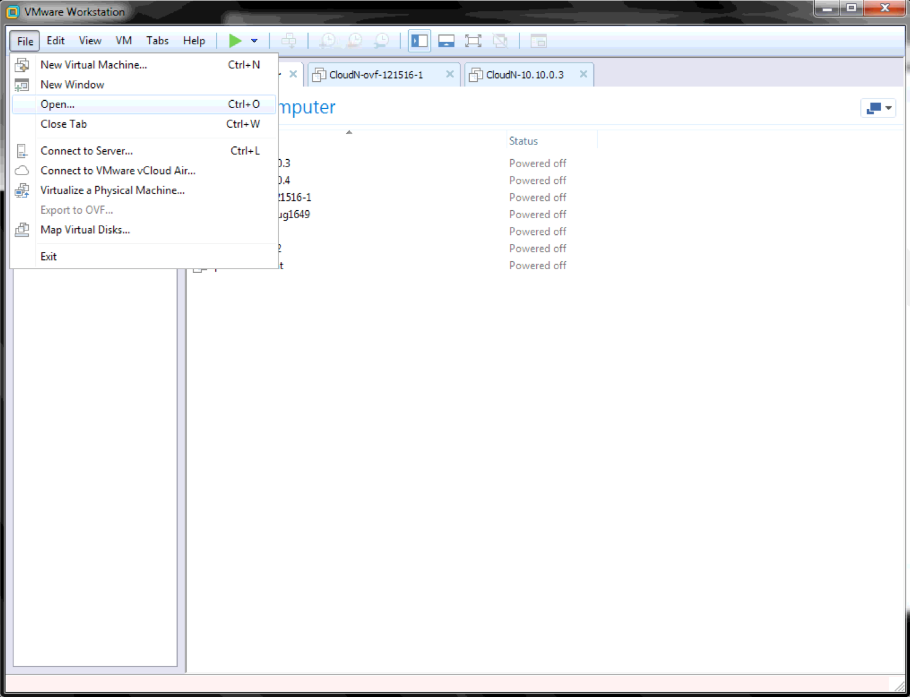
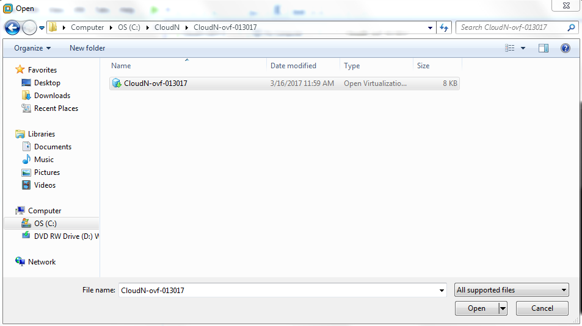
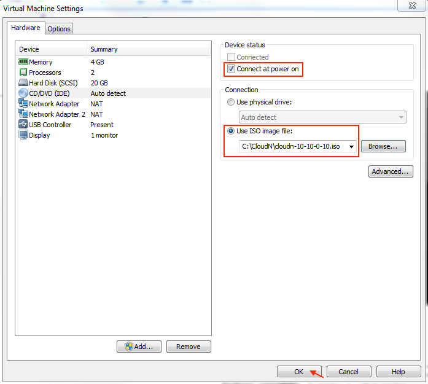
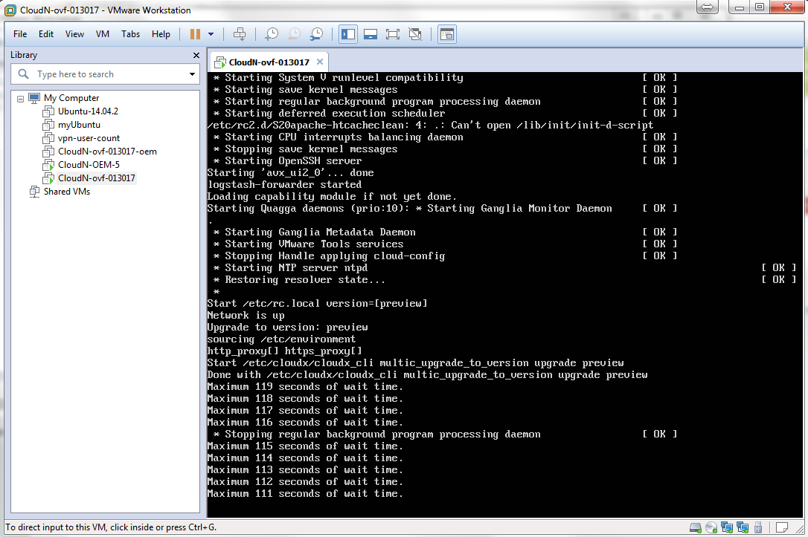
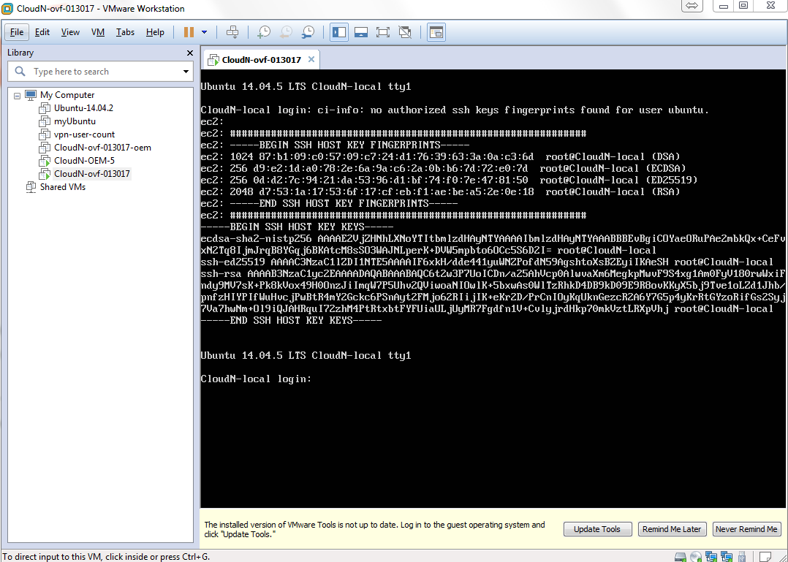
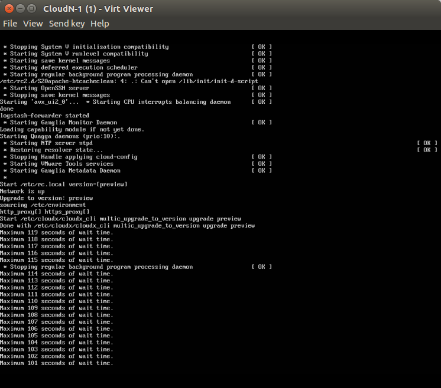
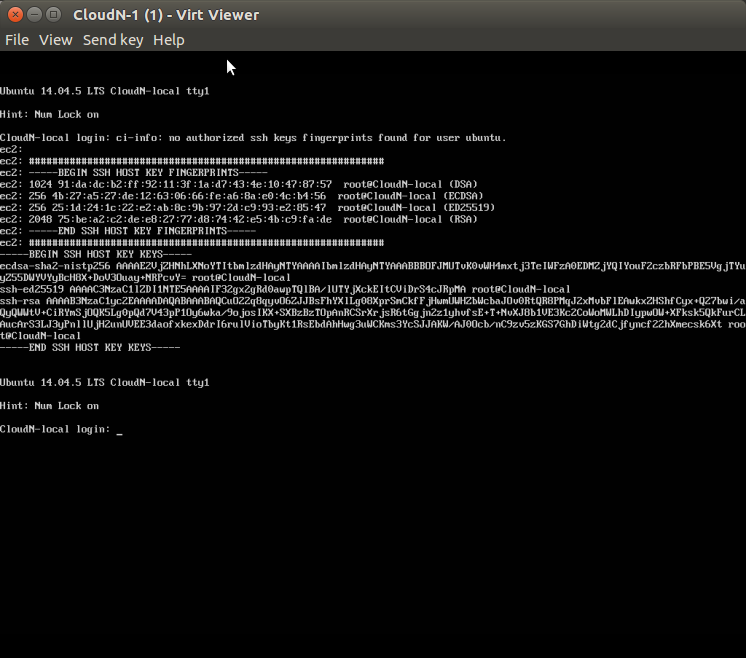
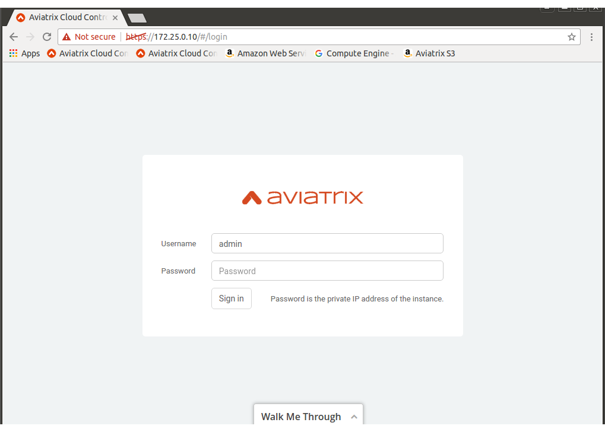

.. meta::
   :description: ClounN Config Drive
   :keywords: CloudN, CloudN config drive, Aviatrix

================================================
Booting CloudN VM with customized configuration
================================================

Installation on vSphere/VMware Workstation 
-------------------------------------------

CloudN Download link:
http://docs.aviatrix.com/StartUpGuides/CloudN-Startup-Guide.html.

Create the customized configuration
~~~~~~~~~~~~~~~~~~~~~~~~~~~~~~~~~~~

In order for cloud-init to parse the meta-data and user-data to CloudN
VM, we need to create an ISO image that will contain both meta-data and
user-data in ISO9660 format.

In the following example, we want to have our CloudN to boot up with a
static ip address 10.10.0.10, netmask 255.255.0.0, gateway 10.10.0.1 and
dns-nameservers 8.8.8.8 8.8.4.4. Please note that “#cloud-config” is not
a comment but a directive to cloud-init.

Sample contents of user-data: 
~~~~~~~~~~~~~~~~~~~~~~~~~~~~~~

:: 

	#cloud-config 

	write\_files
	- path: /etc/network/interfaces
	  content: \|
	    auto lo
	    iface lo inet loopback
	    auto eth0
	    iface eth0 inet static
	    address 10.10.0.10
	    netmask 255.255.0.0
	    gateway 10.10.0.1
	    dns-nameservers 8.8.8.8 8.8.4.4

If CloudN VM will be deployed in a proxy environment, we will need to
include additional proxy settings in the user-data. In the following
sample, 10.10.0.21 is the IP address of the CloudN VM, 10.28.144.137 is
the proxy IP address with port 8080.

Sample contents of user-data (with proxy settings): 
~~~~~~~~~~~~~~~~~~~~~~~~~~~~~~~~~~~~~~~~~~~~~~~~~~~~

::

	#cloud-config

	write\_files:
	- path: /etc/sudoers.d/90-proxy
	  content: \|
	   #Aviatrix http/https proxy integration
	   Defaults env\_keep += "http\_proxy https\_proxy no\_proxy"
	  
	- path: /etc/network/interfaces
	  content: \|
	    auto lo
	    iface lo inet loopback
	    auto eth0
	    iface eth0 inet static
	    address 10.10.0.21
	    netmask 255.255.0.0
	    gateway 10.10.0.1
	    dns-nameservers 8.8.8.8 8.8.4.4
	 
	bootcmd:

	- grep -q \_proxy /etc/environment \|\| (echo
	"http\_proxy=http://10.28.144.137:8080"; echo
	"https\_proxy=http://10.28.144.137:8080"; echo
	"no\_proxy=127.0.0.1,10.10.0.21") >> /etc/environment

	- grep -q \_proxy /etc/apache2/envvars \|\| (echo "export
	http\_proxy=http://10.28.144.137:8080"; echo "export
	https\_proxy=http://10.28.144.137:8080"; echo "export
	no\_proxy=127.0.0.1,10.10.0.21") >> /etc/apache2/envvars

Sample contents of user-data: 
~~~~~~~~~~~~~~~~~~~~~~~~~~~~~~

::

  #cloud-config

  write\_files:
  - path: /etc/network/interfaces
    content: \|
	auto lo
	iface lo inet loopback
	auto eth0
	iface eth0 inet static
	address 10.10.0.10
	netmask 255.255.0.0
	gateway 10.10.0.1
	dns-nameservers 8.8.8.8 8.8.4.4

Contents meta-data:
~~~~~~~~~~~~~~~~~~~

::

  instance-id: CloudN-local
  local-hostname: CloudN-local

Create the ISO
~~~~~~~~~~~~~~

::

  ubuntu@ubuntu:~ $ genisoimage -o cloudn-10-10-0-10.iso -volid cidata -J
  -r user-data meta-data

Verify the ISO (optional)
~~~~~~~~~~~~~~~~~~~~~~~~~

::

  ubuntu@ubuntu:~$ sudo mkdir /media/test\_iso

  ubuntu@ubuntu:~$ sudo mount -o loop cloudn-10-10-0-10.iso
  /media/test\_iso

  mount: /dev/loop0 is write-protected, mounting read-only

  ubuntu@ubuntu:~$ cat /media/test\_iso/user-data

  #cloud-config

  write\_files:
  
    - path: /etc/network/interfaces
      content: \|
	auto lo
	iface lo inet loopback
	auto eth0
	iface eth0 inet static
	address 10.10.0.10
	netmask 255.255.0.0
	gateway 10.10.0.1
	dns-nameservers 8.8.8.8 8.8.4.4
	
  ubuntu@ubuntu:~$ cat /media/test\_iso/meta-data
	
  instance-id: CloudN-local
	
  local-hostname: CloudN-local
	
  ubuntu@ubuntu:~$ sudo umount /media/test\_iso

Deploy CloudN VM with the ISO
-----------------------------

We will deploy a CloudN VM with the cloudn-10-10-0-10.iso attached as a
CDROM to the VM. During the boot up process, the CloudN will be
configured with the customized configuration in user-data and meta-data.
Once the CloudN network is up, it will automatically download the latest
CloudN software. We will be able to access the web UI directly without
having to access the CloudN VM console to perform the initial interface
setup.

|image0|

|image1|

After importing the CloudN ovf is completed,

-  Click on “Edit virtual machine settings” and select CD/DVD Drive
   under the Hardware section.

-  Make sure the Device status “Connect at power on” option is checked

-  Click on “Use ISO image” to browse to the cloudn-10-10-0-10.iso.

-  Click “OK” to complete the Virtual Machine Settings.

|image2|

Power on the CloudN virtual machine. The configuration in
cloudn-10-10-0-10.iso will be read by cloud-init during the installation
process and CloudN will upgrade to default version when the network is
up.

|image3|

|image4|

Once the CloudN login prompt is shown on the VM console, we can access
the https://10.10.0.10 to complete the admin’s email and password
initialization process.

|image5|

Installation on Linux KVM
-------------------------

We will use the same methods previously described to create the
cloudn-172-25-0-10.iso to be used in Linux KVM.

Contents of user-data: 
~~~~~~~~~~~~~~~~~~~~~~~
::

  #cloud-config

  write\_files:

  - path: /etc/network/interfaces
    content: \|
     auto lo
     iface lo inet loopback
     auto eth0
     iface eth0 inet static
     address 172.25.0.10
     netmask 255.255.0.0
     gateway 172.25.0.1

  dns-nameservers 8.8.8.8 8.8.4.4

Contents meta-data:
~~~~~~~~~~~~~~~~~~~
::

  instance-id: CloudN-local

  local-hostname: CloudN-local

Create the ISO
~~~~~~~~~~~~~~

::

  ubuntu@ubuntu:~ $ genisoimage -o cloudn-172-25-0-10.iso -volid cidata -J
  -r user-data meta-data

Deploy CloudN VM with the ISO
-----------------------------

Copy the CloudN qcow2 image and cloudn-172-25-0-10.iso to the
/var/lib/libvirt/images.

::

  root@ubuntu1:/var/lib/libvirt/images# cp
  /home/ubuntu/Downloads/CloudN-ovf-013017.qcow2 .

  root@ubuntu1:/var/lib/libvirt/images# cp
  /home/ubuntu/Downloads/cloudn-172-25-0-10.iso .

  root@ubuntu1:/var/lib/libvirt/images# ls -l CloudN-kvm-013017.qcow2

  -rw-r--r-- 1 root root 7761634304 Mar 19 22:09 CloudN-kvm-013017.qcow2

  root@ubuntu1:/var/lib/libvirt/images# ls -l cloudn-172-25-0-10.iso

  -rw-r--r-- 1 root root 374784 Mar 19 22:11 cloudn-172-25-0-10.iso

In this example below, we created a bridge interface “br1” and assign
eno1 to this “br1”.

::

  ubuntu@ubuntu1:~$ ifconfig
  br1 Link encap:Ethernet HWaddr 00:30:48:b3:59:92
    inet addr:172.25.0.2 Bcast:172.25.255.255 Mask:255.255.255.0
    inet6 addr: fe80::230:48ff:feb3:5992/64 Scope:Link
    UP BROADCAST RUNNING MULTICAST MTU:1500 Metric:1
    RX packets:2060 errors:0 dropped:0 overruns:0 frame:0
    TX packets:507 errors:0 dropped:0 overruns:0 carrier:0
    collisions:0 txqueuelen:1000
    RX bytes:163384 (163.3 KB) TX bytes:74489 (74.4 KB)

  eno1 Link encap:Ethernet HWaddr 00:30:48:b3:59:92
    inet6 addr: fe80::230:48ff:feb3:5992/64 Scope:Link
    UP BROADCAST RUNNING MULTICAST MTU:1500 Metric:1
    RX packets:2076 errors:0 dropped:0 overruns:0 frame:0
    TX packets:559 errors:0 dropped:0 overruns:0 carrier:0
    collisions:0 txqueuelen:1000
    RX bytes:201572 (201.5 KB) TX bytes:83977 (83.9 KB)
    Interrupt:21 Memory:fe600000-fe620000

  enp4s0 Link encap:Ethernet HWaddr 00:30:48:b3:59:93
    UP BROADCAST MULTICAST MTU:1500 Metric:1
    RX packets:0 errors:0 dropped:0 overruns:0 frame:0
    TX packets:0 errors:0 dropped:0 overruns:0 carrier:0
    collisions:0 txqueuelen:1000
    RX bytes:0 (0.0 B) TX bytes:0 (0.0 B)
   Interrupt:19 Memory:fe400000-fe420000

  lo Link encap:Local Loopback
    inet addr:127.0.0.1 Mask:255.0.0.0
    inet6 addr: ::1/128 Scope:Host
    UP LOOPBACK RUNNING MTU:65536 Metric:1
    RX packets:656 errors:0 dropped:0 overruns:0 frame:0
    TX packets:656 errors:0 dropped:0 overruns:0 carrier:0
    collisions:0 txqueuelen:1
    RX bytes:107212 (107.2 KB) TX bytes:107212 (107.2 KB)

  virbr0 Link encap:Ethernet HWaddr 00:00:00:00:00:00
    inet addr:192.168.122.1 Bcast:192.168.122.255 Mask:255.255.255.0
    UP BROADCAST MULTICAST MTU:1500 Metric:1
    RX packets:0 errors:0 dropped:0 overruns:0 frame:0
    TX packets:0 errors:0 dropped:0 overruns:0 carrier:0
    collisions:0 txqueuelen:1000
    RX bytes:0 (0.0 B) TX bytes:0 (0.0 B)

  ubuntu@ubuntu:~$ brctl show
    bridge name bridge id STP enabled interfaces
    br1 8000.003048b35992 no eno1
    virbr0 8000.000000000000 yes

Create a new CloudN-1 by importing the CloudN-kvm-013017.qcow2 image
with the customized cloudn-172-25-0-10.iso

::

  root@ubuntu1:/var/lib/libvirt/images# virt-install --os-type linux
  --os-variant ubuntu14.04 --import --disk
  path=./CloudN-kvm-013017.qcow2,bus=virtio,format=qcow2,size=20 --name
  CloudN-1 --ram 4096 --vcpus 2 --disk
  path=./cloudn-172-25-0-10.iso,device=cdrom --network
  bridge=br1,model=virtio --network bridge=br1,model=virtio --graphics spice

A Virt Viewer windows will pop up to show the installation process of
CloudN. Once the CloudN login prompt is shown on the Virt Viewer
console, we can access the https://172.25.0.10 to complete the admin’s
email and password initialization process.

|image6|

|image7|

|image8|

When you close the Virt Viewer window, the CloudN VM is still running
and you will notice that the “Domain creation completed” on the terminal
that you executed virt-install command earlier.

To shut down or delete the CloudN VM, you may use the Virtual Machine
Manager or virsh commands like any other VMs supported by Linux KVM.

   

  

   

   

   

   

   

   

.. disqus::
