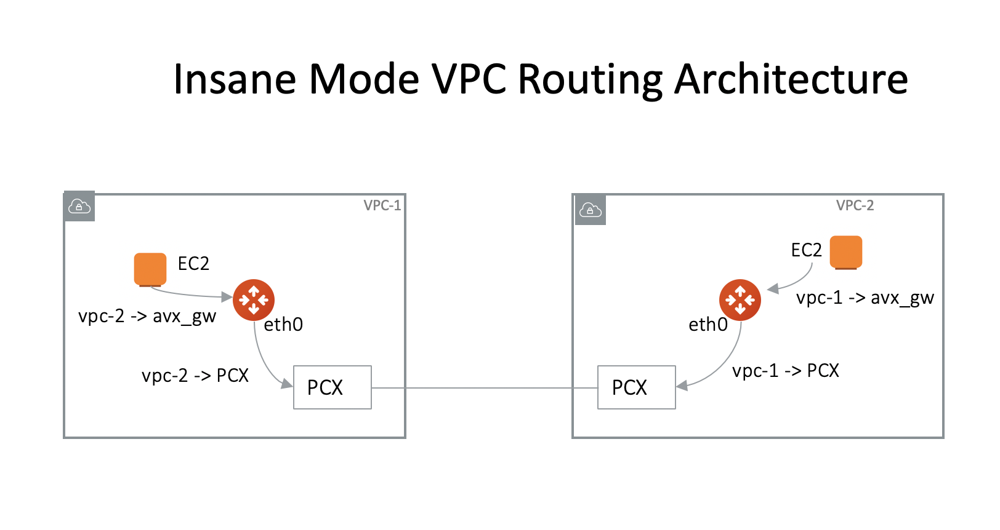

.. meta::
  :description: Global Transit Network
  :keywords: Transit Network, Transit hub, AWS Global Transit Network, Encrypted Peering, Transitive Peering, Insane mode, Transit Gateway, TGW

===============================================
Insane Mode CloudN Deployment Checklist
===============================================

When Insane Mode is applied to improve encryption performance between on-prem and cloud, you need to deploy the Aviatrix hardware appliance CloudN. Making this use case work requires edge router configurations. This document lists the checklist you should follow in 
successfully deploying Insane Mode for hybrid connection. 

CloudN Insane Mode can be applied to hybrid connection by AWS Direct Connect or Azure Express Route. CloudN can also be applied to hybrid 
connection by Internet. 

One CloudN supports `multiple Transit Gateways connections. <https://docs.aviatrix.com/HowTos/insane_mode.html#can-one-cloudn-appliance-connect-to-multiple-connections-of-direct-connect-or-express-route>`_

Step 1. Understand Deployment Architecture 
----------------------------------------------

The first step is to understand how routing works in this use case.

Step 1.1 Connection over Direct Connect or Express Route
~~~~~~~~~~~~~~~~~~~~~~~~~~~~~~~~~~~~~~~~~~~~~~~~~~~~~~~~~~~

If you use AWS Direct Connect or Azure Express Route to connect to your data center, the deployment architecture is 
demonstrated in the diagram below. The diagram uses AWS Direct Connect for illustration purpose, the architecture applies to Azure Express Route. 

|insane_mode_howto_dx| 

The key ideas for this scenario are:

 -  The edge (WAN) router runs a BGP session to VGW (AWS) where the edge router advertises a CloudN WAN subnet network and the VGW advertises the Transit VPC CIDR.
 -  CloudN LAN interface runs a BGP session to the edge router where the edge router advertises on-prem network address range to CloudN LAN interface.
 -  CloudN WAN interface runs a BGP session to Aviatrix Transit Gateway in the Transit VPC where Aviatrix Transit Gateway advertises all Spoke VPC CIDRs to CloudN and CloudN advertises on-prem network to the Aviatrix Transit Gateway. 

Following are a few common deployment architecture. 

Single Aviatrix CloudN Appliance 
~~~~~~~~~~~~~~~~~~~~~~~~~~~~~~~~~~~

|deployment|

And the sample configuration on an ISR is as follows.

|ISR-sample-config|

Aviatrix CloudN Appliance with HA
~~~~~~~~~~~~~~~~~~~~~~~~~~~~~~~~~~~~~~~~~~

|deployment_ha|

Redundant DX Deployment (Active/Standby)
~~~~~~~~~~~~~~~~~~~~~~~~~~~~~~~~~~~~~~~~~~~~~~~~~~
In this deployment model, Direct Connects are being used in a Active/Standby mode. The Preferred path is indicated on the picture.

.. note::
    The firewalls on the left side of the picture cannot handle asymmetric traffic which maybe the reason of having Direct Connect as Active/Standby

|deployment_dual_dx|

Redundant DX Deployment (Active/Active)
~~~~~~~~~~~~~~~~~~~~~~~~~~~~~~~~~~~~~~~~~~~~~~~~~~
In this deployment model, Direct Connects are Active / Active. One of the requirements would be for the firewall to handle asymmetric routing.

|deployment_dual_dx_aa|

Step 1.2 Connection over Internet
~~~~~~~~~~~~~~~~~~~~~~~~~~~~~~~~~~~~

If you use high speed Internet to connect to data center, the deployment architecture is described as below. 

|insane_mode_howto_internet| 

Key ideas are listed below:

  - CloudN LAN and WAN interfaces do not use public IP addresses. It relies on edge router or Firewall NAT function and Internet connectivity. 
  -  CloudN LAN interface runs a BGP session to the edge router where the edge router advertises on-prem network address range to CloudN LAN interface.
  -  CloudN WAN interface runs a BGP session to Aviatrix Transit Gateway in the Transit VPC where Aviatrix Transit Gateway advertises all Spoke VPC CIDRs to CloudN and CloudN advertises on-prem network to the Aviatrix Transit Gateway.

Example deployment diagram
~~~~~~~~~~~~~~~~~~~~~~~~~~~~~

|deployment_internet|

  

Step 2. Pre-deployment Request Form 
------------------------------------

After you understand the deployment architecture and decide to move forward for this deployment, the next step is to fill out the `CloudN
Appliance Request Form. <https://s3-us-west-2.amazonaws.com/aviatrix-download/InsaneMode_CloudN_Prep.docx>`_   

The Aviatrix support team configures a CloudN appliance based on your input in the Request Form, then 
ships the appliance.  Deployment topology for Aviatrix CloudN is as follows:

|InsaneBeta|

The key information in the Request Form that you must fill are explained below. 

=====================  ==================  ===========  ===============  ===============  ==================  =====================  =============================================================
CloudN Interface       Private IP Address  Subnet Mask  Default Gateway  MTU Size         Primary DNS Server  Secondary DNS Server   Note
=====================  ==================  ===========  ===============  ===============  ==================  =====================  =============================================================
1- WAN                                                                                    Not Required        Not Required           WAN port that connects edge router
2- LAN                                                  Not Required                      Not Required        Not Required           LAN port that connects edge router
3- MGMT                                                                  Not Required                                                Management port for CloudN configuration and software upgrade
4- HPE iLO (optional)                                                    Not Required     Not Required        Not Required           HP Integrated Lights-Out
=====================  ==================  ===========  ===============  ===============  ==================  =====================  =============================================================

2.1 Internet Access
~~~~~~~~~~~~~~~~~~~~~~~~
A CloudN appliance does not require a public IP address, but the management port requires outbound internet access on the management port for software upgrade. 

Here is the list of the public IP address that CloudN requires for outbound traffic. 

=======================  ================  ==== =================================================
FQDN                     IP address        PORT Purpose
=======================  ================  ==== =================================================
www.carmelonetworks.com  54.149.28.255     443  Download CloudN software upgrades
license.aviatrix.com     52.24.131.245     443  Reach out to Aviatrix’s License Server
security.aviatrix.com    54.149.28.255     443  Sync service certificates
diag.aviatrix.com        54.200.59.112     443  Upload tracelog to Aviatrix and remote debugging
bower.io                 104.248.78.23     443  Download Linux software upgrades
github.com               192.30.255.112    443  Download Linux software upgrades
=======================  ================  ==== =================================================

2.2 BGP Requirement
~~~~~~~~~~~~~~~~~~~~~~~
BGP is required between the LAN port of the appliance and the on-prem router for route propagation.

Step 3. Deployment Checklist
-----------------------------------

3.1 Before Powering Up CloudN
~~~~~~~~~~~~~~~~~~~~~~~~~~~~~~~~~
Before powering up CloudN, make sure 
 
 a. The CloudN WAN cable, LAN cable and Management cable are properly plugged in to ASR and switches.
 #. Check the interface of ASR to CloudN WAN interface, make sure Proxy ARP is enabled (ip proxy-arp). 
 #. ASR DX (Direct Connect) interface should only advertise CloudN WAN interface subnet network to VGW
 #. ASR LAN (Datacenter facing) interface does not advertise Transit VPC CIDR to datacenter.
 #. ASR to CloudN LAN interface advertises datacenter networks.
 #. The VGW is attached to the Transit VPC. 
 #. AWS Transit VPC Route Propagation is enabled. 
 #. If there is an edge firewall in front of the edge router, make sure the firewall opens UDP port 500 and UDP port 4500 for traffic from the CloudN WAN Interface. CloudN builds an IPSEC tunnel between CloudN WAN interface and Aviatrix Transit Gateway. The BGP session between the two interfaces is inside the tunnel. 

3.2 Power up CloudN
~~~~~~~~~~~~~~~~~~~~~~~

After you power up CloudN, first test that the CloudN interfaces are alive and connected properly by doing the following tests.  

 a. From ASR,  ping the CloudN LAN interface, WAN interface and Mgmt interface.
 #. CloudN mgmt interface can ping Internet (From CloudN clish console)

3.3 Upgrade CloudN to the Latest Software
~~~~~~~~~~~~~~~~~~~~~~~~~~~~~~~~~~~~~~~~~~

 a. Login to the CloudN console. Open a browser console and type: https://CloudN_Mgmt_IP_Address
 #. Login with username "admin" and password "Aviatrix 123#" (You can change the password later)
 #. Upgrade CloudN to the latest.

3.4 Configure Insane Moode
~~~~~~~~~~~~~~~~~~~~~~~~~~~~

From the Controller in AWS, configure Transit Setup Step 3 to CloudN, make sure to select all the correct options.

.. 

 a. CloudN IP Address is the CloudN WAN IP address
 #. CloudN Neighbor IP Address is the ASR to the 	CloudN LAN interface IP address
 #. After configuration, download the configure file and import to CloudN.
 #. If there is HA, import to CloudN HA.

3.5 Troubleshooting Tips
~~~~~~~~~~~~~~~~~~~~~~~~~~~~

 a. Check on CloudN Console. Go to Site2Cloud, make sure the tunnel is up. 
 #. Check on CloudN Console, Go to Troubleshoot -> Diagnostics -> BGP, make sure the tunnel is up. Check BGP learned routes.
 #. Check on the Controller. Go to Transit Network -> Advanced Config -> BGP, make sure BGP is learning routes. Also check Diagnostics to execute BGP commands.
 #. Check on the Controller. Go to Controller -> Site2Cloud, site2cloud and BGP status.
 

.. |tunnel_diagram| image:: insane_mode_media/tunnel_diagram.png
   :scale: 30%

.. |insane_tunnel_diagram| image:: insane_mode_media/insane_tunnel_diagram.png
   :scale: 30%

.. |insane_transit| image:: insane_mode_media/insane_transit.png
   :scale: 30%

.. |insane_datacenter| image:: insane_mode_media/insane_datacenter.png
   :scale: 30%

.. |datacenter_layout| image:: insane_mode_media/datacenter_layout.png
   :scale: 30%

.. |deployment| image:: insane_mode_media/deployment.png
   :scale: 30%

.. |deployment_ha| image:: insane_mode_media/deployment_ha.png
   :scale: 30%

.. |deployment_dual_dx| image:: insane_mode_media/deployment_dual_dx.png
   :scale: 30%

.. |deployment_dual_dx_aa| image:: insane_mode_media/deployment_dual_dx_aa.png
   :scale: 30%
   
.. |ISR-sample-config| image:: insane_mode_media/ISR-sample-config.png
   :scale: 50%

.. |insane_mode_howto_internet| image:: insane_mode_media/insane_mode_howto_internet.png
   :scale: 30%

.. |InsaneBeta| image:: insane_mode_media/InsaneBeta.png
   :scale: 30%

.. disqus::
