.. meta::
  :description: Global Transit Network
  :keywords: CloudN workflow, Transit hub, AWS Global Transit Network, Encrypted Peering, Transitive Peering, Insane mode, Transit Gateway, TGW, Managed CloudN

===============================================
Connecting a Managed CloudN Workflow
===============================================

Introduction
============

Aviatrix Managed CloudN feature enables users to register a CloudN hardware appliance with an Aviatrix Controller so that it can be managed like a CloudWAN device/Aviatrix gateway.

Benefits:
---------

- Ease of use:

	- centrally manage all CloudN appliances through Aviatrix Controller without logging into each Standalone CloudN GUI individually

	- operate Managed CloudN under CloudWAN workflow

	- remove manually importing S2C IPsec configuration to Standalone CloudN

- Enhanced visibility and troubleshooting:

	- perform running diagnostics, upload tracelog, upgrade, and etc on Managed CloudN device same as an Aviatrix gateway in the cloud through Aviatrix Controller GUI

	- support backup/restore function
	
- Active Mesh support:
	
	- employ ECMP feature on Managed CloudN device to send traffic to both Aviatrix Transit primary gateway and backup gateway
	
- Scalability:

	- support scale-out fashion to achieve higher IPsec throughput
	
.. note::

	- Managed CloudN solution supports only High-Performance (Insane) mode which means Aviatrix Transit needs to enable Insane Mode Encryption function.
	
	- This solution applies to over AWS Direct Connect, Azure ExpressRoute, and Internet.
	
	- Will support connecting to Aviatrix Transit Gateway in GCP soon.

This document describes a step-by-step Managed CloudN deployment workflow for R6.2 and later. In this note you learn how to:

	- Workflow on Aviatrix CloudN
	
	- Workflow on Aviatrix Controller
	
	- Traffic Flow Verification
  
	- Troubleshooting Tips
	
	- Upgrade
	
	- Backup/Restore
  
	- Workflow on cleanup
  
	- FAQ

For more information about CloudN, please check out the below documents:

	`Insane Mode CloudN Deployment Checklist <https://docs.aviatrix.com/HowTos/CloudN_insane_mode.html>`_
  
Topology
==================

	|managed_cloudn_topology|

Prerequisite
====================

Step 1.1. `Order a CloudN device <https://docs.aviatrix.com/HowTos/CloudN_insane_mode.html#step-2-pre-deployment-request-form>`_ and install it properly in your data center or data center provider
---------------------------------------------------------------------------------------------------------

Step 1.2. Prepare/register an FQDN for Aviatrix Controller public IP
---------------------------------------------------------------------------------------------------------

Step 1.3. Remove/delete any Site2Cloud (IPsec) connection between Aviatrix Transit gateway and Standalone CloudN if you have it in your existing Standalone CloudN topology
------------------------------------------------------------------------------------------------------------------------------------------------------------------

Step 1.4. `Upgrade <https://docs.aviatrix.com/HowTos/inline_upgrade.html>`_ Aviatrix Controller to at least version 6.2
-----------------------------------------------------------------------------------------------------------------------

Step 1.5. Deploy VPCs, Aviatrix Multi-Cloud Transit Gateways, and Spoke Gateways
--------------------------------------------------------------------------------

Deploy Aviatrix Multi-Cloud Transit solution in the cloud.

	- Follow this `step <https://docs.aviatrix.com/HowTos/transitvpc_workflow.html#launch-a-transit-gateway>`_ to launch Aviatrix Transit gateway with insane mode enabled. Recommended minimum size for Transit in AWS is c5n.4xlarge. Please refer to this `doc <https://docs.aviatrix.com/HowTos/insane_mode_perf.html>`_ for performance detail.
	
	- Follow this `step <https://docs.aviatrix.com/HowTos/transitvpc_workflow.html#launch-a-spoke-gateway>`_ to launch Aviatrix Spoke gateway with insane mode enabled. Recommended minimum size for Spoke in AWS is c5.2xlarge. Please refer to this `doc <https://docs.aviatrix.com/HowTos/insane_mode_perf.html>`_ for performance detail.
	
	- Follow this `step <https://docs.aviatrix.com/HowTos/transitvpc_workflow.html#join-a-spoke-gw-to-transit-gw-group>`_ to attach Aviatrix Spoke gateway to Aviatrix Transit gateway
	
	- To buld connection between Avaitrix Transit Gateway and Managed CloudN, please follow the steps in `Workflow on Aviatrix CloudN`_ and `Workflow on Aviatrix Controller`_

.. note::
	
	In this example, Aviatrix Multi-Cloud Transit Gateway and Aviatrix Spoke Gateway with HPE are deployed in AWS platform. 

Workflow on Aviatrix CloudN
=============================

Step 2.1. Update Aviatrix Controller's inbound security group to allow TCP 443 from public IP address of the router of CloudN's MGMT interface
-----------------------------------------------------------------------------------------------------------------------------------------------

	- Open a browser

	- Navigate to the AWS portal

	- Sign in with AWS account
	
	- Find the security group which is associated with Aviatrix Controller
	
	- Configure inboud rule to allow TCP 443 from public IP address of the router of CloudN's MGMT interface 

	.. important::

		Please apply a static public IP address for the router of CloudN's MGMT interface. 

Step 2.2. Login CloudN GUI
--------------------------

	- Open a browser
	
	- Navigate to the CloudN GUI with CloudN domain name/IP and port 443
	
	- Sign in with CloudN login credentials
	
Step 2.3. Check whether CloudN device needs to function Controller IP Migration
-------------------------------------------------------------------------------

	- Navigate to the page "Troubleshoot -> Diagnostics -> Network"
	
	- Find the panel `CONTROLLER PUBLIC IP <https://docs.aviatrix.com/HowTos/Troubleshoot_Diagnostics.html#controller-public-ip>`_
	
	- Perform function `CONTROLLER IP MIGRATION <https://docs.aviatrix.com/HowTos/Troubleshoot_Diagnostics.html#controller-ip-migration>`_ if the message in the panel "CONTROLLER PUBLIC IP" guides users to execute it.
	
	.. note::
	
		For private link connectivity such as AWS Direct Connect or Azure Express Route case, CloudN WAN interface normally is assigned with a private IP, thus the message in the panel "CONTROLLER PUBLIC IP" displays "The public IP of this controller is NA. Controller was not able to reach www.carmelonetworks.com through the WAN interface(eth0)."
		
Step 2.4. Check basic connectivity to Internet from CloudN device
-----------------------------------------------------------------

	- Navigate to the page "Troubleshoot -> Diagnostics -> Network"
	
	- Find the panel `CONTROLLER UTILITY <https://docs.aviatrix.com/HowTos/Troubleshoot_Diagnostics.html#controller-utility>`_
	
	- Enter a public Host Name (or IP) for testing such as "yahoo.com" or "www.google.com"

Step 2.5. Make sure CloudN device can access the related FQDN list as follows for software upgrade through management port 
--------------------------------------------------------------------------------------------------------------------------

	- Refer to `Internet Access <https://docs.aviatrix.com/HowTos/CloudN_insane_mode.html#internet-access>`_
	
	=======================  ================  ==== =================================================
	FQDN                     IP address        PORT Purpose
	=======================  ================  ==== =================================================
	www.carmelonetworks.com  54.149.28.255     443  Download CloudN software upgrades
	license.aviatrix.com     52.24.131.245     443  Reach out to Aviatrix’s License Server
	security.aviatrix.com    54.149.28.255     443  Sync service certificates
	diag.aviatrix.com        54.200.59.112     443  Upload tracelog to Aviatrix and remote debugging
	=======================  ================  ==== =================================================
	
	- Navigate to the page "Troubleshoot -> Diagnostics -> Network"
	
	- Find the panel `Network Connectivity Utility <https://docs.aviatrix.com/HowTos/Troubleshoot_Diagnostics.html#network-connectivity-utility>`_
	
	- Enter fields for Hostname, Port, Gateway Name, and Protocol
	
	+--------------+--------------------------------------------------------------------+
	| **Field**    | **Value**                                                          |
	+--------------+--------------------------------------------------------------------+
	| Hostname     | Refer to the FQDN/IP address in the Internet Access table as above |
	+--------------+--------------------------------------------------------------------+
	| Port         | Refer to the PORT in the Internet Access table as above            |
	+--------------+--------------------------------------------------------------------+
	| Gateway Name | Controller                                                         |
	+--------------+--------------------------------------------------------------------+
	| Protocol     | TCP                                                                |
	+--------------+--------------------------------------------------------------------+
	
	- Click the button "Go" to check connectivity

Step 2.6. Register Aviatrix Controller FQDN
-------------------------------------------

	- Navigate to the page "Settings -> Advanced -> Registration" or click the link "Managed CloudN" under UseCases dropdown menu on the top
		
		|cloudn_register_controller_fqdn_link_managed_cloudn|
  
	- Find the panel "REGISTER CLOUDN AS A GATEWAY"

	- Enter Aviatrix Controller FQDN
	
		|cloudn_register_controller_fqdn|
  
		.. important::

			It is highly recommended that an FQDN is used instead of an IP address for enhanced security and controller HA.
	
	- Click the button "Register"
	
	- Click the button "OK" to confirm
  
	- Wait for about 40-60 seconds to complete the registration process

Workflow on Aviatrix Controller
=======================================

Step 3.1. Login Aviatrix Contoller
--------------------------------

	- Open a browser
	
	- Navigate to the Aviatrix Controller
	
	- Sign in with Aviatrix account
  
Step 3.2. Check whether a Managed CloudN device connects to Aviatrix Controller properly 
--------------------------------------------------------------------------------------

	- Navigate to the page "CLOUDWAN -> List/Edit" 
	
	- Search for the Managed CloudN device
	
	- Check the state is displayed "registered" on the column "State"
	
		|controller_managed_cloudn_registered_state|
	
[Optional] Step 3.3. Discover a Managed CloudN device WAN interface
-----------------------------------------------------------------

This step is for building connection over internet. If you are building connection over Direct Connect, please jump to the next step directly.

	- Navigate to the page "CLOUDWAN -> Attach"
	
	- Find the panel 1) Prepare to Attach 
	
	- Select the Managed CloudN device
	
	- Click the button "DISCOVER WAN INTERFACES"
	
		|controller_discover_wan_interfaces|	
		
	- Select WAN interface in the drop-down menu
	
	- Update WAN primary interface and IP if needed
	
	- Click the button "APPLY"

Step 3.4.  `Attach the Managed CloudN device to Aviatrix Transit Gateway <https://docs.aviatrix.com/HowTos/cloud_wan_workflow.html#option-1-attach-to-an-aviatrix-transit-gateway>`_
----------------------------------

	- Navigate to the page "CLOUDWAN -> Attach"
	
	- Find the panel 2) Attach Device to Cloud
	
	- Select the radio button "Aviatrix Transit Gateway"
	
	- Enter fields for Branch Name, Aviatrix Transit Gateway, Connection Name, Aviatrix Transit Gateway BGP ASN, CloudN's BGP ASN, CloudN LAN Interface Neighbor's IP, CloudN LAN Interface Neighbor's BGP ASN, and Over DirectConnect.

	+-----------------------------------------+------------------------------------------------------------------------------------------+
	| **Field**                               | **Value**                                                                                |
	+-----------------------------------------+------------------------------------------------------------------------------------------+
	| Device Name                             | Select the Managed CloudN device                                                         |
	+-----------------------------------------+------------------------------------------------------------------------------------------+
	| Aviatrix Transit Gateway                | Select an Aviatrix Transit Gateway                                                       |
	+-----------------------------------------+------------------------------------------------------------------------------------------+
	| Connection Name                         | A unique name for the connection (i.e. Managed-CloudN-to-Aviatrix-Transit-GW-connection) |
	+-----------------------------------------+------------------------------------------------------------------------------------------+
	| Aviatrix Transit Gateway BGP ASN        | Only BGP is supported. Enter BGP ASN number on Aviatrix Transit Gateway. (i.e. 65019)    |
	+-----------------------------------------+------------------------------------------------------------------------------------------+
	| CloudN's BGP ASN                        | Only BGP is supported. Enter BGP ASN number on the Managed CloudN device. (i.e. 65056)   |
	+-----------------------------------------+------------------------------------------------------------------------------------------+
	| CloudN LAN Interface Neighbor's IP      | Enter Managed CloudN LAN Interface Neighbor's IP                                         |
	+-----------------------------------------+------------------------------------------------------------------------------------------+
	| CloudN LAN Interface Neighbor's BGP ASN | Only BGP is supported. Enter BGP ASN number on the Neighbor's Router. (i.e. 65122)       |
	+-----------------------------------------+------------------------------------------------------------------------------------------+
	| Over DirectConnect                      | A checkbox to select whether the connection is over Direct Connect or Internet           |
	+-----------------------------------------+------------------------------------------------------------------------------------------+

	- Click the button "ATTACH"
		
		|controller_attach_aviatrix_transit|

Step 3.5. Check whether the Managed CloudN device attaches to Aviatrix Transit Gateway properly 
-------------------------------------------------------------------------------------------------

	- Navigate back to the page "CLOUDWAN -> List/Edit" 
  
	- Search for the Managed CloudN device
	
	- Check the state is displayed "attached" on the column "State"
	
		|controller_managed_cloudn_attached_state|
		
Step 3.6. Check whether the connection status is Up
---------------------------------------------------

	- Navigate to the page "SITE2CLOUD -> Setup"
	
	- Locate the connection which is created in the previous step (i.e. Managed-CloudN-to-Aviatrix-Transit-GW-connection)
	
	- Check whether the connection status is Up as below example
	
		|controller_managed_cloudn_s2c_up_state|		
		
Step 3.7. Check Transit Gateway BGP status
-------------------------------------------

	- Navigate to the page "MULTI-CLOUD TRANSIT -> Advanced Config -> BGP"
	
	- Locate the connection which is created in the previous step (i.e. Managed-CloudN-to-Aviatrix-Transit-GW-connection)
	
	- Check whether the NEIGHBOR STATUS is established

Traffic Flow Verification
=========================

In this traffic verification example, the on-premise router is Cisco IOS with network loopback address 2.2.2.2/32. Aviatrix Transit VPC is 10.1.0.0/16. Aviatrix Spoke VPC is 192.168.1.0/24 and the private IP of the testing VM is 192.168.1.36/32.

	- Traffic from on-premise router Cisco IOS to cloud VM

		- Issue ICMP traffic from on-prem loopback interface to a Virtual IP of cloud instance

			|managed_cloudn_traffic_flow_verification_on_prem_router_issue_icmp|

		- Execute packet capture on the cloud instance

			|managed_cloudn_traffic_flow_verification_cloud_vm_tcpdump_icmp|

	- Traffic from cloud VM to on-premise router Cisco IOS

		- Issue ICMP traffic from cloud instance to on-prem loopback interface address

			|managed_cloudn_traffic_flow_verification_cloud_vm_issue_icmp|

Troubleshooting Tips
====================

When a Standalone CloudN registers with an Aviatrix Controller properly as a Managed CloudN device, users are able to function those troubleshooting features as below on a Managed CloudN device same as an Aviatrix gateway in the cloud through Aviatrix Controller GUI.

Running diagnostics
--------------------
	
	- Navigate to the page "CLOUDWAN -> List/Edit" on Aviatrix Controller GUI
  
	- Search for the Managed CloudN device and select it
	
	- Click on the button "DIAG" to display dropdown menu
	
	- Click on the button "Run"

	- Wait for a couple of minutes to complete the running diagnostics process
	
	- Click the button "Show" to display report
	
	- Click the button "Submit" to upload report to Aviatrix Support
	
	|controller_troubleshooting_tips_running_diagnostics|

Upload tracelog
---------------

	- Navigate to the page "CLOUDWAN -> List/Edit" on Aviatrix Controller GUI
  
	- Search for the Managed CloudN device and select it
	
	- Click on the button "DIAG" to display dropdown menu
	
	- Click on the button "Upload Tracelog" to upload tracelog to Aviatrix Support
	
	|controller_troubleshooting_tips_upload_tracelog|

Download syslogs
----------------

	- Navigate to the page "CLOUDWAN -> List/Edit" on Aviatrix Controller GUI
  
	- Search for the Managed CloudN device and select it
	
	- Click on the button "DIAG" to display dropdown menu
	
	- Click on the button "Download Syslog"
	
	|controller_troubleshooting_tips_download_syslogs|

Force upgrade
-------------

	- Refer to `Force Upgrade doc <https://docs.aviatrix.com/HowTos/Troubleshoot_Diagnostics.html#force-upgrade>`_
	
	- Navigate to the page "TROUBLESHOOT -> Diagnostics -> Gateway" on Aviatrix Controller GUI
  
	- Search for the panel "Force Upgrade"
	
	- Select the Managed CloudN device on the "Gateway" dropdown menu
	
	- Click on the button "UPGRADE" to force upgrade the Managed CloudN device
	
	|controller_troubleshooting_tips_force_upgrade|

Upgrade
=======

When a Standalone CloudN registers with an Aviatrix Controller properly as a Managed CloudN device, the upgrade process on the Managed CloudN device is treated the same as an Aviatrix gateway in the cloud when Aviatrix Controller is upgraded. Please refer to `Inline Software Upgrade doc <https://docs.aviatrix.com/HowTos/inline_upgrade.html>`_ for upgrading a Managed CloudN device from Aviatrix Controller.

.. important::
	
	Please contact Aviatrix Support support@aviatrix.com, if users need to upgrade a CloudN device from CloudN GUI directly.

Backup/Restore
==============

When a Standalone CloudN registers with an Aviatrix Controller properly as a Managed CloudN device, the backup/restore process on the Managed CloudN device is treated the same as an Aviatrix gateway in the cloud when the backup/restore function is performed on Aviatrix Controller. Please refer to `Controller Backup and Restore doc <https://docs.aviatrix.com/HowTos/controller_backup.html>`_ for details.

.. note::

	Performing backup/restore function for Managed CloudN device through CloudN GUI is not supported.

Workflow on cleanup
===================

De-register a Managed CloudN device from Aviatrix Controller
------------------------------------------------------------

Step 4.1. Perform feature "Detach Device from Cloud" on Aviatrix Controller GUI
^^^^^^^^^^^^^^^^^^^^^^^^^^^^^^^^^^^^^^^^^^^^^^^^^^^^^^^^^^^^^^^^^^^^^^^^^^^^^^^^

	- Open a browser
	
	- Navigate to the Aviatrix Controller
	
	- Sign in with Aviatrix account
	
	- Navigate to the page "CLOUDWAN -> Attach" 
  
	- Find the panel "Delete Function -> 3> Detach Device from Cloud"
	
	- Select the connection from Managed CloudN to Aviatrix Transit gateway on the Attachment Name dropdown menu
	
	- Click on the button "DETACH" to disconnect the connection
	
	|controller_cloudwan_detach|

Step 4.2. Perform feature "De-register a Device" on Aviatrix Controller GUI
^^^^^^^^^^^^^^^^^^^^^^^^^^^^^^^^^^^^^^^^^^^^^^^^^^^^^^^^^^^^^^^^^^^^^^^^^^^

	- Open a browser
	
	- Navigate to the Aviatrix Controller
	
	- Sign in with Aviatrix account
	
	- Navigate to the page "CLOUDWAN -> Register" 
  
	- Find the panel "Delete Function -> 2> De-register a Device"
	
	- Select the Managed CloudN device on the Branch Name dropdown menu
	
	- Click on the button "DE-REGISTER" to convert a Managed CloudN device back to a Standalone CloudN state
	
	|controller_cloudwan_deregister|

	.. note::

		If these steps cannot convert a Managed CloudN device back to a Standalone CloudN state properly, please proceed Factory Reset feature.

Workflow on Factory Reset
--------------------------

"Factory Reset" feature enables users to wipe out all configuration on a Managed CloudN device from a corrupted state to a clean state. Please follow the below steps in order to operate "Factory Reset". This Factory Reset feature is the last resort if users are not able to convert a Managed CloudN device back to a Standalone CloudN state through the steps above.

Step 4.3. Perform feature "Factory Reset" on CloudN GUI first
^^^^^^^^^^^^^^^^^^^^^^^^^^^^^^^^^^^^^^^^^^^^^^^^^^^^^^^^^^^^^

	- Open a browser
	
	- Navigate to the CloudN GUI with CloudN domain name/IP and port 443
  
	- Sign in with CloudN login credentials

	- Navigate to the page "Settings -> Advanced -> Registration" or click the link "Managed CloudN" under UseCases dropdown menu on the top
		
		|cloudn_register_controller_fqdn_link_managed_cloudn|
  
	- Find the panel "FACTORY RESET"
	
	- Click the button "Reset"
  
	- Wait for a couple of minutes to complete the factory reset process
	
	|cloudn_factory_reset|

Step 4.4. Perform feature "Factory Reset" on Aviatrix Controller GUI
^^^^^^^^^^^^^^^^^^^^^^^^^^^^^^^^^^^^^^^^^^^^^^^^^^^^^^^^^^^^^^^^^^^^

	- Open a browser
	
	- Navigate to the Aviatrix Controller
	
	- Sign in with Aviatrix account
	
	- Navigate to the page "CLOUDWAN -> List/Edit" 
  
	- Search for the Managed CloudN device and select it
	
	- Click on the button "DIAG" to display dropdown menu
	
	- Click on the button "Factory Reset"

	- Wait for a couple of minutes to complete the factory reset process
	
	|controller_cloudwan_factory_reset|
	
	.. important::
	
		If users need any assistance for factory reset operation, please contact Aviatrix Support support@aviatrix.com.

User Guide for Redundant DX Deployment
======================================

Active/Active
-------------

This `Active/Active deployment model <https://docs.aviatrix.com/HowTos/CloudN_insane_mode.html#redundant-dx-deployment-active-active>`_ is highly recommended. Not only two CloudN appliances but also underlay bandwidth could be fully utilized.

.. important::
	
	Topology requirements:
	
		- firewall should either be placed somewhere behind the LAN routers or be able to handle asymmetric routing.	

Active/Standby
--------------

Aviatrix solution supports `Active/Standby deployment model <https://docs.aviatrix.com/HowTos/CloudN_insane_mode.html#redundant-dx-deployment-active-standby>`_, but one of the CloudN appliances and network connections stays at standby/idle mode.

To deploy this topology, users need to advertise **longer BGP AS_PATH** to the Standby CloudN from LAN router so that traffic direction from cloud to on-prem always routes to the Active CloudN when the connection is up. Once the connection on the Active CloudN is down, traffic will direct towards to the Standby CloudN based on BGP info. When the Active CloudN is recovered, traffic will switch back to the Active CloudN as it has **shorter BGP AS_PATH** length.

Users can utilize `Connection AS Path Prepend <https://docs.aviatrix.com/HowTos/transit_advanced.html#connection-as-path-prepend>`_ for the traffic direction from on-prem to cloud depending on requirement.

FAQ
====

Q: What is the terminology of Standalone CloudN and Managed CloudN?

Ans: In this document, the term "Standalone CloudN" means that a CloudN device has not managed by any Aviatrix Controller yet; the term "Managed CloudN" means that a CloudN device has registered/managed by an Aviatrix Controller.

Q: Could a Managed CloudN be converted back to a Standalone CloudN?

Ans: Yes, users are able to convert a Managed CloudN device back to a Standalone CloudN by following the `Workflow on cleanup <https://docs.aviatrix.com/HowTos/CloudN_workflow.html#workflow-on-cleanup>`_.

Q: Does Managed CloudN have Aviatrix High-Performance (Insane) mode supported?

Ans: Yes. When a Managed CloudN device attaches to an Aviatrix Transit gateway with HA function enabled, High-Performance (Insane) mode tunnels to both primary and backup transit gateways are automatically be built.

Q: Could Managed CloudN solution support over Azure Express Route?

Ans: Yes, Managed CloudN solution support not only over Azure Express Route but also over AWS Direct Connect.

Q: Could we build a hybrid topology which means mix of IPsec tunnels between CloudN (Managed CloudN/Standalone CloudN) and Aviatrix Transit Gateway?

Ans: No. We don't support this hybrid topology on either Aviatrix Transit Gateway side or CloudN side. Once users decide to deploy Managed CloudN solution, users need to make sure there is no IPsec tunnel between Aviatrix Transit Gateway and Standalone CloudN before registering the Standalone CloudN to Aviatrix Controller. Furthermore, it is not allowed to build mix of IPsec tunnels to Managed CloudN and to Standalone CloudN on one Aviatrix Transit Gateway.

Q: Could one Standalone/Managed CloudN appliance connect to multiple connections of Direct Connect or Express Route?

Ans: Yes. A CloudN appliance can build multiple of HPE tunnels to different Aviatrix Transit Gateways over multiple Direct Connect or Express Route.

Q: Could one Aviatrix Transit Gateway connect to multiple of Standalone/Managed CloudNs?

Ans: Yes. An Aviatrix Transit Gateway can build multiple of HPE tunnels to different Standalone/Managed CloudNs.

Q: How to migrate Standalone CloudN topology to Managed CloudN?

Ans:

- upgrade to the version R6.2

- delete the existing S2C IPsec connection between Aviatrix Transit gateway and Standalone CloudN

- follow `Workflow on Aviatrix CloudN <https://docs.aviatrix.com/HowTos/CloudN_workflow.html#workflow-on-aviatrix-cloudn>`_

- follow `Workflow on Aviatrix Controller <https://docs.aviatrix.com/HowTos/CloudN_workflow.html#workflow-on-aviatrix-controller>`_

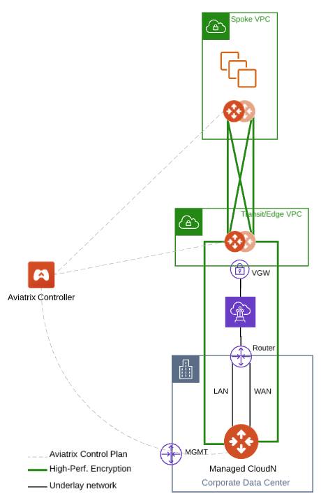
   

	 
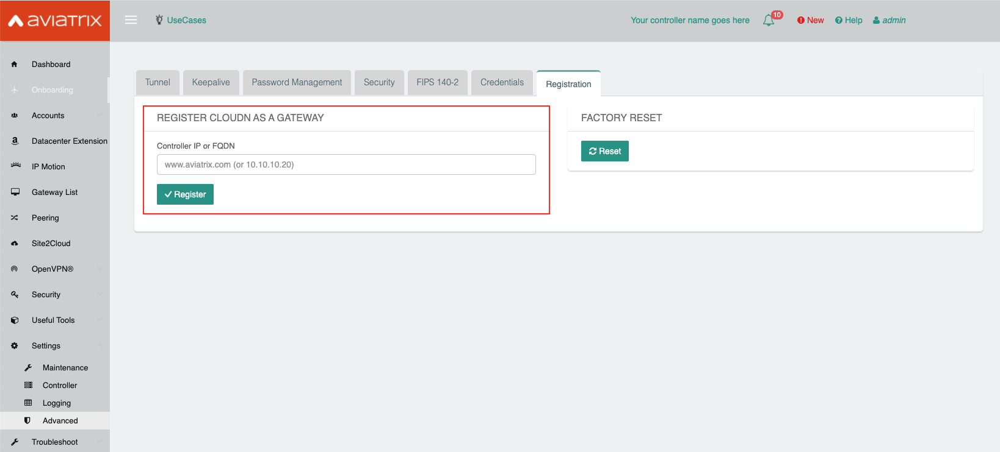
	 
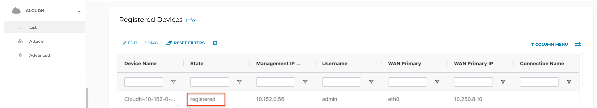

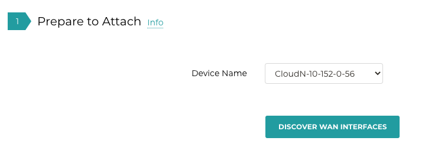

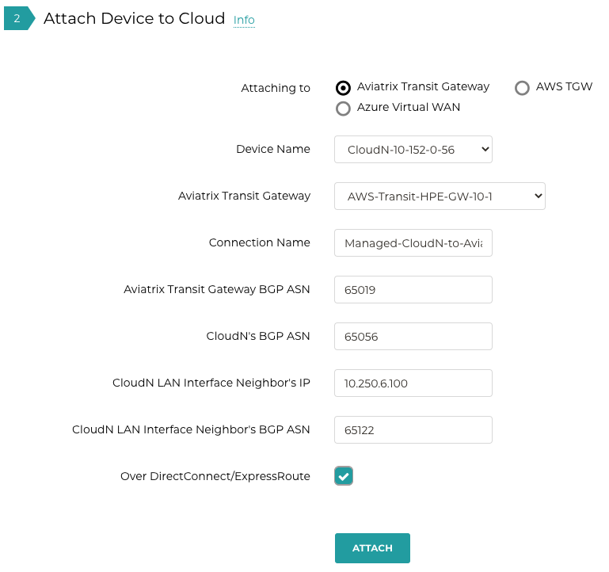

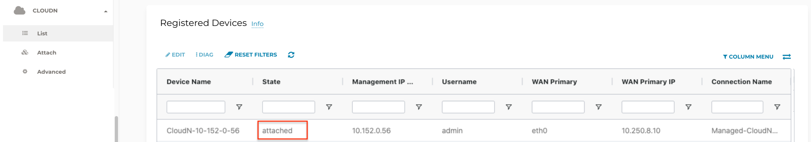

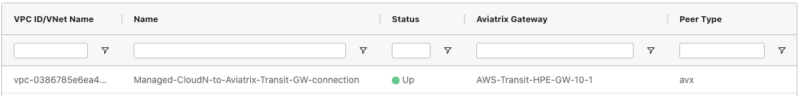

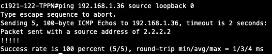

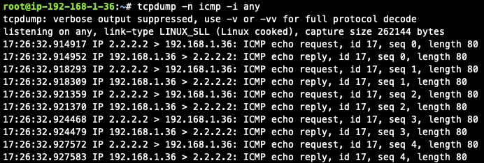
	 
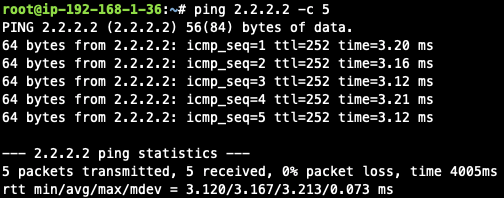

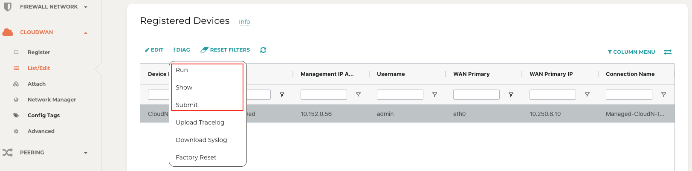

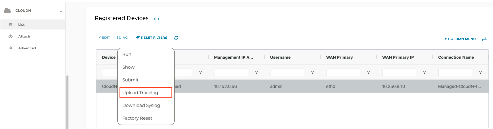

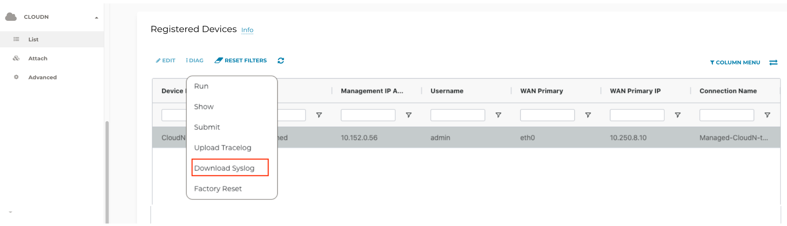

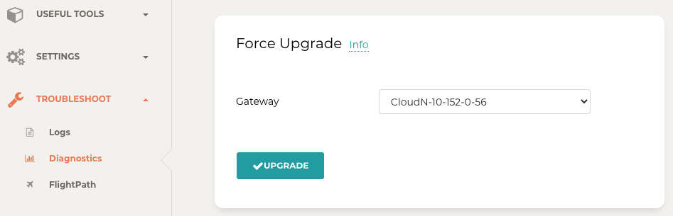

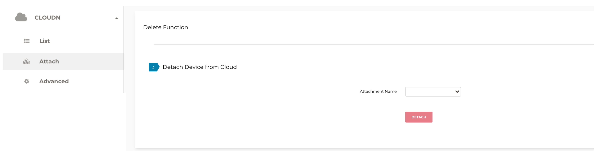

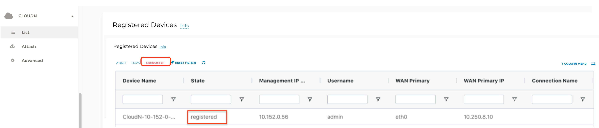

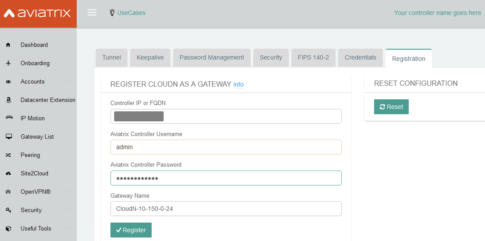

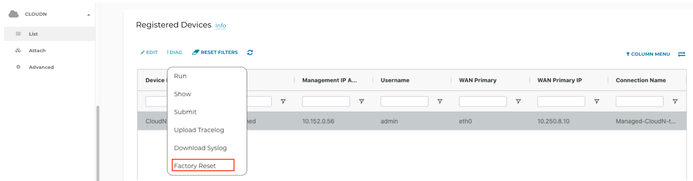

.. disqus::
