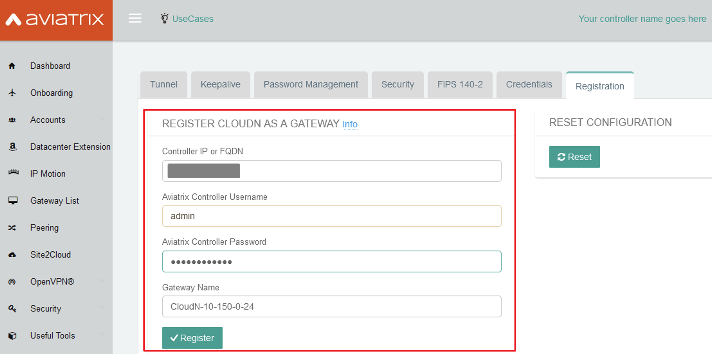
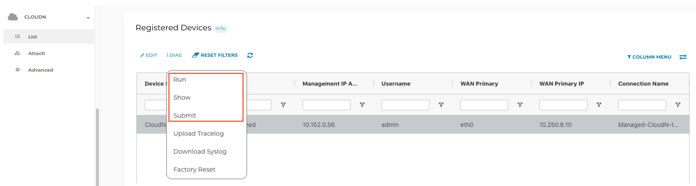

.. meta::
  :description: Global Transit Network
  :keywords: CloudN workflow, Transit hub, AWS Global Transit Network, Encrypted Peering, Transitive Peering, Insane mode, Transit Gateway, TGW, Managed CloudN

===============================================
Managed CloudN Workflows
===============================================

Introduction
============

Aviatrix CloudN hardware appliance is deployed on-prem to connect to public cloud. It provides up to 25Gbps encryption performance over AWS Direct Connect and Azure Express Route.

Aviatrix Managed CloudN enables you to manage CloudN hardware appliances by Aviatrix Controller as an `Aviatrix CloudN device <https://docs.aviatrix.com/HowTos/cloud_wan_faq.html>`_. 

Benefits:
--------------------

- Ease of use:

	- Centrally manage all CloudN appliances from Aviatrix Controller without logging into each Standalone CloudN GUI individually for ongoing configuration and operation actions.

	- Simplify connection configuration by removing manually importing S2C IPsec configuration method as in Standalone CloudN.

- Enhanced visibility and troubleshooting:

	- Perform running diagnostics, upload tracelog and upgrade on Managed CloudN device the same way as an Aviatrix Gateway. 

	- Support backup/restore function
	
- Active Mesh support:
	
	-  Managed CloudN automatically load balance traffic to both Aviatrix Transit Primary Gateway and backup gateway
	
- Scalability:

	- Support scale-out fashion to achieve higher IPsec throughput
	
.. note::

	- Managed CloudN only supports High-Performance (Insane Mode) encryption connection. It works with Aviatrix Transit Gateways with Insane Mode enabled.
	
	- This solution applies to connections over AWS Direct Connect, Azure ExpressRoute, and the Internet.
	
	- This solution applies to over GCP InterConnect starting from 6.3. 
	
	- This solution in GCP supports only one tunnel per transit gateway for over Internet scenario.

For more information and benefits about CloudN, please check out the below documents:

	`Insane Mode CloudN Deployment Checklist <https://docs.aviatrix.com/HowTos/CloudN_insane_mode.html>`_
	
	`Insane Mode Encryption FAQ <https://docs.aviatrix.com/HowTos/insane_mode.html>`_

This document describes a step-by-step Managed CloudN deployment workflow for R6.2 and later. It covers the following topics.

	- Workflow on Aviatrix CloudN
	
	- Workflow on Aviatrix Controller
	
	- Traffic Flow Verification
  
	- Troubleshooting Tips
	
	- Upgrade
	
	- Backup/Restore
  
	- Workflow on cleanup
  
	- FAQ
  
Topology
==================

	|managed_cloudn_topology|

Prerequisites
====================

1. `Order a CloudN appliance  <https://docs.aviatrix.com/HowTos/CloudN_insane_mode.html#step-2-pre-deployment-request-form>`_ and install it properly in your data center or data center provider.
2. (Optional) Create and register an FQDN Name for Aviatrix Controller public IP. This is useful if the Controller has HA configured. 
3. Remove the current connection. Skip this step if this is a brand new deployment. Remove/delete any Site2Cloud (IPsec) connection between Aviatrix Transit Gateway and Standalone CloudN if you have any in your existing Standalone CloudN deployment.
4. `Upgrade <https://docs.aviatrix.com/HowTos/inline_upgrade.html>`_ Aviatrix Controller to the latest version, at least version 6.2.
5. Deploy VPC/VNets, Aviatrix Multi-Cloud Transit Gateways, and Spoke Gateways. Follow this `step <https://docs.aviatrix.com/HowTos/transitvpc_workflow.html#launch-a-transit-gateway>`_ to launch Aviatrix Transit gateway with insane mode enabled. The recommended minimum size for Transit in AWS is c5n.4xlarge. Please refer to this `doc <https://docs.aviatrix.com/HowTos/insane_mode_perf.html>`_ for performance details.
	
* (Optional) Follow this `step <https://docs.aviatrix.com/HowTos/transitvpc_workflow.html#launch-a-spoke-gateway>`_ to launch Aviatrix Spoke gateway with insane mode enabled. The recommended minimum size for Spoke with Insane Mode in AWS is c5.2xlarge. Please refer to this `doc <https://docs.aviatrix.com/HowTos/insane_mode_perf.html>`_ for performance details. Notes: Users has option to attach non-Insane Mode Spoke gateway to Insane Mode Transit Gateway.
* (Optional) Follow this `step <https://docs.aviatrix.com/HowTos/transitvpc_workflow.html#join-a-spoke-gw-to-transit-gw-group>`_ to attach Aviatrix Spoke Gateway to Aviatrix Transit Gateway
	

.. note::
	
	In this example, Aviatrix Multi-Cloud Transit Gateway and Aviatrix Spoke Gateway with HPE are deployed in AWS platform. The workflow applies to Azure. 

Workflow on Aviatrix CloudN
=============================

Opening Controller Inbound Ports
------------------------------------------------

CloudN is deployed inside a data center. It does not require any public IP addressees. However, you need to collect the public IP for 
the management interface (The ISP provided pubic IP) and open port 443 on the Controller for that public IP.  

For AWS accounts, update the Aviatrix Controller's inbound security group to allow TCP 443 from public IP address of the router of CloudN's MGMT interface.

#. Open your AWS console and find the security group associated with Aviatrix Controller.
#. Configure an inbound security rule to allow TCP 443 from public IP address provided by the ISP where CloudN's management interface egresses to Internet.  

	.. important::

		This public IP address needs to be static.  

Configuring NTP Sync and SMTP Services
--------------------------------------------------------

#. Add a firewall rule to allow CloudN’s MGMT outbound UDP port 123 access to ntp.ubuntu.com or to a local NTP server.
#. From the CloudN UI, go to Setting > Controller > System Time. Enter ntp.ubuntu.com or a local NTP server then select the Sync option.
#. Do a manual sync to the NTP server.
#. From the CloudN UI, go to Setting > Controller > Email, Setup SMTP settings to allow CloudN to send alert email.

Logging into the CloudN GUI
----------------------------------------

#. Open a browser and navigate to the CloudN GUI with CloudN domain name/IP and port 443.
#. Sign in with your CloudN login credentials.
	
(Optional, Rare) Checking Whether CloudN Requires a Controller IP Migration
---------------------------------------------------------------------------------------------

Skip this optional step if the Controller IP address has not been changed. 

#. Navigate to Troubleshoot on the left sidebar > Diagnostics > Network.
#. Scroll down to the `Controller Public IP <https://docs.aviatrix.com/HowTos/Troubleshoot_Diagnostics.html#controller-public-ip>`_ section in the bottom right.
#. Perform `Controller IP Migration <https://docs.aviatrix.com/HowTos/Troubleshoot_Diagnostics.html#controller-ip-migration>`_ function if the message in the Controller Public IP section guides users to execute it.
	
	.. note::
	
		For private link connectivity such as AWS Direct Connect or Azure Express Route case, CloudN WAN interface is assigned a private IP, so the message in the Controller Public IP section displays the public IP of this Controller as NA. The Controller was not able to reach www.carmelonetworks.com through the WAN interface(eth0)."

Managed CloudN Management Port Outbound Access
--------------------------------------------------------------------------------------------------------------------------

You must use the specified FDQN, IP address, and ports for Managed CloudN (registered to the Controller) and Standalone CloudN (de-registered from the Controller) implementations. Please see `Required Access for External Sites <https://aviatrix.zendesk.com/hc/en-us/articles/4417312119437-Aviatrix-Products-Access-to-external-FQDN-required>`_. 

	.. note::
	
		You must be registered to access the Aviatrix Customer Support website. If you are not already registered, you can sign-up at https://support.aviatrix.com.

	You must be registered to access the Aviatrix Customer Support website. If you are not already registered, you can sign-up at https://support.aviatrix.com.

To check basic connectivity to Internet from CloudN device and to troubleshoot reachability issue to these addresses, follow the steps below. 

1. Navigate to Troubleshoot  on the left sidebar > Diagnostics > Network.
2. Find the `Network Connectivity Utility <https://docs.aviatrix.com/HowTos/Troubleshoot_Diagnostics.html#network-connectivity-utility>`_ section.
3. Enter the following information in the fields provided.
	
	+--------------+--------------------------------------------------------------------+
	| **Field**    | **Value**                                                          |
	+--------------+--------------------------------------------------------------------+
	| Hostname     | Refer to the FQDN/IP address on the Aviatrix Support webstie.      |
	+--------------+--------------------------------------------------------------------+
	| Port         | Refer to the PORT on the Aviatrix Support webstie.                 |
	+--------------+--------------------------------------------------------------------+
	| Gateway Name | Controller                                                         |
	+--------------+--------------------------------------------------------------------+
	| Protocol     | TCP                                                                |
	+--------------+--------------------------------------------------------------------+
	
4. Click **Go** to check connectivity.

Registering with Aviatrix Controller FQDN Name
-------------------------------------------------------

1. Navigate to Settings on the left sidebar > Advanced > Registration or select the **Managed CloudN under UseCases** dropdown menu on the top.
		
		|cloudn_register_controller_fqdn_link_managed_cloudn|
  
2. Open the **Register CloudN as a Gateway** section.
3. Enter the Aviatrix Controller FQDN name.
	
		|cloudn_register_controller_fqdn|
  
		.. important::

			It is highly recommended to register CloudN with Aviatrix Controller’s FQDN name instead of its IP address for allowing Controller HA operation (allows the controller to be assigned to a different IP address).

			When your Aviatrix Controller's FQDN is mapped to a private IP address, make sure that CloudN’s MGMT primary DNS server or secondary DNS server can resolve the FQDN to its private IP address.

			Registering CloudN to Aviatrix Controller via private networks is not a fully supported scenario; please discuss this with the Aviatrix team during the planning phase before you finalize the design for the Managed CloudN deployment. 
	
4. Enter Aviatrix Controller Username/Password with an admin user credential (any users in admin RBAC Groups).
5. Enter the Gateway Name to represent this CloudN device.
6. Click **Register.**
7. Click **OK** to confirm. Wait about 40-60 seconds to complete the registration process.

Workflow on Aviatrix Controller
=======================================

1. Log in to the Aviatrix Controller.
2. Check if a Managed CloudN device is connected to Aviatrix Controller properly. Navigate to CloudN > List/Edit and search for the Managed CloudN device. Make sure it is displayed as "registered" in the State column.
	
		|controller_managed_cloudn_registered_state|
	
(Optional) Discover a Managed CloudN Device WAN Interface
---------------------------------------------------------------------------------

This step is for building connections over the Internet. If you are building connections over Direct Connect or ExpressRoute, proceed to the next step.

1. Navigate to CloudN > Attach and find the 1. Find the Attach section.
2. Select the Managed CloudN device.
3. Click **Discover WAN Interfaces**.
	
|controller_discover_wan_interfaces|	
		
4. Select the WAN interface in the dropdown menu.
5. Update the WAN primary interface and IP if needed.
6. Click **Apply**.

Attaching Managed CloudN
-----------------------------------------

This step follows the instructions at `Attach a CloudN device to Aviatrix Transit Gateway <https://docs.aviatrix.com/HowTos/cloud_wan_workflow.html#option-1-attach-to-an-aviatrix-transit-gateway>`_.

1. Navigate to CloudN > Attach.
2. Scroll down to 2. Attach Device to Cloud.
3. Select the **Aviatrix Transit Gateway** radio button.
4. Enter the following information in the fields below.

+-----------------------------------------+------------------------------------------------------------------------------------------+
| **Field**                               | **Value**                                                                                |
+-----------------------------------------+------------------------------------------------------------------------------------------+
| Device Name                             | Select the Managed CloudN device                                                         |
+-----------------------------------------+------------------------------------------------------------------------------------------+
| Aviatrix Transit Gateway                | Select an Aviatrix Transit Gateway                                                       |
+-----------------------------------------+------------------------------------------------------------------------------------------+
| Connection Name                         | A unique name for the connection (i.e. Managed-CloudN-to-Aviatrix-Transit-GW-connection) |
+-----------------------------------------+------------------------------------------------------------------------------------------+
| Aviatrix Transit Gateway BGP ASN        | Only BGP is supported. Enter BGP ASN number on Aviatrix Transit Gateway. (i.e. 65019)    |
+-----------------------------------------+------------------------------------------------------------------------------------------+
|Device's BGP ASN                         | Only BGP is supported. Enter BGP ASN number on the Managed CloudN device. (i.e. 65056)   |
+-----------------------------------------+------------------------------------------------------------------------------------------+
| Algorithms                              | Leave this checkbox unmarked.                                                            |
+-----------------------------------------+------------------------------------------------------------------------------------------+
| Enable Global Accelerator               | Check the box to enable AWS Global Accelerator for the branch router to hop onto the     |
|                                         | nearest AWS edge and traverse the AWS backbone to get to the Aviatrix Transit Gateway.   |
+-----------------------------------------+------------------------------------------------------------------------------------------+
| Pre-shared key                          | Leave this checkbox unmarked.                                                            |
+-----------------------------------------+------------------------------------------------------------------------------------------+
| Local Tunnel IP                         | Leave this checkbox unmarked.                                                            |
+-----------------------------------------+------------------------------------------------------------------------------------------+
| Remote Tunnel IP                        | Leave this checkbox unmarked.                                                            |
+-----------------------------------------+------------------------------------------------------------------------------------------+

5. Click **Attach.**
		
		|controller_attach_aviatrix_transit|

Check Whether the Managed CloudN Device is Attached to Aviatrix Transit Gateway Properly 
------------------------------------------------------------------------------------------------------------------

#. Navigate to CloudN > List/Edit.
#. Search for the Managed CloudN device.
#. Check the state is displayed as "attached" in the State column.
	
		|controller_managed_cloudn_attached_state|
	
.. note::

	The status "attached" here reflects only the management operation state, it does not reflect the attached connection state in real time. Please go to Site2Cloud page to monitor the connection status as shown below.
		
Check Whether the Connection Status is Up
--------------------------------------------------------

#. Navigate to Site2Cloud > Setup.
#. Locate the connection which is created in the previous step (i.e. Managed-CloudN-to-Aviatrix-Transit-GW-connection).
#. Check whether the connection status is Up as in the example below.
	
|controller_managed_cloudn_s2c_up_state|		
		
Check Transit Gateway BGP status
-------------------------------------------

#. Navigate to Multi-Cloud Transit > Advanced Config > BGP.
#. Locate the connection which is created in the previous step (i.e. Managed-CloudN-to-Aviatrix-Transit-GW-connection).
#. Check whether the Neighbor Status is established.

Traffic Flow Verification
=========================

Traffic Flow Verification example was exercised after S2C connection(s) is up and BGP connection(s) is established. The on-premise router is Cisco IOS with network loopback address 2.2.2.2/32. Aviatrix Transit VPC/VNet is 10.1.0.0/16. Aviatrix Spoke VPC/VNet is 192.168.1.0/24 and the private IP of the testing VM is 192.168.1.36/32.

	- Traffic from on-premise router Cisco IOS to cloud VM

		- Issue ICMP traffic from on-prem loopback interface to a Virtual IP of cloud instance

			|managed_cloudn_traffic_flow_verification_on_prem_router_issue_icmp|

		- Execute packet capture on the cloud instance

			|managed_cloudn_traffic_flow_verification_cloud_vm_tcpdump_icmp|

	- Traffic from cloud VM to on-premise router Cisco IOS

		- Issue ICMP traffic from cloud instance to on-prem loopback interface address

			|managed_cloudn_traffic_flow_verification_cloud_vm_issue_icmp|

Troubleshooting Tips
====================

When an CloudN registers with an Aviatrix Controller properly as a Managed CloudN device, users can perform troubleshooting on a Managed CloudN device the same way as 
an Aviatrix Gateway in the cloud via Aviatrix Controller GUI. 

.. note::
	
	Direct access to CloudN's local HTTPs URL/UI is still allowed for only Troubleshoot/Diagnostic reasons; access to any other menu items is not recommended nor supported.

Running Diagnostics
--------------------
	
#. Navigate to CloudN > List/Edit in the Aviatrix Controller.
#. Search for the Managed CloudN device and select it.
#. Click **Diag** to display a dropdown menu.
#. Click **Run**.
#. Wait for a couple of minutes to complete the running diagnostics process.
#. Click **Show** to display the report.
#. Click **Submit** to upload the report to Aviatrix Support.
	
|controller_troubleshooting_tips_running_diagnostics|

Upload Tracelog
---------------------------

#. Navigate to CloudN on the left sidebar > List/Edit.
#. Search for the Managed CloudN device and select it.
#. Click **Diag** to display a dropdown menu.
#. Click **Upload Tracelog** to upload tracelog to Aviatrix Support.
	
|controller_troubleshooting_tips_upload_tracelog|

Download syslogs
-------------------------

#. Navigate to CloudN on the left sidebar > List/Edit.
#. Search for the Managed CloudN device and select it.
#. Click **Diag** to display dropdown menu.
#. Click on the button **Download Syslog**.
	
|controller_troubleshooting_tips_download_syslogs|

Force Upgrade
-------------------------
See `Force Upgrade doc <https://docs.aviatrix.com/HowTos/Troubleshoot_Diagnostics.html#force-upgrade>`_.
	
#. In the Aviatrix Controller, navigate to Troubleshoot on the left sidebar > Diagnostics > Gateway.
#. Open the Force Upgrade section.
#. Select the Managed CloudN device on the Gateway dropdown menu.
#. Click **Upgrade** to force upgrade the Managed CloudN device.
	
|controller_troubleshooting_tips_force_upgrade|

Upgrade
=======

When a CloudN registers with an Aviatrix Controller properly as a Managed CloudN device, the upgrade process on the Managed CloudN device is treated the same way 
as an Aviatrix Gateway in the cloud when Aviatrix Controller is upgraded. Please refer to `Inline Software Upgrade doc <https://docs.aviatrix.com/HowTos/inline_upgrade.html>`_ for upgrading a Managed CloudN device from Aviatrix Controller.

.. important::
	
	* Once CloudN is registered to the Aviatrix Controller, if you wish to check the version of Managed-CloudNs, please go to Aviatrix controller > Settings > Maintenance > Upgrade > Gateway Upgrade Status. However, the software version you see from CloudN GUI locally would not change, and it stays with the version at the time when you register CloudN to Aviatrix controller.
	
	* With Managed CloudN, software upgrading directly from CloudN GUI is no longer needed, unless unexpected issues occur. In such case, please open a support ticket at `Aviatrix Support Portal <https://support.aviatrix.com>`_.
	
	

|correct_place_to_check_cloudN_version|
	

Backup/Restore
==============

When a CloudN registers with an Aviatrix Controller properly as a Managed CloudN device, the backup/restore process on the Managed CloudN device is processed the same way as an 
Aviatrix Gateway in the cloud when the backup/restore function is performed on Aviatrix Controller. Please see the `Controller Backup and Restore doc <https://docs.aviatrix.com/HowTos/controller_backup.html>`_ for details.

.. note::

	Performing backup/restore function for Managed CloudN device via CloudN GUI is not supported.

Workflow on Cleanup
===================

Detach a Managed CloudN device from Aviatrix Controller
------------------------------------------------------------------------------

Follow these steps to detach a Managed CloudN device from the Aviatrix Controller. 

#. In your Aviatrix Controller, navigate to CloudN on the left sidebar > Attach. 
#. Scroll down to Delete Function > 3 > Detach Device from Cloud.
#. Select the connection from the Attachment Name dropdown menu.
#. Click **Detach** to disconnect the connection.
	
	|controller_cloudwan_detach|

Note that you can also deregister devices by navigating to CloudN on the left sidebar > List, selecting the connection from the list of Registered Devices, and clicking **Deregister**.
	
|controller_cloudwan_deregister|

	.. note::

		If these steps cannot convert a Managed CloudN device back to a Standalone CloudN state properly, please proceed to the Reset Configuration section.

Workflow on Reset Configuration
---------------------------------------------

The Reset Configuration feature enables users to remove all configuration on a Managed CloudN device from a corrupted state to a clean state. Please follow the steps below in the Resetting Configuration section.
This Reset Configuration feature is the last resort if users are not able to convert a Managed CloudN device back to a Standalone CloudN state through the steps above.

Resetting Configuration
^^^^^^^^^^^^^^^^^^^^^^^^

#. In your Aviatrix Controller, navigate to CloudN on the left sidebar > List/Edit.
#. Search for the Managed CloudN device and select it
#. Click **Diag** to display dropdown menu.
#. Click **Reset Configuration**. Wait for a few minutes for the process to complete.
	
	|controller_cloudwan_factory_reset|
	
	.. note::
	
		Normally, when users reset a configuration, the Aviatrix Controller notifies Managed CloudN to perform this function. If Managed CloudN does not reset the configuration properly through the Aviatrix Controller, users need to execute the step below.
	
(Optional) Perform feature "Reset Configuration" on CloudN GUI 
^^^^^^^^^^^^^^^^^^^^^^^^^^^^^^^^^^^^^^^^^^^^^^^^^^^^^^^^^^^^^^^^^^

Use the following steps to reset a device's configuration if you are unable to do so through your Aviatrix Controller.

1. Open a browser and navigate to the CloudN GUI with CloudN domain name/IP and port 443.
3. Sign in and navigate to Settings > Advanced > Registration or select **Managed CloudN** under UseCases dropdown menu on the top/
		
		|cloudn_register_controller_fqdn_link_managed_cloudn|
  
3. Find the Reset Configuration section and click **Reset**. Wait a few minutes for the process to complete.
  
	|cloudn_factory_reset|	
	
	.. important::
	
		If you need any assistance to reset a configuration, please open a support ticket at `Aviatrix Support Portal <https://support.aviatrix.com>`_.

User Guide for Redundant DX Deployment
======================================

Active/Active
-------------

|deployment_dual_dx_aa|

The `Active/Active deployment model <https://docs.aviatrix.com/HowTos/CloudN_insane_mode.html#redundant-dx-deployment-active-active>`_ is recommended. In this deployment
model, both CloudN appliances forward traffic and the underlying network links are fully utilized. 

.. important::
	
	Aviatrix topology requirements:
	
		- Attach two CloudN appliances to Aviatrix Transit by following the workflows above.
		
		- Enable `BGP ECMP function <https://docs.aviatrix.com/HowTos/transit_advanced.html#bgp-ecmp>`_ on Aviatrix Transit.
		
	On-prem topology requirements:
	
		- If firewalls are deployed, make sure there is no asymmetric routing issues or the firewalls are capable of handling asymmetric routing issues. 
		
		- LAN routers should advertise the same AS path length to both CloudN appliances and enable ECMP feature. 

Active/Standby
--------------

|deployment_dual_dx|

Aviatrix solution supports `Active/Standby deployment model <https://docs.aviatrix.com/HowTos/CloudN_insane_mode.html#redundant-dx-deployment-active-standby>`_, but one of the CloudN appliances and network connections stays at standby/idle mode.

To deploy this topology, on-prem LAN router must advertise **longer BGP AS_PATH** to the Standby CloudN  to ensure traffic direction from cloud to on-prem always routes to the Active CloudN when the connection is up. Once the connection on the Active CloudN is down, traffic will be directed towards the Standby CloudN based on BGP info. When the Active CloudN is recovered, traffic will switch back to the Active CloudN as it has **shorter BGP AS_PATH** length.

Users can utilize `Connection AS Path Prepend <https://docs.aviatrix.com/HowTos/transit_advanced.html#connection-as-path-prepend>`_ for the traffic direction from on-prem to cloud depending on requirement.

FAQ
====

Q: What is the terminology of Standalone CloudN and Managed CloudN?

Ans: In this document, the term "Standalone CloudN" refers to a CloudN device is not managed by an Aviatrix Controller; "Managed CloudN" refers to a CloudN device that is registered/managed by an Aviatrix Controller.

Q: Could a Managed CloudN be converted back to a Standalone CloudN?

Ans: Yes. While this is not recommended practice, you should be able to convert a Managed CloudN device back to a Standalone CloudN by following the `Workflow on cleanup <https://docs.aviatrix.com/HowTos/CloudN_workflow.html#workflow-on-cleanup>`_.

Q: Does Managed CloudN have Aviatrix High-Performance (Insane) mode supported?

Ans: Yes. When a Managed CloudN device attaches to an Aviatrix Transit gateway with HA function enabled, High-Performance (Insane) mode tunnels to both primary and backup transit gateways are built automatically.

Q: Can Managed CloudN solution support Azure ExpressRoute?

Ans: Yes, Managed CloudN runs over Azure ExpressRoute. 

Q: Can we build a mixed topology in the deployment where some connections are from Managed CloudN and others are from Standalone CloudN in one CloudN appliance? 

Ans: No. We don't support this mixed topology. Once you decide to deploy Managed CloudN solution, you need to make sure there is no IPsec tunnel between Aviatrix Transit Gateway and Standalone CloudN before registering the Standalone CloudN to Aviatrix Controller.

Q: Can one Standalone/Managed CloudN appliance connect to multiple links Direct Connect or ExpressRoute?

Ans: Yes. A CloudN appliance can build multiple of HPE connections to different Aviatrix Transit Gateways over multiple Direct Connect or ExpressRoute.

Q: Can one Aviatrix Transit Gateway connect to multiple of Managed CloudNs?

Ans: Yes. An Aviatrix Transit Gateway can build multiple of HPE connections to different Managed CloudNs.

Q: Can one Aviatrix Transit Gateway build mixed connections to different Standalone CloudN and Managed CloudN?

Ans: Yes. While this is not recommended practice, an Aviatrix Transit Gateway is able to build mixed connections to different Standalone CloudN and Managed CloudN. This deployment is for migration stage only.

Q: How to update the new Aviatrix Controller public IP for Managed CloudN?

Ans:

- Refer to `step 2.6 Register with Aviatrix Controller FQDN Name <https://docs.aviatrix.com/HowTos/CloudN_workflow.html#step-2-6-register-with-aviatrix-controller-fqdn-name>`_.

1. Navigate to Settings > Advanced > Registration or select **Managed CloudN** under the UseCases dropdown menu on the top on CloudN GUI.
2. Find the Register CloudN as a Gateway section and enter the new Aviatrix Controller public IP.

	.. important::

		It is highly recommended that a FQDN name is used instead of an IP address for enhanced security and controller HA.

3. Click **Register**.
4. Click **OK**.

Q: How do I migrate a Standalone CloudN to a Managed CloudN?

Ans:

- `Upgrade <https://docs.aviatrix.com/HowTos/inline_upgrade.html>`_ Aviatrix Controller and CloudN appliance to the latest version.

	.. note::
	
		From Release 6.6a and onwards, to register CloudN with the Controller as Managed CloudN does not require to upgrade CloudN applicance to the Controller version.

- Remove/delete any Site2Cloud (IPsec) connection between a Aviatrix Transit Gateway and Standalone CloudN.

- Follow `Managed CloudN Workflows <https://docs.aviatrix.com/HowTos/CloudN_workflow.html#managed-cloudn-workflows>`_.

.. |managed_cloudn_topology| image:: CloudN_workflow_media/managed_cloudn_topology.png
   :scale: 80%
   
.. |cloudn_register_controller_fqdn_link_managed_cloudn| image:: CloudN_workflow_media/cloudn_register_controller_fqdn_link_managed_cloudn.png
   :scale: 80%	 
	 

	 
.. |controller_managed_cloudn_registered_state| image:: CloudN_workflow_media/controller_managed_cloudn_registered_state.png
   :scale: 50%

.. |controller_discover_wan_interfaces| image:: CloudN_workflow_media/controller_discover_wan_interfaces.png
   :scale: 60%

.. |controller_attach_aviatrix_transit| image:: CloudN_workflow_media/controller_attach_aviatrix_transit.png
   :scale: 60%

.. |controller_managed_cloudn_s2c_up_state| image:: CloudN_workflow_media/controller_managed_cloudn_s2c_up_state.png
   :scale: 60%

.. |managed_cloudn_traffic_flow_verification_on_prem_router_issue_icmp| image:: CloudN_workflow_media/managed_cloudn_traffic_flow_verification_on_prem_router_issue_icmp.png
   :scale: 100%

.. |managed_cloudn_traffic_flow_verification_cloud_vm_tcpdump_icmp| image:: CloudN_workflow_media/managed_cloudn_traffic_flow_verification_cloud_vm_tcpdump_icmp.png
   :scale: 100%
	 
.. |managed_cloudn_traffic_flow_verification_cloud_vm_issue_icmp| image:: CloudN_workflow_media/managed_cloudn_traffic_flow_verification_cloud_vm_issue_icmp.png
   :scale: 100%

.. |controller_troubleshooting_tips_force_upgrade| image:: CloudN_workflow_media/controller_troubleshooting_tips_force_upgrade.png
   :scale: 50%

.. |deployment_dual_dx| image:: insane_mode_media/deployment_dual_dx.png
   :scale: 30%

.. |deployment_dual_dx_aa| image:: insane_mode_media/deployment_dual_dx_aa.png
   :scale: 30%
   

    
.. disqus::
