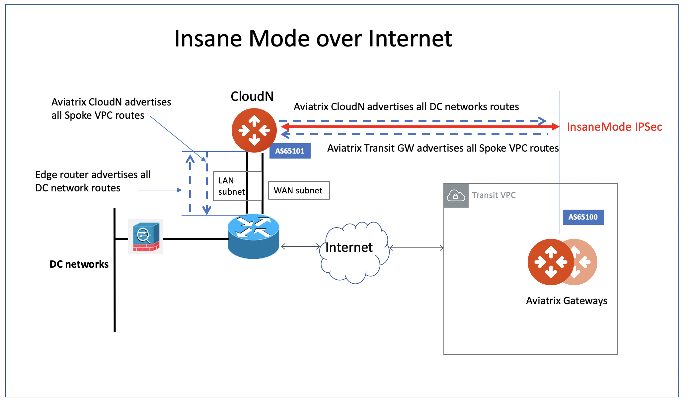

.. meta::
  :description: Global Transit Network
  :keywords: CloudN workflow, Transit hub, AWS Global Transit Network, Encrypted Peering, Transitive Peering, Insane mode, Transit Gateway, TGW

===============================================
Connecting a CloudN Workflow
===============================================

This document describes CloudN deployment workflow for R6.1 and later. 

.. |tunnel_diagram| image:: insane_mode_media/tunnel_diagram.png
   :scale: 30%

.. |insane_tunnel_diagram| image:: insane_mode_media/insane_tunnel_diagram.png
   :scale: 30%

.. |insane_transit| image:: insane_mode_media/insane_transit.png
   :scale: 30%

.. |insane_datacenter| image:: insane_mode_media/insane_datacenter.png
   :scale: 30%

.. |datacenter_layout| image:: insane_mode_media/datacenter_layout.png
   :scale: 30%

.. |deployment| image:: insane_mode_media/deployment.png
   :scale: 30%

.. |deployment_ha| image:: insane_mode_media/deployment_ha.png
   :scale: 30%

.. |deployment_internet| image:: insane_mode_media/deployment_internet.png
   :scale: 30%

.. |deployment_dual_dx| image:: insane_mode_media/deployment_dual_dx.png
   :scale: 30%

.. |deployment_dual_dx_aa| image:: insane_mode_media/deployment_dual_dx_aa.png
   :scale: 30%
   
.. |ISR-sample-config| image:: insane_mode_media/ISR-sample-config.png
   :scale: 50%

.. |insane_routing| image:: insane_mode_media/insane_routing.png
   :scale: 30%

.. |insane_mode_howto_dx| image:: insane_mode_media/insane_mode_howto_dx.png
   :scale: 30%

.. |InsaneBeta| image:: insane_mode_media/InsaneBeta.png
   :scale: 30%

.. disqus::
