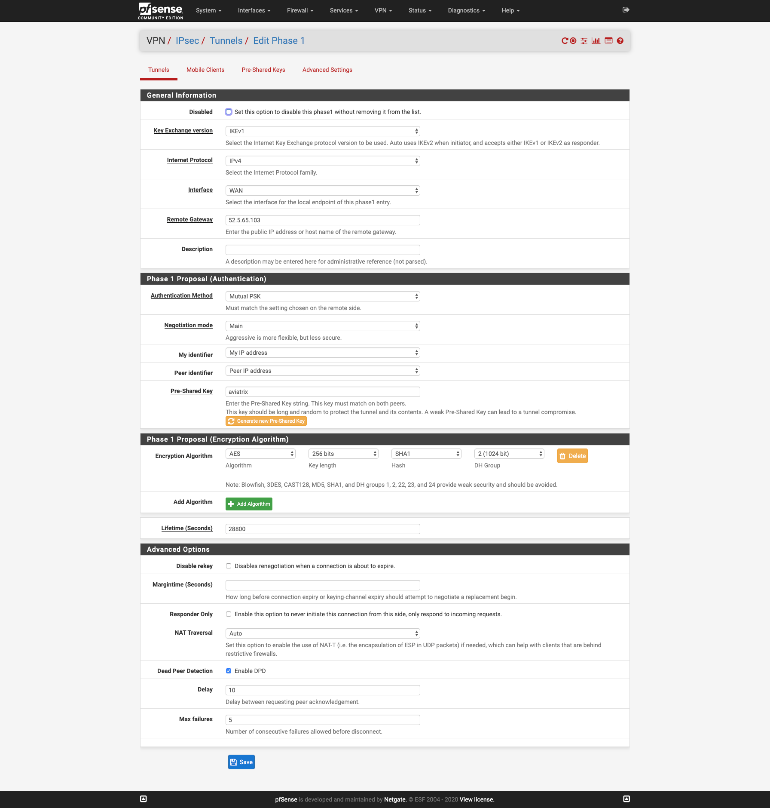
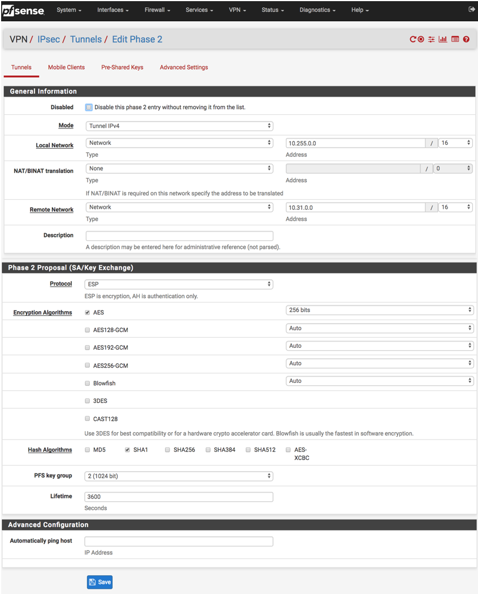

.. meta::
   :description: Site2Cloud (Aviatrix Gateway - pfSense)
   :keywords: pfsense, aviatrix, site2cloud

.. role:: orange

.. raw:: html

   

=====================================================================
Aviatrix Gateway to pfSense
=====================================================================

Overview
----------------

This document describes how to configure an IPsec tunnel between an Aviatrix Gateway and a pfSense firewall using Aviatrix Site2Cloud.

Adding a Site2Cloud Tunnel in Aviatrix Controller
------------------------------------------------------------
1. Log in to your Aviatrix Controller.
2. Select Site2Cloud on the left navigation bar.
3. Click **+ Add New** near the top of the Site2Cloud tab.
4. Under Add a New Connection, enter the following:

  +-------------------------------+------------------------------------------+
  | Field                         | Expected Value                           |
  +===============================+==========================================+
  | VPC ID / VNet Name            | Select the VPC/VNet where this tunnel    |
  |                               | will terminate in the cloud.             |
  +-------------------------------+------------------------------------------+
  | Connection Type               | Unmapped unless there is an              |
  |                               | overlapping CIDR block.                  |
  +-------------------------------+------------------------------------------+
  | Connection Name               | Name this connection.  This connection   |
  |                               | represents the connectivity to the       |
  |                               | edge device.                             |
  +-------------------------------+------------------------------------------+
  | Remote Gateway Type           | Generic                                  |
  +-------------------------------+------------------------------------------+
  | Tunnel Type                   | UDP                                      |
  +-------------------------------+------------------------------------------+
  | Algorithms                    | Unmark this checkbox                     |
  +-------------------------------+------------------------------------------+
  | Encryption over ExpressRoute/ | Unmark this checkbox                     |
  | DirectConnect                 |                                          |
  +-------------------------------+------------------------------------------+
  | Enable HA                     | Unmark this checkbox                     |
  +-------------------------------+------------------------------------------+
  | Primary Cloud Gateway         | Select the Gateway where the tunnel will |
  |                               | terminate in this VPC/VNet.              |
  +-------------------------------+------------------------------------------+
  | Remote Gateway IP Address     | IP address of the pfSense device.        |
  +-------------------------------+------------------------------------------+
  | Pre-shared Key                | Optional.  Enter the pre-shared key for  |
  |                               | this connection.  If nothing is entered  |
  |                               | one will be generated for you.           |
  +-------------------------------+------------------------------------------+
  | Remote Subnet                 | Enter the CIDR representing the network  |
  |                               | behind the edge device that this tunnel  |
  |                               | supports.                                |
  +-------------------------------+------------------------------------------+
  | Local Subnet                  | The CIDR block that should be advertised |
  |                               | on pfSense for the cloud network (will   |
  |                               | default to the VPC/VNet CIDR block)      |
  +-------------------------------+------------------------------------------+

5. Click **OK**.

Creating an IPsec Tunnel in pfSense
---------------------------------------------

1. Log in to your pfSense dashboard.
2. In the VPN menu, select **IPsec**.
3. Click **+ Add P1**.
4. Populate the fields according to your preferences. The important fields are (with :orange:`extra emphasis` on a few key fields):

   *General Information*

   +-------------------------------+------------------------------------------+
   | Field                         | Expected Value                           |
   +===============================+==========================================+
   | Key exchange version          | IKEv1                                    |
   +-------------------------------+------------------------------------------+
   | Remote Gateway                | Enter the public IP address of the       |
   |                               | Aviatrix Gateway here.                   |
   +-------------------------------+------------------------------------------+

   *Phase 1 Proposal*

   +-------------------------------+------------------------------------------+
   | Field                         | Expected Value                           |
   +===============================+==========================================+
   | Authentication Method         | Mutual PSK                               |
   +-------------------------------+------------------------------------------+
   | My identifier                 | My IP address                            |
   +-------------------------------+------------------------------------------+
   | :orange:`Peer identifier`     | :orange:`IP address. Enter the Public`  |
   |                               | :orange:`IP address of the remote`       |
   |                               | :orange:`Aviatrix Gateway`               |
   +-------------------------------+------------------------------------------+
   | Pre-Shared Key                | Enter the PSK from the Site2Cloud tunnel |
   |                               | creation step.                           |
   +-------------------------------+------------------------------------------+

   *Phase 1 Proposal (Algorithms)*

   +-------------------------------+------------------------------------------+
   | Field                         | Expected Value                           |
   +===============================+==========================================+
   | Encryption Algorithm          | AES - 256 bits                           |
   +-------------------------------+------------------------------------------+
   | Hash Algorithm                | SHA1                                     |
   +-------------------------------+------------------------------------------+
   | DH Group                      | 2 (1024 bit)                             |
   +-------------------------------+------------------------------------------+

   *Advanced Options*

   +-------------------------------+------------------------------------------+
   | Field                         | Expected Value                           |
   +===============================+==========================================+
   | Disable rekey                 | :orange:`Unchecked`                      |
   +-------------------------------+------------------------------------------+

   |imageExamplePfSenseConfiguration|

5. Click **Save**.
6. Add a Phase 2 entry.
   |imageExamplePfSensePhase2Config|

7. Save the Phase 2 entry.

8. Test to make sure the tunnel is up.

.. disqus::
