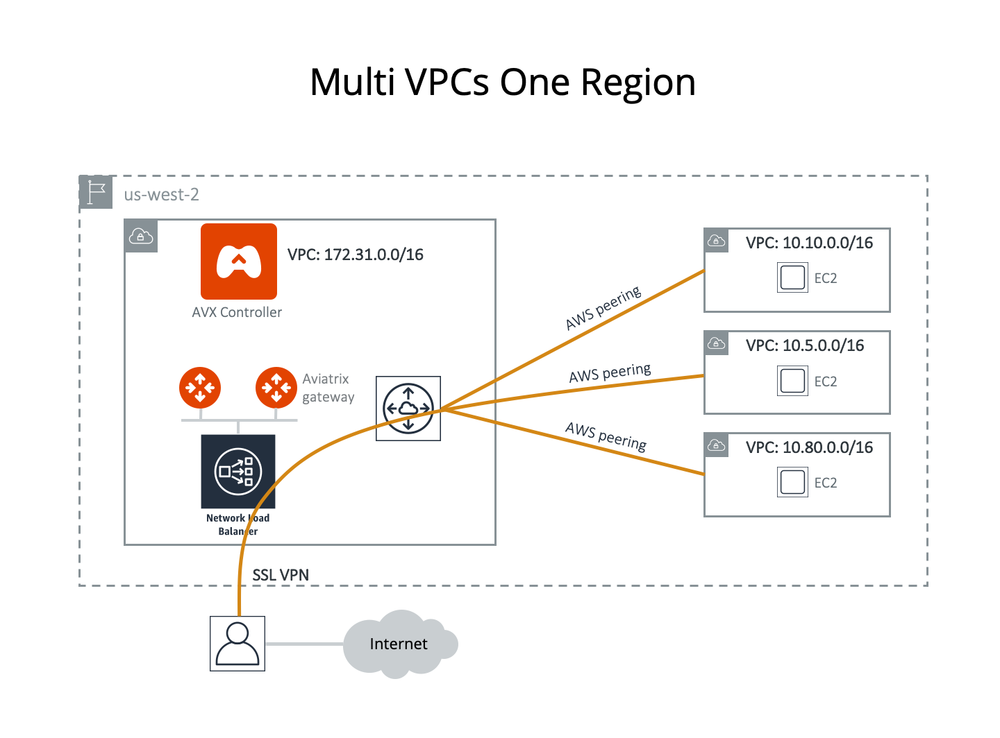

.. meta::
  :description: Cloud Networking Ref Design
  :keywords: cloud networking, aviatrix, multi VPC, VPC peering, OpenVPN, remote user VPN, remote VPN

.. Note:: This guide references AWS for illustration purposes and also applies to Azure (VNet) and Google (VPC).
..

===================================================
OpenVPN® Design for Multi-Accounts and Multi-VPC/VNets
===================================================

This reference design helps you build an end-to-end secure cloud
network, from accessing the network (AWS VPC, Azure VNet, or GCP VPC) by users to routing
packets among the VPC/VNets, such that once a user is connected via VPN, she
can access any private resources in the cloud no matter where that
resource is.

There are three use cases covered, from simple to more complex ones. You can
read and decide which one suits you or combine parts from different ones
to create a network that meet your requirements. You can easily build a
full-mesh network.

Multiple VPC/VNets in One Region 
==============================

The network you have in mind is shown below where all VPC/VNets are in the
same region. The Aviatrix Controller instance can be in the same VPC/VNet or a
different VPC/VNet.

|image0|

Assume you have created 4 VPC/VNets in the same region (us-west-2 in this
case). You would like to use the VPC/VNet with CIDR 172.31.0.0/16 to host gateways
where users connect to. After a user connects to this VPC/VNet via SSL VPN,
she should be able to access any instances in the other VPC/VNets as long as
her profile allows, without having to connect to each VPC/VNet with SSL VPN.

Another requirement is split tunnel mode, that is, only traffic destined
to the cloud goes through the SSL tunnel. If a user does general browsing
on the Internet or watches movies from Hulu, traffic should be routed via
WI-FI to ISP to Internet. You do not wish to pay AWS for this type of
compute and network cost.

Configuration Workflow
---------------------------------

Tips: Hover your cursor over the fields to see their definitions. Do a software upgrade
if an upgrade alert message appears on your dashboard page.

The description in the steps below provides critical fields you need to
select; it may not include all fields. Make sure you have the correct
VPC/VNet ID and its region for the VPC/VNet ID field and region in each step.

1. Launch a gateway with VPN capability in VPC 172.31.0.0/16.

* Go to the Gateway menu and create a gateway. 
* At the Gateway Name field, enter a distinct and convenient name. For
      example, mgmt-vpn-1.
* Select **VPN Access**. Selecting features in the Advanced Options section is not required. Selecting Split Tunnel Mode is not required.
* Select **Save Template**, if you wish to do so. This template saves you from entering
      repeated fields if you wish to create more gateways with the same
      configuration.

2. Repeat Step 1 to create more gateways with VPN enabled. Note that each
   gateway must have a different VPN CIDR Block and name. You may select
   different AZs for the Public Subnet field.

3. Configure AWS or Azure peering.

* Go to Peering > AWS Peering for AWS or Peering > Azure Peering for Azure. Click **New Peering**.
* For Peer1, select the Account Name, Region, and VPC ID of one of the gateways created.
* Do the same for Peer2.
* Click **OK**. If the new peering does not show up under the list of peerings below the popup, click **refresh**.
* Repeat the above steps as many times as necessary for the gateways you created.

4. Add Users and Profiles.

* Go to OpenVPN® > Profiles to create as many profiles as you
      please. The target field can be FQDN (DNS names or fully qualified
      domain name).
* Go to OpenVPN® > VPN > VPN Users to add more users.
      Associate each user with a profile. Note that if no profile is
      associated, the user has full access to all resources. When a user is
      added to the database, an email with a .ovpn file or .onc (for
      Chromebooks) will be sent to the user with detailed instructions.

5. Launch VPN connections from remote users to VPC/VNet1 (172.31.0.0/16).
   Once the SSL VPN connection is established, this VPN user should be
   able to reach all instances (in all VPC/VNets) to which he/she has access
   permission.

Multiple VPC/VNets in Multi-Regions, Split Tunnel
============================================

The network you have in mind is shown below where VPC/VNets are in different
regions. The Aviatrix Controller instance can be in the same or a
different VPC/VNet.

|image1|

In this example, Aviatrix encrypted peering is used for connecting to remote VPCs. You can also use AWS peering/Azure peering to accomplish the task.

Assume you have created 4 VPC/VNets. You would like to use the VPC/VNet with CIDR
172.31.0.0/16 in us-west-2 to host gateways where users connect to.
After a user connects to this VPC/VNet via SSL VPN, she should be able to
access any instances in the other VPC/VNets as long as her profile allows,
without having to connect to each VPC/VNet with SSL VPN.

Another requirement is split tunnel mode, that is, only traffic
originating from the user and destined to resources in VPC/VNets is routed
through the SSL VPN tunnel. The traffic to the Internet will be routed through
ISP instead of SSL VPN tunnel.

Configuration Workflow
----------------------------------

Tips: Hover your cursor over the fields to see their definitions. The description in
each step does not include all fields. Make sure you have the correct
VPC/VNet ID and its region for the VPC ID field and region in each step.

1. Launch a gateway with VPN capability in VPC 172.31.0.0/16.

* Go to the Gateway menu and click **Create**.
* At the Gateway Name field, enter a distinct and convenient name. For
      example, mgmt-vpn-1.
* Select VPN Access.
* Use the default VPN CIDR Block.
* Select Split Tunnel mode.

      |      i.  For the Additional CIDRs field under Split Tunnel, enter other
                VPC/VNet or any network CIDRs you wish to reach beyond the VPC/VNet
                you are connecting to. In the example shown, you should enter
                10.10.0.0/16,10.5.0.0/16,10.80.0.0/16. It is a good idea to do
                some planning to include future VPC/VNets or network address
                ranges. (In a case where you never have to worry about
                connecting to your corporate VPN, you may consider entering the
                entire private network address range in the Additional CIDRs
                range field, separated by commas:
                172.16.0.0/12,10.0.0.0/8,192.168.0.0/16. Doing so affords you
                to not have to reconfigure the gateway if you need to add more
                VPC/VNets for networking with different CIDR range in the future.)
      |
      |      ii. (Optional) If you like to use private DNS name to access
                instance, you can fill the Nameservers and the Search Domain field
                under Split Tunnel. Enter your private DNS name and search
                domain. If you use AWS Route 53 private hosted zone and
                records for your host names, make sure the Nameserver is the
                DNS server of the VPC/VNet. In this case, you should enter
                "172.31.0.2".

* Select **Enable ELB**.
* Select **Save Template**. This Template saves you from entering
      repeated fields if you wish to create more gateways with the same
      configuration.

2. Repeat Step 1 to create more gateways with VPN enabled. You may
   select different AZs for the Public Subnet field.

3. Build encrypted routing networks to reach other VPC/VNets.

* Launch a gateway without VPN capability in VPC/VNet 172.31.0.0/16. This
      is the routing gateway. Make sure:

      |      i.   At Gateway Field, give it a distinct and convenient name. For
                 example, dev-east-1, or teamKardashian-east-1 for the
                 Kardashian game project.

      |      ii.  VPN Access is not selected.

      |      iii. Enable NAT is NOT selected (since step 1 has enabled NAT
                 function for this VPC/VNet).

      |      iv.  Save Template is not selected. (so that you don’t overwrite
                 the hard work of entering the fields of gateways with VPN
                 enabled).

* Repeat step 3 for VPC/VNet 10.10.0.0/16, 10.5.0.0/16 and 10.80.0.0/16.
      Select Enable NAT if you want instances in these 3 VPC/VNets to be able
      to reach the Internet directly.
* Configure encrypted peering. Go to Peering > New Peering. Note
      that each VPC/VNet is represented by one or more gateways. Make sure you
      want to peer between two gateways without VPN capability.

4. (Optional) Set up Stateful Firewall Rules at the VPC/VNet level.

* Go to Gateway and select the gateway you just created to edit Security
   Policies to add any policies for each VPC/VNet.

5. The steps above complete the network infrastructure setup.

6. Add Users and Profiles.

* Go to OpenVPN® > Profiles to create as many profiles as you
      please. The target field can be FQDN (DNS names or fully qualified
      domain name).
* Go to OpenVPN® > VPN Users to add as many users as you please.
      Associate each user with a profile. Note that if no profile is
      associated, the user has full access to all resources. When a user is
      added to the database, an email with an .ovpn file or .onc (for
      Chromebooks) will be sent to the user with detailed instructions.

Multiple VPC/VNets in Multi Regions, Full Tunnel, your own firewall
==============================================================

The network you have in mind is shown below where VPC/VNets are in different
regions. The Aviatrix Controller instance can be in the same or a
different VPC/VNet.

|image2|

Assume you have created 4 VPC/VNets. You would like to use the VPC/VNet with CIDR
172.31.0.0/16 in us-west-2 to host gateways where users connect to.
After a user connects to this VPC/VNet via SSL VPN, she should be able to
access any instances in the other VPC/VNets as long as her profile allows,
without having to connect to each VPC/VNet with SSL VPN.

Another requirement is full tunnel mode, that is, all traffic originated
from the user is routed through SSL VPN. Your organization requires to
run its own firewall function for any Internet-bound traffic.

Configuration Workflow
-----------------------------------

Tips: Hover your cursor over the fields to see their definitions. The description in
each step does not include all fields. Make sure you have the correct
VPC/VNet ID and its region for the VPC/VNet ID field and region in each step.

1.  Launch a gateway with VPN capability in VPC/VNet 172.31.0.0/16.

* Go to Gateway menu and click **Create**.
* At the Gateway Name field, give it a distinct and convenient name.
       For example, mgmt-vpn-1.
* The VPN CIDR Block must be a subnet that is outside your current
       VPC/VNet CIDR range and your laptop or device subnet range. In the
       example above, you may enter 192.168.2.0/24.
* Full Tunnel Mode is selected.
* Enable AWS ELB is selected.

* Enable Policy-Based Routing (PBR) is selected.

            i.  Note that the PBR Subnet must be a subnet that is in the same AZ as
                 the primary subnet (Public Subnet where the gateway is
                 launched). Enter the AWS subnet default gateway for PBR
                 Default Gateway field. For example, if PBR Subnet is
                 172.31.48.0/20, the default Gateway field is 172.31.48.1.
      
            ii. (optionally) you can enable NAT Translation Logging to log
                 every user’s each activity to every server and site. This is
                 useful for auditing and compliance.

            iii. Save Template is selected. This Template saves you from entering repeated fields if you wish to create more gateways with the same configuration.

2.  Repeat Step 1 to create more gateways with VPN enabled. You may
    select different AZs for the Public Subnet field.

3.  (Optional) If you have your own routing network to route between the
    VPCs and one of your own backbone routers can route traffic to your
    own firewall for Internet-bound traffic, you can skip this step and
    the next two steps (step 4 and 5).

* Launch a gateway without VPN capability in VPC 172.31.0.0/16.
       This is the routing gateway, make sure:

      |       i.   At the Gateway Field, give it a distinct and convenient name.
                  For example, dev-east-1, or teamKardashian-east-1 for the
                  Kardashian game project.

      |       ii.  Enable NAT is not selected.

      |       iii. VPN Access is not selected.

      |       iv.  Save Template is not selected. (so that you don’t overwrite
                  the hard work of entering the fields of gateways with VPN
                  enabled).

4.  (Optional) Repeat step 3 for VPC 10.10.0.0/16, 10.5.0.0/16 and
    10.80.0.0/16. Select Enable NAT if you wish the instances in these
    VPCs to be able to reach Internet directly.

5.  (Optional) Configure encrypted peering. Go to VPC/VNet Encrypted
    Peering > Add. Note: each VPC/VNet is represented by one or more
    gateways. Make sure you want to peer between two gateways without
    VPN capability.

6.  The steps above complete the network infrastructure setup.

7.  Add Users and Profiles.

    a. Go to OpenVPN® -> Profiles to create as many profiles as you
       please. The target field can be FQDN (DNS names or fully
       qualified domain name).

    b. Go to OpenVPN® > VPN Users to add as many users as you please.
       Associate each user with a profile. Note: if no profile is
       associated, the user has full access to all resources. When a user is
       added to the database, an email with a .ovpn file or .onc (for
       Chromebooks) will be sent to the user with detailed instructions. Alternatively,
       you can go to Controller > VPN users > Download to download the .ovpn file directly. 

Use an AWS Transit Gateway to Access Multiple VPCs in One Region
==============================================================

You can use an AWS Transit Gateway (TGW) allow remote users to connect to multiple VPCs in the same region, as shown below.

|vpn_with_tgw_one_region|

User VPN Solution for Multi Cloud
====================================

With Aviatrix multi-cloud support, you can build a global VPN solution that spans to multi cloud. 

|vpn_tgw_multi_cloud|

OpenVPN is a registered trademark of OpenVPN Inc.

.. |image1| image:: Cloud_Networking_Ref_Des_media/MultiRegionVPC_reference.png
   :width: 3.61127in
   :height: 2.59580in

.. |vpn_with_tgw_one_region| image:: Cloud_Networking_Ref_Des_media/vpn_with_tgw_one_region.png
   :scale: 30%
.. |vpn_tgw_multi_cloud| image:: Cloud_Networking_Ref_Des_media/vpn_tgw_multi_cloud.png
   :scale: 30%

.. disqus::
