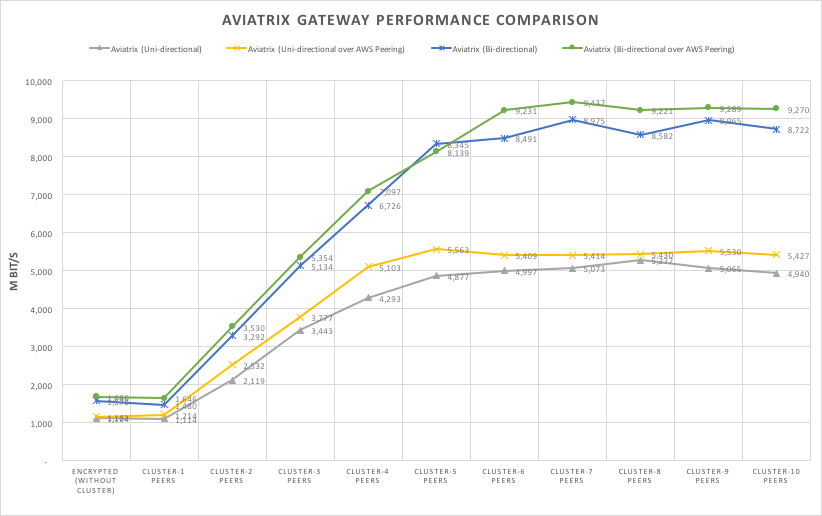

.. meta::
   :description: Cluster peering reference design
   :keywords: cluster, peering, cluster peering, Aviatrix, AWS VPC, Egress control

=====================================
Cluster Peering
=====================================

Performance Challenges
==============================

<<<<<<< Updated upstream
Today, encrypted peering (IPsec tunnel) between two VPC/VNets is carried out
by two gateways (virtual machine, or instance based), one in each VPC/VNet. This limits IPsec
=======
Today encrypted peering (an IPsec tunnel) between two VPCs is carried out
by two gateways (EC2 instance based), one in each VPC. This limits IPSEC
>>>>>>> Stashed changes
tunnel packet throughput to the throughput of a single instance. For
example, AWS C4.4xlarge provides up to 1.5Gbps for an iperf test with
TCP. There is no solution for use cases that require more than that
throughput with one gateway instance.

Each Cloud Service Provider (CSP) has its own performance limitations. For example, in AWS infrastructure, traffic leaving a
VPC has a bandwidth limit of 5Gbps for one direction and 10Gbps for
bi-directional traffic. This limitation applies to both intra-region VPC traffic
and Internet bound traffic.

For example, running an iperf test between two instances in two VPCs in the same
region yields 5Gbps one way throughput and 10Gbps bi-directional
traffic.

Encrypted Cluster Peering Solution
==================================

Aviatrix has developed a scale out IPsec capability. A VPC/VNet can deploy a
cluster of gateways. Encrypted peering between two VPC/VNets is carried out
by two clusters of gateways in each VPC/VNet. The deployment diagram is shown
below.

Aviatrix supports both inter-region cluster peering and intra-region
cluster peering. In the first case, the encrypted cluster peering is
over the Internet through an IGW. In the second case, the encrypted cluster
peering is over native AWS peering.

The deployment diagrams are described below for both cases in AWS.

|image1|

|image2|

In this AWS example, three Aviatrix Gateways are deployed for encrypted
peering between VPC-1 and VPC-2. A demux gateway is used to distribute
user instance session traffic to 3 gateways. The distribution algorithm
guarantees no packet for the same TCP stream is delivered out of order
to the peering VPC.

Performance Benchmark and Analysis (AWS)
=====================================

Below is the performance benchmark for cluster peering using the iperf tool in AWS.
The results are collected with encryption over AWS peering in the same
region. The Aviatrix Gateway size is C4.8xlarge. The demux gateway size
is C4.8xlarge.

As the results show, with 4 or 5 gateways in a cluster, performance
reaches the AWS VPC line rate. Adding more gateways does not improve the performance.

Note that if the gateway size is C4.xlarge, more gateways are needed to achieve
the AWS line rate.

For information on how to run multi-stream iperf tests, check out our GitHub project. https://github.com/AviatrixSystems/PerformanceTest/blob/master/PerformanceTest.txt

|image3|

High Availability
=================

CSP Controllers monitor the health of the peering gateways and the demux gateway.
When heartbeat information from any gateway fails, the Controller will restart
the failing gateways. The detection to failover is under 30 seconds.

Configuration Workflow for AWS
===============================

Before you start, make sure you have the latest software by checking the
Dashboard. If an alert message (New !) appears, click **New!** to download
the latest software.

For AWS peerings, we assume you already know how to deploy the Aviatrix solution in AWS. If you need
help, check out this `reference
design <https://s3-us-west-2.amazonaws.com/aviatrix-download/Cloud-Controller/Cloud+Networking+Reference+Design.pdf>`__.

The Cluster Peering workflow for AWS is as follows, with major steps
highlighted.

1. In your Controller, create a gateway in VPC-1. Go to Gateway > New Gateway to create a gateway in VPC-1.
2. Repeat the previous step to create two more gateways in VPC-1. Note that all
   gateway instances must be in the same subnet.
3. Create a cluster in VPC-1. Go to Peering > Cluster Encrypted Peering > **+ New Cluster**. Make
   sure you highlight and select all three gateways at the Highlight and
   Select Gateways field.
4. Repeat the three steps above for VPC-2.
5. Create a Cluster Encrypted Peering. Go to Peering > Cluster Encrypted Peering > Cluster Peering >
    **+New Peering** and enter the two clusters you created in the previous
    steps.

    **Special Notes**. For AWS Gateways, select **Over AWS Peering** if the two VPCs are in
    the same region. Note that when this option is selected, you must have
    AWS peering routing PCX programmed in the routing table **only** for
    the subnet where cluster gateway instances are deployed. You must
    **NOT** program PCX for routing tables whose associated subnets are
    where your application EC2 instances are deployed.

1. Once peering configuration is completed, you can view it in
   dashboard. Cluster peering is drawn with a thicker green line.

2. Note if that you wish to add more gateways once a cluster peering has been
   created, you need to unpeer the cluster peering first. Add more
   gateways in each VPC, then create cluster peering again.

3. You can create multiple clusters in a VPC. A gateway may also belong
   to different clusters.

For support, please open a support ticket at `Aviatrix Support Portal <https://support.aviatrix.com>`_.

.. |image1| image:: Cluster_Peering_Reference_Design_files/image002.png
   :width: 6.5in
   :height: 2.5in
.. |image2| image:: Cluster_Peering_Reference_Design_files/image003.png
   :width: 6.5in
   :height: 2.5in

.. add in the disqus tag

.. disqus::
