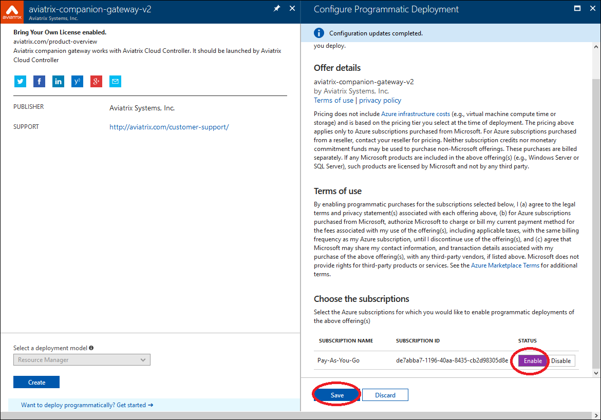

.. meta::
  :description: Aviatrix Companion Gateway
  :keywords: gateway, companion gateway, v2, version 2, aviatrix companion gateway, aviatrix

==================================
    Aviatrix Companion Gateway V2
==================================

If you need to launch a gateway in Azure ARM, you must subscribe to
**Aviatrix Companion Gateway V2** in **Azure Marketplace**. This model removes
the requirement to download the Aviatrix gateway image into your
Azure account which typically takes more than 30 minutes, thus
greatly reduces the deployment time. The Aviatrix Companion Gateway V2
in Azure marketplace is free of charge.

The following steps describe how to subscribe Aviatrix Companion
Gateway V2 in Azure marketplace.

Step 1: Select Aviatrix Companion Gateway V2
------------------------------------------

    Go to `Azure Marketplace <https://azure.microsoft.com/enIus/marketplace/>`__, search
    **“aviatrix”**, select **[aviatrix-companion-gateway-v2]**, as shown below:

    |image0|

|

Step 2: Deploy Programmatically
-----------------------------------

    After you click Create Virtual Machine for Aviatrix Companion
    Gateway V2, 
    click **Want to deploy programmatically? Get started ->** at the bottom of the page, as shown below:

|image1|

|

Step 3: Enable subscription
----------------------------

    In the next step, select **[Enable subscription]**, click **[Save]**, as shown
    below:

|image2|

|

    That’s it!

    For support, send email to support@aviatrix.com

.. |image0| image:: CompanionGateway_media/img_01.PNG
.. |image1| image:: CompanionGateway_media/img_02.PNG

.. disqus::
