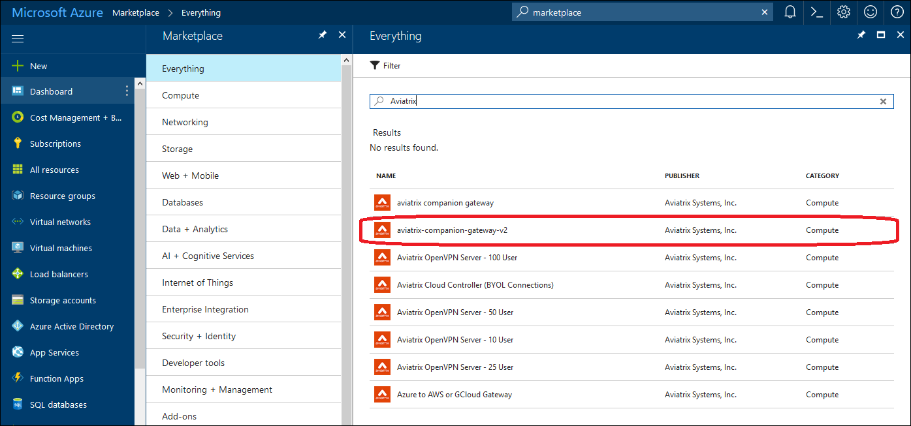
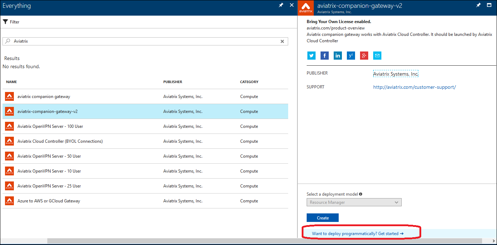
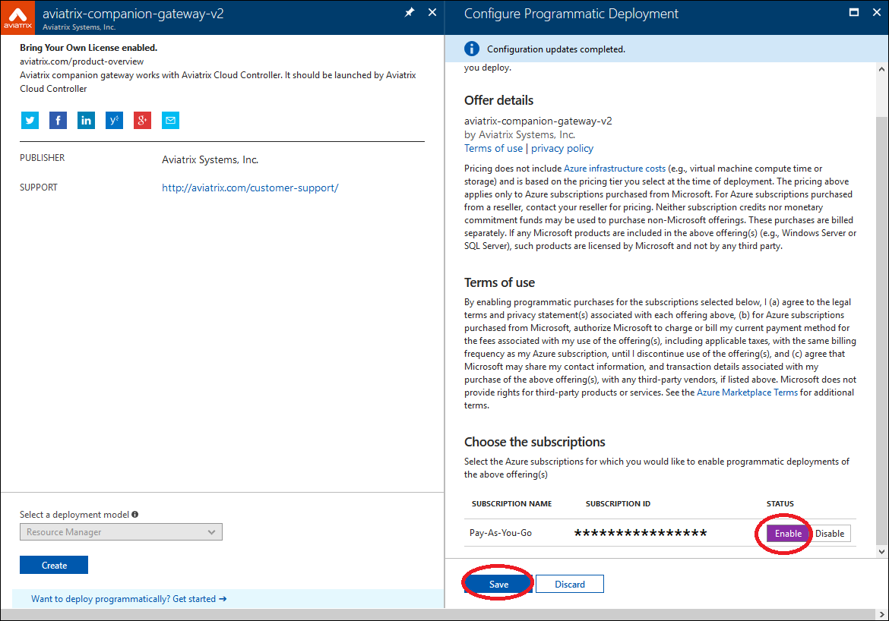
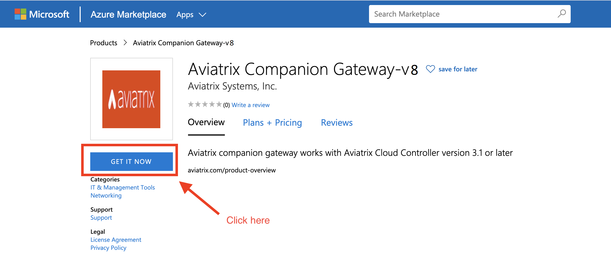
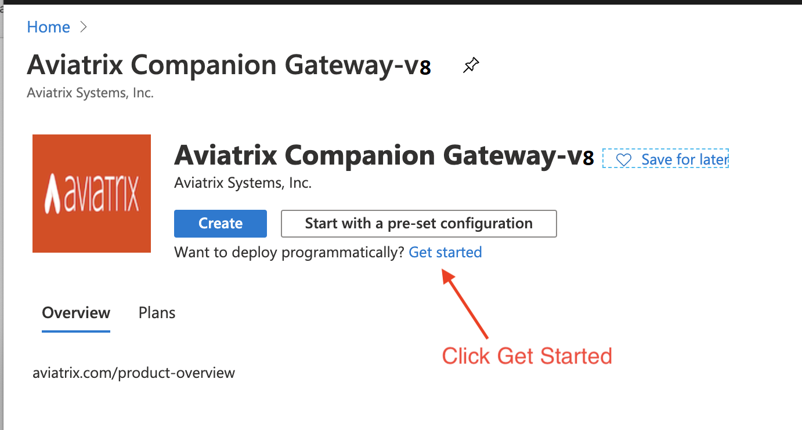
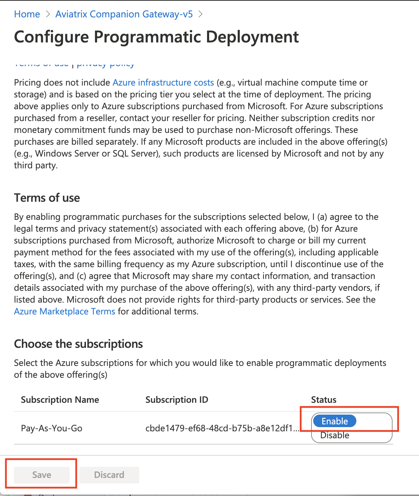

.. meta::
  :description: Aviatrix Companion Gateway
  :keywords: aviatrix, companion, gateway, v2, version 2

==================================
Aviatrix Companion Gateway
==================================

If you need to launch a gateway in Azure ARM, you must subscribe to
**Aviatrix Companion Gateway** in **Azure Marketplace**. This model removes
the requirement to download the Aviatrix gateway image into your
Azure account which typically takes more than 30 minutes, thus
greatly reducing the deployment time. The Aviatrix Companion Gateway
in Azure marketplace is free of charge.

The following steps describe how to subscribe Aviatrix Companion
Gateway in Azure marketplace.

Step 1: Select Aviatrix Companion Gateway
------------------------------------------

Go to `Azure Marketplace <https://azuremarketplace.microsoft.com/en-us/marketplace/apps/aviatrix-systems.aviatrix-companion-gateway-v5?tab=Overview>`_ to subscribe to Companion Gatewaay V5

 |companion_gw|

Step 2: Deploy Programmatically
-----------------------------------

Click **Want to deploy programmatically? Get started ->**, as shown below:

|get_started|

Step 3: Enable subscription
----------------------------

Select **[Enable]**, click **[Save]**, as shown below

|enable_program|

    That’s it!

    For support, send email to support@aviatrix.com

.. disqus::
