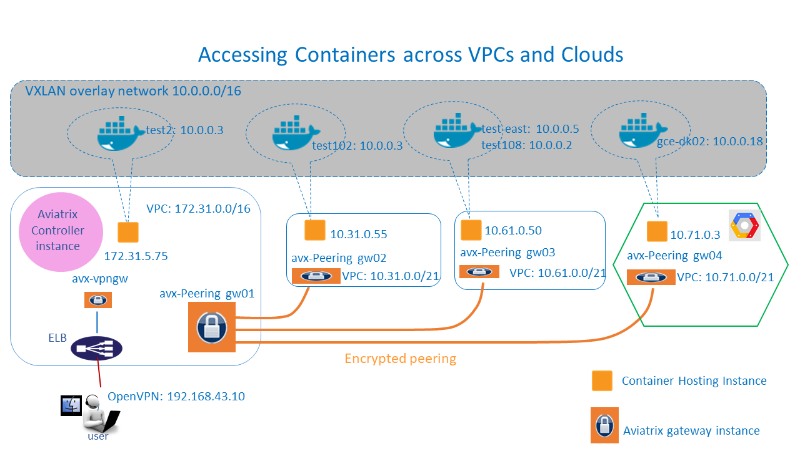

========================================
Docker Container Access 
========================================

Introduction
============

Project Skyhook by Aviatrix enables VPN users to access remote Docker
containers in a multi-host Swarm cluster built on a VXLAN overlay
network in the same manner to access remote cloud instance. (A host is a
cloud instance.)

With Aviatrix encrypted peering capability that connects VPC/VNets
securely across regions and clouds, a multi-host Docker swarm cluster
can span across multiple VPC regions and multiple clouds, such as AWS,
Azure and Google.

Users can use Aviatrix enterprise OpenVPN® capability to connect to the
cloud, then from your desktop access remote containers in a swarm
cluster in the same manner as accessing instances. VPN users from
desktop, for example, can use “curl” or run a browser session directly
to a remote container running a web service.

Without Aviatrix solution, it requires complex port mapping to access a
remote Docker container. It is not possible today, from your desktop, to
access a remote container in a VXLAN overlay network.

In addition, administrators can leverage already built in multi-factor
authentication and user profile defined access control to grant or deny
access to a container or container application port.

In this reference design, we are going to show you how to enable and use
this capability. This document assumes some familiarity with Aviatrix
Cloud Native Networking product, Docker Swarm cluster and VXLAN
multi-host networking. If not, no worries, read on and proceed, we have
compiled instructions for you.

Skyhook: Docker Container Access
================================

Aviatrix Docker Container Access solution can be deployed as shown
below:

|image0|

In the diagram above, the left most VPC (172.31.0.0/16), the “VPN
landing VPC”, is the one hosting the Swarm primary/secondary managers,
consul (Discovery backend) and a few Swarm nodes. Read `this
link <http://docs.aviatrix.com/HowTos/Docker_Swarm.html>`__
on how to create a Swarm Cluster that you’ll need later.

Instances in the rest of the VPCs are part of the swarm cluster nodes
that span across multiple VPC regions and to Azure and Google by using
Aviatrix encrypted peering capability.

The Aviatrix Solution Benefits
==============================

Aviatrix gateways are deployed and managed by an Aviatrix Cloud Connect
Controller (the pink color instance in the diagram) which itself is a
cloud instance or VM. Aviatrix benefits are highlighted below:

-  Aviatrix solution enables users to remotely access swarm containers
   as well as instances. Once VPN in, users can use native desktop
   commands such as “curl” without complex port mapping and “docker
   exec…” type of commands.

-  Multi-factor authentication and user profile based access control
   enable fine granular security.

-  Aviatrix VPN gateways are supported by ELB for high availability and
   scalability.

-  Extensive logging allows administrators to have complete visibility
   of network event and user browsing history.

-  With Aviatrix encrypted peering, we can easily span Swarm cluster
   across different regions, and cloud providers (AWS, Azure, and Google
   GCE).

-  The gateway is launched from a central controller web console with a
   few clicks.

Configuration Workflow
======================

Before you start, make sure you have the latest software by checking the
Dashboard. If an alert message displays, click Upgrade to download the
latest software.

As a prerequisite, you must create a Swarm overlay network cluster
first. You need to record the Docker Swarm Cluster Consul IP address,
the Overlay Network Name (e.g. multi-host-overlay), and the Overlay
Network Address (e.g. 10.0.0.0/16). Please refer for instructions on how
to create a Swarm Cluster.

The configuration workflow is as follows, with major steps highlighted.

1. Setup secure VPC access and connectivity infrastructure

   This step setup a secure environment so that all your instances and
   containers can be accessed and communicated securely with private IP
   addresses.

   If you are going to start with all containers in one VPC
   (172.31.0.0/16 as shown in the diagram), launching an Aviatrix VPN
   gateway and create a VPN user for secure remote access to the
   instances in the VPC.

   On the other hand, if you like to try to run containers span across
   multiple VPCs, launch encrypted peering gateways and Aviatrix VPN
   gateways to create the necessary network infrastructure for secure
   access and secure connectivity among instances. Note you must launch
   separate peering gateway and VPN gateways.

   In either case, check out `this reference
   design <http://docs.aviatrix.com/HowTos/Cloud_Networking_Ref_Des.html>`__
   for instructions.

2. Create a Docker swarm cluster

   Follow `the
   instructions <http://docs.aviatrix.com/HowTos/Docker_Swarm.html>`__
   to create a Docker swarm cluster and create some containers. First
   VPN to the landing VPC, then ssh into each swarm node (instance) with
   its private IP address.

   With Aviatrix VPN access capability and encrypted peering, your
   entire swarm cluster can be deployed on private subnets with private
   IP addresses.

3. Enable overlay network access

   if you have selected “Split Tunnel” mode when creating VPN gateways
   at step 1, you need to add the VXLAN overlay network 10.0.0.0/16 to
   allow your laptop to tunnel the address range to the VPC, Follow the
   steps below:

   Go to VPC/VNet -> Edit Configuration,

	-  click Modify Split Tunnel.

	-  At VPC/VNet Name field, select the landing VPC (the one with CIDR
	   172.31.0.0/16)

	-  At Additional CIDRs, add 10.0.0.0/16 to the CIDR strings separated
	   with comma.

	-  (If you have Nameservers and Search Domains, fill in these fields so
	   you can access containers with names.)

	-  Click Modify.

4. Enable Docker Container Access.

   Go to VPC/VNet -> VPN Access -> Skyhook:Docker Container Access

	-  Click on “Enable” for the gateway you just created (e.g.
	   avx-vpngw01).

	-  Fill in the Docker Swarm Cluster Consul IP address, the Overlay
	   Network Name (e.g. multi-host-overlay), and the Overlay Network
	   Address (e.g. 10.0.0.0/16).

	-  Click “Enable” to confirm the request.

	-  **Important notes** – If there are more than one VPN gateways, make
	   sure you enable Docker Container Access for each one and the same
	   configuration should be applied to all VPN gateways.

5. Verify your setup

   Now you should be able to access your containers. Use your desktop
   VPN client to VPN into the VPC. You can try a few things. Note you
   need to use the container overlay IP address for accessing, in this
   reference design, all containers overlay IP address is in the
   10.0.0.0/16 range.

	-  If you have one container that runs a web server, you should be able
	   to access the web server from your desktop browser, run a command
	   “wget” from a Linux machine, or run a command “curl” from a OSX
	   machine.

	-  If one container has been loaded with ssh access capability, you can
	   ssh directly into the container from your desktop.

	-  Ping the container overlay IP address.

6. Adding a new swarm node

   You can still add a new swarm node later, just follow the same
   instruction as described in `this
   link <http://docs.aviatrix.com/HowTos/Docker_Swarm.html>`__.

   Important note: for a container on a Google GCE instance, you must
   enable “IP forwarding” when you launch the Google GCE instance.

Troubleshooting
===============

1. If you failed to enable Docker Container Access for a gateway, make
   sure the Docker Swarm Consul IP address is reachable from your
   gateway. Check the security group associated with the instances.

2. If there are more than one VPN gateway, make sure you enable Docker
   Container Access for each one and the same configuration should be
   applied to all VPN gateways; otherwise, you may experience
   inconsistent behaviors.

3. After you disabled the Docker Container Access for a VPN gateway, if
   you try to enable it immediately, it may fail. This is because the
   Swarm Consul still has the node entry in the DB and it needs time to
   discover that the node is gone. Simply wait for a few minutes until
   the TTL expired and the key-value store cleans up the old entry
   automatically.

For support, please open a support ticket at `Aviatrix Support Portal <https://support.aviatrix.com>`_

For feature request and feedback, click Make a wish at the bottom of
each page.

Enjoy!

OpenVPN is a registered trademark of OpenVPN Inc.

.. disqus::
