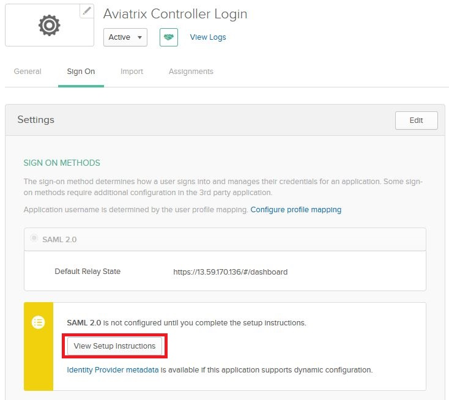
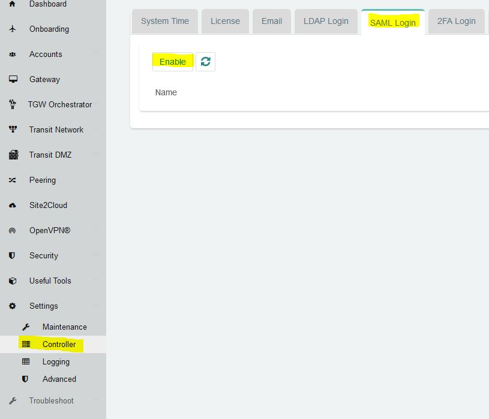
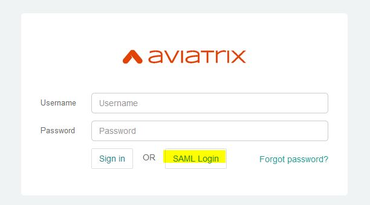

.. meta::
   :description: Aviatrix Controller Login Okta SAML Configuration
   :keywords: Okta, SAML, controller login, okta saml, Aviatrix

.. toctree::
   :numbered:

==============================================================================
Aviatrix Controller Login with SAML Authentication on Okta IDP
==============================================================================

Overview
------------

This guide provides an example on how to configure Aviatrix Controller to authenticate against an Okta IDP.  When SAML client is used, your Aviatrix controller acts as the Identity Service Provider (ISP) that redirects browser traffic from client to IDP (e.g., Okta) for authentication.

Pre-Deployment Checklist
-----------------------------
Before configuring SAML integration between Aviatrix and Okta, make sure the following is completed:

#. `Aviatrix Controller <#aviatrix-controller>`__ is setup and running.
#. Have a valid `Okta account <#okta-account>`__ with admin access.

.. _aviatrix_controller:

Aviatrix Controller
####################

If you haven’t already deployed the Aviatrix controller, follow `the Controller Startup Guide <https://docs.aviatrix.com/StartUpGuides/aviatrix-cloud-controller-startup-guide.html>`_.

.. _okta_account:

Okta Account
############

A valid Okta account with admin access is required to configure the integration.

Configuration Steps
-------------------

Follow these steps to configure Aviatrix to authenticate against your Okta IDP:

#. Create an `Okta SAML App <#okta-saml-app>`__ for Aviatrix
#. Retrieve `Okta IDP metadata <#okta-idp-metadata>`__
#. Create Aviatrix `SAML SP Endpoint <#aviatrix-saml-endpoint>`__
#. `Test the Integration <#test-integration>`__ is Set Up Correctly
#. `Validate <#validate-entire-process>`__

.. _okta_saml_app:

Create an Okta SAML App for Aviatrix
#####################################

.. note::

   This step is usually done by the Okta Admin.

#. Login to the Okta Admin portal
#. Follow `Okta documentation <https://developer.okta.com/standards/SAML/setting_up_a_saml_application_in_okta>`__ to create a new application.

   +----------------+----------------+
   | Field          | Value          |
   +================+================+
   | Platform       | Web            |
   +----------------+----------------+
   | Sign on method | SAML 2.0       |
   +----------------+----------------+

      |image0|

#. General Settings

   +----------------+-----------------+----------------------------------------+
   | Field          | Value           | Description                            |
   +================+=================+========================================+
   | App name       | Aviatrix        | This can be any value.  It will be     |
   |                |                 | displayed in Okta only.                |
   +----------------+-----------------+----------------------------------------+
   |                | Aviatrix logo:  | Aviatrix logo (optional)               |
   |                |                 |                                        |
   | App logo       | | |logoAlias1|_ |                                        |
   |                | | |logoAlias2|_ |                                        |
   +----------------+-----------------+----------------------------------------+
   | App visibility | N/A             | Leave both options unchecked           |
   +----------------+-----------------+----------------------------------------+

      |image1|

#. SAML Settings

   * General
   +----------------------+----------------------------------------------------+
   | Field                | Value                                              |
   +======================+====================================================+
   | Single sign on URL   | ``https://[host]/flask/saml/sso/controller``       |
   +----------------------+----------------------------------------------------+
   | Audience URI         | ``https://[host]/``                                |
   | (SP Entity ID)       |                                                    |
   +----------------------+----------------------------------------------------+
   | Default RelayState   | ``https://[host]/#/dashboard``                     |
   +----------------------+----------------------------------------------------+
   | Name ID format       | Unspecified                                        |
   +----------------------+----------------------------------------------------+
   | Application username | Okta username                                      |
   +----------------------+----------------------------------------------------+

   ``[host]`` is the hostname or IP of your Aviatrix controller.  For example, ``https://controller.demo.aviatrix.live``

   ``controller`` must be the SP name. Otherwise there will be an "SP is not present" error.

   ``https://[host]/#/dashboard`` must be set as the Default RelayState so that after SAML authenticates, user will be redirected to dashboard.

   * Attribute Statements
   +----------------+-----------------+--------------------------------------+
   | Name           | Name format     | Value                                |
   +================+=================+======================================+
   | FirstName      | Unspecified     | user.firstName                       |
   +----------------+-----------------+--------------------------------------+
   | LastName       | Unspecified     | user.lastName                        |
   +----------------+-----------------+--------------------------------------+
   | Email          | Unspecified     | user.email                           |
   +----------------+-----------------+--------------------------------------+

   |image2|
   

.. _okta_idp_metadata:

Retrieve Okta IDP metadata
#####################################

.. note::

   This step is usually completed by the Okta admin.

After the application is created in Okta, go to the `Sign On` tab for the application.

    |image4|

Right click on the Identity Provider metadata and copy URL. This value will be used to configure the SAML on the Aviatrix controller.

#. Assign the application to your account

    |image5|

.. _aviatrix_saml_endpoint:

Create Aviatrix SAML Endpoint
#############################

.. note::

   This step is usually completed by the Aviatrix admin.

#. Login to the Aviatrix Controller
#. Click `Settings` in the left navigation menu
#. Select `Controller`
#. Click on the `SAML Login` tab
#. Click `Enable` button

   |image6|

   +-------------------------+-------------------------------------------------+
   | Field                   | Value                                           |
   +=========================+=================================================+
   | IDP Metadata Type       | Text                                            |
   +-------------------------+-------------------------------------------------+
   | IDP Metadata Text       | ``Value Copied from Okta`` (Paste the value     |
   |                         | copied from Okta SAML configuration)            |
   +-------------------------+-------------------------------------------------+
   | Entity ID               | Hostname                                        |
   +-------------------------+-------------------------------------------------+
   | Access                  | Use either Admin or read-only                   |
   |                         |                                                 |
   +-------------------------+-------------------------------------------------+

#. Click `OK`

.. _test_integration:

Test the Integration
####################

#. Click `Settings` in the left navigation menu
#. Select `Controller`
#. Click on the `SAML Login` tab
#. Click the `Test` button next to ``controller``

   .. tip::

      You will need to assign the new Okta application to a test user's Okta account before clicking `Test`.

      |image7|

#. You should be redirected to Okta.  Login with your test user credentials.

   .. important::

      If everything is configured correctly, once you have authenticated another windows should open with the test user's access.

.. _validate_entire_process:

Validate
########

#. Logout of the Aviatrix Controller
#. Login to the Aviatrix Controller by clicking the `SAML Login` button

    |image8|

#. You should be redirected to Okta.  Login with your test user credentials.

       .. important::

          If everything is configured correctly, once you have authenticated you will be redirected to the dashboard's controller.

Configure Okta for Multifactor Authentication (OPTIONAL)
########################################################

Once you have successfully configured Okta IDP with Aviatrix SP, you can configure Okta for Multifactor Authentication.

Please read this `article <https://support.okta.com/help/Documentation/Knowledge_Article/Multifactor-Authentication-1320134400>`__ from Okta on Multifactor setup.

See this `article <https://support.okta.com/help/Documentation/Knowledge_Article/Configuring-Duo-Security-734413457>`__ if you're interested in using DUO in particular.

OpenVPN is a registered trademark of OpenVPN Inc.

.. |logoAlias1| replace::  Aviatrix logo with red background
.. _logoAlias1: https://a.aviatrix.com/news/press-kit/logo-aviatrix-reverse.zip

.. |logoAlias2| replace:: Aviatrix logo with transparent background
.. _logoAlias2: https://a.aviatrix.com/news/press-kit/logo-aviatrix.zip

.. |image0| image:: Controller_Login_Okta_SAML_media/image0.png

.. |image1| image:: Controller_Login_Okta_SAML_media/image1.png

.. |image2| image:: Controller_Login_Okta_SAML_media/image2.png

.. |image3| image:: Controller_Login_Okta_SAML_media/image3.png

.. |image5| image:: Controller_Login_Okta_SAML_media/image5.png

.. |image7| image:: Controller_Login_Okta_SAML_media/image7.png

.. disqus::
