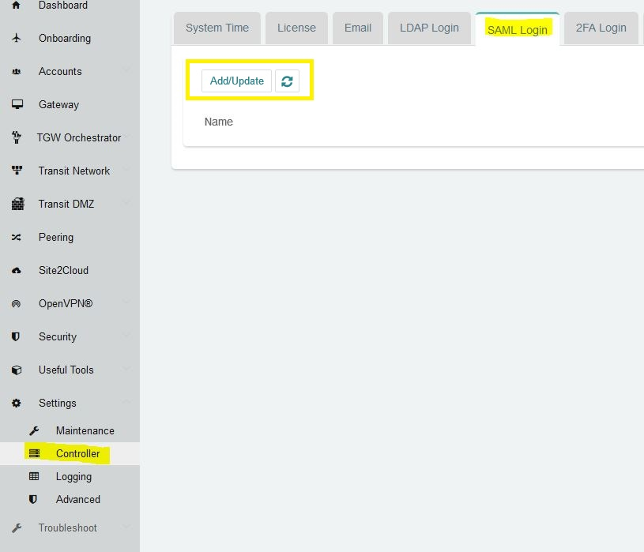
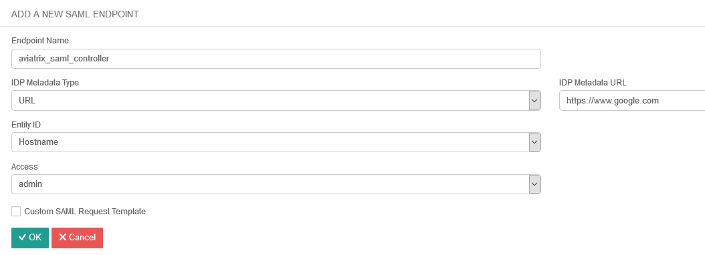
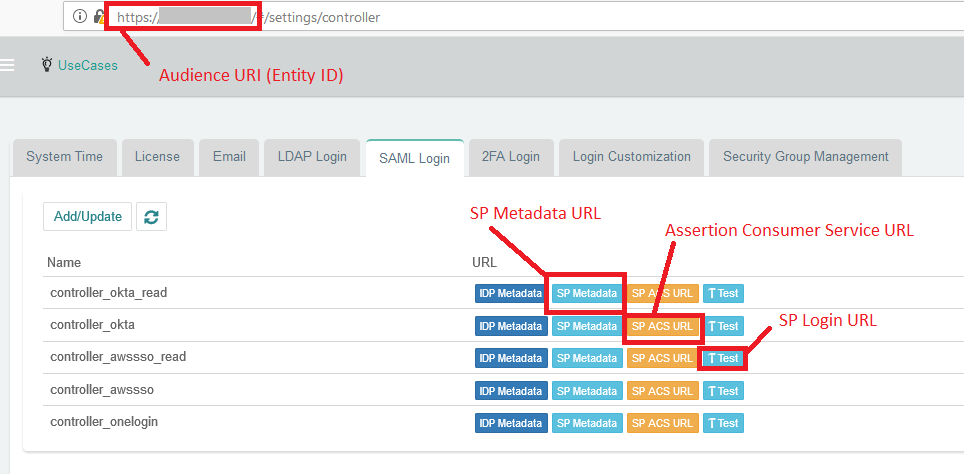
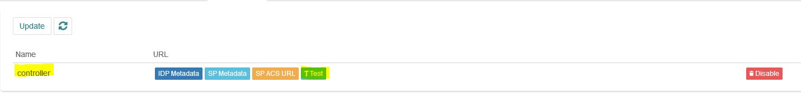
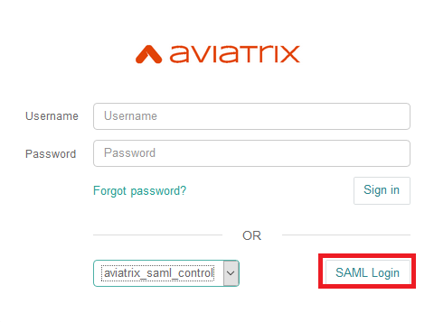

.. meta::
   :description: Aviatrix Controller Login SAML Configuration
   :keywords: SAML, controller login, Aviatrix, idp, sp

.. toctree::
   :numbered:

==============================================================================
Aviatrix Controller Login with SAML Authentication
==============================================================================

1.  Overview
------------

This guide provides an example on how to configure the Aviatrix Controller to authenticate to an IdP.  When SAML is
used for Controller access authentication, your Aviatrix controller acts as the
Identity Service Provider (ISP) that redirects browser traffic from client to IdP (e.g., Okta) for authentication.

The Aviatrix controller SAML login supports multiple SAML endpoints with varying access and utilizing different IdP's.

For different IdP's, there will be links to each individual IdP integration.

2. Pre-Deployment Checklist
-----------------------------
Before configuring SAML integration between Aviatrix and IdP, make sure the following is completed:

#. `Aviatrix Controller <#pdc-21>`__ is setup and running
#. Have a valid `IdP account <#pdc-22>`__ with admin access

.. _PDC_21:

2.1 Aviatrix Controller
#######################

If you haven’t already deployed the Aviatrix controller, follow `the Controller Startup Guide <https://docs.aviatrix.com/StartUpGuides/aviatrix-cloud-controller-startup-guide.html>`_.

.. _PDC_22:

2.2 IdP Account
###############

An IdP refers to an identity provider for SAML. This could be any provider that supports a SAML end point like `Okta <./SAML_Integration_Okta_IdP.html>`__,
`OneLogin <./SAML_Integration_OneLogin_IdP.html>`__, `Google <./SAML_Integration_Google_IdP.html>`__,
`AWS SSO <./SAML_Integration_AWS_SSO_IdP.html>`__, `Azure AD <./SAML_Integration_Azure_AD_IdP.html>`__, and `PingOne <./SAML_Integration_PingOne_IdP.html>`__.
You will require administrator access to create IdP endpoints for SAML. Check `IdP-specific SAML Integration <#idp-integration>`__ to see a list of guides for supported IdP's

3. Configuration Steps
----------------------

Follow these steps to configure Aviatrix to authenticate against IdP:

1. Create `temporary Aviatrix SP Endpoint <#config-31>`__ for Aviatrix controller
2. Create `SAML IdP App <#config-32>`__ with specific IdP
#. Retrieve `IdP Metadata <#config-33>`__ from IdP
#. Update `Aviatrix SP Endpoint <#config-34>`__ with IdP metadata
#. `Test the Integration <#config-35>`__ is set up correctly
#. `Validate <#config-36>`__

.. _Config_31:

3.1 Create temporary Aviatrix SP Endpoint
#########################################

.. note::
   This step is usually completed by the Aviatrix admin.
   This endpoint will be updated later on in the guide.
   At this step, we will be using placeholder values.
   
Choose an endpoint name for your Aviatrix SAML endpoint which will be used throughout the guide.
This guide will use ``aviatrix_saml_controller`` as an example for the endpoint name.

#. Login to the Aviatrix Controller
#. Click `Settings` in the left navigation menu
#. Select `Controller`
#. Click on the `SAML Login` tab
#. Click `Add/Update` button

   |image3-1-1|

   |image3-1-2|

   +-------------------------+-------------------------------------------------+
   | Field                   | Value                                           |
   +=========================+=================================================+
   | Endpoint Name           | Enter a unique identifier for the service provider     |
   +-------------------------+-------------------------------------------------+
   | IPD Metadata Type       | Text or URL (depending on what was              |
   |                         | provided by the SAML provider)                  |
   |                         | For now, choose URL                             |
   +-------------------------+-------------------------------------------------+
   | IdP Metadata Text/URL   | IdP metadata URL/Text copied from the SAML      |
   |                         | provider configuration                          |
   |                         | For now, put in a placeholder URL,              |
   |                         | such as "https://www.google.com"                |
   +-------------------------+-------------------------------------------------+
   | Entity ID               | Select `Hostname` for now                       |
   +-------------------------+-------------------------------------------------+
   | Access                  | Select admin or read-only access                |
   +-------------------------+-------------------------------------------------+
   | Custom SAML Request     | For now leave blank, depending on your specific |
   | Template                | IdP, you may have to check this option          |
   +-------------------------+-------------------------------------------------+

.. note::
   Each endpoint only supports one type of access. If you need admin and read-only access, create two separate SAML apps.

#. Click `OK`
#. Depending on your IdP provider, you may need to upload SP metadata. After temporary SAML endpoint is created:

- Click **DOWNLOAD SP METADATA** button next to the SAML endpoint and save file to your local machine
- Click **SP METADATA** button, and copy the SP metadata as text

.. _Config_32:

3.2 Create a SAML App for Aviatrix with the IdP
###############################################

.. note::
   This step is usually done by the IdP administrator.
   This section shows only a generalized process for creating a SAML application.
   Refer to the `IdP-specific SAML App Integration <#idp-integration>`_ section for links to detailed steps with each particular IdP.

Create a SAML 2.0 app with the IdP Provider with the following values.

#. Assertion Consumer Service URL*
#. Audience URI(Entity ID)*
#. SP Metadata URL
#. SP Login URL
#. Default RelayState* = <empty>

.. important::
   You can find these values in the controller under the `Settings` navigation item.
   Then, select `Controller` and go to the `SAML Login` tab.
   Click on the button for the respective value, and copy the URL on the new page.
   RelayState is currently not used by the Aviatrix SP

|image3-2|

The following SAML attributes are expected:

#. FirstName
#. LastName
#. Email (unique identifier for SAML)

.. note::
   These values are case sensitive

.. _Idp_Integration:

**IdP-specific SAML App Integration**

.. note::
   You will require administrator access to create IdP endpoints for SAML.

These are guides with specific IdP's that were tested to work with Aviatrix SAML integration:

#. `AWS SSO <./SAML_Integration_AWS_SSO_IdP.html>`__
#. `Azure AD <./SAML_Integration_Azure_AD_IdP.html>`__
#. `Centrify <./SAML_Integration_Centrify_IdP.html>`__
#. `Google <./SAML_Integration_Google_IdP.html>`__
#. `Okta <./SAML_Integration_Okta_IdP.html>`__
#. `OneLogin <./SAML_Integration_OneLogin_IdP.html>`__
#. `PingOne <./SAML_Integration_PingOne_IdP.html>`__

Other tested IdP's include:
VmWare VIDM, ForgeRock's OpenAM etc.

.. _Config_33:

3.3  Retrieve IdP metadata
##########################

After creating the IdP, you need to retrieve IdP Metadata either in URL or text from the IdP application created in the previous step.

#. AWS SSO  - provides IdP metadata URL, needs a custom SAML request template, and will need to provide SP metadata file from Aviatrix
#. Azure AD - provides IdP metadata URL and needs a custom SAML request template
#. Centrify - provides IdP metadata URL and will need to provide SP metadata text from Aviatrix
#. Google   - provides IdP metadata text
#. Okta     - provides IdP metadata URL
#. OneLogin - provides IdP metadata URL
#. PingOne  - provides IdP metadata URL

.. _Config_34:

3.4 Update Aviatrix SP Endpoint
###############################

.. note::
   his step is usually completed by the Aviatrix admin.
   Take note of the IdP Metadata type along with Text/URL your IdP provides, and if you need a custom SAML request template in the previous section.

#. Login to the Aviatrix Controller
#. Click `Settings` in the left navigation menu
#. Select `Controller`
#. Click on the `SAML Login` tab
#. Click `Edit` button

   +-------------------------+----------------------------------------------------------+
   | Field                   | Value                                                    |
   +=========================+==========================================================+
   | Endpoint Name           | Unique name that you chose in step 3.1                   |
   +-------------------------+----------------------------------------------------------+
   | IPD Metadata Type       | Text or URL (depending on what was                       |
   |                         | provided by the SAML provider)                           |
   +-------------------------+----------------------------------------------------------+
   | IdP Metadata Text/URL   | IdP metadata URL/Text copied from the SAML               |
   |                         | provider configuration                                   |
   +-------------------------+----------------------------------------------------------+
   | Entity ID               | Select `Hostname` or `Custom`                            |
   +-------------------------+----------------------------------------------------------+
   | Custom Entity ID        | Only visible if `Entity ID` is `Custom`                  |
   +-------------------------+----------------------------------------------------------+
   | Access                  | Select admin or read-only access                         |
   +-------------------------+----------------------------------------------------------+
   | Custom SAML Request     | Depending on your specific                               |
   | Template                | IdP, you may have to check this option.                  |
   |                         | Refer to `IdP-specific Integration <#idp-integration>`__ |
   +-------------------------+----------------------------------------------------------+

.. note::
   `Hostname` is the default for Entity ID, but if you have other apps using the same hostname, use a custom Entity ID.

6. Click `OK`

.. _Config_35:

3.5 Test the Integration
########################

#. Click `Settings` in the left navigation menu
#. Select `Controller`
#. Click on the `SAML Login` tab
#. Click the `Test` button next to your SAML endpoint name

      |image3-5|

#. You should be redirected to IdP.  Login with your test user credentials.

.. important::
   If everything is configured correctly, once you have authenticated, another windows should open with the test user's access.

.. _Config_36:

3.6 Validate
############

#. Logout of the Aviatrix Controller
#. Choose from the dropdown box your SAML endpoint name
#. Login to the Aviatrix Controller by clicking the `SAML Login` button.

    |image3-6|

#. You should be redirected to IdP.  Login with your test user credentials.

.. important::
   If everything is configured correctly, once you have authenticated you will be redirected to the dashboard's controller.

.. |logoAlias1| replace::  Aviatrix logo with red background
.. _logoAlias1: https://www.aviatrix.com/news/press-kit/logo-aviatrix.png

.. |logoAlias2| replace:: Aviatrix logo with transparent background
.. _logoAlias2: https://www.aviatrix.com/images/logo-reverse.png

.. disqus::
