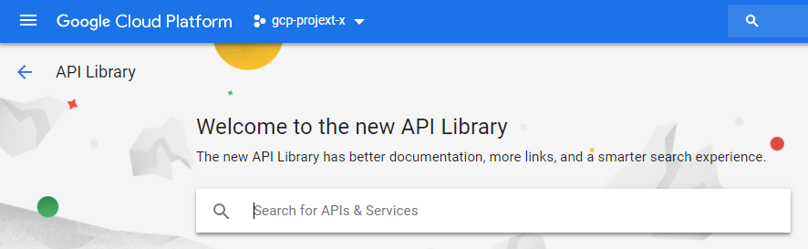
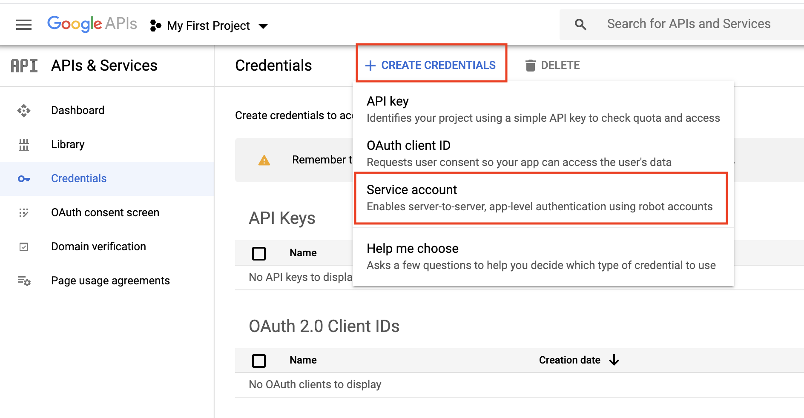
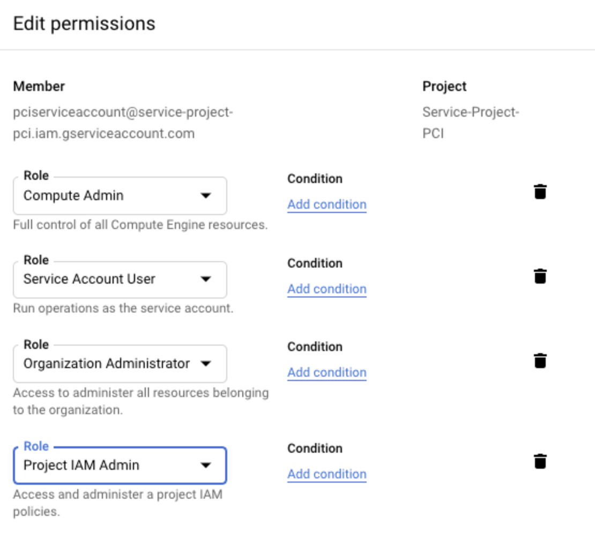

.. meta::
   :description: Create GCloud Account on Aviatrix Controller
   :keywords: GCloud, create GCloud, create GCloud account, Aviatrix, GCP credentials

===================================================================
GCP Credentials
===================================================================

Before creating a cloud account for GCloud/GCP on the Aviatrix controller, follow the
steps below to make sure you have the credentials set up for API calls.

1. Create a GCloud or GCP account (https://cloud.google.com/). Continue to the next
step if you have already done so.

.. note::

The Controller supports multiple accounts with each account associated with a different GCloud projects, but there needs to be at least one account to start with.

.. note::

2. Create a GCloud Project. Log in to your GCloud account at https://console.cloud.google.com/project and create a project. Continue to the next step if you have already created
one. Note the project ID will be used in referencing to the project by the Aviatrix Controller.

(As an example, we created a project Aviatrix-UCC. The project ID is
aviatrix-ucc-1214.)

Enabling Compute Engine API on the Selected Project
----------------------------------------------------------------------

1. Go to your Google Cloud Platform console, click on the dropdown menu in the top left, and select **APIs and Services. At the Dashboard, click on **Enable APIs and Services**.

|image3|

2. On the Search box, enter "Compute Engine API" and select it from search results.

|image2|

3. Click **Enable**.

Creating a Credential File
----------------------------------

When you create a cloud account Aviatrix Controller for GCloud, you will be asked to upload a
GCloud Project Credentials file. Follow the steps below to download the
credential file from the Google Developer Console.

1. Open the `Credential
   page <http://console.developers.google.com/project/_/apiui/credential>`__.
2. Select the project you are creating credentials for.
3. At Credentials, Click **Create credentials** and select **Service account** as shown below.

   |service_account|

4. At the Service Accounts, enter a service account name and click **Create**. For Service account permissions, select Project, Editor, as shown below. 

 |iam_credential|

5. Select a service account. Select the KEYS tab, click on the **ADD KEY** dropdown menu, and select **Create new key**. 

6. Select the **JSON** radio button and click **CREATE**.

6. Click **Create**. The credential file downloads to your local
   computer.

7. Upload the Project Credential file to the Aviatrix Controller at the GCloud
   account create page.

Note: Creating a Service Account with Restricted Access
-----------------------------------------------------------------------------
We recommend creating the service account with the Editor role as mentioned, but in some cases an organization might want
to further restrict permission for the service account. In such a situation Aviatrix recommendation is to have at least following roles assigned
to service account so that Aviatrix can perform its functions properly, such as managing the compute resources, route tables, firewall rules, shared service VPC network, etc. 

1. Compute Admin
2. Service Account User
3. Organization Administrator (required for GCP Shared VPC)
4. Project IAM Admin (required for GCP Shared VPC)

  |restricted_access|

If an organization is currently using GCP Shared VPC or planning to use in future, then enabling Organization Administrator 
and Project IAM Admin is also required.

In addition to restricting the GCP roles, you can restrict the rights for those roles. You can grant roles permission to perform the following tasks:

::

   compute.addresses.create
   compute.addresses.createInternal
   compute.addresses.delete
   compute.addresses.deleteInternal
   compute.addresses.get
   compute.addresses.list
   compute.addresses.use
   compute.addresses.useInternal
   compute.disks.create
   compute.disks.get
   compute.firewalls.create
   compute.firewalls.delete
   compute.firewalls.get
   compute.firewalls.list
   compute.firewalls.update
   compute.forwardingRules.create
   compute.forwardingRules.delete
   compute.forwardingRules.list
   compute.globalOperations.get
   compute.healthChecks.create
   compute.healthChecks.delete
   compute.healthChecks.useReadOnly
   compute.httpHealthChecks.get
   compute.httpHealthChecks.useReadOnly
   compute.images.list
   compute.images.useReadOnly
   compute.instanceGroups.create
   compute.instanceGroups.delete
   compute.instanceGroups.get
   compute.instanceGroups.update
   compute.instanceGroups.use
   compute.instances.create
   compute.instances.delete
   compute.instances.get
   compute.instances.list
   compute.instances.setMachineType
   compute.instances.setMetadata
   compute.instances.setTags
   compute.instances.start
   compute.instances.stop
   compute.instances.updateNetworkInterface
   compute.instances.use
   compute.networks.addPeering
   compute.networks.create
   compute.networks.delete
   compute.networks.get
   compute.networks.list
   compute.networks.removePeering
   compute.networks.updatePolicy
   compute.projects.get
   compute.projects.setCommonInstanceMetadata
   compute.regionBackendServices.create
   compute.regionBackendServices.delete
   compute.regionBackendServices.get
   compute.regionBackendServices.update
   compute.regionBackendServices.use
   compute.regionOperations.get
   compute.routes.create
   compute.routes.delete
   compute.routes.list
   compute.subnetworks.create
   compute.subnetworks.delete
   compute.subnetworks.get
   compute.subnetworks.list
   compute.subnetworks.use
   compute.subnetworks.useExternalIp
   compute.targetPools.addInstance
   compute.targetPools.create
   compute.targetPools.delete
   compute.targetPools.get
   compute.targetPools.removeInstance
   compute.targetPools.use
   compute.zoneOperations.get
   compute.zones.list
   iam.serviceAccounts.actAs
   logging.logEntries.create
   pubsub.subscriptions.consume
   pubsub.subscriptions.create
   pubsub.subscriptions.delete
   pubsub.subscriptions.get
   pubsub.topics.attachSubscription
   pubsub.topics.create
   pubsub.topics.delete
   pubsub.topics.get
   pubsub.topics.publish
   resourcemanager.projects.get

Troubleshooting Tips
----------------------

If the cloud account creation fails, check the error message on your Aviatrix
Controller and try again with the steps provided in this
document.

For additional support, please open a support ticket at `Aviatrix Support Portal <https://support.aviatrix.com>`_

.. |image0| image:: GCloud_media/image1.png

.. |image1| image:: GCloud_media/image2.png

.. |image3| image:: GCloud_media/gcloud-enable-apis-and-services.png

.. |iam_credential| image:: GCloud_media/iam_credential.png
   :scale: 30%
   

.. disqus::
