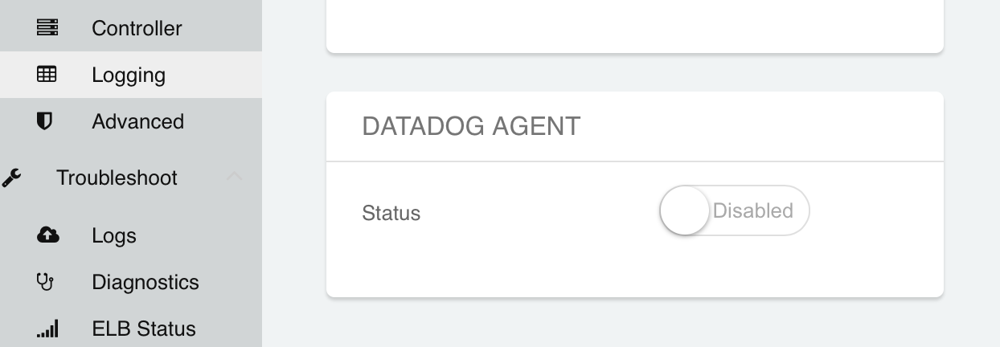
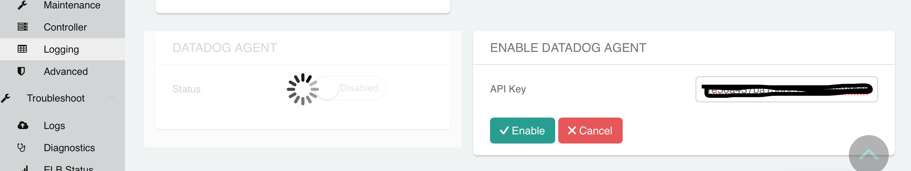

================================================================================
|imageLogo| Datadog Integration
================================================================================

Summary
-------
The Datadog integration sends system metrics from Aviatrix Gateways and the Controller to your Datadog instance.

Once enabled, all existing and new Gateways will send system metrics via an installed `Datadog agent <https://github.com/DataDog/dd-agent>`__ to the configured Datadog instance.

Prerequisites
-------------
In order to complete the steps in this guide, you'll need:

- A Datadog account and API Key

.. tip::
  Sign up for a Datadog account `here <https://www.datadoghq.com>`__.  Once you have an account, you can create a new `API Key` from the `Integrations~APIs <https://app.datadoghq.com/account/settings#api>`__ menu.

Enable/Disable Integration
--------------------------

Login to the Aviatrix Controller.  Go to the `Settings` in the navigation bar and click on `Logging`.  At the bottom of the page, find `Datadog Agent`:

  |imageAgentIsDisabled|

Change the status to `Enabled` and enter your Datadog `API Key` and finally click `Enable`.

  |imageEnableAgent|

What Data Is Collected
----------------------
Once enabled, the Controller will install and configure the `Datadog agent <https://github.com/DataDog/dd-agent>`__ on each of your Gateways and on the Controller automatically.

Host Name
---------

Metrics from Aviatrix Gateways will have a host name in this format ::

  aviatrix-gw-<Gateway Name>

The Aviatrix Controller will appear as::

  aviatrix-ucc-<Controller Public IP Address>

.. disqus::
