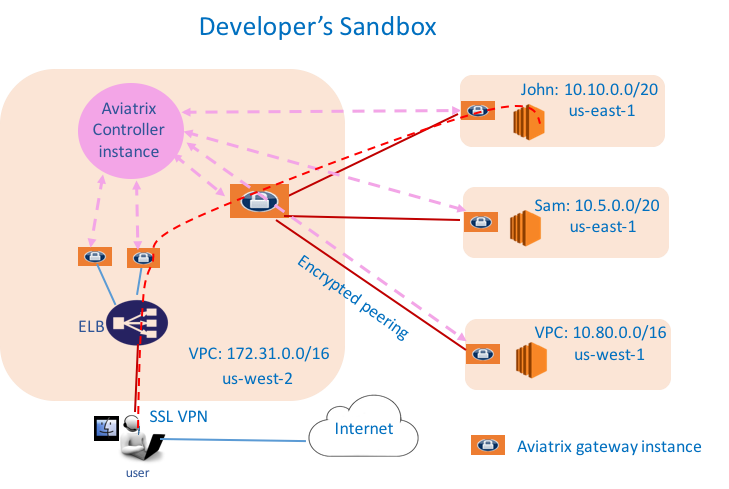

.. meta::
   :description: Developer's Sandbox Ref Design
   :keywords: Developer sandbox, sandbox, aviatrix

====================================
Developer’s Sandbox
====================================

Objective
=========

As a gatekeeper to manage a functional network for your production
environment in the cloud, security must be one of your top concerns. How
to keep your environment secure while giving your developers the freedom
to experiment and learn new services offered by AWS is a challenge. We
are here to help you.

This reference design leverages the multi tenants’ capability of
Aviatrix controller to build sandboxes for your developers. While the
developer has full administrative authority to her sandbox, the sandbox
itself is isolated from your main production environments.

The network diagram is shown below,

|image0|

where the Aviatrix controller instance can be in the same or a different
VPC, and two developer’s sandboxes are shown. John: 10.10.0.0/16 and
Sam: 10.5.0.0/16.

In this configuration, assume you want to the VPN to be in split tunnel
mode, that is, only traffic destined to the cloud go through the SSL
tunnel. If a user does general browsing to Internet or watch movies from
Hulu, traffic should be routed via her device WI-FI to ISP to Internet.
You do not wish to pay AWS for this type of compute and network costs.

Solution
========

The solution is to give John and Sam each their own AWS accounts, link
their accounts to your corporate root account, using the Consolidated
Billing feature offered by AWS.

http://docs.aws.amazon.com/awsaccountbilling/latest/aboutv2/consolidated-billing.html

With John’s own AWS account and API credentials, you create a
corresponding Cloud Account on the controller. Use this Cloud Account,
you can create VPC for John. John may have more privileges in his VPC.

Configuration Workflow
======================

Before you start make sure you have the latest software by checking the
Dashboard. If an alert message displays, click Upgrade to download the
latest software.

We assume here that you have created a management VPC 172.31.0.0/16, its
corresponding VPN gateways and John has been added as a VPN user. For
more information for this part of configuration, check out this
`reference
design <https://s3-us-west-2.amazonaws.com/aviatrix-download/Cloud-Controller/Cloud+Networking+Reference+Design.pdf>`__:

The configuration workflow is as follows, with major steps highlighted.

1. Create a Cloud Account for John

   Go to Accounts -> Cloud Account -> New Account, make sure:

	a. Account Name is unique to the controller, for example, JohnSmith.

	b. Account Password can be used to login in with Account Name.

	c. An email will be sent for this account created.

	d. Add AWS credentials for this account.

2. Create a VPC and Gateway for John

   Go to Advanced Config -> Create VPC Pool -> Create:

	a. Account Name: JohnSmith

	b. Pool Name: John

	c. Number of VPCs: 1

	d. VPC Size: the gateway size. A t2.micro maybe all you need. A t2.micro
	   Aviatrix gateway performance is between 40mbps to 80mbps.

	e. Launch Gateway: check

	f. Custom CloudFormation Script: a URL that points to your custom
	   CloudFormation script in S3. Note only VPC ID is taken as input
	   parameter. After gateway is launched, a CloudFormation stack will be
	   created. One use case for this script is security groups and policies
	   if you have a standard one.

	g. Public Subnets: check. This will create subnets whose default gateway
	   is IGW.

	h. Enable NAT: check. If this is checked, NAT function is integrated on
	   the gateway.

3. Build Encrypted Peering

   Go to Peering -> Encrypted Peering -> New Peering

   Note each VPC is represented by one or more gateways. Make sure you
   want to peer between two gateways without VPN capability. In this
   example, the peering is between John and the peering gateway in the
   management VPC 172.31.0.0/16 (no the VPN gateway)

4. Repeat the above two steps for other developers or projects.

5. Add users

   If you have not done so, add VPN user John to the cloud network. Go
   to OpenVPN, Use Profile to control which user can access what cloud
   instance/application/ports.

6. Done. 

.. disqus::
