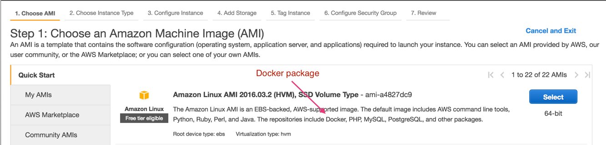

.. meta::
   :description: Docker swarm cluster installation
   :keywords: Docker, swarm, cluster, Aviatrix, swarm cluster

===========================================
Docker Swarm Cluster Installation
===========================================

Introduction
============

This document describes how to spin up a multi-host Docker swarm cluster
built on a VXLAN overlay network in AWS, where a host is a AWS instance
and multiple hosts may reside in the same VPC or different VPCs. If
there is underlying network connectivity to connect VPCs securely (such
as using Aviatrix encrypted peering), a swarm cluster can span across
multiple VPCs and to Azure and Google.

For a reference design on how to use Aviatrix OpenVPN® capability to
remotely access containers in a swarm cluster in the same manner as
accessing instances from your laptop, for example, being able to use
“curl” to a container running a web service, check out `this
link. <https://s3-us-west-2.amazonaws.com/aviatrix-download/Cloud-Controller/Container+Access+Reference+Design.pdf>`__

To build a Swarm cluster, there needs to be a manager instance, a consul
instance, and a few hosting instances. To simplify the topology, manager
and consul are combined into one instance.

There are many How to resources online on creating a swarm cluster with
a VXLAN overlay network, the guide below is intended to be a reference.

Installation Steps
==================

1. Create one manager/consul instance and few container hosting instances.
--------------------------------------------------------------------------

   At AWS console, launch instances by using Amazon Linux AMI with
   Docker package, as shown below:

   |image0|

2. Install docker daemon
---------------------------

|   For each of the above instances, do the following:

  | a.  ssh into each instance
  | b.  *sudo yum update*
  | c.  *curl -sSL https://get.docker.com/ \| sh*
  | d.  *sudo service docker start*
  | e.  *sudo service docker stop*
  | f.  *sudo docker daemon -H tcp://0.0.0.0:2375 -H unix:///var/run/docker.sock&*
  | g.  *sudo usermod -aG docker ec2-user*
  | h.  *logout*

3. Start manager/consul
-----------------------

|   On the manager/consul instance:

  | a.  ssh into the manager/consul instance
  | b.  *ifconfig eth0 (to get the consul’s eth0 IP address, for example, 172.31.12.28)*
  | c. *sudo docker run -d -p 8500:8500 --name=consul progrium/consul -server -bootstrap*
  | d.  *docker run -d -p 4000:4000 swarm manage -H :4000 --replication --advertise 172.31.12.28:4000 consul://172.31.12.28:8500*

4. Setup Docker configuration file
------------------------------------

|   On each container hosting instance:

  | a. ssh into each instance
  | b. Follow the same procedures as described in Step 2 to install docker daemon
  | c. *sudo vi /etc/sysconfig/docker*  and add the following line:
  |  OPTIONS="--default-ulimit nofile=1024:4096 -H tcp://0.0.0.0:2375 -H unix:///var/run/docker.sock --cluster-advertise eth0:2375 --cluster-store consul://172.31.12.28:8500"
  | d. *sudo service docker restart*

5. Join swarm cluster
----------------------

|   On each container hosting instance:

  | a.  ssh into each instance
  | b.   Use “\ *ifconfig eth0*\ ” to get container hosting instance’s own IP address, e.g. 172.31.14.64
  |    Tell consul my IP address and to join the swarm cluster:
  |    *sudo docker run -d swarm join --advertise=172.31.14.64:2375 consul://172.31.12.28:8500*

6. Create a VXLAN overlay network
------------------------------------

On the manager/counsul instance:

  |   a. ssh into each instance
  |   b. Create an overlay network “my-overlay-network” with network CIDR
        “10.0.0.0/24”:
        *docker -H :4000 network create - -subnet=10.0.0.0/24 my-overlay-network*
  |   c. To list the network and you will see the newly created
        “my-overlay-network” on each hosting instance joined the swarm
        cluster
  |      *docker network ls*

7. Launch a container
----------------------------

On each container hosting instance:

  |   a. ssh into the host
  |   b. Launch a container “test01” within the overlay network “my-overlay-network:
  |      *sudo docker run -itd --net my-overlay-network --name test01 ubuntu /bin/bash*
  |   c. Find out the overlay IP address for container “test01” assigned by consul. There are at least three ways:

      1. type command on the instance:

         *sudo docker inspect test01*

         The above command returns a json output, look for “IPAddress”
         under my-overlay-network.

      2. Type command on the instance:

         *docker network inspect my-overlay-network,* where
         my-overlay-network is the overlay network name.

      3. Alternatively, use the following command to find out overlay IP
         address:

         *docker inspect -f '{{.Name}} - {{range
         .NetworkSettings.Networks}}{{.IPAddress}}{{end}}' test01*

         where test01 is the container name.

8. Install Optional Tools (just for fun)
--------------------------------------------

a. Access into the container and install some network tools if you like:

    |   *sudo docker exec -ti test01 /bin/bash*
    |   *apt-get update --yes*
    |   *apt-get install net-tools --yes*
    |   *apt-get install iputils-ping –yes*

b. If you like to have ssh access to your container, follow these steps:

    |  *apt-get install openssh-server*
    |  *apt-get install vim*
    |  *sudo vi /etc/ssh/sshd\_config*

    |    and modify the following 2 lines to:

    |  *PermitRootLogin yes*
    |  *#StrictModes yes*

    |  Setup root password by typing command “passwd”
    |  *Sudo service ssh restart*
    |  *ifconfig eth0* to get the IP address

c. In the container, do “\ *ping 10.0.0.x*\ ” to other containers you
      created.

9. To add more container hosting instances, repeat steps 1, 2, 4, 5 and 7.
----------------------------------------------------------------------------

Note:

You may need to modify “Security Group” of each instance and manager to
allow the access to their ports.

OpenVPN is a registered trademark of OpenVPN Inc.

.. add in the disqus tag

.. disqus::
