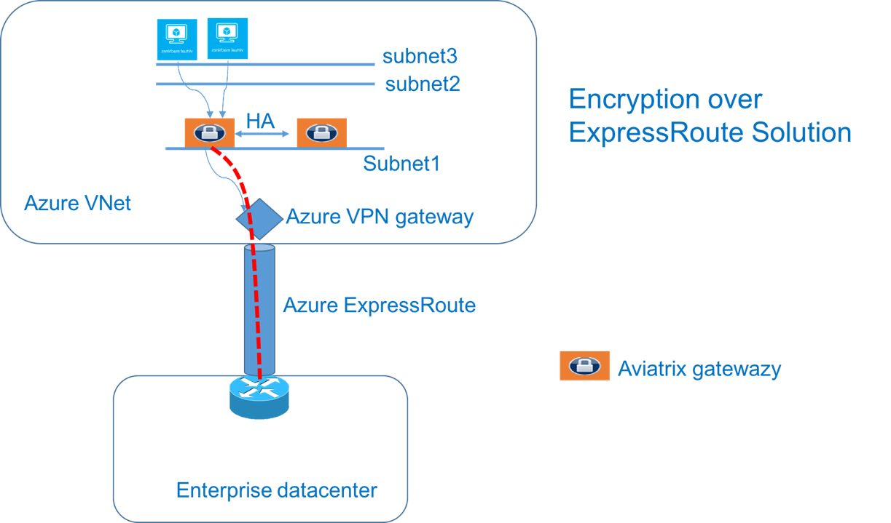

.. meta::
   :description: Encryption over Express Route
   :keywords: Encryption, Azure, encryption over azure, ExpressRoute, Aviatrix

######################################################
Encryption over Direct Connect/ExpressRoute
######################################################

The Problem
---------------------------

AWS Direct Connect and Azure ExpressRoute provide a private routed circuit to an AWS VPC and an Azure VNet. 

The Aviatrix Site2Cloud feature provides encryption over Direct Connect or ExpressRoute (named "Over Private Network" when configuring a Site2Cloud connection). 

This document describes how to implement the feature over Express Route. The same method applies to AWS. 

The VNet VPN gateway that terminates the ExpressRoute connects VNet virtual machines with the on-prem servers in a traditional routing domain. While Azure ExpressRoute provides a private link between a customer’s on-prem network and an Azure VNet without going through the Internet, packets between on-prem edge and VNet travel through exchange points and third party provider networks and are not encrypted. If encryption is a requirement for security and compliance reasons, this is a problem.

Aviatrix Solution for Encryption over ExpressRoute
---------------------------------------------------

The Aviatrix Site2Cloud solution can be applied to encrypt traffic over ExpressRoute, as shown below.

|image1|

In the diagram above, an encrypted IPsec tunnel is established between an Aviatrix Gateway and the customer’s edge router.

An Aviatrix Gateway is deployed in a separate subnet from the subnets where the user virtual machines are launched. (The Controller is not drawn.) This is necessary as the Aviatrix Gateway is the router for user subnets to reach the enterprise data center.

An Aviatrix Gateway can be deployed in a 1:1 redundancy fashion where a backup gateway is ready to take over should the primary IPsec tunnel go down due to gateway VM hardware/software failure.

Configuration Workflow
-----------------------------------

Before you start, make sure you have the latest software by checking the Dashboard. If an alert message displays, click **!New** to download the latest software.

For the network design, you must decide if you want to enable HA for the gateway.

The configuration workflow is as follows, with major steps highlighted.

| 1. Create a gateway in a VNet where you want to connect to the enterprise datacenter.
|     Go to Gateway > Create and make sure:

      -  The gateway is launched in a different subnet from the user subnets. In this example, the gateway is deployed on Subnet1.

      -  The gateway may have VPN access disabled.

| 2. (Optional) If HA is enabled, create a backup gateway in the same VNet.
|     Go to Gateway > Create, and make sure:

    -  The gateway is launched in a different subnet from the user subnets. In this example, the gateway is deployed on Subnet1.

    -  The gateway may have VPN access disabled.

| 3. Create a connection to the Enterprise data center.
|    Go to Site2Cloud > Add New and:
|
|   a. Select the VPC/VNet Name where the Aviatrix Gateway for encryption is launched.
|   b. If HA is not enabled:
|      i. In the Gateway field, select a gateway that was launched with encryption enabled.
|   c. If HA is enabled:
|      i.  In the Primary Cloud Gateway field, select a gateway launched earlier as primary gateway.
|      ii.  In the Backup Gateway field, select a gateway launched earlier as backup gateway.
|   d. Input the connection with a unique name (for example, FirstExpressRoute).
|   e. In the Remote Gateway IP Address field, enter the private IP address of the edge router for Enterprise data center.
|   f. In the Remote Subnet (Real) field, enter the network CIDR of the Enterprise datacenter. If there are multiple subnets, enter each one separated with a comma.
|   g. Select the Over Private Network check box.
|   h. In the Route Table To Modify field, select the route table(s) associated with subnet2 and subnet3.
    i. Enter the Remote Gateway Latitude/Longitude. Click `here <https://www.iplocation.net>`_ for information on how to obtain these values.
|
| 4. Download the configuration template:
|    
|   a. Select the Site2Cloud connection.
|   b. Click Download Configuration.
|   c. If your remote edge device is not listed in the dropdown menu, select an available one in the menu.
|   d. Click **Download Configuration** to download a template file that contains the gateway public IP address, VPC/VNet CIDR, and pre-shared secret and encryption algorithm or CA certificate. Incorporate the information to your remote router/firewall configuration.
|
| 5. At the enterprise data center or remote site, configure encryption on the edge device.
|   Make sure your peer network is Subnet2 and Subnet3, as shown in this example.
|

.. add in the disqus tag

.. disqus::
