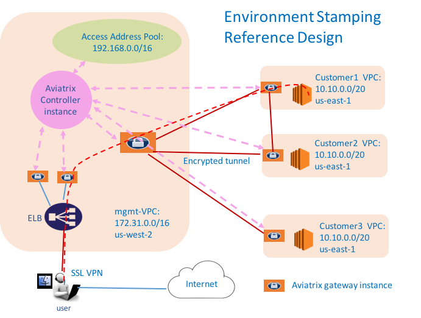

=====================================
Environment Stamping 
=====================================

Objectives
==========

This reference design helps you build a repeatable deployment solution
that scales indefinitely, as shown in the diagram below:

|image0|

where the Aviatrix controller instance can be in the same or a different
VPC. Each customer or managed VPC shares an identical VPC CIDR, security
policies and instances. A user who connects to the management VPC should
be uniquely address an instance in any given VPC by a private IP address
or with a preferred name.

Configuration Workflow
======================

Before you start make sure you have the latest software by checking the
Dashboard. If an alert message displays, click Upgrade to download the
latest software.

The configuration workflow is as follows. It highlights the major steps.

1. Create a gateway in management VPC

   The mgmt-vpc is our management VPC with CIDR 172.31.0.0/16 in
   us-west-2. Click Gateway, then Create, make sure:

   a. The VPC ID field is the AWS VPC ID where you launch the management gateway.

   #. The Gateway Name in this example is mgmt-gw.

   #. Enable NAT is not selected.

   #. VPN Access is not selected.

#. Create an Access Address Pool

   This Access Address Pool is the address range from which instance
   addresses are mapped to. Accessing instance is done by accessing one
   mapped address from the pool. Go to VPC/VNet -> Environment Stamping
   -> Map Instance Addresses -> Address Pool. Make sure:

   a. The Access Address Pool is big enough. In this example, we use 192.168.0.0/16 which gives you 16K unique IP addresses.

   #. Select mgmt-vpc as the gateway choice.

   #. Click Set.

#. (Optional) Setup Instance Names

   envStamping integrates Route 53 private hosted zone feature to
   enables you to access instances with DNS names and preferred (alias)
   names. Skip this step if you do not wish to use names to access
   instances.

   Go to VPC/VNet -> Environment Stamping -> Setup Instance Names ->
   Config. Enter a private domain name. For example, mydevops.com. Click
   Enable.

#. Create VPN gateways

   Create one or more VPN gateways in the management VPC for users to
   connect to AWS and access instances. In this example, we configure a
   split tunnel mode solution where only cloud bound traffic goes to the
   VPN tunnel. Among all fields you need to enter, make sure:

	|   a. Enable NAT is selected.
	|   b. VPN Access is selected.
	|      i.  VPN CIDR Block must be an address range that is outside of
	|           management VPC and all other VPCs you intend to create. In
	|           this example, enter 10.20.0.0/24.
	|      ii. Split Tunnel Mode is “Yes”.
	|          1. Additional CIDRs: enter the Access Address Pool CIDR. In
	|             this example, enter 192.168.0.0/16
	|          2. (optional) Nameservers: enter the private DNS server of the
	|             management VPC if Setup Instance Names is enabled. In this
	|             example, enter 172.31.0.2
	|          3. (optional) Search Domains: The private hosted zone domain
	|             name if Setup Instance Names is enabled. In this example,
	|             enter mydevops.com
	|   c. Enable AWS ELB is “Yes”.
	|   d. Save Template: check to save the template.
	|   e. Repeat the above steps to create more VPN gateways to achieve
	|      scalability and resilience.

#. Create a managed VPC pool and its gateways

   This step creates a number of managed VPCs and gateways. If you
   already have existing VPCs, you should use Gateway tab to just create
   gateways. Make sure VPN access is disabled.

   a. Go to VPC/VNet -> Environment Stamping -> Manage VPC Pool -> Create
   #. Pool Name: a name for this VPC pool. Every VPC created in this pool will have a numeric number append to it.
      In this example, enter customer.
   #. Number of VPCs: the number of VPCs. In this example, enter 3.
   #. Check Launch Gateway
        i. Enable NAT: check this box if you like the gateway to also perform NAT function.

#. Launch customer instances

   Once VPC and gateways are created, you can launch instances from AWS
   console or your own CloudFormation scripts. The pool of managed VPC
   may already have some instances.

#. Map instance addresses

   This step scans and maps instance private addresses in managed VPC to
   addresses from Access Address Pool, so that you can access these
   instances via Access Address Pool addresses.

   a. Go to VPC/VNet -> Environment Stamping -> Map Instance Addresses -> Auto Mapping

   #. Management VPC: select the gateway for management VPC. In this example, select mgmt-gw

   #. Managed VPC: select one gateway from managed VPC. In this example, select customer001. Click Scan & Map.

   #. Repeat the above step for all the remaining gateways in managed VPC.

   #. Go to VPC/VNet -> Environment Stamping -> Map Instance Addresses -> List to view your instances and their mapped addresses.

#. Add users

   Add VPN users to the cloud network. Go to VPC/VNet -> VPN Access ->
   Users. Use Profile to control which user can access what cloud
   instance/application/ports.

#. Access Instances with Names

   When a user connects to management VPC, she can access instances in
   all managed VPCs.

   The instances can be accessed by its mapped Access Address, DNS name
   or nickname. When using DNS names and nicknames, make sure you
   include the domain name. For example, an instance with nickname
   webfrontend should be accessed as webfrontend.mydevops.com

#. For support, please open a support ticket at `Aviatrix Support Portal <https://support.aviatrix.com>`_

#. For feature request, click Make a wish at the bottom of each page.

#. Enjoy!

.. disqus::
