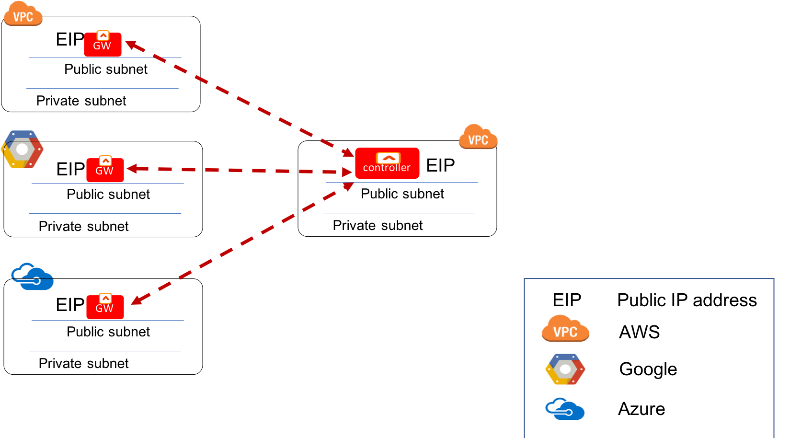

.. meta::
   :description: UCC Frequently Asked Questions
   :keywords: ucc, faq, frequently asked questions, ucc faq, aviatrix faq

===========================
Frequently Asked Questions
===========================

The Aviatrix product consists of a Controller and Gateways. When the product is deployed in the
public cloud marketplace, what you launch is the Controller instance. From the Controller console, you launch gateways by using cloud provider APIs.

When the product is deployed as a virtual appliance in a virtualized data center environment, the Controller and Gateway are bundled into one virtual image, such as OVF (Open Virtualization Format) and VHD (Virtual Hard Disk).

The following FAQ discusses only the cloud deployment scenario.

Aviatrix Secure Cloud Network Platform
=======================================

What can the Aviatrix platform do for me?
-----------------------------------------------------

Aviatrix cloud-native networking solution provides an end-to-end secure network solution
for AWS, Azure, Google GCloud, and Oracle Cloud (OCI). The solution includes `AWS Global Transit Network <http://docs.aviatrix.com/HowTos/transitvpc_faq.html>`_, an enterprise
`OpenVPN® <http://docs.aviatrix.com/HowTos/openvpn_faq.html>`_ access to VPC/VNet, `encrypted routing <http://docs.aviatrix.com/HowTos/peering.html>`_ for VPC/VNet to VPC/VNet traffic, `Stateful Firewall and Egress FQDN <http://docs.aviatrix.com/HowTos/FQDN_Whitelists_Ref_Design.html>`_ and
`monitoring and logging <http://docs.aviatrix.com/HowTos/AviatrixLogging.html>`_ of link status and latency. The solution enables
you to build a secure private network spanning one or more public clouds
where a user can access any instance/VM with a private IP address directly.
No more bastion stations and jump hosts: the solution gives the user the
seamless experience that they enjoy when using the on-prem network.

For an Aviatrix overview, check out `this document <http://docs.aviatrix.com/StartUpGuides/aviatrix_overview.html>`_.

In addition, the product interoperates with any third-party IPsec capable devices, including AWS VGW and Aviatrix's own on-prem virtual appliance CloudN.

Architecturally, Aviatrix solution is a centrally managed, loosely
coupled, and globally deployed platform built for the cloud from the
ground up.

How do I launch the product?
--------------------------------------------

The product consists of two components: the Controller and one or more
Gateways. The Gateway is launched from the Controller.

The Controller provides a central console for all provisioning,
monitoring and upgrades of the services.

The Controller is available in the AWS and Azure marketplace. It is also
available as a GCloud community image. For marketplace launch, search
for “Aviatrix” in marketplace.

* Follow `Getting Started on AWS <http://docs.aviatrix.com/StartUpGuides/aviatrix-cloud-controller-startup-guide.html>`_ instructions to launch the Controller on AWS.
* Follow `Getting Started on Azure <http://docs.aviatrix.com/StartUpGuides/azure-aviatrix-cloud-controller-startup-guide.html>`_ instructions to launch the Controller on Azure. 
* Follow `Getting Started on Google <http://docs.aviatrix.com/StartUpGuides/google-aviatrix-cloud-controller-startup-guide.html>`_ instructions to launch the Controller on Google.

What are the deployment requirements for the Aviatrix product?
--------------------------------------------------------------------------------

Aviatrix Controller and Gateways are deployed on subnets (public subnets in AWS, GCP, and OCI) with public IP addresses for Internet access, as shown below.

|deployment|

How do I access the Controller?
---------------------------------------

If your Controller is launched as a machine image (AMI/VM Image/Custom Image) from marketplace, you access the Controller instance via a web browser.

https://public\_IP\_address\_of\_the\_controller\_instance

Log in with the username “admin.” The first-time password is the private IP
address of the Controller instance. You are required to change the
password at your first login.

If you are using an Aviatrix Hosted Service (AHS), following the instructions sent to you to access. 

How do I secure the Controller access?
--------------------------------------------------

There are several ways to secure your Controller access, as discussed below. 

1. Enabling Controller Security Group Management
###############################################

Only TCP port 443 needs to be opened for inbound traffic to the
Controller. If you wish to reduce the scope of source addresses by
specifying a custom IP address, you must include all gateway public IP
addresses, in addition to your own public IP address. This is because
gateways launched from the Controller use its public IP address to
communicate back to the Controller.

You can use the Controller Security Management feature to automatically manage the Controller instance's inbound rules from gateways.  

Go to Settings > Controller > Access Security, select the `primary access account <http://docs.aviatrix.com/HowTos/aviatrix_account.html#setup-primary-access-account-for-aws-cloud>`_, and click **Enable**. 

.. note::

  After this feature is enabled, you can now edit the security rules that are outside gateways public IP addresses to limit the source address range. 

AWS:
^^^^^^^

AWS Network ACLs are not stateful, so they are not recommended for controlling access to/from Aviatrix Controllers and Gateways.

When this feature is enabled, the Controller will immediately create 4 security groups. Since each security group can support 50 security rules, the Controller can support up to 200 gateways. 

AZURE:
^^^^^^^^

When this feature is enabled, the Controller utilizes the associated network security group which can support up to 1,000 security rules.

.. note::

   If you deploy Aviatrix SAML clients for user VPN access, you can follow `this document <http://docs.aviatrix.com/HowTos/controller_security_for_SAML.html>`_ to add security to the Controller.

2. Using a Signed Certificate
##########################

The Aviatrix Controller is shipped with a self-signed certificate. Therefore, there is a "Note Secure" warning sign shown on your browser console. 

You can change that by importing your own signed certificate. To do so, go to Settings > Controller > Certificate. On the Controller Certificate Management page, select Generate CSR and Import Certificate. Here you generate a CSR (certificate sign request), and then import the CA and the signed Controller certificate. 

You can also use an `ALB in front of the Controller <./controller_ssl_using_elb.html>`__.

3. Removing Less Secure TLS Version(s)
####################################

You can disable access from a browser that runs TLSv1 and TLSv1.1 and only supports TLSv1.2. To do so, go to Settings > Advanced > Security > TLS Versions Support. Uncheck TLSv1 and TLSv1.1. 

4. Enabling LDAP or DUO Second Factor to Log in
################################################

In addition to username and password login credentials to the Controller, you can also enable LDAP or DUO authentication. 

To enable LDAP authentication, go to Settings > Controller > LDAP Login and fill the form. 

To enable DUO authentication, go to Settings > Controller > Duo Login and follow `the instructions <http://docs.aviatrix.com/HowTos/AdminUsers_DuoAuth.html#configuration-workflow-for-duo-authentication>`_ to set up DUO. 

5. Creating Read-Only Accounts
#############################

You can create read_only accounts for your operations team. They can view and list pages but not making changes. Follow the `answer <http://docs.aviatrix.com/HowTos/FAQ.html#can-there-be-read-only-account-for-operation-team>`_ to have it set up.

6. Remove Admin Account Login
###############################

The "admin" account login can be disabled to use an account user instead. 

To disable the admin login to the Controller, go to Settings > Controller > Login Customization. Click **Disable**.

Please note that you need a local user with admin privileges to be created before you can disable the "admin" account.

7. Encrypting the Controller EBS Volume
##################################

Follow the `instructions here <https://github.com/AviatrixSystems/EBS-encryption>`_ to encrypt the Controller EBS Volume after the Controller is launched. 

8. Encrypting the Gateway EBS Volume
#################################

Aviatrix Gateway EBS volume can be encrypted after it is launched following `the same instructions <https://docs.aviatrix.com/HowTos/encrypt_ebs_volume.html?highlight=volume>`_. In addition, we provide an `open source script <https://github.com/AviatrixSystems/EBS-encryption>`_ to automate the process.

9. Enabling Controller SAML Login
################################

You can enable `SAML authentication for Controller login. <https://docs.aviatrix.com/HowTos/Controller_Login_SAML_Config.html>`_

10. Securing Controller when using SAML for VPN User Authentication
######################################################################

This scenario is explained in detail `here <https://docs.aviatrix.com/HowTos/controller_security_for_SAML.html>`_

11. Enabling Login Banner
#######################

This function is explained in detail `here <https://docs.aviatrix.com/HowTos/controller_config.html#login-banner>`_.

What events does the Aviatrix Controller monitor?
--------------------------------------------------------------------------

 1. **VPN tunnel status** Alert when it goes down and alert when it comes back up.
 #. **Gateway health status** Alert when gateway goes to down state. Alert when it comes back up.
 #. **Overlap network CIDR range** Alert when BGP routes overlap. 
 #. **Route limit** Alert when BGP route limits reach a threshold. 
 #. **TGW Auditor** Monitors the configuration changes. Alert when there is an inconsistency between AWS console and Aviatrix Controller for resources related to TGW operation.
 #. **IAM role and policy** Alert when account IAM policy is not up to date or being deleted. 
 #. **Guard Duty integration** Alert and block malicious IP addresses.
 #. **Black hole route** Alert when VPC/VNet route table has inactive routes.  
 #. **Subnet** Alert when there are unwanted instances launched on specific subnets (public subnets in AWS, GCP, and OCI). 
 #. **CPU/Memory/Disk** Alert when gateway memory usage crosses 80% or disk space reaches 90% of its capacity.

How do I ensure my Transit Network is secure when an Aviatrix Gateway is deployed on an AWS public subnet?
--------------------------------------------------------------------------------------------------------------------------------------

The Customer Concerns
######################

Some organizations have concerns about having public subnets in a VPC in AWS. 
The concern is that if there were a public subnet in a VPC, 
users may find ways to launch an instance on the public subnet and associate the instance with a 
public IP address, thus enabling the instance to access the Internet without 
going through a proper egress firewall (in the cloud or on-prem).

The Reality 
##############

However, when deploying a `AWS Global Transit Network solution <https://aws.amazon.com/answers/networking/aws-global-transit-network/>`_, a vendor gateway must be deployed on a public subnet in the Transit VPC. This is true for all vendor appliances on the AWS marketplace. This is
because the vendor gateway in the Transit VPC establishes IPsec tunnels with Spoke VPC 
over public IP address, whether or not the Spoke VPC deploys a vendor gateway or VGW. Another reason is the vendor
gateway requires SSH access to configure its VPN tunnels. 

Note that this connectivity between Transit VPC and Spoke VPC, although using public IP addresses 
as IPsec tunnel endpoints, does not imply that traffic between Transit VPC and Spoke VPC go through the 
Internet. AWS recognizes that it owns these public IP addresses and therefore always
tries to route the traffic through its own backbone network without ever going out to Internet.   

The Aviatrix Solution
######################

An Aviatrix gateway instance has strict security groups. It only opens to the Controller on TCP port 443 and port 22 (for the Controller to reach the Gateway for diagnostics purposes.) 

In addition, Aviatrix provides multiple features to ensure your Transit Network is secure, as described below.

 #. If you use AWS Transit Gateway (TGW) to build a transit network, the Aviatrix Gateway is only launched in the transit VPC. All spoke VPCs have no Aviatrix Gateway.  
 #. Enable `Gateway Subnet Monitoring <http://docs.aviatrix.com/HowTos/gateway.html#monitor-gateway-subnet>`_. When this feature is enabled, the Controller will monitor the selected public subnets periodically. When it detects any instances being launched on these subnets, the Controller will alert the admin and stop the instances. 
 #. Enable `VPC Egress Firewall`. If you need to optimize application performance, you should consider allowing instances to access Internet directly, rather than backhauling to on-prem. When this feature is enabled, any traffic initiated from instances on the private subnet must go through the inline and in VPC egress whitelists before going out to the Internet.  
 #. Enable `Remote User VPN`. If you need to optimize developer experience (less latency, higher bandwidth), you should consider allowing users to access instances in the VPC directly with SSL VPN. When this feature is enabled, all user traffic is tracked and logged for audit and tracking purposes. 
 #. Secure the Controller. Follow the guidelines `here <http://docs.aviatrix.com/HowTos/FAQ.html#how-do-i-secure-the-controller-access>`_ to secure the Controller access. 
 #. Log everything. Enable `Logging` to send all events from gateways, Controllers and user activities to your favorite log service platform for audit and compliance. 

Is Aviatrix Cloud Gateway a SaaS offer?
------------------------------------------

No. The Aviatrix Controller and gateways are software products that are deployed in
your own network perimeter.

Onboarding
===============

Where do I start?
---------------------------

The first time you log in, complete the steps of the Onboarding process.

If you have a BYOL license or use a community image, you need to have a
customer ID provided by Aviatrix to be able to use the product. Please open a support ticket at `Aviatrix Support Portal <https://support.aviatrix.com>`_ if you do not have a customer ID.

What is an Aviatrix Access Account?
----------------------------------------------

An Aviatrix Access Account is specific and unique on the Controller. It
contains cloud credentials, for example, your AWS IAM Access Key ID and
Secret Key. The Controller uses these credentials to launch Aviatrix
gateways by using cloud APIs.

An Aviatrix Cloud Account can correspond to multiple cloud accounts. For
example, it can contain credentials for an AWS IAM account, Azure
account, and GCloud account.

How do I upgrade the software?
------------------------------------------

Click Settings > Upgrade. This upgrades to the latest release of the
Controller software.

When a new release becomes available, an alert message appears on
Dashboard. An email will also be sent to the admin of the Controller.

Is there a reference design example?
---------------------------------------

Check out docs.aviatrix.com.

What is the support model?
---------------------------------------

For support, please open a support ticket at `Aviatrix Support Portal <https://support.aviatrix.com>`_ or reach out to your respective Account Executive.
We also offer `Platinum <https://aviatrix.com/support/>`__ customers with 24x7 support.

Logging and Monitoring
======================

How do I forward syslog events to my Logstash server?
----------------------------------------------------------------------

Click on Settings > Logging > LogStash logging and input the required
parameters to enable forwarding of Controller syslog events and all
gateways syslog and auth log to a Logstash server.

SUMO Logic, Splunk, DataDog and rSyslog are also supported.

What are the monitoring capabilities?
-----------------------------------------------

Encrypted tunnel (peering and site2cloud) status is monitored. When a tunnel status changes, an alert email is sent to the Controller admin.

Active VPN users are displayed on the Dashboard. Click on any username and
the user VPN connectivity history is displayed.

You can also disconnect a user from the dashboard.

Can alert emails be sent to a different email address?
-----------------------------------------------------------------

Yes, you can choose an alternative email address to send alert messages.
This is useful if the Controller admin is different from the operation team.

Administration
==============

Can there be multiple admins?
---------------------------------------

Yes. Username “admin” is the default admin user. But you can create
multiple users with admin privileges.
Follow `the instructions <http://docs.aviatrix.com/HowTos/AdminUsers_DuoAuth.html>`_ to learn more about setting up multiple admin users.

Is there 2FA support to log in to the console?
----------------------------------------------------------

Yes. In addition to password login, DUO authentication and LDAP are supported.

Starting from Release 4.2, SAML authentication is supported to login to the Controller console. 

Can there be read-only account for operation team?
-----------------------------------------------------------------

Yes. Navigate to Accounts > Account Users > Add a New User, at Account Name field and select "read_only" from the dropdown menu. This user account will have views to all pages but cannot make changes to any configurations.

Is Aviatrix FIPS 140-2 compliant?
-------------------------------------------

Yes. Aviatrix has achieved FIPS 140-2 compliant status with certificate number `#3273 <https://csrc.nist.gov/projects/cryptographic-module-validation-program/certificate/3273>`_ as listed at NIST site. 

What are the FIPS 140-2 compliant algorithms?
------------------------------------------------

FIPS 140-2 approved crypto functions can be found in `this link. <https://csrc.nist.gov/csrc/media/publications/fips/140/2/final/documents/fips1402annexa.pdf>`_. According to this document, the following algorithms that are supported on Aviatrix are FIPS 140-2 compliant. 

=======================      ==========
**IPsec algorithms**         **Value**
=======================      ==========
Phase 1 Authentication       SHA-1, SHA-512, SHA-384, SHA-256
Phase 1 DH Groups            2, 1, 5, 14, 15, 16, 17, 18
Phase 1 Encryption           AES-256-CBC, AES-192-CBC, AES-128-CBC, 3DES
Phase 2 Authentication       HMAC-SHA-1, HMAC-SHA-512, HMAC-SHA-384, HMAC-SHA-256
Phase 2 DH Groups            2, 1, 5, 14, 15, 16, 17, 18
Phase 2 Encryption           AES-256-CBC, AES-192-CBC, AES-128-CBC, AES-128-GCM-64, AES-128-GCM-96, AES-128-GCM-128, 3DES
=======================      ==========

SSL VPN encryption algorithm set on the server is AES-256-CBC. For OpenVPN clients running a version 2.3 or lower the negotiated algorithm would be AES-256-CBC. For OpenVPN clients running 2.4 or higher, the negotiated algorithm would be AES-256-GCM due to NCP (Negotiable Crypto Parameters)

SSL VPN authentication algorithm is SHA512.

What is the difference between IKEv1 and IKEv2?
----------------------------------------------------------------

Internet Key Exchange (IKE) protocol is the control plane to IPsec data encryption. 
Its responsibility is in setting up security association that allow two parties 
to send data securely. 

There is no difference in data encryption algorithms and data encryption strength 
itself between IKEv1 and IKEv2. 

The primary difference between IKEv1 and IKEv2 is that it takes fewer messages to 
establish the security association in IKEv2. 

There are a couple of other differences regarding IKEv2, which has a better support for mobile devices which does not apply to site to site and site to cloud VPN where Aviatrix is being used. 

How to encrypt Aviatrix Controller and gateway EBS volume?
-----------------------------------------------------------------------------

You can follow the `instructions here <https://www.alienvault.com/documentation/usm-appliance/kb/2017/02/encrypting-root-volumes-for-aws-deployments.html>`_ to encrypt the Controller.

For automation, you can reference our `python script on the Github repository. <https://github.com/AviatrixSystems/EBS-encryption>`_   

Starting Release 4.2, Aviatrix gateway EBS volume can be encrypted from the Controller. 

How do I launch the Controller by Terraform?
-------------------------------------------------------

Terraform for Controller launch is supported as a community project on Github on `this Aviatrix repo. <https://github.com/AviatrixSystems/terraform-modules>`_

How do I migrate a Controller from a Metered license to BYOL license?
-------------------------------------------------------------------------------------

Follow the instructions described in `this document. <https://docs.aviatrix.com/HowTos/Migration_From_Marketplace.html>`_

What is the best practice to ensure high availability of the Controller?
---------------------------------------------------------------------------------------

The best practice is to enable `backup and restore function <https://docs.aviatrix.com/HowTos/controller_backup.html>`_. 
In the event of Controller being terminated or become non-functional, you can restore the system by following the instructions `here. <https://docs.aviatrix.com/HowTos/Migration_From_Marketplace.html>`_

Since Aviatrix Controller is not in the data plane, temporary loss of the Controller does not affect the existing tunnels or packet forwarding. 

For AWS deployment, you can also enable `Controller HA <https://docs.aviatrix.com/HowTos/controller_ha.html>`_ for auto recovery when the current Controller becomes unhealthy. 

Do you have the CloudFormation source code for launching the Controller?
-------------------------------------------------------------------------------------------

Yes, the source repository for Controller launch can be found on Github at `here. <https://github.com/AviatrixSystems/aws-controller-launch-cloudformation-templates>`_

How are security updates handled and delivered by Aviatrix?
----------------------------------------------------------------------------

These are the steps:

 1. **Field Notice** All Aviatrix customers are notified when a security update is available. 
 #. **Security Patch** Aviatrix Controller provides a inline software patch to fix vulnerability with the instructions from the Field Notice. The updates do not require reboot of the Controller or gateways most of the time. 

How can an account recover when a Controller software upgrade fails?
------------------------------------------------------------------------------------------

Here is the best practice procedure to follow:

 1. Before a software upgrade, go to Settings > Maintenance > Backup & Restore > Backup Now. This will save a copy of the deployment configuration to your S3 bucket. 
 #. Do a dry run before upgrading. Go to Settings > Maintenance > Upgrade > Upgrade to the Latest > Dry Run. If the Dry Run is successful, proceed to the next step. If the Dry Run fails, do not proceed to the upgrade until you determine the root cause of the issue. 
 #. Upgrade. Go to Settings > Maintenance > Upgrade > Upgrade to the Latest > Upgrade. Wait for the process to finish.
 #. If Controller upgrade is successful and some gateways fail, you can 'force upgrade' the failed gateway again. Go to Troubleshoot > Gateway > Force Upgrade. Select the gateway and click **Upgrade**. 
 #. If Gateway force upgrade fails, proceed to replace the gateway. Go to Troubleshoot > Gateway > Gateway Replace. Select the failed gateway and click **Replace**.

What IP addresses does the Controller need to reach out to?
----------------------------------------------------------------------------

Please see `Required Access for External Sites <https://aviatrix.zendesk.com/hc/en-us/articles/4417312119437-Aviatrix-Products-Access-to-external-FQDN-required>`_. 

.. note::
	You must be registered to access the Aviatrix Customer Support website. If you are not already registered, you can sign-up at https://support.aviatrix.com.

What IP addresses does an Aviatrix Gateway need to reach out to?
-----------------------------------------------------------------------------------
Please see `Required Access for External Sites <https://aviatrix.zendesk.com/hc/en-us/articles/4417312119437-Aviatrix-Products-Access-to-external-FQDN-required>`_. 

.. note::
	You must be registered to access the Aviatrix Customer Support website. If you are not already registered, you can sign-up at https://support.aviatrix.

Centralized Logging Within AWS Government Cloud
-----------------------------------------------------------------
When attempting to perform centralized logging for AWS Government Cloud, due to
restrictions with communication inside of Government Cloud, it is not possible to have your 
Aviatrix Controller hosted in AWS Public Cloud and receive logs from gateways in AWS Gov
Cloud. In order for the Aviatrix Controller to be able to accept logs from gateways inside of the
Government Cloud, the Aviatrix Controller must be hosted within AWS Government Cloud as well.

How does an Aviatrix Gateway support high availability in Azure?
---------------------------------------------------------------------------------

Aviatrix support Azure Availability Set for HA gateway provides 99.95% of up time. 

Azure has started to introduce Availability Zone in some regions. Aviatrix will start to support this option in the future. 

.. |image1| image:: FAQ_media/image1.png

.. disqus::
