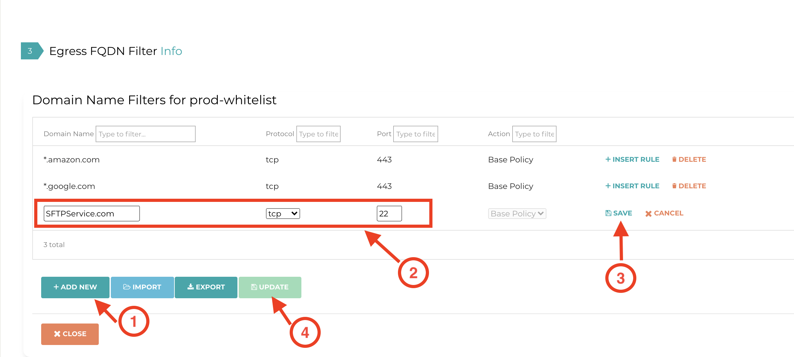

.. meta::
   :description: FQDN whitelists reference design
   :keywords: FQDN, whitelist, blacklist, Aviatrix, Egress Control, AWS VPC, Azure VNet, OCI VCN

=================================
 Egress Control Filter
=================================

For questions, please see the `Egress FQDN FAQ <https://docs.aviatrix.com/HowTos/fqdn_faq.html>`_ or learn more about `FQDN here <https://www.aviatrix.com/learning/glossary/fqdn.php>`_.

Configuration Workflow
======================

.. tip ::

 The instructions below assume there is already an Aviatrix Gateway running in the VPC/VNet where you wish to deploy FQDN filter. If not, follow the Egress Control workflow to first launch a gateway.

Adding a New Tag
---------------------

Go Security > Egress Control and click **New Tag**, as shown below:

|fqdn-new-tag|

Click **+ New Tag**, and enter a name for the tag, for example, prod-whitelist, as shown below:

|fqdn-add-new-tag|

Adding a URL List to the New Tag
------------------------------------------

Enable the new tag and click **Edit**, as shown below:

|fqdn-enable-edit|

Click **+ Add New** to add each URL, wild card is allowed for HTTP/HTTPS (TCP 443), as shown below.
(Action "Update" means to save the rules in the tag. If gateways are attached to the tag, "Update" applies the rules to the gateways.)

|fqdn-add-domain-names|

Base Policy
^^^^^^^^^^^^

Base Policy is a new Action field of a rule available in Release 5.2. It only applies to a rule whose Whitelist is on TCP port 80 or 443.

The default Action field is Base Policy which means if the tag is a WhiteList
(which is the majority of the use case), this specific rule is to allow the domain name to pass. For the most part, you should not
edit this field.

There is a use case where you want to leverage the Active field. For example, you need to allow most of the FQDN names
in salesforce.com except for one domain name, finance.salesforce.com. If salesforce.com provides hundreds of domain names, you would
have to whitelist all of them and you cannot use ``*.salesforce.com`` as it will leak finance.salesforce.com.

With the new feature, you can now configure two rules to accomplish filtering out finance.salesforce.com while allowing the rest of salesforce.com supported domain names, as shown below:

==========================================    ================   ==================  =============
Domain Name                                   Protocol           Port                Action
==========================================    ================   ==================  =============
finance.salesforce.com                        tcp                443                 Deny
``*``.salesforce.com                          tcp                443                 Base Policy
==========================================    ================   ==================  =============

Attaching to Gateways
-------------------------------

Click **Attach Gateway** to attach a gateway to the tag.

When a gateway is attached to a tag, the gateway in the tag will be pushed for
enforcement (Whitelist or Blacklist), as shown below:

|fqdn-attach-spoke1|

Repeat this step if you have more gateways that should be attached to this tag.

|fqdn-attach-spoke2|

Adding More Tags
---------------------------------

Repeat the previous steps to create more tags and attach them to the same gateway or different gateways.
However, if multiple tags are attached to the same gateway, then the mode (Whitelist or Blacklist) must be identical.

Exception Rule
===============

Exception Rule is a system-wide mode. **Exception Rule only applies to whitelist**. 

By default, the Exception Rule is enabled. (The Exception rule checkbox should be marked.)

|exception_rule|

When Exception Rule is enabled, packets passing through the gateway without an SNI field are
allowed to pass. This usually happens when an application uses hard-coded destination
IP addresses for HTTPS connection instead of domain names.

When Exception Rule is disabled (unmark the checkbox), packets passing through the gateway without SNI field
are dropped unless the specific destination IP address of the
packet is listed in the Whitelist. The use case could be that certain old applications use
hard coded destination IP address to access external services.

If Blacklist is configured, client hello packets without SNI is allowed to pass as it should not match any rules. 

Export
==============

This feature is available in Release 3.4 and later.

Export allows you to download the configured FQDN rules on a per tag basis,
in a human-readable text file format, as shown in the example below:

|export|

Import
========

This feature is available in Release 3.4 and later.

Import allows you to upload a text file that contains FQDN rules to a specific tag.
The text file can be:

 1. The downloaded file from `FQDN Discovery <https://docs.aviatrix.com/HowTos/fqdn_discovery.html>`_.
 #. The download file from Export from a different tag.
 #. A text file in the format compatible to Export.

Edit Source
==============

Edit Source is available in Release 4.0 and later.

Edit Source allows you to control which source IP in the VPC/VNet is qualified for a specific tag. The source IP
can be a subnet CIDR or host IP addresses. This provides fine-grained configuration.  

.. important::
  If Edit Source is not configured, i.e., no source IP address ranges are selected, all packets arriving at the FQDN gateway
  are applied to the filter tag. However if there are one or more source IP address ranges selected, any packets with 
  source IP addresses outside those ranges are dropped. In this regard, the distinguished Source is exclusive. 

For example, one use case is if you have two private subnets in a VPC/VNet: one deploys dev instances and another
deploys prod instances. With the Edit Source feature, the dev instances can have different tags than
the prod instances.

Edit Source assumes you already attached a gateway to a tag.

To go to the Edit Source page, click **Edit Source** at Egress FQDN Filter on a specific tag and follow
the example in the illustration below, the network appeared on the right hand of the panel go through the FQDN tag filtering while 
the network on the left side of the panel are dropped.

|source-edit|

Enabling Private Network Filtering
=================================

This is a global configuration that applies to  all FQDN gateways. 

By checking this option, destination FQDN names that translate to private IP address range (RFC 1918) are subject to FQDN whitelist filtering function. The use case is if your destination hostname is indeed a private service and you wish to apply FQDN filtering, you can enable this option.

To configure this option, go to Security > Egress Control > Global Configs > Enable Private Network Filtering. FQDN names that are resolved
to RFC 1918 range will be subject to FQDN filter function.

Disabling Private Network Filtering
===================================

This is a global configuration that applies to  all FQDN gateways. 

By checking this option, packets with destination IP address of RFC 1918 range are not inspected. This is the default behavior.

To configure, go to Security > Egress Control > Global Configs > Disable Private Network Filtering. FQDN names that are resolved
to RFC 1918 range will be subject to FQDN filter function.

Customizing Network Filtering
==============================

This is a global configuration that applies to  all FQDN gateways. 

When this option is selected, you can customize packet destination address ranges not to be filtered by FQDN.  

To configure, go to Security > Egress Control > Global Configs > Customize Network Filtering. Select pre-defined RFC 1918 
range, or enter your own network range. 

This feature is not enabled as default.

FQDN Name Caching
=====================

This is a global configuration that applies to  all FQDN gateways. 

If FQDN Name caching is enabled, the resolved IP address from FQDN filter is cached so that if subsequent TCP session matches the 
cached IP address list, FQND domain name is not checked and the session is allowed to pass. 

We recommend disabling Caching to prevent unwanted domain names to bypass filter as they resolve to the same IP address. For example, youtube.com shares the same destination IP address range as google.com. There is minimal performance impact by disabling the cache. 

To configure this option, go to Security > Egress Control > Global Configs > Caching > click **Enabled** to set the toggle switch to **Disabled**.

This feature is enabled as default.

Exact Match
==============

This is a global configuration that applies to all FQDN gateways. 

If a FQDN rule does not have * an exact match is expected. If this global option is not enabled, FQDN rules use regex to match any FQDN names that are subset of the name. For example, if salesforce.com is a rule and Exact Match option is enabled, finance.salesforce.com is not a match and will be dropped.

This feature is not enabled as default.

For support, please open a support ticket at `Aviatrix Support Portal <https://support.aviatrix.com>`_

.. |fqdn| image::  FQDN_Whitelists_Ref_Design_media/fqdn.png
   :scale: 30%

.. |fqdn-new-tag| image::  FQDN_Whitelists_Ref_Design_media/fqdn-new-tag.png
   :scale: 30%

.. |fqdn-add-new-tag| image::  FQDN_Whitelists_Ref_Design_media/fqdn-add-new-tag.png
   :scale: 30%

.. |fqdn-enable-edit| image::  FQDN_Whitelists_Ref_Design_media/fqdn-enable-edit.png
   :scale: 30%

.. |fqdn-attach-spoke1| image::  FQDN_Whitelists_Ref_Design_media/fqdn-attach-spoke1.png
   :scale: 30%

.. |fqdn-attach-spoke2| image::  FQDN_Whitelists_Ref_Design_media/fqdn-attach-spoke2.png
   :scale: 30%

.. |source-edit| image::  FQDN_Whitelists_Ref_Design_media/source-edit.png
   :scale: 30%

.. |export| image::  FQDN_Whitelists_Ref_Design_media/export.png
   :scale: 30%

.. |exception_rule| image::  FQDN_Whitelists_Ref_Design_media/exception_rule.png
   :scale: 30%

.. add in the disqus tag

.. disqus::
