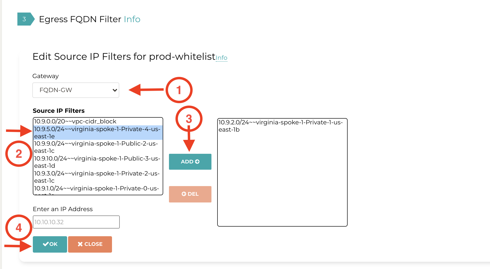

.. meta::
   :description: FQDN whitelists reference design
   :keywords: FQDN, whitelist, Aviatrix, Egress Control, AWS VPC

=================================
 Egress Control Filter 
=================================

For questions, check out `Egress FQDN FAQ <https://docs.aviatrix.com/HowTos/fqdn_faq.html>`_.

Configuration Workflow
======================

.. tip ::

 The instruction below assumes there is already an Aviatrix gateway running in the VPC where you wish to deploy FQDN filter. If not, follow the Egress Control workflow to first launch a gateway. 

Step 1. Add a new tag
---------------------

Go Security -> Egress Control, click New Tag, as shown below:

|fqdn-new-tag|

Click "+New Tag", and enter a name for the tag, for example, prod-whitelist, as shown below:

|fqdn-add-new-tag| 

Step 2. Add URL list to the new tag
-----------------------------------

Enable the new tag and click Edit, as shown below:

|fqdn-enable-edit|

Click "+Add New" to add each URL, wild card is allowed for HTTP/HTTPS (TCP 443), as shown below.
(Action "Update" means to save the rules in the tag and if gateways are attached to the tag, "Update" applies the rules to the gateways.)

|fqdn-add-domain-names|

Step 3. Attach to gateways
---------------------------

Click "Attach Gateway" to attach a gateway to the tag. 

When a gateway is attached to a tag, in the tag will be pushed for 
enforcement (whitelist or blacklist), as shown below. 

|fqdn-attach-spoke1|

Repeat Step 3 if you have more gateways that should be attached to this tag. 

|fqdn-attach-spoke2|

Add more tags
-------------

Repeat from Step 1 to create more tags and attach different gateways. 
Note each gateway can only be attached to one tag. 

Exception Rule
===============

Exception rule is a system wide mode. 

When Exception Rule is enabled, packets passing through the gateway without SNI field are 
allowed to pass. This usually happens when an application uses hard coded destination 
IP address for HTTPS connection instead of domain names. This could be a security loop hole.

When Exception Rule is disabled, packets passing through the gateway without SNI field 
are dropped unless the specific destination IP address of the 
packet is listed in the Whitelist. The use case could be certain old application uses 
hard coded destination IP address to access outside services.  

Export
==============

This feature is available in Release 3.4 and later. 

Export allows you to download the configured FQDN rules on a per tag bases, 
in a human readable text file format, as shown in the example below:

|export| 

Import
========

This feature is available in Release 3.4 and later. 

Import allows you to upload a text file that contains FQDN rules to a specific tag. 
The text file can be: 

 1. The downloaded file from `FQDN Discovery <https://docs.aviatrix.com/HowTos/fqdn_discovery.html>`_
 #. The download file from Export from a different tag. 
 #. A text file in the format compatible to Export. 

Edit Source
==============

Edit Source is available in Release 4.0 and later. 

Edit Source allows you to control which source IP in the VPC is qualified for a specific tag. The source IP 
can be a subnet CIDR or host IP addresses. This provides fine grained configuration. 

One use case for example, is if you have two private subnets in a VPC, one deploys dev instances and another 
one for prod instances. With Edit Source feature, the dev instances can have a different TAGs than
the prod instances.

Edit Source assumes you have already attached a gateway to a tag. 

To go to the Edit Source page, click "Edit Source" at Egress FQDN Filter on a specific tag and follow
the example in the illustration below. 

|source-edit|

For support, send email to support@aviatrix.com

Enjoy!

.. |fqdn| image::  FQDN_Whitelists_Ref_Design_media/fqdn.png
   :scale: 50%

.. |fqdn-new-tag| image::  FQDN_Whitelists_Ref_Design_media/fqdn-new-tag.png
   :scale: 50%

.. |fqdn-add-new-tag| image::  FQDN_Whitelists_Ref_Design_media/fqdn-add-new-tag.png
   :scale: 50%

.. |fqdn-enable-edit| image::  FQDN_Whitelists_Ref_Design_media/fqdn-enable-edit.png
   :scale: 50%

.. |fqdn-add-domain-names| image::  FQDN_Whitelists_Ref_Design_media/fqdn-add-domain-names.png

.. |fqdn-attach-spoke1| image::  FQDN_Whitelists_Ref_Design_media/fqdn-attach-spoke1.png
   :scale: 50%

.. |fqdn-attach-spoke2| image::  FQDN_Whitelists_Ref_Design_media/fqdn-attach-spoke2.png
   :scale: 50%

.. |export| image::  FQDN_Whitelists_Ref_Design_media/export.png
   :scale: 50%

.. add in the disqus tag

.. disqus::
