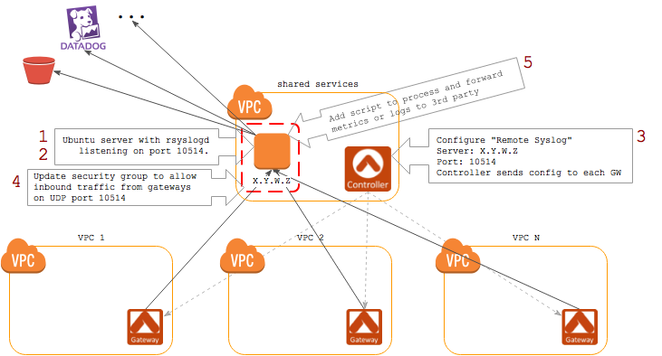

==========================================
 Forward Logs to a Central Logging Server
==========================================

Overview
========

Aviatrix supports forwarding logs from the gateway(s) to a central logging server for processing.  This is particularly useful for connecting to services such as Datadog or for processing the logs prior to being sent to another log service such as Splunk.

Step-by-step Deployment Guide
=============================

Solution Overview
-----------------

In addition to direct integrations with services like Splunk and Sumologic, the Aviatrix Controller supports forwarding logs to another syslog server.

If your logging provider requires that you process the data before it is sent to it, you can forward these logs to a Linux server that will handle the processing and forwarding.  This solution guide will walk you through configuring this.

Steps to complete:

|imageOverview|

#. Create an `EC2 instance <#step1>`__ that will receive logs from all gateways
#. Configure `rsyslogd <#step2>`__ on the instance
#. `Configure Aviatrix <#step3>`__ to forward logs your new instance
#. Update the `security group <#step4>`__ for the instance to allow traffic from each Aviatrix Gateway
#. Implement `processing logic <#step5>`__ (or use one provided by Aviatrix) to process and forward the logs

.. _step1:

Create an EC2 instance
----------------------

#. Create a new EC2 instance to receive logs from the gateways

.. _step2:

rsyslogd
--------

#. Install rsyslogd

   .. code-block:: shell

      sudo add-apt-repository ppa:adiscon/v8-stable
      sudo apt-get update
      sudo apt-get install rsyslog

   .. note::
      (see http://www.rsyslog.com/ubuntu-repository/ for more details)

#. Configure rsyslogd to accept messages on your desired port

   #. SSH and login to the EC2 instance
   #. Check that the /etc/rsyslogd.conf is listening on UDP or TCP port.  Optionally, update the port.

      .. code-block:: shell

         # provides UDP syslog reception
         $ModLoad imudp
         $UDPServerRun 10514

      .. note::
         Use any port you wish here.

.. _step3:

Enable Log Forwarding in Aviatrix Controller
--------------------------------------------

#. Login to your Aviatrix Controller
#. Expand the `Settings` navigation group
#. Click on `Logging`
#. Scroll down to the `Remote Syslog` section.  Click on the `Disabled` button to enable remote syslog.
#. Enter the data

   +------------------+-----------------------------------------------------+
   | Field            | Value                                               |
   +==================+=====================================================+
   | Server           | Enter the IP address of the EC2 instance created    |
   |                  | in earlier step.                                    |
   +------------------+-----------------------------------------------------+
   | Port             | Enter the port of the listening service             |
   +------------------+-----------------------------------------------------+
   | Cert             | Upload the certificate (optional)                   |
   +------------------+-----------------------------------------------------+
   | Protocol         | Select TCP or UDP                                   |
   +------------------+-----------------------------------------------------+
   | Optional Custom  | Enter a rsyslog template.  See below for more       |
   | Template         | details.                                            |
   +------------------+-----------------------------------------------------+

#. Click `Enable`

.. _step4:

Update Security Group of Receiving Instance
-------------------------------------------

Allow inbound traffic on the selected UDP/TCP port to the EC2 instance you created earlier.

.. _step5:

Implement Processing Logic
--------------------------

Implement the logic to process the incoming logs and forward to the log service.  A few examples are provided below.

Write Logs to S3
################

#. Install `AWS CLI <https://docs.aws.amazon.com/cli/latest/userguide/installing.html>`__

   .. note::
      You may need to install the package ``python-pip`` first

#. Create a directory on the local file system (e.g., /var/log/aviatrix)

   .. code-block:: shell

      sudo mkdir /var/log/aviatrix

#. Change the ownership of this directory to allow the rsyslogd user to write files to this directory

   .. code-block:: shell

      sudo chown syslog:adm /var/log/aviatrix
      sudo chmod 750 /var/log/aviatrix

#. Create a new rsyslogd configuration file ``/etc/rsyslog.d/22-aviatrix.conf`` with the following configuration:

   .. code-block:: shell

      :msg, contains, "Aviatrix" /var/log/aviatrix/gateways.log

      # comment out the following line to allow Aviatrix messages through.
      & stop

#. (optional) Reload rsyslogd configuration

   .. code-block:: shell

      sudo /etc/init.d/rsyslogd force-reload
   
#. Create a script to move the log files to S3.  There is a template below:

   .. code-block:: shell
   
      #!/bin/sh
      
      DIR=/var/log/aviatrix
      if [ ! -d ${DIR} ]; then exit 1; fi
      DESTDIR=s3://mybucket
      
      current_time=$(date +%Y-%m-%dT%H-%M-%S)
      new_filename=gateways.${current_time}.log
      
      # rename the file
      if [ -f ${DIR}/gateways.log ]; then
          sudo mv ${DIR}/gateways.log ${DIR}/${new_filename}
          if [ $? -ne 0 ]; then exit 2; fi
      
          # HUP rsyslogd to start logging to new file
          sudo killall -HUP rsyslogd
          if [ $? -ne 0 ]; then exit 3; fi
      fi
      
      # copy any outstanding file(s) to s3 bucket
      cd ${DIR}
      for f in $(ls); do
        if [ "$f" != "gateways.log" ]; then
            aws s3 cp ${DIR}/$f ${DESTDIR}/${new_filename}
            if [ $? -eq 0 ]; then
                sudo rm -f ${DIR}/$f
            fi
        fi
      done

#. Create a crontab entry to run this script as often as desired

Datadog
#######

For Datadog integration, please see `this <https://github.com/AviatrixSystems/ThirdPartyLogIntegration>`__ Github repository.

Use the following `Optional Custom Template`:

.. code:: shell

     constant(value="tenant-identifier")
     constant(value="\t")
     property(name="timereported")
     constant(value="\t")
     property(name="msg")
     constant(value="\n")

