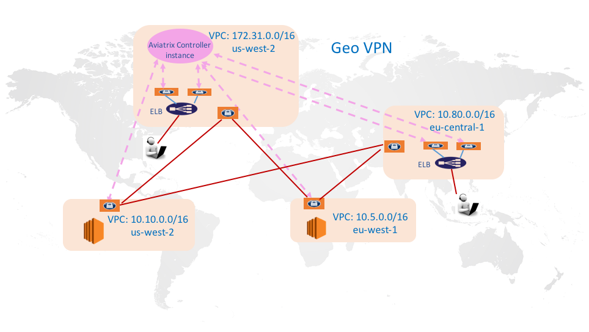
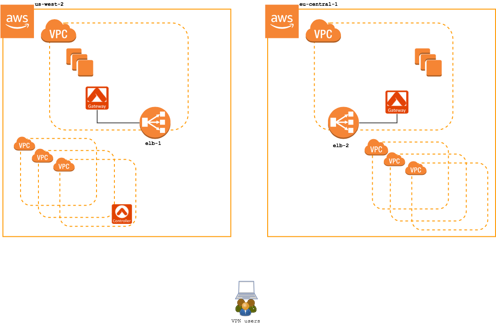
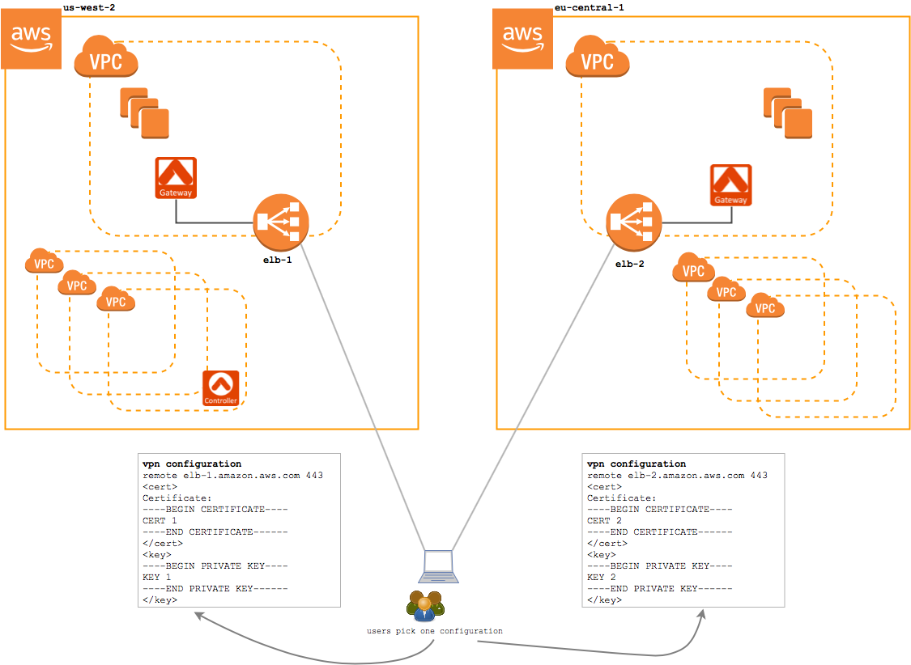
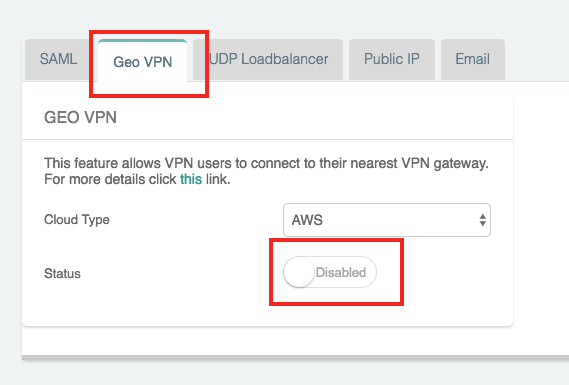
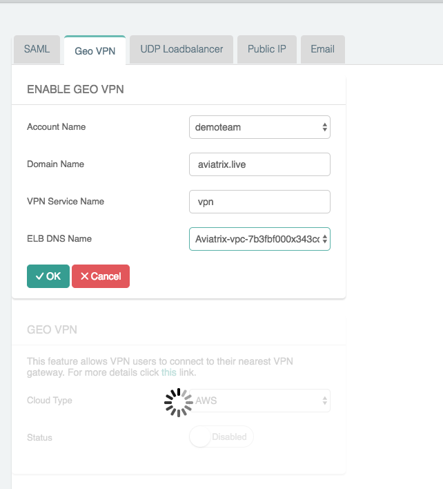
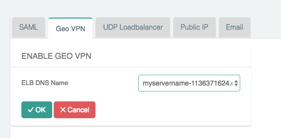
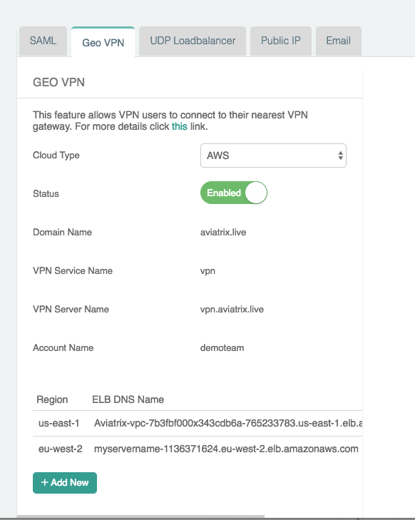
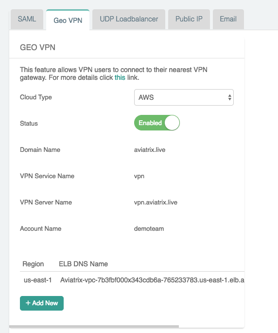
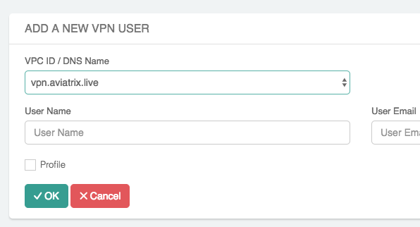

.. meta::
   :description: Geo VPN Reference Design
   :keywords: Geo VPN, VPN, aviatrix, remote user vpn, openvpn, user vpn, aws

===================================================
VPN Access Gateway Selection by Geolocation of User
===================================================

Overview
========

If you have a global workforce that needs to access the cloud with the
best user experience, building a cloud network with Geo VPN access
capability is the right solution for you.

The geolocation VPN feature combines the Aviatrix scale out
VPN solution with latency based routing to dynamically route VPN users
to the nearest VPN access gateway based on the latency between the user
and the gateways.

   .. note::

      GeoVPN service is  currently only available for AWS cloud.

VPN Access Details
==================

An example deployment in AWS is shown below. In this configuration, there are two VPN access gateways: one in us-west-2 and another in eu-central-1. Each VPN access gateway is fronted by a load balancer in AWS.

|imageArchitecture|

Let's look at the difference between a standard VPN access service and VPN access service with the Geolocation feature enabled:

Standard VPN Service (without geolocation feature enabled)
++++++++++++++++++++++++++++++++++++++++++++++++++++++++++

Without the Geolocation feature enabled, when a user connects to the VPN service, they will connect to one of the two regions' VPN gateway. Each gateway is independently administered, meaning users need a separate configuration profile for each region they will access.

In this configuration, an EU-based user would be given a configuration profile for the eu-central-1 load balancer.  And, a US-based user will be provided with a us-west-2 configuration profile.  If either user relocates or travels to the opposite region, they will need a separate configuration profile in that region and they will need to manually switch the active configuration profile.

|imageWithoutGeoVPN|

Geolocation VPN Service
+++++++++++++++++++++++

With the Geolocation feature enabled, when a user connects to the VPN service, they are directed to a Route 53 that uses a latency-based routing policy to choose between the available regions.

In this configuration, both the EU-based user and the US-based user would be given the same configuration profile.  This configuration profile will select the closest region automatically using a latency-based routing policy defined on the DNS record.

|imageWithGeoVPN|

Configuration Workflow
======================

#. Create a `VPN gateway <./uservpn.html>`__ in each region

   .. important::
      Enable ELB on each gateway that will be associated with the Geo VPN feature.

   .. tip::
      You must create at least one gateway to enable Geo VPN.  You can add more gateways to the pool at any time.

#. Once you have at least one VPN gateway created with ELB enabled, you are ready to proceed to the enable Geo VPN feature.  Click on **OpenVPN** in the navigation menu and select **Advanced**.

#. Click on the **Geo VPN** tab.

#. Select the `Cloud Type` and click on the `Disabled` status to Enable the Geo VPN feature.

   |imageEnable|

#. Populate the fields:

   +-------------------------+---------------------------------------------------------------+
   | Field                            | Description                                                                          |
   +============================================================+
   | Account Name          | Select the cloud account where the DNS domain        |
   |                                     | is hosted.                                                                              |
   +----------------------- -+----------------------------------------------------------------+
   | Domain Name           | The hosted domain name.                                                |
   |                                     |                                                                                               |
   |                                     | .. important::                                                                       |
   |                                     |    This domain name must be hosted by AWS                |
   |                                     |    Route53 in the selected                                                 |
   |                                     |    account.                                                                             |
   +------------------------+----------------------------------------------------------------+
   | VPN Service Name   | The hostname that users will connect to.                      |
   |                                     | A DNS record will be created for this name                    |
   |                                     | in the specified domain name.                                          |
   +-------------------------+---------------------------------------------------------------+
   | ELB DNS Name          | Select the first ELB name to attach to this                     |
   |                                      | Geo VPN name.  You can add others after                      |
   |                                      | this feature is enabled.                                                      |
   +-------------------------+----------------------------------------------------------------+

   |imageEnablePopulate|

#. Click `OK`

   |imageComplete|

   .. note::

      If enabling Geo VPN fails, make sure the Domain Name you enter is a
      registered name under AWS Route 53 in a public hosted zone. In addition,
      this Domain name must be hosted in the account that you have access
      privilege. If the domain name is hosted by another account, you will not
      be able to add DNS record.

#. For each additional region, repeat these steps:

   #. Click `+ Add New`
   #. Select the `ELB DNS Name`
   #. Click `OK`

   |imageAddAdditionalELB|

.. tip::

   Add encrypted peering to connect regions.

Add Users
+++++++++

Once you have Geo VPN enabled, you can add users.  Follow these steps to add users:

#. Click the **OpenVPN** navigation menu item
#. Click **VPN Users**
#. Click the **+ Add New** button
#. In the `VPC ID / DNS Name` drop down, select the Geo VPN VPN service name created in the previous steps
#. Populate the `User Name` and optionally the `User Email`
#. Click **OK**

   |imageAddVPNUser|
   
Manage Geo VPN configuration
++++++++++++++++++++++++++++

Once you have Geo VPN feature enabled, you can centrally manage all the VPN gateways' configuration under the Geo VPN service. Follow these steps to configure them:

#. Click the **OpenVPN** navigation menu item
#. Click **Edit Config**
#. In the `VPC ID/VNet Name` drop down, select the Geo VPN service name created in the previous steps
#. Update the VPN configuration regarding to your requirement

Advanced Settings - manage VPN configuration for individual DHCP setup  
======================================================================

GeoVPN can use DHCP Setting for DNS name resolution from the cloud private network where the VPN gateway is deployed. This reduces latency as DNS service is likely to be closer to the source of the VPN user location. Follow these steps to configure DHCP configuration for individual VPN gateway:

#. Click the **OpenVPN** navigation menu item
#. Click **Edit Config**
#. In the `VPC ID/VNet Name` drop down, select the specific VPC ID and LB/Gateway Name instead of Geo VPN service name
#. Update the supported VPN configuration as below regarding to your requirement in each VPN gateway
   
   - Additional CIDRs
   
   - Nameservers
   
   - Search Domains
   
   .. note::

      The attributes “Additional CIDRs, Nameservers, and Search Domains” are able to be edited for individual LB//Gateway Name only if the split tunnel mode is selected under the Geo VPN service.

#. Check this `document <https://docs.aviatrix.com/Support/support_center_openvpn_gateway.html#how-can-i-resolve-my-private-vpc-instance-s-name-when-connecting-via-remote-vpn>`_ for more info.

OpenVPN is a registered trademark of OpenVPN Inc.

.. |imageWithGeoVPN| image:: GeoVPN_media/architecture_with_geovpn.png

.. disqus::
