.. meta::
    :description: Using Aviatrix to Connect Azure to AWS or GCP
    :keywords: Aviatrix, Azure, AWS, GCP, multi cloud

.. _AWS billing: https://console.aws.amazon.com/billing/home?#/account

======================================================================
Multi-Cloud: Connecting Azure to AWS and GCP
======================================================================

Overview
--------------
Companies are relying more and more on multiple cloud (multi-cloud) providers.  However, setting up the connectivity between those providers is difficult.  And, maintaining and monitoring the tunnels is time-consuming and cumbersome to troubleshoot.

Aviatrix simplifies this by providing simple, point-and-click tunnel creation between cloud providers. Additionally, Aviatrix gives you a single, centralized location from which to troubleshoot and monitor your connections.

|imageAvtxDashboard0|

Getting Started
------------------------

The Aviatrix Controller automates, monitors, and reacts to events in each cloud environment on your behalf.  In order to do this, we'll need to configure a few things in each cloud to support this.

We'll walk through these steps in the following sections.  Once complete, you can connect to one or both cloud providers.

Start by logging into the `Azure Portal <https://portal.azure.com>`__.

Installing Aviatrix Controller from the Azure Marketplace
^^^^^^^^^^^^^^^^^^^^^^^^^^^^^^^^^^^^^^^^^^^^^^^^^^^^^^^^^^^^^^

The first step is to install the Aviatrix Controller from the Azure Marketplace.  Select the **Aviatrix Cloud Gateway to AWS and GCP** from the Marketplace.  Configure the new VM to meet your preferences and requirements.  Be sure to allow inbound connections on port 443. Once ready, launch the new VM and continue to the next step.

Preparing your Azure Account
^^^^^^^^^^^^^^^^^^^^^^^^^^^^^^^^^^

While the VM is being deployed in the selected region, configure the following items:

Registering Aviatrix with Active Directory
#######################################

1. Go to the Azure Active Directory (available from the left navigation panel or More Services).
2. Click **Properties** (available under Manage on the left inner navigation bar).

   .. important:: Copy and save the **Directory ID** for later use.  It will be referred to again as the Application Endpoint.

3. Click **App registrations** (available under Manage on the left inner navigation bar).
4. Click **+ New application registration** along the top.

    |imageAzureAppRegBtn|

5. Populate the fields as follows:

  +--------------------+--------------------------------------------------+
  | Field              | Value                                            |
  +====================+==================================================+
  | Name               | Aviatrix Controller                              |
  +--------------------+--------------------------------------------------+
  | Application type   | Web app / API                                    |
  +--------------------+--------------------------------------------------+
  | Sign-on URL        | http://aviatrix                                  |
  +--------------------+--------------------------------------------------+

6. Click **Create**.

  |imageAzureAppRegForm|

Adding a Key
###########

1. Find and select the application you just registered in the list displayed.

   |imageAzureAppRegAppID|

   .. important:: Copy and save the **Application ID** for later.  It will be referred to again later in this document as the **Application Client ID**.

2. Click **Keys** in the Settings pane on the right.

   |imageAzureAppRegKeysBtn|

3. Enter a new row:

  +--------------------+--------------------------------------------------+
  | Field              | Value                                            |
  +====================+==================================================+
  | Key description    | Aviatrix                                         |
  +--------------------+--------------------------------------------------+
  | Expires            | Never expires                                    |
  +--------------------+--------------------------------------------------+

4. Click **Save**.

   |imageAzureAppRegKeySave|

5. Copy the displayed key value and save it for later.

   |imageAzureAppRegKeySaveComplete|

.. important:: Save this value. It will be referred to again later in this document as the **Application Client Secret**.

6. Exit the Keys window.

Adding Required Permissions
##########################

1. Select the **Aviatrix Controller** application registration again (you may already be on it).
2. Click **Required permissions** just above Keys.

   |imageAzureAppRegPermBtn|

3. Click **+ Add** button.
4. Click **Select an API** (on the right).
5. Find and select **Windows Azure Service Management API**.

   |imageAzureAppRegPermSelectAPI|

6. Click **Select**.
7. In the Enable Access panel, mark the **Access Azure Service Management as organization users (preview)** checkbox.

   |imageAzureAppRegPermEnableAccess|

8. Click **Select**.
9. Click **Done**.
10. Exit the Required Permissions panel.

Granting Permissions to Aviatrix Controller
########################################

1. Go to the Subscriptions service (available from the left navigation panel or from More Services).
2. Click on the subscription where Aviatrix Controller is installed.

.. important:: Copy and save the **Subscription ID** for later.

3. Click **Access Control (IAM)**.

   |imageAzureSubscriptionIAM|

4. Click **+ Add**.

5. Populate the fields as follows:

  +--------------------+--------------------------------------------------+
  | Field              | Value                                            |
  +====================+==================================================+
  | Role               | Contributor                                      |
  +--------------------+--------------------------------------------------+
  | Assign access to   | Azure AD user, group, or application             |
  +--------------------+--------------------------------------------------+
  | Select             | Aviatrix Controller                              |
  +--------------------+--------------------------------------------------+

  |imageAzureSubscriptionIAMAddPerm|

6. Click **Save**.
7. Exit the Access control (IAM) panel.

Configuring Aviatrix
^^^^^^^^^^^^^^^^^^^^^^^^^^^^^^^^^^^^^^^^^^^^^^^^^^^^^

Your Aviatrix Controller should be up and running by now. Go back to the Microsoft Azure portal and find the newly created instance. Open it and copy the **Public IP address**.

Open a browser and navigate to https://<public ip address>/ .  

   .. tip:: You may receive a warning about the certificate not matching.  You can safely ignore this and continue to the page.

When you arrive at the login prompt, log in with the Username "admin."  The password is the private IP address of the Azure instance.

   .. tip:: Find the Private IP address on the instance page by selecting **Networking**.

   |imageAviatrixFirstLogin|
            
After logging in, you will be prompted to provide your email address.  This is used for alert notifications as well as for password recovery.  Enter your email address and click **OK**.

Set the admin password to something you will remember and click **Save**.

If you require a proxy for this instance to get to the internet, enter that now.  Otherwise, click **Skip**.

Finally, the software will be upgraded.  Click **Run** button and the latest version of the Controller will be downloaded and installed. This will take a few minutes. Once complete, the login prompt will appear.

   |imageAviatrixFirstLoginRunUpdate|

Log in with the username "admin" and the new password.
   
Azure
----------

After logging in, click **Azure ARM** to connect Aviatrix to your Azure account.  

   |imageAviatrixOnboardAzureSelect|

Creating the Account
^^^^^^^^^^^^^^^^^^^^

Fill out the fields as follows:

  +-------------------------------+--------------------------------------------+
  | Field                         | Expected Value                             |
  +===============================+============================================+
  | Account Name                  | The login/username for users who will have |
  |                               | admin access to Azure resources.           |
  |                               | For example, `AzureOpsTeam`.               |
  +-------------------------------+--------------------------------------------+
  | E-mail                        | The e-mail address for this team.          |
  +-------------------------------+--------------------------------------------+
  | Password                      | Password for login to the controller       |
  +-------------------------------+--------------------------------------------+
  | Confirm Password              |                                            |
  +-------------------------------+--------------------------------------------+
  | ARM Subscription ID           | The **Subscription ID** you saved in a     |
  |                               | previous step.                             |
  +-------------------------------+--------------------------------------------+
  | Application Endpoint          | The **Application Endpoint** (i.e., the    |
  |                               | **Directory ID**) retrieved earlier.       |
  +-------------------------------+--------------------------------------------+
  | Application Client ID         | The **Client ID** (i.e., the **Application |
  |                               | ID**) saved earlier.                       |
  +-------------------------------+--------------------------------------------+
  | Application Client Secret     | The **Client Secret** (i.e., the key value)|
  |                               | displayed earlier.                         |
  +-------------------------------+--------------------------------------------+

Once complete, click **Create** button at the bottom of the form.

   |imageAviatrixOnboardAzureCreate|

Accepting License Agreement
^^^^^^^^^^^^^^^^^^^^^^^^^^^

Before you can automate launching an Aviatrix Gateway, you must first subscribe to the Aviatrix Companion Gateway in the `Azure Marketplace <https://portal.azure.com/#blade/Microsoft_Azure_Marketplace/GalleryFeaturedMenuItemBlade/selectedMenuItemId/home/resetMenuId/>`__.

1. Search for "aviatrix companion gateway."
2. Select the result.

   |imageAzureCompanionGWSearchResult|

3. Click on the link at the very bottom titled "Want to deploy programmatically? Get started ➔".

   |imageAzureCompanionGWDeployLink|

4. Click **Enable** status button.

   |imageAzureCompanionGWEnableAccess|

5. Click **Save**.

Creating a Gateway
^^^^^^^^^^^^^^^^^^

The Controller can now automate creating a Gateway within Azure. Switch back to the browser tab or window with the Aviatrix Controller.

Click **Gateway** in the left navigation bar:

   |imageAviatrixNavGateway|

Next, click **+ New Gateway**.  Populate the Gateway Name and select the appropriate Region, VNet, and Public Subnet.  The Gateway Size can be left at the smallest size.  It can be scaled up (and out) later if needed.

   |imageAviatrixGWCreate|

Click **OK** to create the Gateway automatically.  This will take a few minutes as it creates the instance in the selected region and sets up the appropriate route table entries, etc.

Once complete, click **X Close**.

Now you have a Gateway in Azure that can connect to either AWS, GCP, or both.

AWS
----------------

Creating the Account
^^^^^^^^^^^^^^^^^^^

1. Go to the Onboarding section on your Controller.

   |imageAviatrixOnboardNav|
 
2. Click **AWS**.

   Fill out the fields as follows:

  +-------------------------------+--------------------------------------------+
  | Field                         | Expected Value                             |
  +===============================+============================================+
  | Account Name                  | The login/username for users who will have |
  |                               | admin access to AWS resources.             |
  |                               | For example, AWSOpsTeam.                   |
  +-------------------------------+--------------------------------------------+
  | E-mail                        | The e-mail address for this team.          |
  +-------------------------------+--------------------------------------------+
  | Password                      | Password for login to the controller       |
  +-------------------------------+--------------------------------------------+
  | Confirm Password              |                                            |
  +-------------------------------+--------------------------------------------+
  | AWS Account Number            | You can find your account number           |
  |                               | on the AWS billing page                    |
  +-------------------------------+--------------------------------------------+
  | IAM role-based                | Leave this unchecked for now.  For         |
  |                               | production use, you'll want to use IAM     |
  |                               | roles with specific permissions.           |
  +-------------------------------+--------------------------------------------+
  | AWS Access Key ID             | An admin user's AWS access key ID          |
  +-------------------------------+--------------------------------------------+
  | AWS Secret Key                | An admin user's AWS secret key             |
  +-------------------------------+--------------------------------------------+

Once complete, click **Create** at the bottom of the form.

   |imageAviatrixOnboardAWSCreate|

Deploying a Gateway in AWS
^^^^^^^^^^^^^^^^^^^^^^^^^^

Head back over to the Gateways section in the Aviatrix Controller and click **+ New Gateway**.

1. Select **AWS** for Cloud Type.
2. Enter a Gateway name.
3. Select the appropriate values for Region, VPC ID, and Public Subnet.
4. Set the default Gateway Size at **t3.large**.
5. Mark the **Allocate New EIP** checkbox so a new Elastic IP will be allocated on creation.
6. Click **OK** when ready.  

   .. tip:: Create a new VPC for testing.

|imageAviatrixGWCreateAWS|

Peering the Gateways
^^^^^^^^^^^^^^^^^^^^^

1. Click on the **Peering** navigation link on the Controller.
2. Click **+ New Peering**.

   |imageAviatrixGWCreateAWSPeerAddBtn|

3. Select the AWS Gateway and the Azure Gateway.

   |imageAviatrixGWCreateAWSPeerAddNew|

4. Click **OK**.

   |imageAviatrixGWCreateAWSPeerUp|

Complete
^^^^^^^^^^^^

Your Azure VNet instances can now talk to your AWS instances over a secure tunnel. You will soon receive an email notification that the tunnel is up. You'll receive additional notifications if the tunnel goes down.

GCP
--------------

Preparing your Google Cloud Account
^^^^^^^^^^^^^^^^^^^^^^^^^^^^^^^^^

The Aviatrix Controller requires a few settings to be enabled in order for it to be able to interact with your Google Cloud account.

1. From the `Google Cloud Console Dashboard <https://console.cloud.google.com/home/dashboard>`__, copy and save the **Project ID**.

  |imageGCPProjectID|

2. Enable GCloud Messaging Service. The Controller relies on Google Cloud Pub/Sub APIs to communicate with the Gateways in GCP.  Enable these APIs by going to the `APIs & services Dashboard <https://console.cloud.google.com/apis/dashboard>`__ for the selected project.  Select **Enable APIs and Services** at the top of the page.

   |imageGCPEnableAPIsBtn|

Select **Google Cloud Pub/Sub API** from the list.  Then, click **Enable**.

   |imageGCPEnablePubSubBtn|

3. Create a Credentials File. Navigate back to the `APIs & services Dashboard <https://console.cloud.google.com/apis/dashboard>`__ and select **Credentials** (or click `here <https://console.cloud.google.com/apis/credentials>`__).

   |imageGCPCredentialsPage|

Click the **Create credentials** dropdown menu and select **Service account key**.

   |imageGCPCredentialsCreateStep1|

Select **Compute Engine default service account** for the Service account and select **JSON** for Key type.

   |imageGCPCredentialsCreateStep2|

Then, click **Create**.  A file will be downloaded to your computer. Find it and store it in a safe location. Then, click **Close**.

   |imageGCPCredentialsSaved|

You are now ready to connect the Aviatrix Controller to your Google Cloud Platform account.

Create Account
^^^^^^^^^^^^^^^^

1. Go to the Onboarding section on the Aviatrix Controller.

   |imageAviatrixOnboardNav|
 
2. Click **GCloud**.

   Fill out the fields as follows:

  +-------------------------------+--------------------------------------------+
  | Field                         | Expected Value                             |
  +===============================+============================================+
  | Account Name                  | The login/username for users who will have |
  |                               | admin access to Google Cloud resources.    |
  |                               | For example, "GCPOpsTeam."                 |
  +-------------------------------+--------------------------------------------+
  | E-mail                        | The e-mail address for this team.          |
  +-------------------------------+--------------------------------------------+
  | Password                      | Password for login to the Controller       |
  +-------------------------------+--------------------------------------------+
  | Confirm Password              |                                            |
  +-------------------------------+--------------------------------------------+
  | GCloud Project ID             | The **Project ID** saved earlier           |
  +-------------------------------+--------------------------------------------+
  | GCloud Project Credentials    | Select the credentials file created in an  |
  |                               | earlier step.                              |
  +-------------------------------+--------------------------------------------+

Once complete, click **Create** at the bottom of the form.

   |imageAviatrixOnboardGCPCreate|

Deploying a Gateway in GCP
^^^^^^^^^^^^^^^^^^^^^^^^^^

Head back over to the Gateways section in the Aviatrix Controller and click on **+ New Gateway** button.

1. Select **GCloud** for the Cloud Type.
2. Enter a Gateway name.
3. Select a VPC ID and Public Subnet.
4. Keep the default Gateway Size of "f1-micro."
5. Click **OK** when ready.

|imageAviatrixGWCreateGCP|

Peering the Gateways
^^^^^^^^^^^^^^^^^^^^^

1. Click on the **Peering** navigation link on the Controller.
2. Click **+ New Peering**.

   |imageAviatrixGWCreateAWSPeerAddBtn|

3. Select the AWS Gateway and the Azure Gateway.

   |imageAviatrixGWCreateGCPPeerAddNew|

4. Click **OK**.

   |imageAviatrixGWCreateGCPPeerUp|

Complete
^^^^^^^^
Your Azure VNet instances can now talk to your GCP instances over a secure tunnel. You will soon receive an email notification that the tunnel is up. You'll receive additional notifications if the tunnel goes down.

Summary
-----------------

If you peered your Azure account with both AWS and GCP, then you should see something like this on your Aviatrix Controller Dashboard:

   |imageAviatrixDashboardFinal|

Now that you have the accounts established, you can easily add connectivity to other VPCs in either AWS or GCP.  And, of course, you can also connect AWS to GCP.

.. |imageAvtxDashboard0| image:: GettingStartedAzureToAWSAndGCP_media/aviatrix/screenshot_aviatrix_dashboard_sample.png

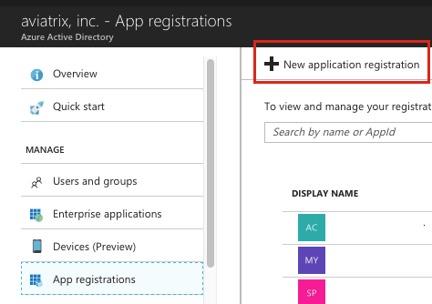

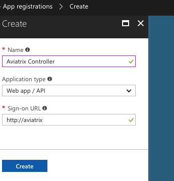

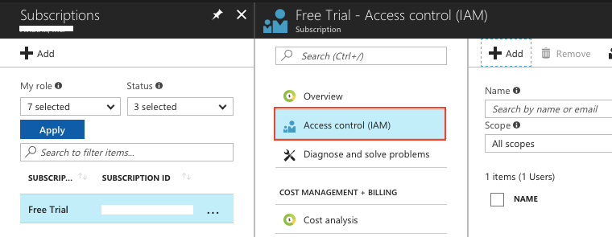

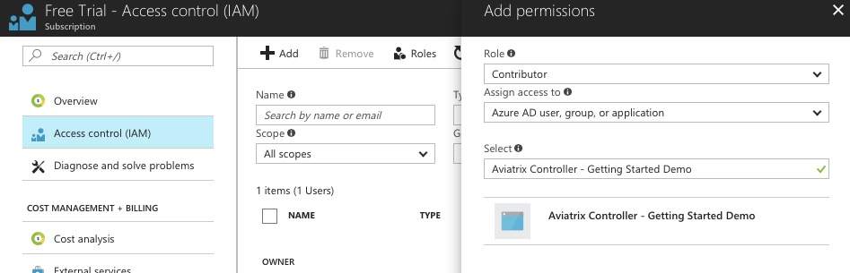

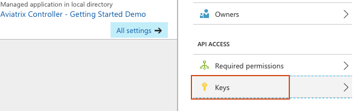

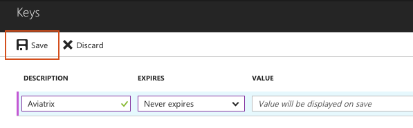

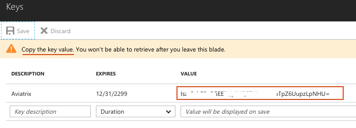

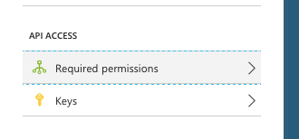

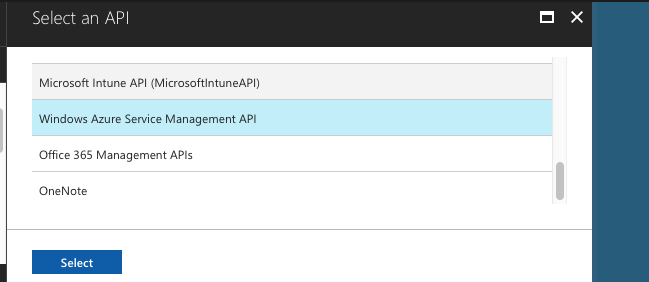

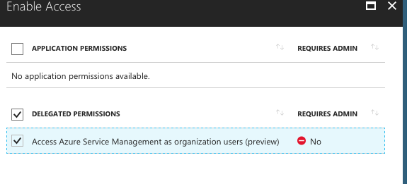

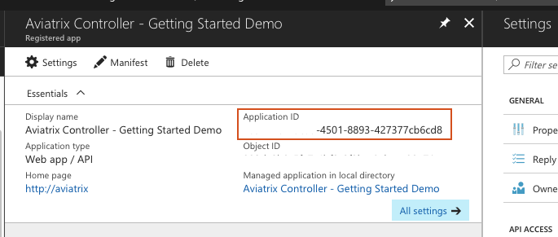

.. |imageAviatrixFirstLogin| image:: GettingStartedAzureToAWSAndGCP_media/aviatrix/configure_first_login.png

.. |imageAviatrixFirstLoginRunUpdate| image:: GettingStartedAzureToAWSAndGCP_media/aviatrix/configure_run_update.png

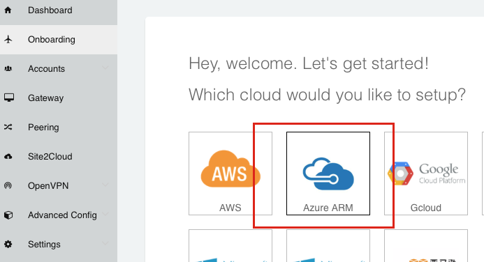

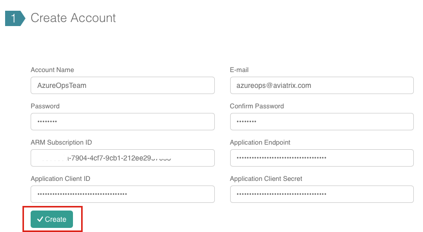

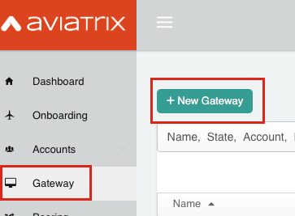

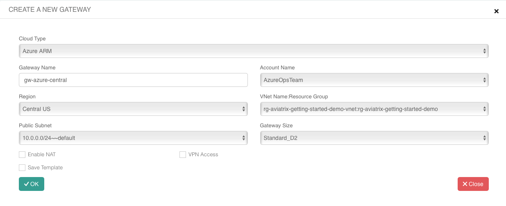

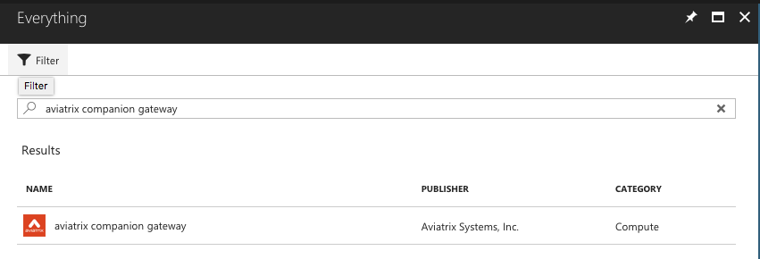

.. |imageAzureCompanionGWDeployLink| image:: GettingStartedAzureToAWSAndGCP_media/azure/companion_subscribe/deploy_programmatically_link.png

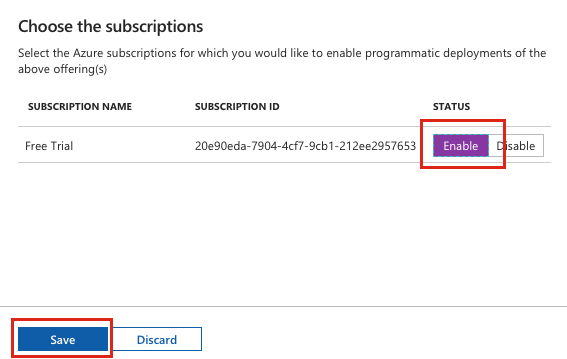

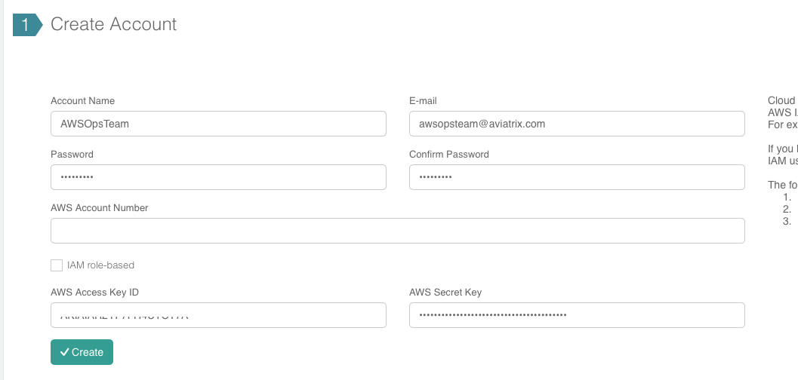

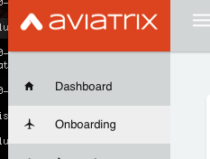

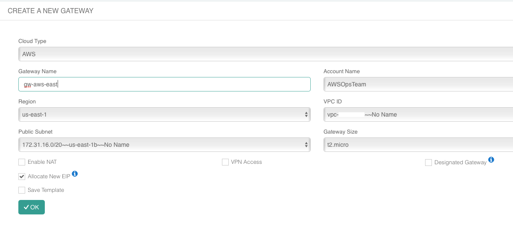

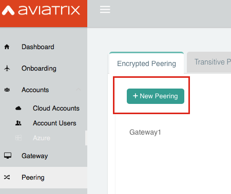

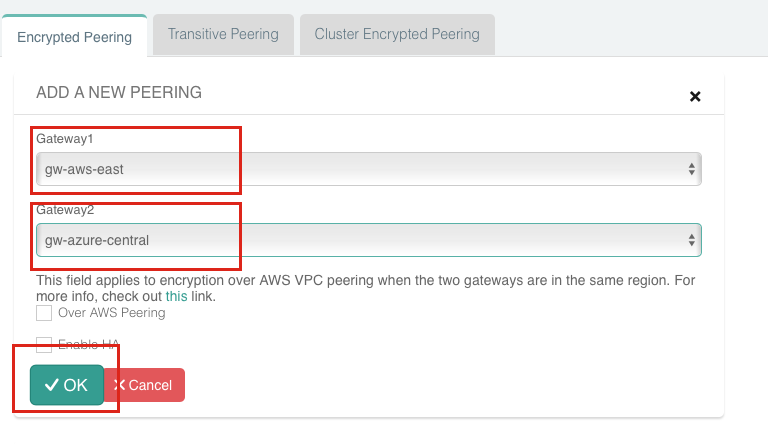

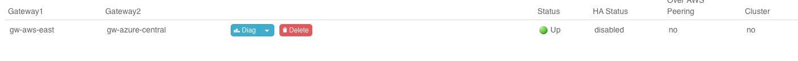

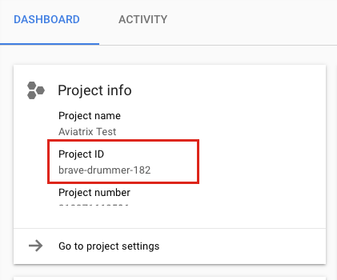

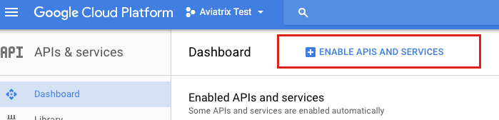

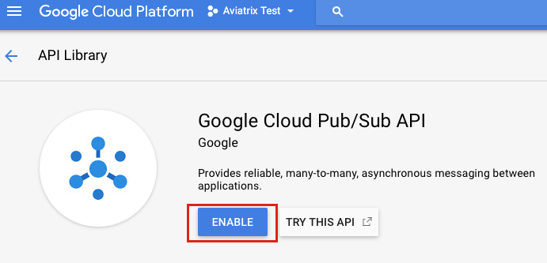

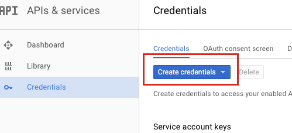

.. |imageGCPCredentialsCreateStep1| image:: GettingStartedAzureToAWSAndGCP_media/gcp/gcp_credentials_btn_expanded.png

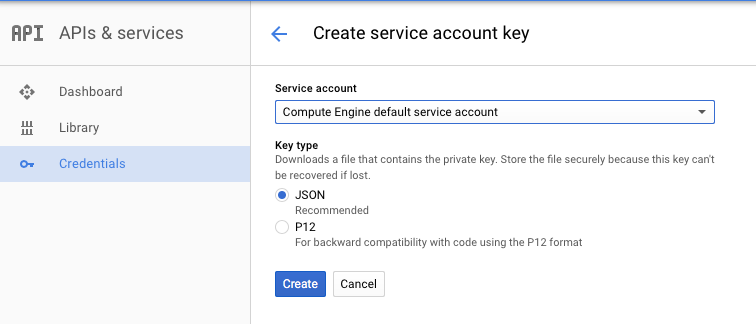

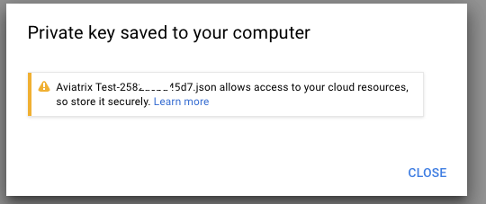

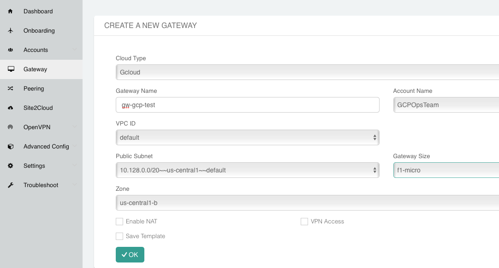

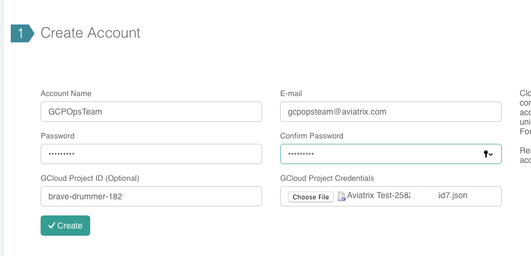

.. |imageAviatrixGWCreateGCPPeerAddNew| image:: GettingStartedAzureToAWSAndGCP_media/aviatrix/peering_add_new_gcp.png

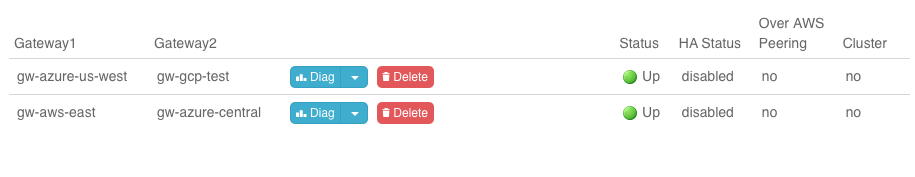

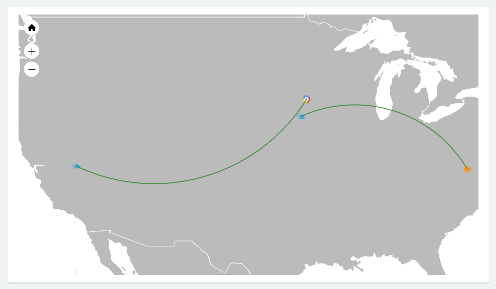

.. disqus::
