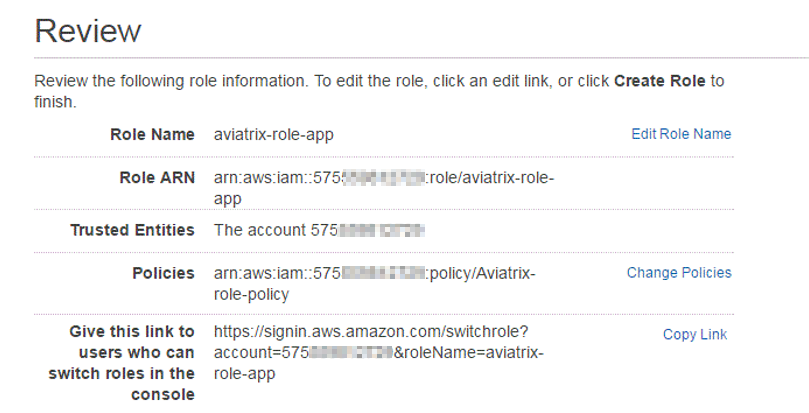
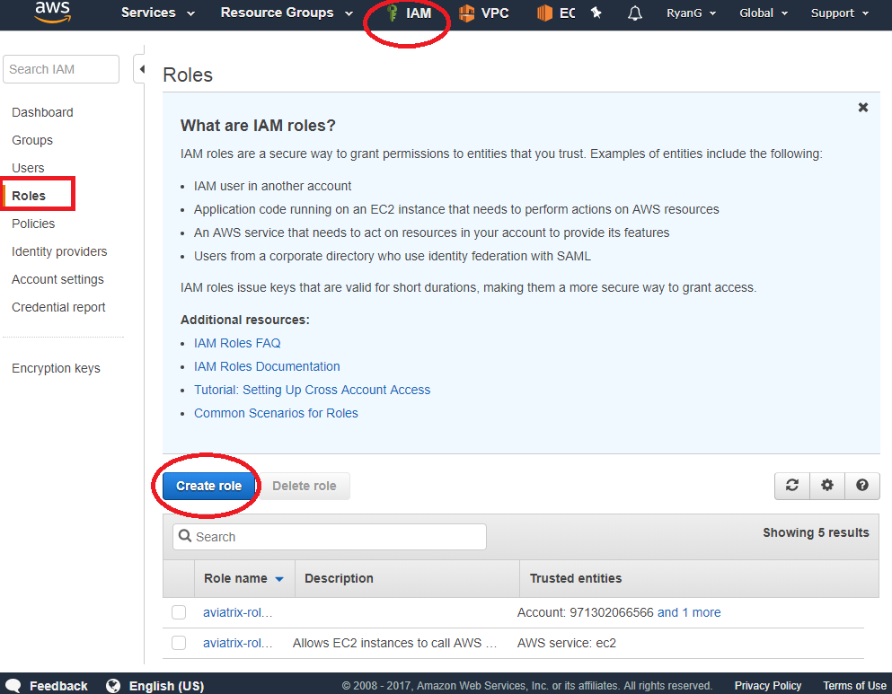
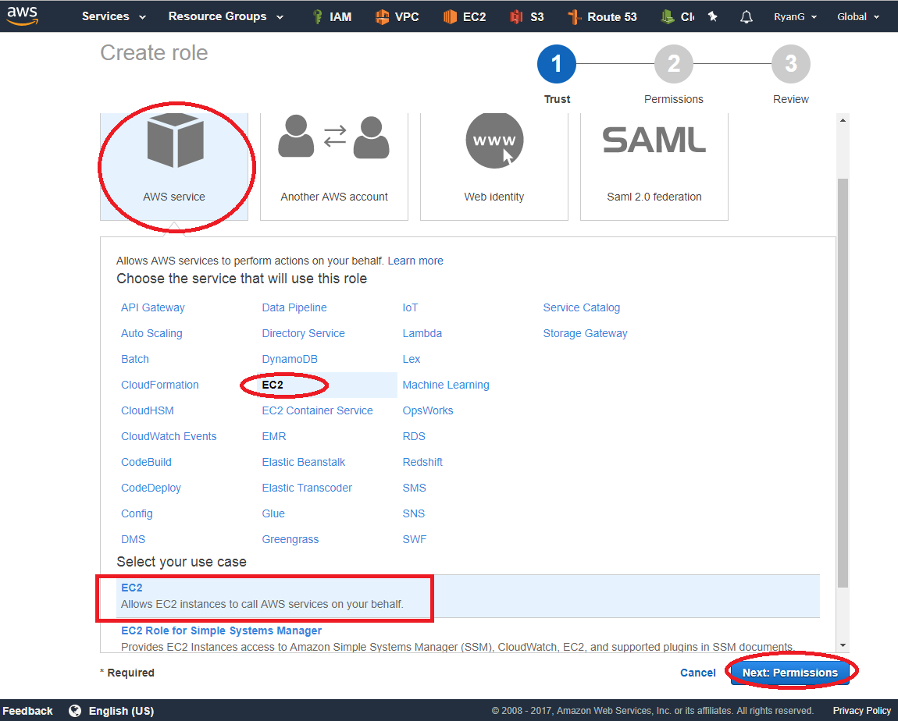
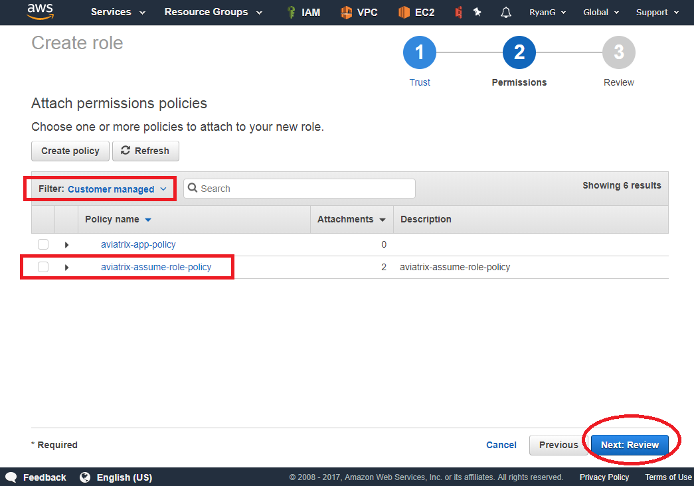
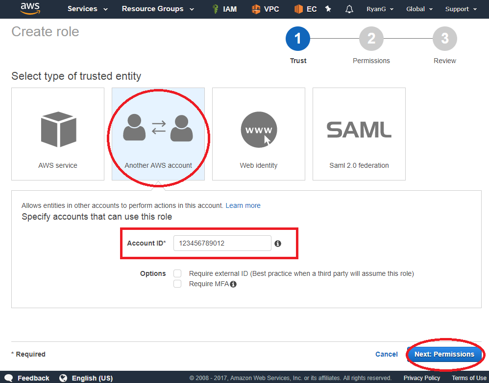
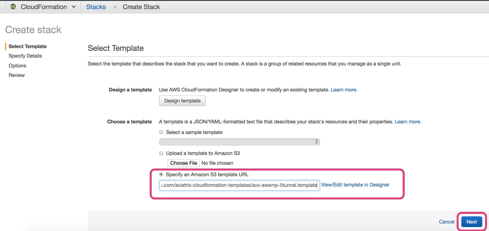
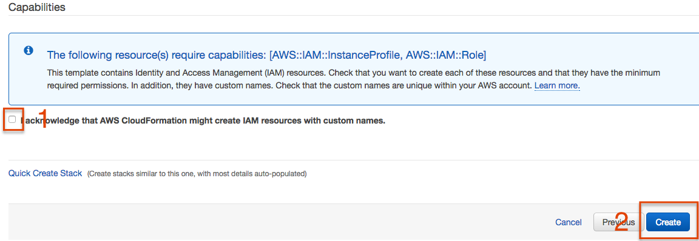

.. meta::
   :description: How to Set Up IAM Role for Aviatrix
   :keywords: IAM, IAM role, IAM role Aviatrix

#######################################
IAM Roles for Secondary Access Accounts
#######################################

When the Aviatrix Controller goes through the initial Onboarding process, the `primary access account <http://docs.aviatrix.com/HowTos/onboarding_faq.html#what-is-the-aviatrix-primary-access-account>`_ is created. 
Using the primary access account, the Controller can launch gateways and build connectivity in the VPCs 
that belong to this account. 

If the Controller needs to build connectivity in AWS accounts that are different from the Controller instance's AWS account, secondary access accounts need to be created. 

To create a secondary access account on the Controller, you need to first create IAM roles, policies and establish a trust relationship to the primary AWS account. 

Follow the steps below to create IAM roles and policies for the secondary access account. 

(If you like to customize the conditions of the policies published by Aviatrix, consult `this link. <http://docs.aviatrix.com/HowTos/customize_aws_iam_policy.html>`_)

Setup by CloudFormation template 
===========================================================================

This is the recommended approach. 

Follow `the instructions <https://docs.aviatrix.com/HowTos/aviatrix_account.html#setup-additional-access-account-for-aws-cloud>`_ to setup. 

Setup Secondary Account IAM Manually
=========================================================================

**This is not a recommended approach as it takes a longer time and is error prone.** 

1. Create two IAM custom policies
--------------------------------------

1.1 Create “aviatrix-assume-role-policy”:
~~~~~~~~~~~~~~~~~~~~~~~~~~~~~~~~~~~~~~~~~

-  Log in to the AWS management console with a secondary AWS account.

-  Go to Services -> IAM -> Policies -> Create Policy -> Create Your Own
   Policy

-  Enter the policy name, **aviatrix-assume-role-policy** , copy and
   paste the policy text from `this
   link <https://s3-us-west-2.amazonaws.com/aviatrix-download/iam_assume_role_policy.txt>`__.

-  Click Valid Policy to validate the policy.

-  Click the Create Policy button.

1.2 Create “aviatrix-app-policy”:
~~~~~~~~~~~~~~~~~~~~~~~~~~~~~~~~~

-  Log in to AWS console with your own account.

-  Go to Services -> IAM -> Policies -> Create Policy -> Create Your Own
   Policy

-  Enter the policy name, **aviatrix-app-policy** , copy and paste the
   policy provided by `this
   link <https://s3-us-west-2.amazonaws.com/aviatrix-download/IAM_access_policy_for_CloudN.txt>`__
   into “Policy Document” section. In this example, the policy name is
   “aviatrix-app-policy”, as shown below.

-  Click Create Policy button.

2. Create Two IAM Roles
----------------------------

2.1 Create “aviatrix-role-ec2” role
~~~~~~~~~~~~~~~~~~~~~~~~~~~~~~~~~~~~

The role name MUST be exactly “\ **aviatrix-role-ec2**\ ”.

-  Go to AWS console -> IAM service -> Roles -> Create role

|image3|

- Select AWS Service -> EC2 -> EC2 -> Next: Permissions

|image4|

- Search Policy **aviatrix-assume-role-policy**, then select this policy. Click "Next Review"

|image5|

-  Enter Role name **aviatrix-role-ec2** (must be exact) then click [Create]

-  Search/Check the role. You should see something
   like this for Role ARN:
   arn:aws:iam::575xxxxxx729:role/aviatrix-role-ec2

|image0|

-  Make a note of the above Role ARN string, it will be used to setup the
   Aviatrix Cloud Account later

2.2 Create "aviatrix-role-app" role
~~~~~~~~~~~~~~~~~~~~~~~~~~~~~~~~~~~~~~~

This role is to be assumed by a granted AWS account. The Aviatrix
Controller acquires the “assume role” capability authorized by its
“aviatrix-role-ec2” role. It then assumes to this service role that is
granted by its own AWS account or other AWS accounts to perform AWS
APIs.

-  Go to AWS console -> IAM service -> Roles -> Create Role

- Select "Another AWS account", and enter your AWS account ID, then Click [Next:Permissions]

|image6|

-  Select **aviatrix-app-policy** IAM policy, then click [Next: Review]

-  Enter a Role Name, in this case **aviatrix-role-app** . Click “Create role”

-  You should see something like this for Role ARN:
   arn:aws:iam::575xxxxxx729:role/aviatrix-role-app

-  Make a note of the above Role ARN string, it will be used to setup
   Aviatrix access account later.

    |image1|

2.3 Establish trust relationship with primary account
~~~~~~~~~~~~~~~~~~~~~~~~~~~~~~~~~~~~~~~~~~~~~~~~~~~~~~~

.. note::

   If you are using this manual process to setup primary access account (Controller's account), you do not need to establish a trust relationship. Skip this step. 

Grant the primary (Controller) AWS account access to the aviatrix-role-app in
this secondary account.

   a. AWS console -> IAM service -> Roles > aviatrix-role-app

   b. Click Trust Relationships > Edit Trust Relationship

   c. Edit the trust relationship as follows

      |image2|

   d. Remember you need to enter both the primary account number and secondary account number

   e. Click Update Trust Policy

Notes for custom IAM role name feature:
=======================================

If the primary access account is using a custom EC2 IAM role name for the controller, then any secondary IAM based access accounts must use an identical name for the EC2 IAM role.

The primary and secondary access accounts must use identical names under the following conditions:

- You are using custom IAM roles for the primary access account.

- You are NOT using custom gateway IAM roles on the secondary account.

Example:

The controller is using 'custom-role-app' and 'custom-role-ec2' on a secondary access account. Custom role 'custom-role-ec2' also exists on the primary account because that is where the controller is hosted.

When you launch a gateway under the secondary access account the controller takes the primary access account ec2 role name, in this case 'custom-role-ec2' and passes it to the API call to create the instance. The API call refers to a role on the secondary CSP account, not the role of the primary account. 

.. |image0| image:: IAM_media/image1.png
   :width: 6.50000in
   :height: 2.99931in

.. |image2| image:: IAM_media/image3.png
   :width: 4.67200in
   :height: 3.33379in

.. |imageCFCreate| image:: IAM_media/cf_create.png

.. |imageCFEnableTermProtection| image:: IAM_media/cf_termination_protection.png

.. add in the disqus tag

.. disqus::
