

=========================================
AWS Managed Microsoft AD for Aviatrix
=========================================

Summary
-------

This document describes how to deploy an AWS Directory Service for Microsoft Active Directory for `Aviatrix Controller LDAP <https://docs.aviatrix.com/HowTos/AdminUsers_LDAP.html?highlight=ldap#controller-ldap-login-configuration>`__ and `OpenVPN LDAP <https://docs.aviatrix.com/HowTos/VPNUsers_LDAP.html#ldap-configuration-for-authenticating-vpn-users>`__ feature.

The `AWS Directory Service for Microsoft Active Directory <https://docs.aws.amazon.com/en_us/directoryservice/latest/admin-guide/what_is.html>`__ is an AWS service if you need an actual Microsoft Active Directory in the AWS Cloud that supports Active Directory–aware workloads, or AWS applications and services such as Amazon WorkSpaces and Amazon QuickSight, or you need LDAP support for Linux applications.

Please note that in the following steps, most involve following `AWS Managed Microsoft AD Test Lab Tutorials <https://docs.aws.amazon.com/en_us/directoryservice/latest/admin-guide/ms_ad_tutorial_test_lab_base.html>`__ to create LDAP service in AWS Cloud. 

|image9|

Follow these steps to configure the AWS AD configuration in your environment and verify LDAP connection.

#. Setting Up Your Base AWS Managed Microsoft AD in AWS
#. Verify AWS AD Is Operational by using AD Explorer
#. Verify AWS AD Is Operational by an Aviatrix Controller with LDAP login verification.
#. Verify AWS AD Is Operational by an Aviatrix OpenVPN Server with LDAP login verification.

Prerequisites
-------------
In order to complete the steps in this guide, you'll need:

1. An AWS Account
2. An Aviatrix Controller which has already onboarded above AWS account

Setting Up Your Base AWS Managed Microsoft AD in AWS
-------------------------------------------------------------

Step A: Set Up Your AWS Environment for AWS Managed Microsoft AD
####################
https://docs.aws.amazon.com/directoryservice/latest/admin-guide/microsoftadbasestep1.html

Step B: Create Your AWS Managed Microsoft AD Directory in AWS
####################
https://docs.aws.amazon.com/en_us/directoryservice/latest/admin-guide/microsoftadbasestep2.html

Create your AWS Managed Microsoft AD directory.
In this example, the following domain and dns are created

Domain Name: aws-ad.aviatrixtest.com.
Two domain Name servers are created by AWS AD: 172.31.28.253, 172.31.14.48
|image0|
|image4|

Step C: Deploy an EC2 Instance to Manage AWS Managed Microsoft AD
####################

Follow these steps to configure Microsoft AD of your Windows Server EC2 Instance.

1. Deploy an EC2 Instance to Manage AWS Managed Microsoft AD `Check Detail Here <https://docs.aws.amazon.com/directoryservice/latest/admin-guide/microsoftadbasestep3.html>`__

2. Manually Join a Windows Instance `Check Detail Here <https://docs.aws.amazon.com/directoryservice/latest/admin-guide/join_windows_instance.html>`__

.. note::
   TIPS: Use these commands from a command prompt on the instance above
   %SystemRoot%\system32\control.exe ncpa.cpl  => Make sure the two domain controller IP is in your dns setup
   %SystemRoot%\system32\control.exe sysdm.cpl   ==> Join domain

|image3|
|image6|

Step D: Configure LDAP
After logging in to the EC2 Instance with AD authentication (aws-ad.aviatrixtest.com\Admin), configure another user "aduser" to AWS AD domain.

|image7|

.. _Verify_AWS_AD_AD_Explorer:
Verify AWS AD Is Operational by using AD Explorer
--------------------------
You can download Microsoft AD Explorer from this `link <https://docs.microsoft.com/en-us/sysinternals/downloads/adexplorer>`__

Verify LDAP information, for example Bind DN and Base DN, and store them for further Aviatrix Controller and OpenVPN LDAP authentication.

|image2|
|image1|

.. _Verify_AWS_AD_AVX_CTRL:
Verify AWS AD Is Operational by an Aviatrix Controller with LDAP login verification.
--------------------------
In the Aviatrix Controller GUI, go to Setting > Controller > LDAP Login.
Input the LDAP information from `AD Explorer <#Verify_AWS_AD_AD_Explorer>`__ and verify LDAP connection.

|image8|

.. _Verify_AWS_AD_AVX_OVPN:
Verify AWS AD Is Operational by a Aviatrix OpenVPN Server with LDAP login verification.
--------------------------
In the Aviatrix Controller GUI, go to Setting > Controller > LDAP Login.
Input LDAP information from `AD Explorer <#Verify_AWS_AD_AD_Explorer>`__ and verify the LDAP connection.

|image10|

OpenVPN is a registered trademark of OpenVPN Inc.

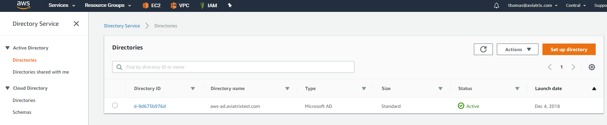
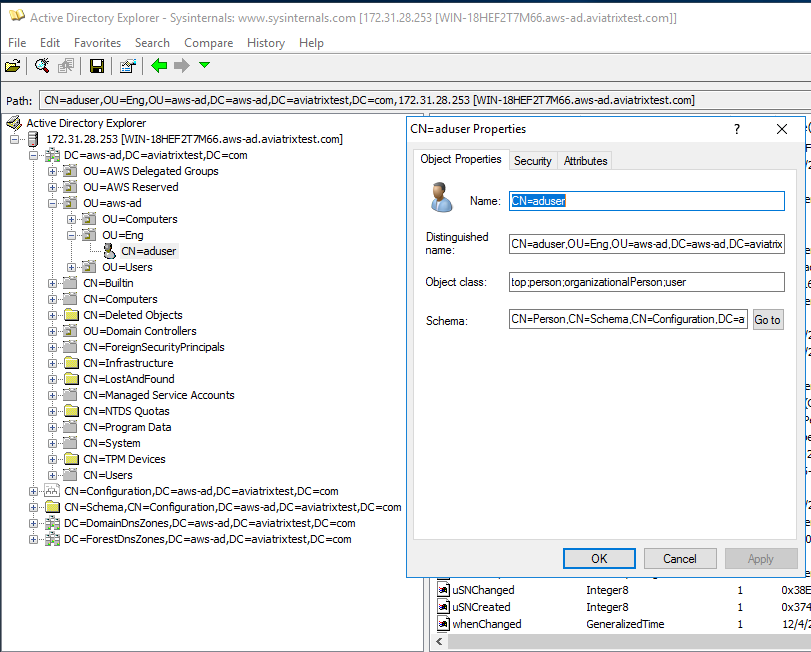
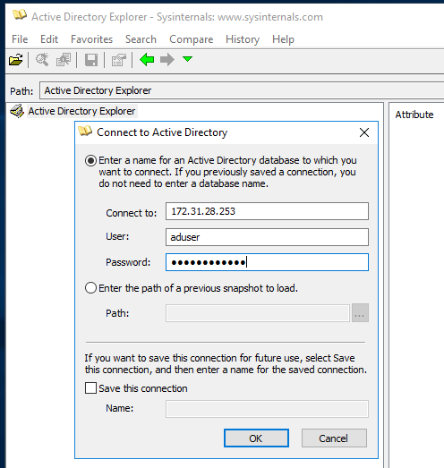
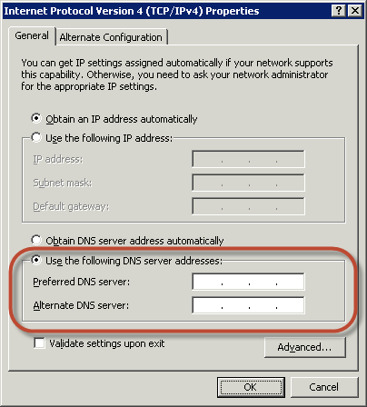
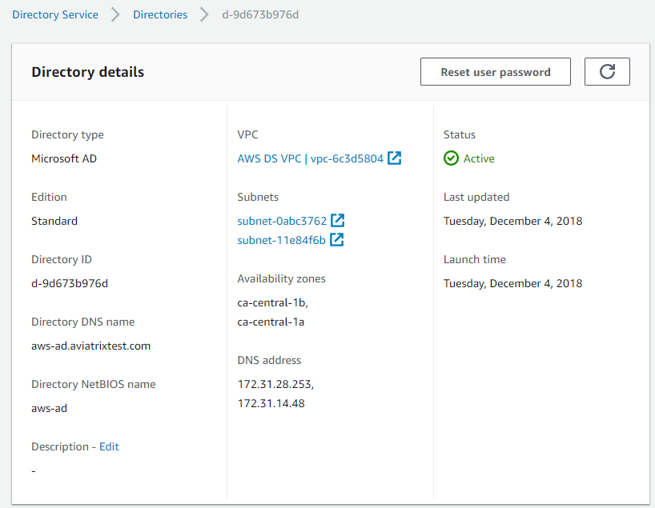
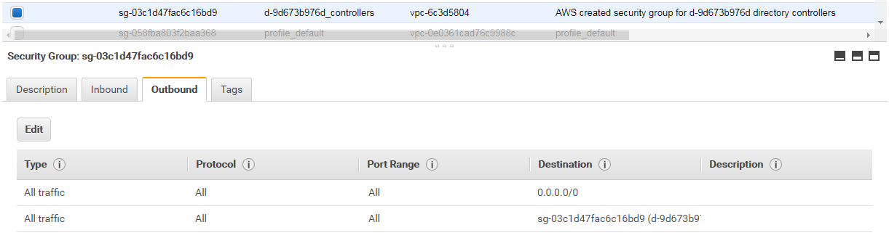
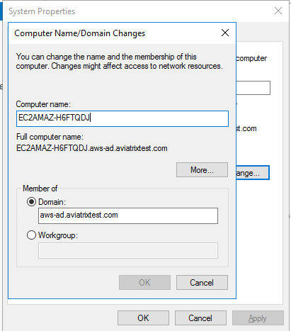
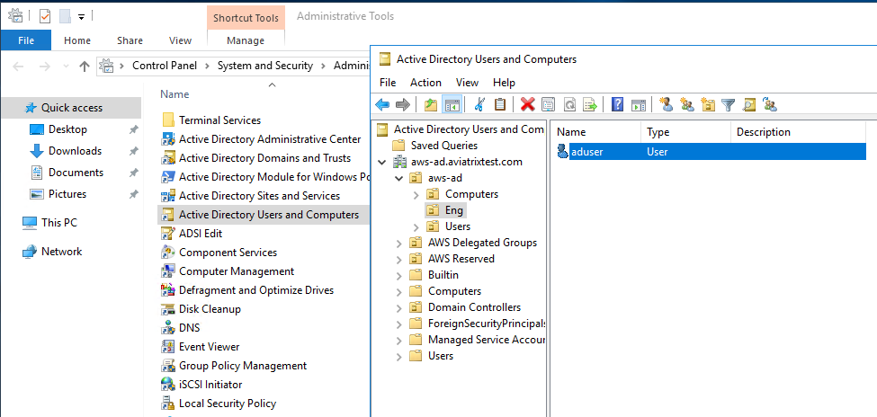
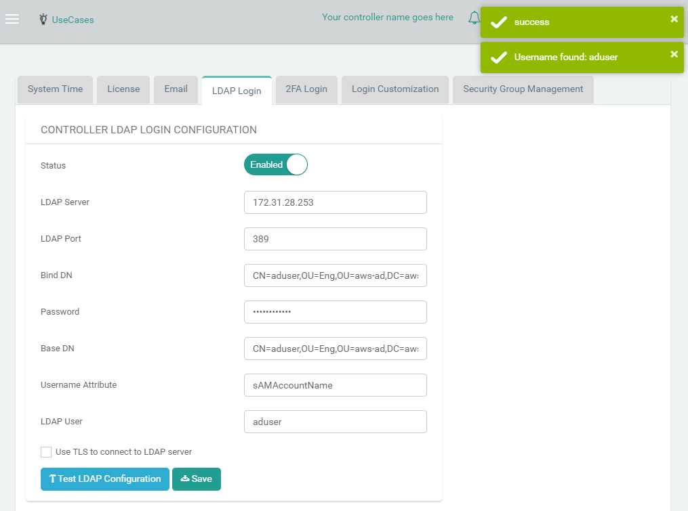
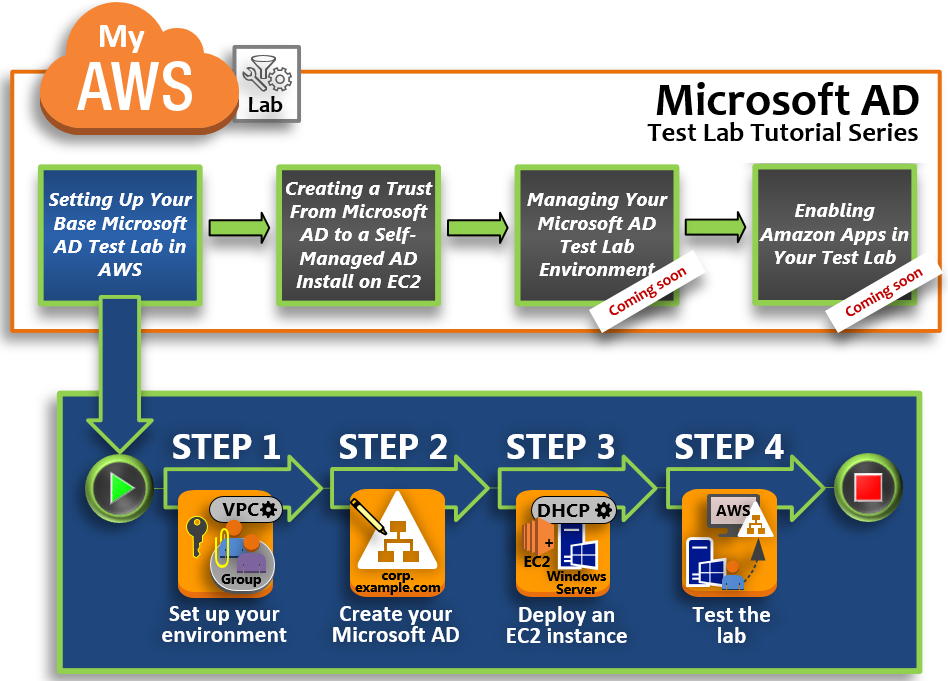
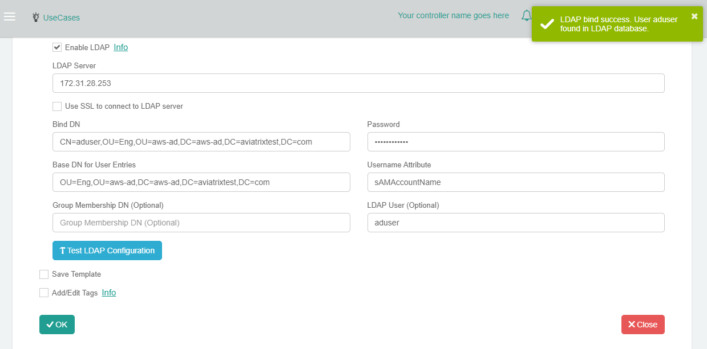

.. disqus::
