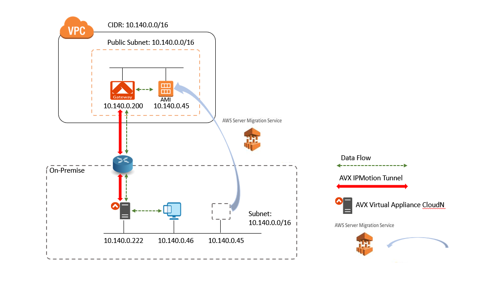
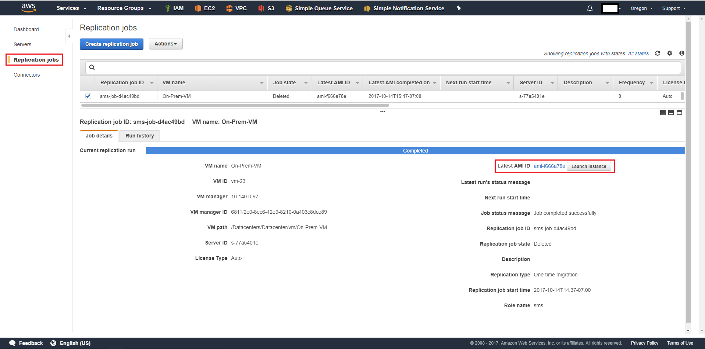
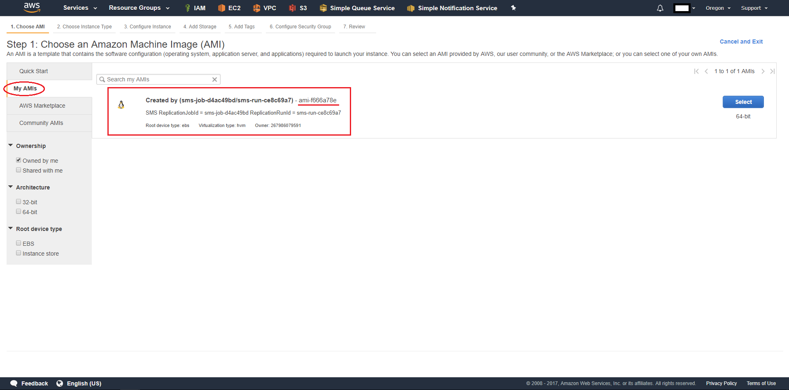
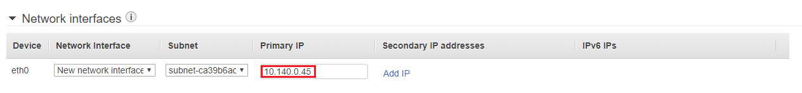
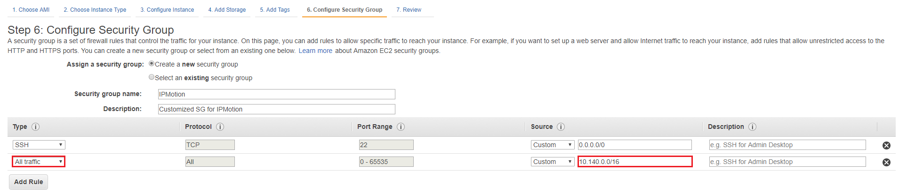

.. meta::
   :description: IPMotion
   :keywords: IPMotion, AWS Server Migration Service, AWS Migration Hub

===================================================================
Migrating VMs with Aviatrix IPMotion and AWS Migration Hub Service
===================================================================

1. Solution Overview
======================

This document describes how to migrate an on-prem VM to AWS while preserving its IP address. The migration tools we use are 
AWS Migration Hub service (AWS Server Migration Service) and Aviatrix IPmotion, where Aviatrix IPmotion feature enables IP address preservation after an VM is migrated to AWS via AWS Server Migration Service. 

By preserving its IP address of an on-prem VM after migrating
to AWS, dependencies of this VM to other on-prems are automatically preserved, thus there is no need to discover the dependencies for migration purpose. There is no need to update on-prem security rules, AD, DNS and Load Balancers. 

2. Configuration Workflow
==========================

The instructions in this section will use the following network diagram.
The CIDR and subnets may vary depending on your network setup; however, the
general principle will be the same.

|image0|

2.1 Prerequisites
-------------------------------

Before setting up Aviatrix IPMotion for migration, make sure 
the following prerequisites are completed.

1.  Plan the Cloud Address and create an AWS VPC

2.  Setup AWS Server Migration Service (SMS) to create migrated AMIs

3.  Deploy an Aviatrix Virtual Appliance CloudN in On-Premise

These prerequisites are explained in detail below.

2.1.1  Plan the Cloud Address and create an AWS VPC
---------------------------------------------------

First identify the on-prem subnet from which you plan to migrate VMs. In this example, the subnet is 10.140.0.0/16 with two On-Prem VMs (10.140.0.45 and 10.140.0.46.) 

(In this illustration, the cloud subnet is a public subnet. There are other `design patterns <http://docs.aviatrix.com/HowTos/design_pattern_ipmotion.html>`_ you can follow.)

Then create an AWS VPC with a public subnet that has identical CIDR as the on-prem subnet where migration is to take place. For example, create a VPC CIDR 10.140.0.0/16 with a public subnet 10.140.0.0/16 in region Oregon. Note that it is not neccessary for the migrated VMs to have public IP addresses. 

===============================    ================================================================================
**AWS Example Setting**            **Value**
===============================    ================================================================================
Cloud Type                         AWS
Region                             Oregon
VPC CIDR                           10.140.0.0/16
Public Subnet                      10.140.0.0/16
===============================    ================================================================================

2.1.2  Setup AWS Server Migration Service (SMS) to create a migrated AMI
------------------------------------------------------------------------

Please refer to "AWS Server Migration Service – Server Migration to the Cloud Made Easy!" for detail.

`AWS Server Migration Service – Server Migration to the Cloud Made Easy! 
<https://aws.amazon.com/blogs/apn/aws-server-migration-service-server-migration-to-the-cloud-made-easy/>`_

- Deploy the Server Migration Connector virtual appliance on On-Premise. 

===============================    ================================================================================
**vCenter Setting**                **Example**
===============================    ================================================================================
Setup networks                     10.140.0.0/16
===============================    ================================================================================
- Configure the connector on On-Premise. 

===============================    ================================================================================
**Connector Setting**              **Example**
===============================    ================================================================================
AWS Region                         US West (Oregon)
===============================    ================================================================================

- Import the server catalog on AWS SMS console

===============================    ================================================================================
**AWS SMS Setting**                **Example**
===============================    ================================================================================
Replication job ID                 VM which will be migrated to cloud (e.g. VM with ip 10.140.0.45)
===============================    ================================================================================

After completing the previous steps, a user is able to view and launch the migrated AMI in below console:

i.) AWS -> Migration -> Server Migration Service

|image1|

ii.) AWS -> Compute -> EC2 -> Launch Instance

|image2|

Please confirm the migrated AMI is ready on AWS console. 
This document will describe how to integrate the migrated AMI with IPMotion feature in 3.2.2 Step b.

2.1.3  Deploy an Aviatrix Virtual Appliance CloudN in On-Premise subnet
-----------------------------------------------------------------------

The Aviatrix Virtual Appliance CloudN must be deployed and setup in the on-prem subnet where you plan to migrate VMs prior to configuring IPMotion. For example, the subnet is 10.140.0.0/16. Please refer to "Virtual Appliance CloudN" on how to deploy the Virtual Appliance CloudN.

`Virtual Appliance CloudN 
<http://docs.aviatrix.com/StartUpGuides/CloudN-Startup-Guide.html>`_

Check and make sure you can access the Aviatrix Virtual Appliance CloudN dashboard and
login with an administrator account. The default URL for the Aviatrix
Virtual Appliance CloudN is:

https://<private ip of Aviatrix Virtual Appliance CloudN>

2.2 Configuration Steps
-----------------------

Make sure the pre-configuration steps in the previous section are completed before proceeding.

2.2.1 Step a – Deploy Aviatrix IPMotion gateway
-----------------------------------------------

The first step is to deploy Aviatrix IPMotion gateway in AWS VPC.
Please refer to "IPmotion Setup Instructions" for detail.

`IPmotion Setup Instructions 
<http://docs.aviatrix.com/HowTos/ipmotion.html>`_

**Instructions:**

a.1.  Login to the Aviatrix Virtual Appliance CloudN

a.2.  Click on "IP Motion" in the left navigation bar

a.3.  For section 1> Specify the on-prem IP Address List, enter both the list of IP addresses of VMs that will be migrated and the list of IP addresses of VMs that will remain on-prem. 

===============================    ================================================================================
**IPMotion Configuration**         **Example**
===============================    ================================================================================
On-prem Subnet IP List             10.140.0.45-10.140.0.46
===============================    ================================================================================

a.4.  Click “Specify”.

a.5.  Click "View" to check those specified IPs and its status.

===============================    ================================================================================
**Status Value**                   **Notes**
===============================    ================================================================================
ON-PREM                            IP of VM in On-Prem  
IN-CLOUD-STAGING                   IP of VM in staging Mode
IN-CLOUD                           IP of VM migrated to Cloud
===============================    ================================================================================

a.6.  For section 2> Reserve IPmotion Gateway IP Address List, specify 10 IP addresses that are not being used by any running VMs and reserve these addresses for Aviatrix IPmotion gateway.

================================    ================================================================================
**IPMotion Configuration**          **Example**
================================    ================================================================================
IPmotion Gateway Reserve IP List    10.140.0.200-10.140.0.210
================================    ================================================================================

a.7.  Click "View" to check those reserved IPs.

a.8.  For section 3> Launch an IPmotion Gateway in the AWS VPC, it launches an Aviatrix IPmotion gateway and builds an encrypted IPSEC tunnel between the subnet of On-Prem and AWS VPC.

===============================     ===================================================
**Setting**                         **Value**
===============================     ===================================================
Cloud Type                          Choose AWS
Account Name                        Choose the account name
Region                              Choose the region of VPC (e.g. us-west-2)
VPC ID                              Choose the VPC ID of VPC 
Gateway Name                        This name is arbitrary (e.g. IPMotion-GW)
Gateway Size                        t2.small is fine for testing.  
Gateway Subnet                      Select the public subnet (e.g. 10.140.0.0/16)
===============================     ===================================================

a.9.  Click “Launch”. It will take a few minutes for the gateway to deploy. Do not proceed until the gateway is deployed.

a.10. Done

.. Note:: Next 2.2.2 Step b – Integrate Aviatrix IPMotion with AWS AMI will explain how to utilize section 4> Let's Move! to coordinate IP migration with the migrated AMI created by AWS SMS

2.2.2 Step b – Integrate Aviatrix IPMotion with AWS AMI
-------------------------------------------------------

This step explains how to integrate Aviatrix IPMotion with the AMI that a user migrated from On-Premise VM to AWS via AWS SMS earlier.

b.1.  Click on IP Motion in the left navigation bar of GUI of Aviatrix Virtual Appliance CloudN

b.2.  Navigate to section 4> Let's Move!

b.3.  Select the IP of VM which will be migrated to cloud. (e.g. 10.140.0.45)

b.4.  Click "Staging". This is the preparation step for a user to shutdown the On-Prem VM with the selected IP and power up its corresponding cloud VM with the same IP.

b.4.1.  Shutdown the On-Prem VM via vCenter. (e.g. 10.140.0.45)

b.4.2.  Power up the AWS EC2 instance with that selected IP. (e.g. 10.140.0.45)

b.4.2.1.  Navigate to AWS -> Compute -> EC2 console

b.4.2.2.  Click "Launch Instance" 

b.4.2.3.  Step 1: Choose an Amazon Machine Image (AMI) -> Click side bar "My AMIs" -> Click "Select" of the AMI which is created by AWS SMS

b.4.2.4.  Step 2: Choose an Instance Type

b.4.2.5.  Step 3: Configure Instance Details: 

b.4.2.5.1.  In first section, here is an example for the testing topology

==================================      ===================================================
**AWS Example Setting**                     **Value**
==================================      ===================================================
Number of instances                     1
Purchasing Optional                     Uncheck this box is fine for testing
Network                                 Choose the VPC ID of the planned VPC 
Subnet                                  Choose the Subnet ID of the planned Subnet
Auto-assign Public IP                   Enable is fine for testing
IAM role                                None is fine for testing
Shutdown behavior                       Stop is fine for testing
Enable termination protection           Uncheck this box is fine for testing
Monitoring                              Uncheck this box is fine for testing
Tenancy                                 Shared - Run a shared hardware instance is fine
==================================      ===================================================

b.4.2.5.2.  (Important) In second section - Network interfaces, enter the selected IP (e.g. 10.140.0.45)

|image3|

b.4.2.6.  Step 4: Add Storage: default settings is fine for testing.

b.4.2.6.  Step 5: Add Tags: default settings is fine for testing.

b.4.2.7.  Step 6: Configure Security Group -> Click "Create a new security group". For this testing topology, adding a rule with Type of "All traffic" and Source of "Custom - 10.140.0.0/16" to allow all traffic between On-Prem VM and Cloud VM. User can further customize the firewall rules.

|image4|

b.4.2.8.  Step 7: Review Instance Launch -> Click "Launch" It will take a few minutes for the EC2 instance to deploy. Do not proceed until the EC2 instance is deployed.

b.5.  (Optional) Click "View" of section 1> Specify the on-prem IP Address List to check status. That IP status will change from status "ON-PREM" to "IN-CLOUD-STAGING".

b.6.  Navigate back to the section 4> Let's Move! of IP Motion of GUI of Aviatrix Virtual Appliance CloudN

b.7.  Select IP "10.140.0.45" -> Click "Commit"

b.8.  (Optional) Click "View" of section 1> Specify the on-prem IP Address List to check status. That IP status will change from status "IN-CLOUD-STAGING" to "IN-CLOUD".

b.9.  Done

2.2.3  Step c – Test Connectivity
--------------------------------------------

This step explains how to test the connectivity between the On-Prem VM to the migrated VM in the cloud.

**Instructions:**

c.1.  Browse the GUI of Aviatrix Virtual Appliance CloudN

c.1.1.  Click side bar Troubleshoot -> Diagnostics -> Network -> Ping Utility.

c.1.2.  Enter the committed IP address -> click Ping.

c.2.  Test bi-directional end-to-end connectivity 

c.2.1.  Login to the On-Prem VM (e.g. 10.140.0.46)

c.2.2.  Check ICMP protocal via command "ping 10.140.45"  

c.2.3.  Login to the migrated EC2 (e.g. 10.140.0.45)

c.2.4.  Check ICMP protocal via command "ping 10.140.46"

.. Note::  Make sure the security group of the migrated EC2 has ICMP allowed. Also make sure the migrated EC2 instance responds to Ping request.

 
Troubleshooting
===============

1.  Click button "View" of section 1> Specify the on-prem IP Address List of IPMotion of GUI of Aviatrix Virtual Appliance CloudN to check what state an IP address is at.

2.  Click button "Reset" if all things fail and you like to start over

2.1.  First of all, delete the IPmotion gateway by navigating to side bar "Gateway List"

2.2.  Select the gateway -> click Delete. It will take a few minutes to delete. Do not proceed until the gateway is deleted.

2.3.  After deletion is completed, go back to section 1> Specify the on-prem IP Address List of IPMotion and click button "Reset". 

2.4.  You can then start it over by going through Step a – Deploy Aviatrix IPMotion gateway and Step b – Integrate Aviatrix IPMotion with AWS AMI again.

3.  Get Support email support@aviatrix.com for assistance.

.. disqus::
