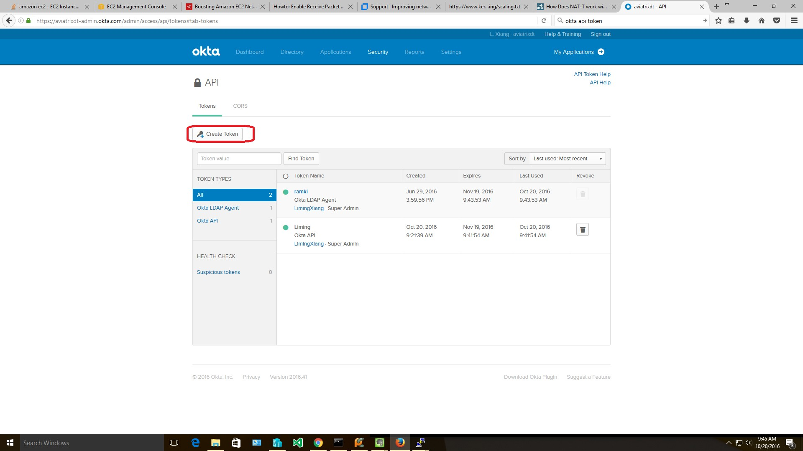
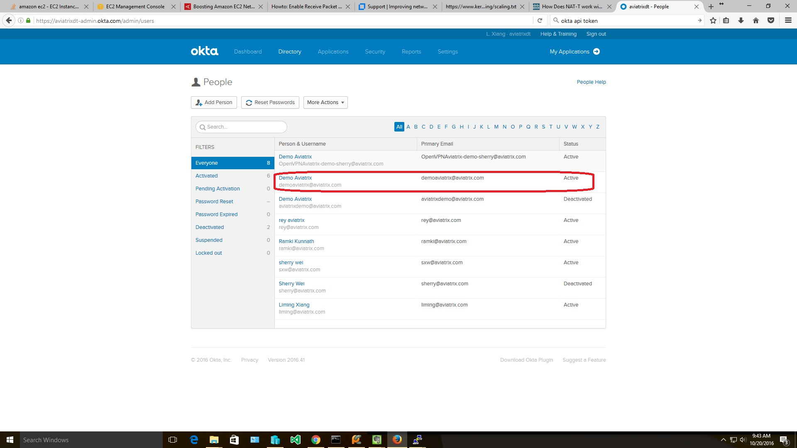
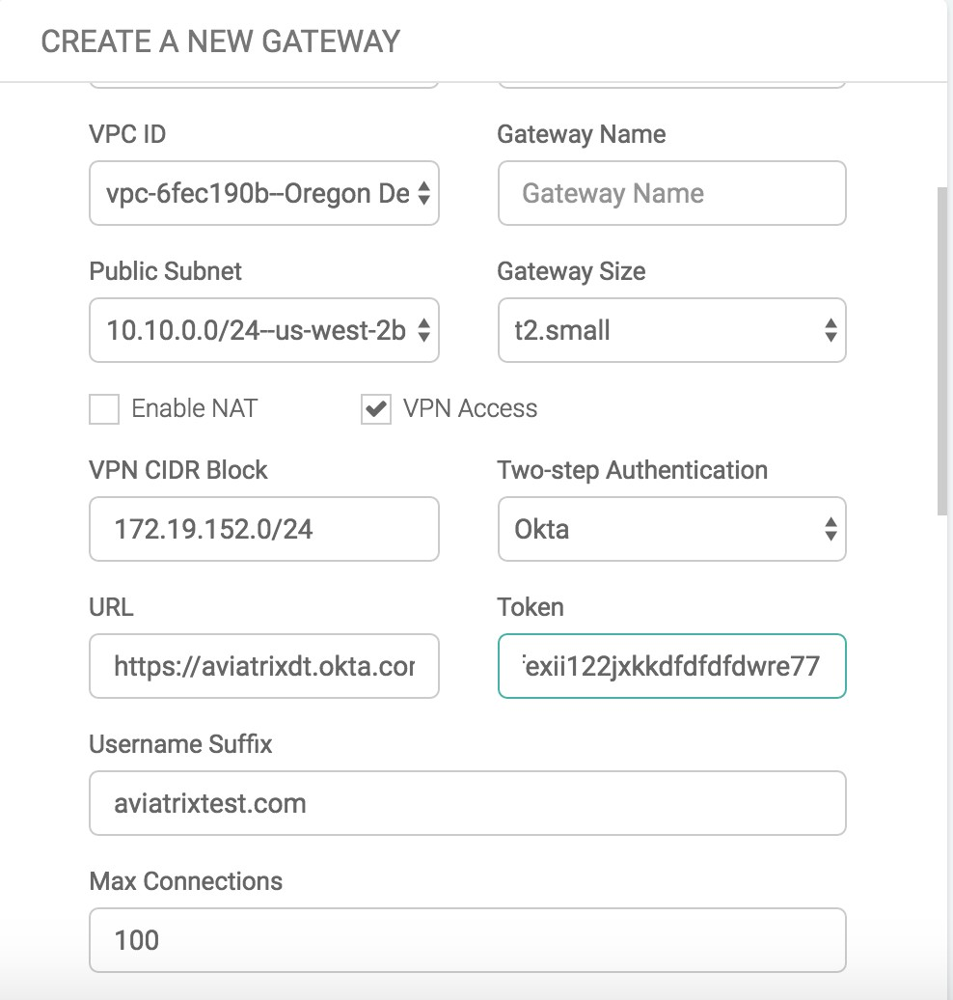
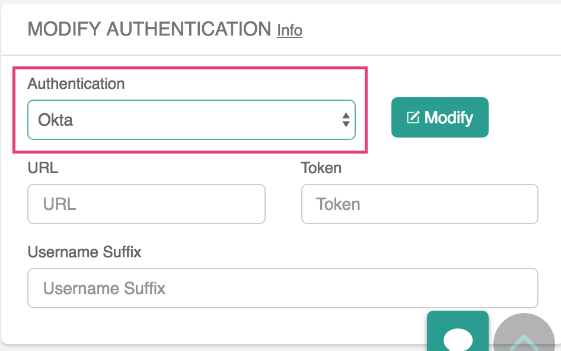
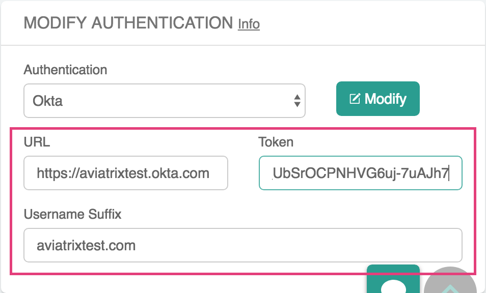
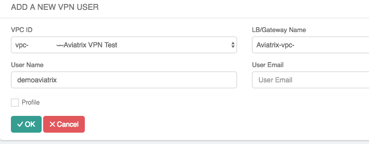

.. meta::
   :description: Okta Integration in Aviatrix for User SSL VPN authentication
   :keywords: Okta, Aviatrix

.. raw:: html

   

=========================================
Okta Authentication with Okta API Token
=========================================

Overview
-----------------

There are two methods to authenticate a VPN user against Okta: using an Okta API Token or the `Aviatrix VPN SAML Client <https://docs.aviatrix.com/HowTos/VPN_SAML.html>`_.

Okta API Token is a method where the Aviatrix VPN Gateway authenticates against Okta on behalf of VPN clients using 
the standard Okta API. When this method is used, you can continue to use a native OpenVPN® client such as Tunnelblick 
while enjoying MFA authentication. 

This document shows you how to set up authentication using Okta API Token. 

Follow these steps to configure Okta authentication and MFA on a User VPN Gateway in your environment:

#. Obtain an `API token <#okta-api-token>`__ from your Okta account.
#. Setup `Okta authentication  <#setup-okta>`__.
#. Create `VPN Users <#create-vpn-users>`__ for this Aviatrix Gateway.
#. `Test <#validate>`__ connectivity.

.. important::
   Okta authentication can be enabled both at the Aviatrix Gateway launch time and after the Aviatrix Gateway is launched. We highly recommend you configure Okta after the gateway is launched. 

.. _okta_api_token:
   
Obtaining the API Token from Okta
-------------------------------------------

Follow the steps outlined in the `Okta documentation <https://developer.okta.com/docs/api/getting_started/getting_a_token>`__ to create a new API token.

#. Log in into your Okta account as a **Super Admin.** This allows the privilege to create a Token for API access.

#. Go to Security > API and click **Create Token**. Give the token a name (for example, Aviatrix).

      .. note::
         Copy the generated token value. You’ll need this token to allow the Aviatrix Gateway to access Okta.

      |image1|

.. _setup_okta:

Setting up Okta Authentication
----------------------------------------

#. Follow the steps in `this guide <./uservpn.html>`__ to create a new Aviatrix VPN Gateway.
#. When you are ready to configure Okta, log in to the Controller. At the main navigation bar, go to OpenVPN® > Edit Config > Modify Authentication. From the dropdown option, select **Okta**.

   |GWOktaMFA|

#. Enter details about your Okta environment:

   +-----------------------+-------------------------------------------------+
   | Field                 | Description                                     |
   +=======================+=================================================+
   | URL                   | Your Okta account login URL. (For example,      |
   |                       | https://aviatrixtest.okta.com.)                 |
   +-----------------------+-------------------------------------------------+
   | Token                 | The token value you copied earlier.             |
   +-----------------------+-------------------------------------------------+
   | Username Suffix       | If provided, the VPN username                   |
   |                       | will be the account ID without the domain name. |
   |                       |                                                 |
   |                       | For example, if your Okta account is            |
   |                       | "demoaviatrix@aviatrixtest.com" and             |
   |                       | "aviatrixtest.com" is your Username Suffix,     |
   |                       | the VPN username should be "demoaviatrix".      |
   |                       |                                                 |
   |                       | If no value is provided for                     |
   |                       | this field, you must enter the full username    |
   |                       | including domain name (for example,             |
   |                       | "demoaviatrix@aviatrixtest.com").               |
   +-----------------------+-------------------------------------------------+

   |GWOktaAdditionalFields|

.. _create_vpn_users:

Creating User(s)
-----------------------

#. Log in to your Aviatrix Controller.
#. Expand **OpenVPN** and select **VPN Users**.
#. Click **+ Add New**.
#. Select the VPC/VNet where the VPN was created in the previous step.
#. Select the Aviatrix Gateway or Load Balancer.
#. Enter the username.

   .. important::
      This username must match the username in Okta.

#. (Optional) Enter the user's email where the .ovpn file will be emailed.

   .. note::
      If an email is not provided, users will need to download their .ovpn file from the Controller.

#. (Optional) Select a profile for this user.
#. Click **OK**.

   |AddVPNUser|

.. _validate:

Validating
-------------------------

#. Use the .ovpn file emailed to your test account or download it from Aviatrix VPN Users.
#. Add the configuration to your VPN client.
#. Connect and log in.

   .. note::
      Since Aviatrix Okta authentication uses API authentication, it uses the default sign on policy of Okta.
      If you have configured Multi-factor Authentication in Okta, then during VPN login, the end user needs to append his MFA token to the password during authentication.

OpenVPN is a registered trademark of OpenVPN Inc.

.. |image0| image:: How_to_setup_Okta_for_Aviatrix_media/image0.png
   :width: 3.5in
   :height: 0.5in

.. disqus::
