Enable SAML App for a group of users in G-Suite using Organization
-------------------------------------------------------------------

1. Follow `Google Idp for SAML Integration <https://docs.aviatrix.com/HowTos/SAML_Integration_Google_IdP.html#google-idp-for-saml-integration##openvpn-with-saml-authentication-on-okta-idp>`_ to create a **SAMLVPN** application.

2. Repeat the following steps to create users in G-suite Google Admin console and leave them under the root organization.

   2.1. Go to G-suite Google Admin console, select **Users**.

   |g-suite-admin-users|

   2.2. Click **Add new user**.

   |add-new-user-button|

   2.3. Enter user information. In this example, **Aviatrix Support** is the root organization.

   |add-new-user|

   2.4. Click **DONE**.

   |new-user-added|

3. Define a sub-organization **saml access org** within your root organization.

   3.1. At G-suite Google Admin console, select **Organizational units**.

   |g-suite-admin|

   3.2. Click **+** to add a new organization under your root organization.

   |manage-org|

   3.3 Create a sub-organization, e.g., **saml access org**.

   |create-org|

   |saml-access-org|

4. Turn on **SAMLVPN** application for **saml access org**.

   4.1. Go back to G-suite Google Admin console and select **Apps**.

   |g-suite-admin-apps|

   4.2. Select **SAML apps**.

   |apps-settings|

   4.3. Select the **SAMLVPN** App created in step 1.

   |saml-vpn-apps|

   4.4. Click **EDIT SERVICE** to enable/disable **SAMLVPN** app for the selected organization.

   |open-SAMLVPN|

   4.5. Turn off **SAMLVPN** for root organization (**Aviatrix Support**).

   |disable-SAMLVPN-rootorg|

   4.6. Turn on **SAMLVPN** for **saml access org**.

   |enable-SAMLVPN-suborg|

5.  Assign users to **SAMLVPN** app by moving users into **saml access org**.

   5.1. Go back to G-suite Google Admin console and select **Users**.

   |g-suite-admin-users|

   5.2. Select the user for SAMLVPN app (e.g., Dan Smith) and click **Change organizational unit**.

   |change-org-button|

   5.3. Select **saml access org**.

   |change-org-unit|

   5.4. Confirm the change.

   |confirm-org-change|

   5.5. Review the change.

   |select-dan-smith|

   |reopen-2-confirm-org|

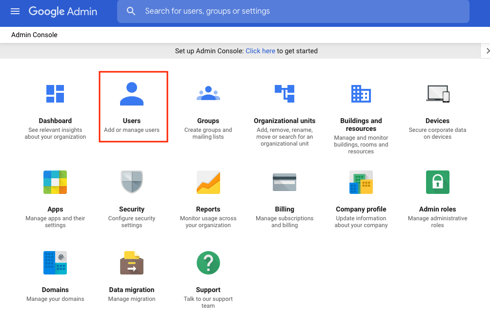

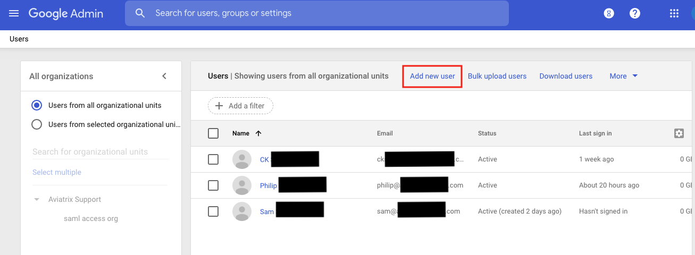

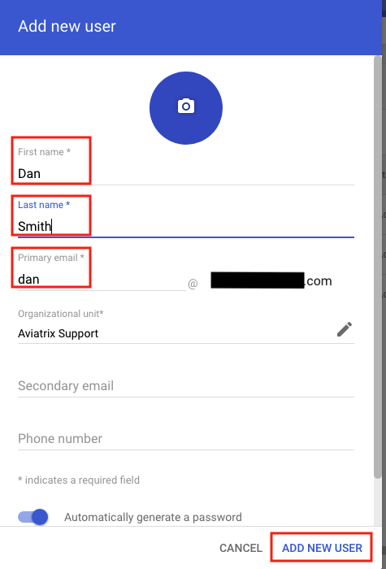

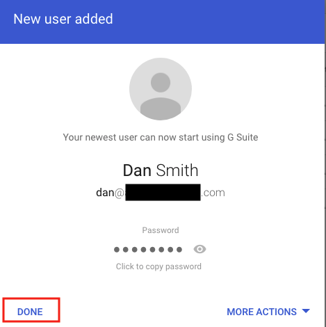

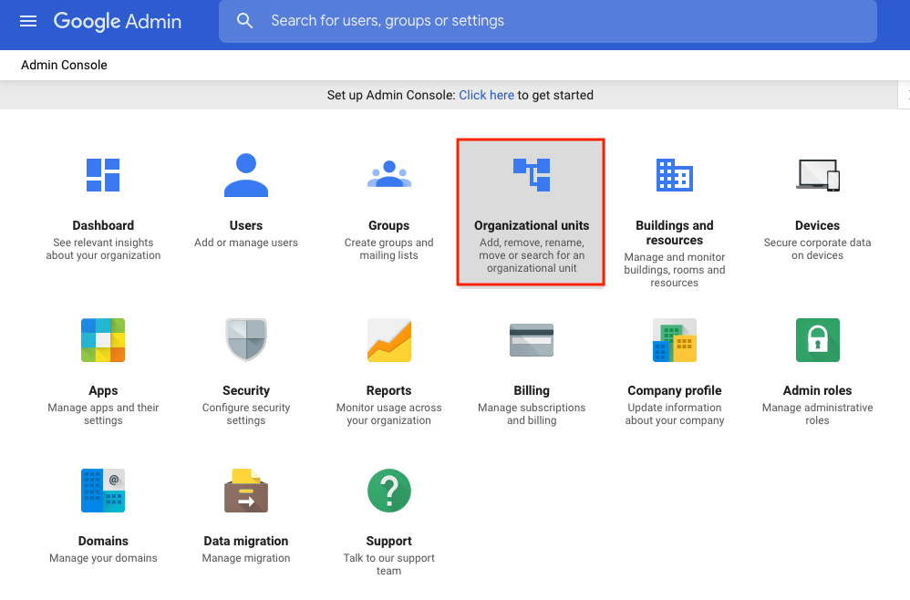

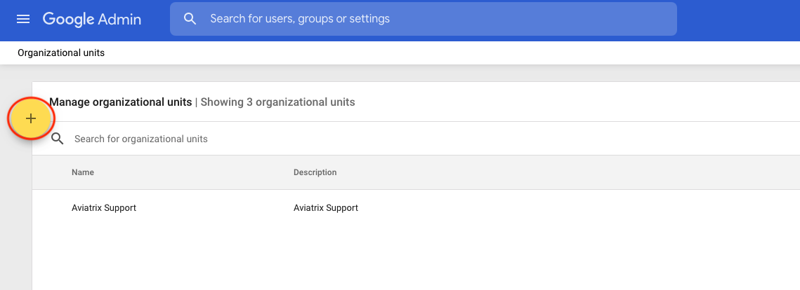

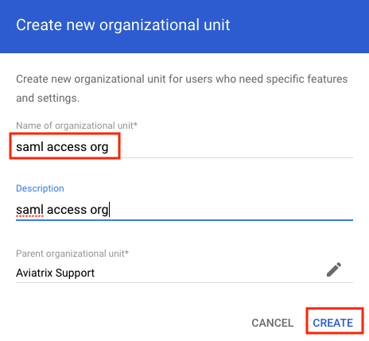

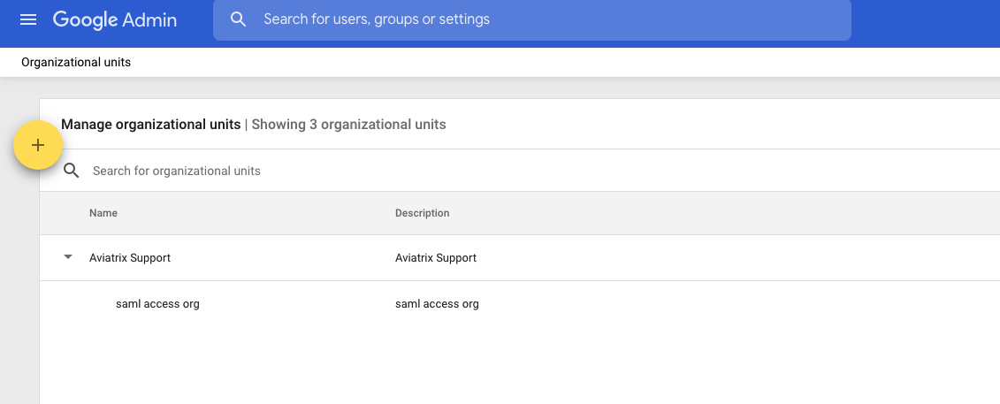

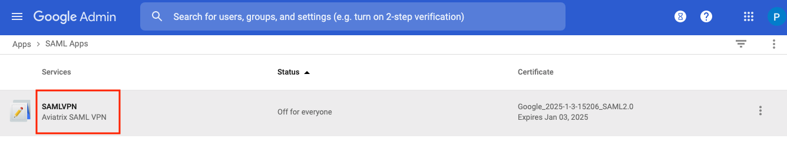

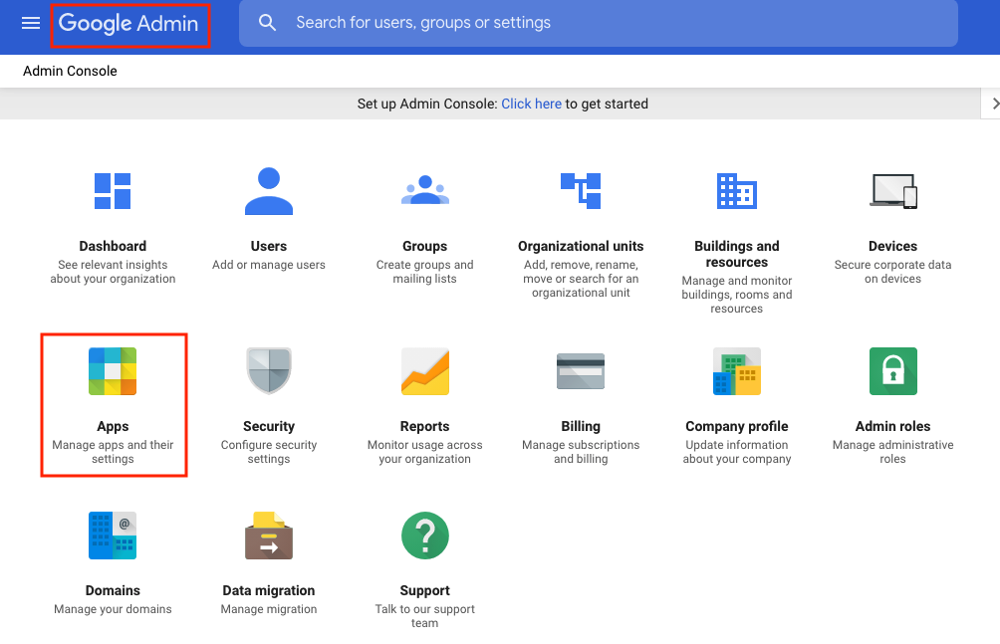

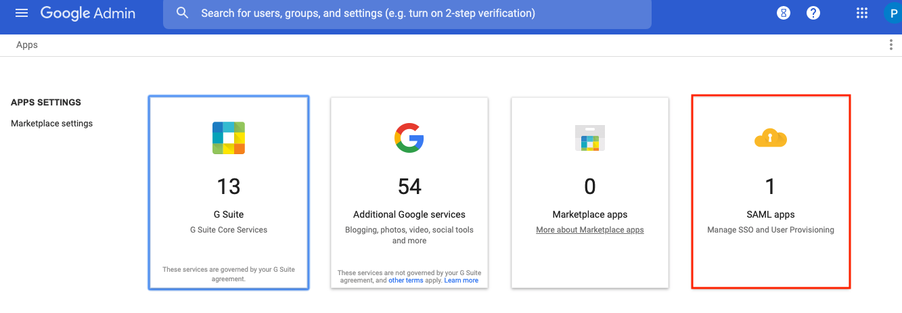

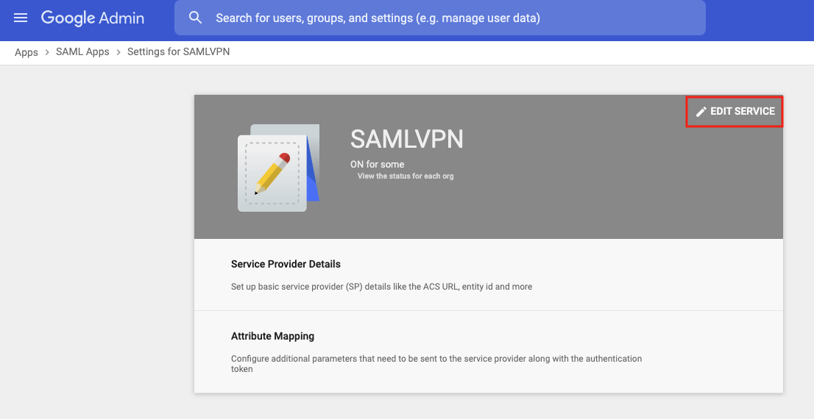

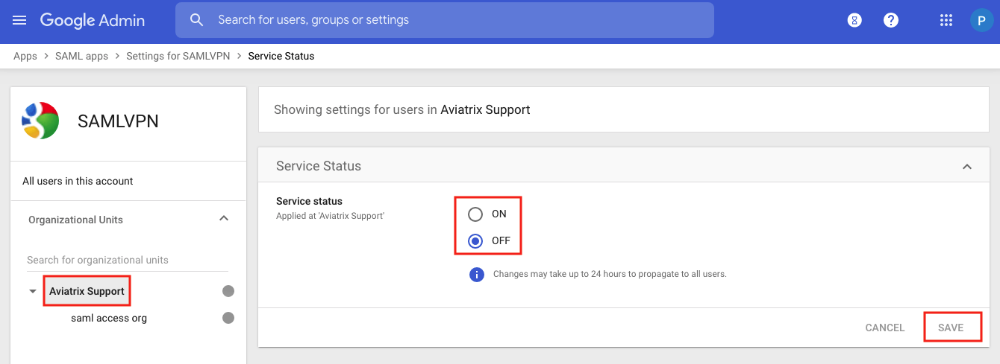

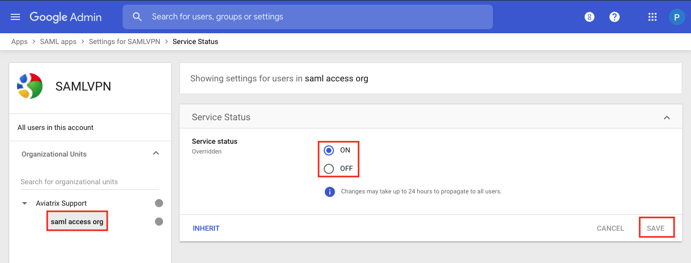

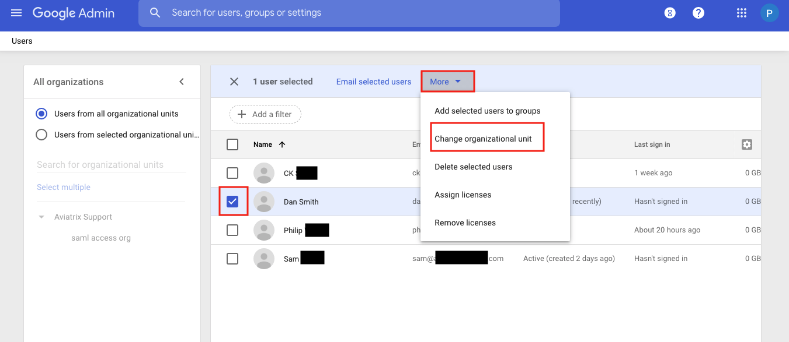

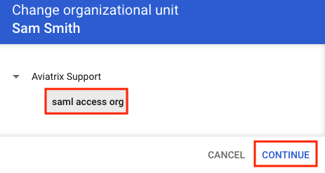

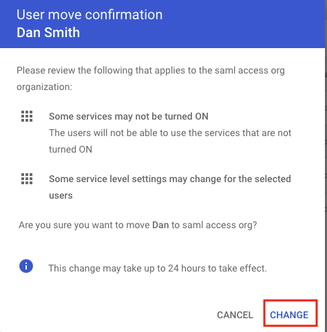

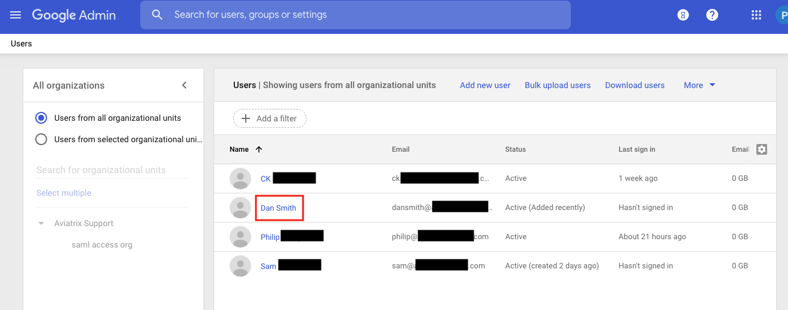

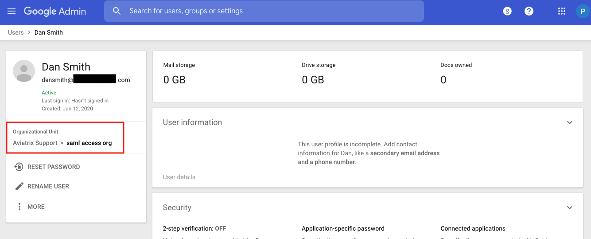

.. disqus::
