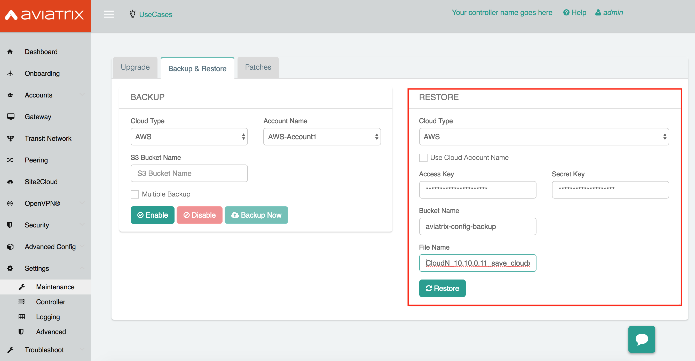

.. meta::
   :description: Migration from AWS Marketplace Licensing Model to BYOL Licensing Model
   :keywords: Marketplace, migration, licensing, Aviatrix, AWS

==============================================================================
Migrating from one Aviatrix Controller AMI to another
==============================================================================

Introduction
============

This document outlines all the steps necessary to migrate from one Aviatrix Controller AMI to another.

.. tip::
   This document applies to migrating from an old controller to a new controller AMI within the same subscription or moving from one subscription to another.

   .. note::
      For migration to a BYOL license model, please contact your Aviatrix Sales Account Manager or email sales@aviatrix.com to acquire the appropriate BYOL license.  Make sure you already have subscribed BYOL AMI. 
      
Prerequisites
=============

* Existing Aviatrix Controller instance deployed
* Aviatrix Controller running latest version of software

  #. Login to your existing Aviatrix Controller
  #. If you are using a BYOL image, please get your CustomerID either through Controller/Settings/Controller/License or from your Aviatrix Account Manager
  #. Navigate to **Settings** > **Maintenance** > **Upgrade tab**
  #. Make sure you are running the **latest** version. If it is not the latest version, please `upgrade <inline_upgrade.html>`__ before proceeding. Note that Aviatrix software version upgrade is a version-to-version upgrade. Therefore you may need to perform multiple upgrades until you reach the latest version on your existing controller. 

     |image1|

* An S3 bucket in the AWS account linked to your Aviatrix Controller (will be used for backups).
* Your IAM policy must be updated in all your AWS accounts. Please refer the instructions `here <https://docs.aviatrix.com/HowTos/iam_policies.html#updating-iam-policies>`__ to update your IAM policies.
* Make sure you delete the controller HA cloud formation stack. This is important to avoid the backup configuration being corrupted which may result in controller migration failure.

Step 1 - Enable Backup
======================

.. tip::
   If you already have backup enabled, click **Backup Now** to make sure you have the latest backup.
   Once complete, confirm in your S3 bucket that the backup file has been updated with the latest timestamp.

#. Login to your existing Aviatrix Controller
#. Navigate to **Settings** > **Maintenance** > **Backup & Restore tab**
#. Click **Enable**

|image2|

Step 2 - Stop the current Aviatrix Controller instance
======================================================

.. note::
   If the Controller has `HA enabled <controller_ha.html#enable-controller-ha>`__, you must first `disable the Controller HA <controller_ha.html#disable-controller-ha>`__.

On the AWS console proceed to **Stop** the existing Aviatrix Controller instance.

Step 3 - Disassociate EIP
=========================

On the AWS console, go to **EC2** > **Network & Security** > **Elastic IPs**.  Disassociate the EIP from the existing Aviatrix AWS Marketplace controller instance.

.. note::
   Make sure browser cache is cleared before the next step to avoid connecting to an old stale session.

Step 4 - Launch new Aviatrix Controller
=======================================

Launch new Aviatrix Controller.  Please refer to the `AWS Startup Guide </StartUpGuides/aviatrix-cloud-controller-startup-guide.html#step-1-subscribe-to-an-aviatrix-ami>`__ for steps.

   .. tip::
      We highly recommend migrating to Metered AMI as it is more flexible and scalable as your business needs change over time.
      
   .. attention::
      Make sure you already have subscribed the AMI that you want to migrate to. Please refer to the `Subscribe to an Aviatrix AMI </StartUpGuides/aviatrix-cloud-controller-startup-guide.html#step-1-subscribe-to-an-aviatrix-ami>`__  for detail.

Step 5 - Associate EIP
======================

On the AWS console, go to **EC2** > **Network & Security** > **Elastic IPs**, associate the same EIP from step 3 to the new Aviatrix Controller.

Step 6 - Upgrade Controller
===========================

Login to the new controller and perform the initialization. Make sure your new Aviatrix Controller is upgraded to same version (latest) by validating it at **Settings** > **Maintenance** > **Upgrade tab**. Please note that Aviatrix only supports controller backup and restore within the same software version. In this example, the previous controller is upgraded to the latest 3.3.402 at the time of this writing. The following screenshot shows that the new controller is running the latest 3.3.402 as well.

|image3|

Step 7 - Setup Aviatrix Customer ID (Not required if you are migrating to a Metered AMI controller)
================
On the new Aviatrix Controller, go to **Settings** > **Controller** and select the **License**.
Fill your Aviatrix License ID into the field of Customer ID in the panel "SETUP AVIATRIX CUSTOMER ID".

|image6|

Step 8 - Restore
================
On the new Aviatrix Controller, go to **Settings** > **Maintenance** and select the **Backup & Restore tab**.
Insert the details about your S3 bucket name and execute a restore.

|image4|

Step 9 - Setup Aviatrix Customer ID Again (Not required if you are migrating to a Metered AMI controller) and AWS Account Number
================
On the new Aviatrix Controller, go to **Settings** > **Controller** and select the **License**.
Fill your Aviatrix License ID into the field of Customer ID in the panel "SETUP AVIATRIX CUSTOMER ID".

|image6|

Step 10 - Make sure the Security Groups of the new controller match the old controller's.  After modification, backup the configuration again.

.. tip::
   Optional: After confirming everything is running correctly, delete the previous Aviatrix AWS Marketplace controller instance.

.. |image1| image:: Migration_From_Marketplace/image1-3.3.png
.. |image2| image:: Migration_From_Marketplace/image2-3.3.png

.. |image4| image:: Migration_From_Marketplace/image4-3.3.png
.. |image5| image:: Migration_From_Marketplace/image5-3.3.png
.. |image6| image:: Migration_From_Marketplace/image6.png

.. disqus::
