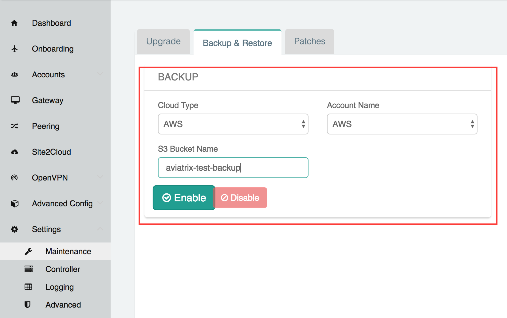
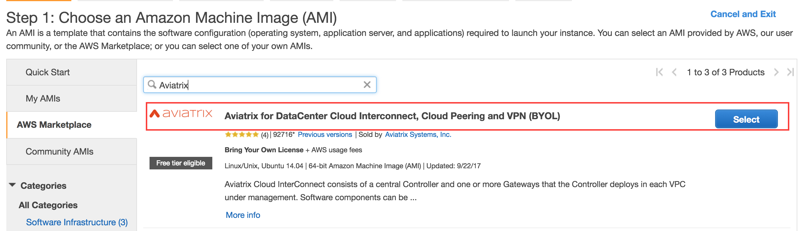
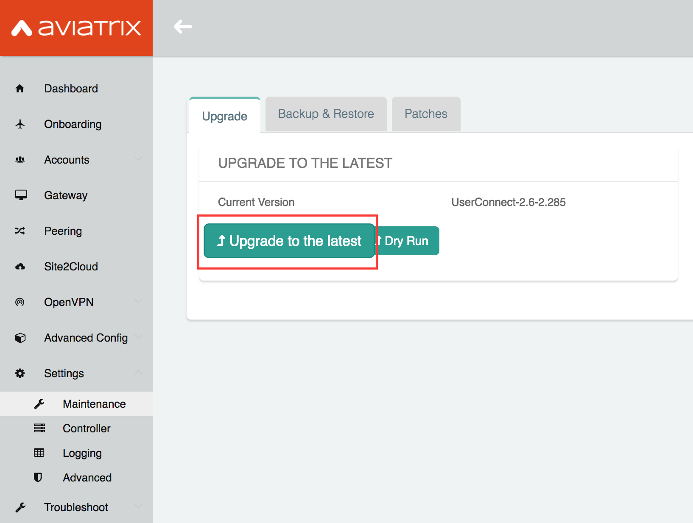
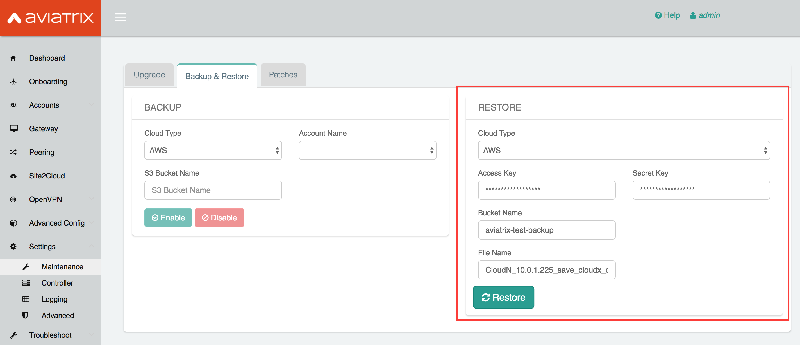
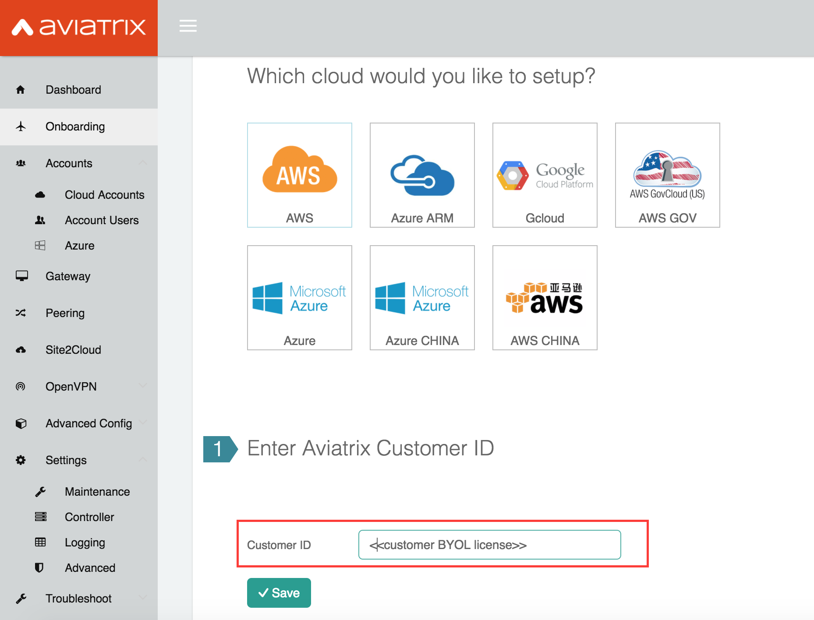

.. meta::
   :description: Migration from AWS Marketplace Licensing Model to BYOL Licensing Model
   :keywords: Marketplace, migration, licensing, Aviatrix, AWS

==============================================================================
  Migration from AWS Marketplace Licensing Model to BYOL Licensing Model
==============================================================================

Introduction
============

Many customers start by trying our AWS Marketplace image that allows you to deploy 10 VPN Users or 5 Peering Tunnels.
Those images are not flexible and cannot be extended beyond it's initial license.
In order to exceed this limitations, the customer needs to move to a BYOL License model.
This document outlines all the steps necessary to execute the migration.

Pre-requisites
==============
1. Existing Aviatrix AWS Marketplace instance deployed
#. Contact your Aviatrix Sales Account Manager to acquire the appropriate BYOL License
#. All Aviatrix controller should be running v2.7 (or later)

Step 1 - Enable Backup
======================
On the Aviatrix Markeplace Controller, goto Settings--> Maintenance and select the Backup & Restore tab.
Create an S3 bucket and copy the name on the corresponding field. Click Enable.

|image1|

::

  Note: If you already have Backup enabled, please disable and re-enable to make sure the backup is executed.
  Double check on your S3 bucket that the file has been updated based on the timestamp.

Step 2 - Stop the Marketplace instance
======================================
On the AWS console proceed to STOP the Aviatrix AWS Marketplace controller instance.

Step 3 - Disassociate EIP
=========================
On the AWS console, goto EC2-->Network & Security --> Elastic IPs, and disassociate the EIP from the Aviatrix AWS Marketplace controller instance.

::

  Note: Make sure browser cache is cleared before the next Step,
  to avoid connecting to an old stale session.

Step 4 - Launch BYOL Controller
===============================
Launch new Aviatrix Controller using the BYOL License.

|image2|

Step 5 - Attach EIP
===================
On the AWS console, goto EC2-->Network & Security --> Elastic IPs, associate the same EIP from step 3 to the new Aviatrix  BYOL Controller.

Step 6 - Upgrade Controller
===========================
Make sure your Aviatrix Controller is upgraded to version 2.7.378 (or later)

|image3|

Step 7 - Restore
================
On the Aviatrix Controller, goto Settings--> Maintenance and select the Backup & Restore tab.
Insert the right S3 bucket name and execute a restore.

|image4|

Step 8 - Install License
=========================
On the on-boarding page, enter the customer id provided by your Aviatrix Sales Account Manager.

|image5|

Step 9 - Enjoy your new controller
======================================

::

  Optional: After confirming everything is running as per normal,
  elete the Aviatrix AWS Marketplace controller instance.

For support, send email to support@aviatrix.com.

For feature request and feedback, click Make a wish at the bottom of
each page.

.. disqus::
